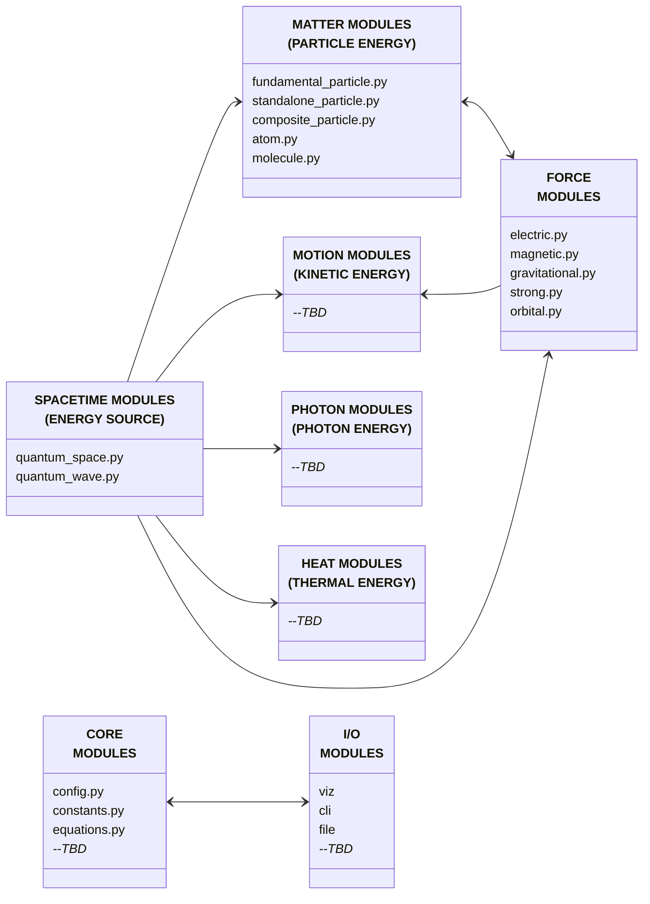

# MODULAR STRUCTURE & OBJECTS MAP

## Configuration System

Configuration is managed through `config.py` with sections for:

- `universe`: Simulation parameters (size, time_step)
- `screen`: Display resolution settings
- `color`: Color scheme for different physics entities (space, quantum_waves, matter, antimatter, motion, photons, energy, heat)

### Dependencies

- **numpy**: Numerical computing
- **scipy**: Scientific computing and analysis
- **matplotlib**: 2D plotting and visualization
- **taichi**: High-performance parallel computing for simulations

### Constants Usage

- Import from `openwave.constants` for all physics constants
- Use EWT-specific constants (QWAVE_LENGTH, QWAVE_AMPLITUDE, etc.) for wave modeling
- Classical constants are provided for compatibility and validation
- All constants use SI units (kg, m, s)

### Configuration Access

- Load configuration via `openwave.config` module
- Access screen dimensions: `config.screen_width`, `config.screen_height`
- Configuration file: `openwave/config.ini`
