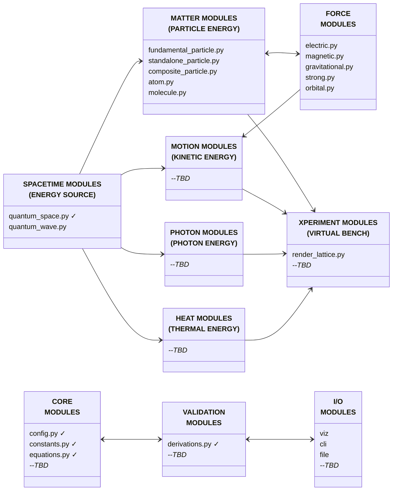
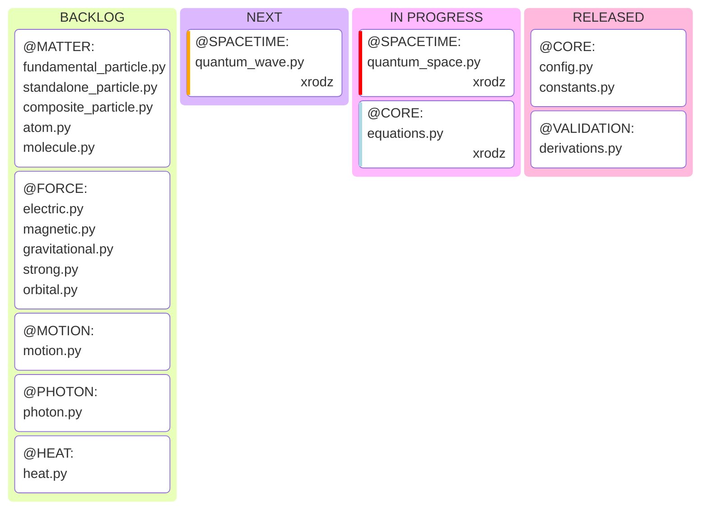

# OpenWave

`>simulate(the_universe)`

[](LICENSE)
[](https://github.com/openwave-labs/openwave)
[](https://www.python.org/)
[](https://www.reddit.com/r/openwave/)
[](https://x.com/openwavelabs/)
[](https://youtube.com/@openwave-labs/)

[](https://openwavelabs.com/)

## What is OpenWave?

OpenWave is an open-source application designed to simulate the formation and behavior of matter and other identities of energy — from the emergence of spacetime and quantum waves, through the creation of subatomic particles, to the development of matter, motion, light, and heat — based on the deterministic quantum mechanics model: [Energy Wave Theory (EWT)](https://energywavetheory.com "Energy Wave Theory").

## Core Scope

OpenWave provides computational and visualization tools to explore, demonstrate, and validate EWT predictions through three main functions:

### Numerical Validation

- Runs simulations derived directly from equations.
- Validates outcomes by comparing them against observed reality.
- [PLANNED] Generates numerical analysis reports for scientific publications.

### Visual Demonstration

- Illustrates complex, often invisible phenomena for better comprehension.
- Represents graphically wave equations and analyses.
- [PLANNED] Automates animation export for online video publishing.

### Experiments Simulation (#energy_hacking)

- [PLANNED] Models experimental conditions to explore new tech derived from subatomic-scale energy exchange simulations.
- [PLANNED] Generates baseline knowledge for your patent applications.

## Scientific Source

OpenWave is a programmatic computing and rendering package based on the [Energy Wave Theory (EWT)](https://energywavetheory.com "Energy Wave Theory") model.

Prior to using and contributing to OpenWave, it is recommended to study and familiarize yourself with this interpretation of quantum mechanics from the following resources:

- Website & Videos: [Energy Wave Theory (EWT)](https://energywavetheory.com "Energy Wave Theory")
- Scientific Papers: [Core Concepts](https://github.com/openwave-labs/openwave/tree/main/research_requirements/scientific_source "Energy Wave Theory")
- Original Requirements: [Requirements](https://github.com/openwave-labs/openwave/tree/main/research_requirements/original_requirements "Energy Wave Theory")

### Origins

The [Energy Wave Theory (EWT)](https://energywavetheory.com "Energy Wave Theory") is a deterministic quantum mechanics model designed by [Jeff Yee](https://www.youtube.com/@EnergyWaveTheory) that builds upon the work of pioneers like:

- [Louis de Broglie](https://en.wikipedia.org/wiki/Pilot_wave_theory)
- [Albert Einstein](https://en.wikipedia.org/wiki/Einstein%E2%80%93Podolsky%E2%80%93Rosen_paradox)
- [Dr. Milo Wolff](https://www.amazon.com/dp/0962778710)
- [Gabriel LaFreniere](http://www.rhythmodynamics.com/Gabriel_LaFreniere/matter.htm)
- among others.

>*"Quantum mechanics is very worthy of respect. But an inner voice tells me this is not the genuine article after all. The theory delivers much but it hardly brings us closer to the Old One's secret. In any event, I am convinced that He is not playing dice."*
>>Albert Einstein (December 4, 1926), challenging the adoption of a probabilistic interpretation to quantum mechanics.

## System Architecture v0.1.0

### Modular Design

This diagram illustrates the architecture of the OpenWave system, broken down into the following system modules:

- ✓ = module already released



### DEVELOPMENT ROADMAP



### Scalability & Performance

- Support increasing simulation resolution to handle extreme granularity of Planck-scale interactions
- Efficient handling of large particle counts and ultra-small wavelength resolution
- GPU optimized parallel processing for computational performance

### Tech Stack

- **Primary Language**:
  - Python (>=3.12)
- **Parallel Processing**:
  - Taichi Python Acceleration: GPU optimization for computationally intensive wave simulations
- **Math/Physics Libraries**:
  - NumPy, SciPy
- **Visualization**:
  - Taichi: 3D rendering
  - Matplotlib: numerical analysis plots and cross-sectional graphs
  - Export of 3D images and GIFs for visual inspection
- **Data Output**:
  - Numerical datasets, graphs, and analysis reports in open formats (CSV, JSON, PNG, STL)

### Todo

- [ ] Implement CLI entry points
- [ ] Develop documentation
- [ ] Define pre-commit hooks and style enforcement tools to ensure consistent formatting
- [ ] Introduce automated testing and continuous integration to validate code changes

## Installation

### Development installation refer to [Contribution Guide](CONTRIBUTING.md)

```bash
# Clone the OpenWave repository
  git clone https://github.com/openwave-labs/openwave.git
  cd openwave # point to local directory where OpenWave was installed

# Create virtual environment (via Venv)
  python -m venv openwave
  source openwave/bin/activate  # On Windows: openwave\Scripts\activate
   
# Or Create virtual environment (via Conda)
  conda create -n openwave python=3.12 -y
  conda activate openwave

# Install package & dependencies
  pip install .  # reads dependencies from pyproject.toml
```

## Usage

### Play with x_files

x_files are virtual bench experiments where you play with quantum objects to achieve a desired outcome.

```bash
# Run your first OpenWave x_file
python openwave/spacetime/quantum_space.py
python openwave/spacetime/x_view_tesseract.py

# Run sample x_files available at the codebase, or create your own
```

Note: CLI entry points are currently in progress.

## Contributing to this Project

Please refer to the [Contribution Guide](CONTRIBUTING.md)

See `/dev_docs` for coding standards and development guidelines

## License

This project is licensed under the MIT License - see the [LICENSE](LICENSE) file for details

>Real human power comes from collaboration.
