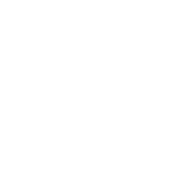
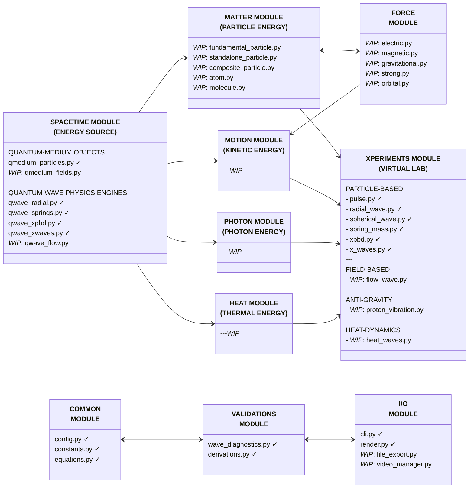
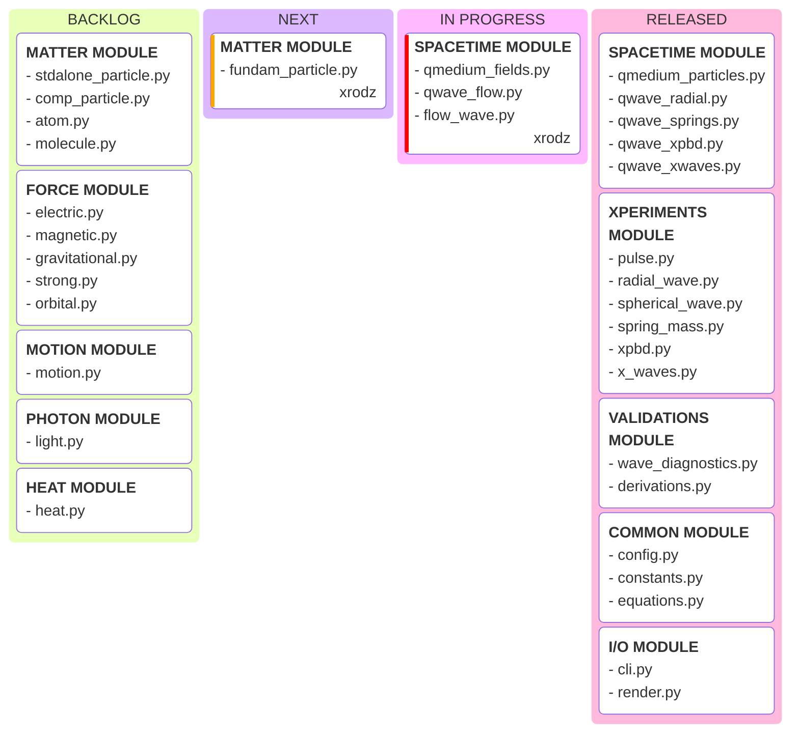
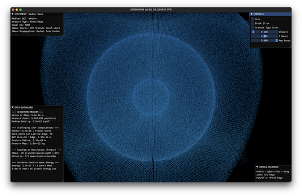

# OpenWave `>simulate(the_universe)`

<div align = "center">

[](https://www.gnu.org/licenses/)
[](https://www.python.org/)
[](https://github.com/openwave-labs/openwave)
[](https://www.reddit.com/r/openwave/)
[](https://x.com/openwavelabs/)
[](https://youtube.com/@openwave-labs/)

[](https://openwavelabs.com/)

</div>

## What is OpenWave?

OpenWave is an open-source application designed to simulate the formation and behavior of matter and other identities of energy — from the emergence of spacetime and quantum waves, through the creation of subatomic particles, to the development of matter, motion, light, and heat — based on the deterministic quantum mechanics model of the [Energy Wave Theory (EWT)](https://energywavetheory.com "Energy Wave Theory").

## Core Scope

OpenWave provides computational and visualization tools to explore, demonstrate, and validate EWT predictions through three main functions:

### Numerical Validation

- Runs simulations derived directly from built-in equations and quantum-wave phenomena.
- Validates outcomes by comparing them against observed reality.
- Generates numerical analysis and reports for scientific publications (assisted by your preferred LLM).

### Visual Demonstration

- Illustrates complex, often invisible phenomena for better comprehension.
- Represents graphically wave equations and analyses.
- [PLANNED] Automates animation export for online video publishing.

### Experiments Simulation (#energy_hacking)

- Models experimental conditions to explore new tech derived from subatomic-scale energy exchange simulations.
- [PLANNED] Generates baseline knowledge for your patent applications.

## Model spacetime with physics accuracy and render it in 3D


## Scientific Source

OpenWave is a programmatic computing and rendering package based on the [Energy Wave Theory (EWT)](https://energywavetheory.com "Energy Wave Theory") model.

Prior to using and contributing to OpenWave, it is recommended to study and familiarize yourself with this interpretation of quantum mechanics from the following resources:

### ENERGY WAVE THEORY (EWT)

- Main Entry Point: [EWT Website](https://energywavetheory.com)
- Scientific Publications: [Research Papers](https://www.researchgate.net/profile/Jeff-Yee-3)
- Explainer Videos: [Video Channel](https://www.youtube.com/@EnergyWaveTheory)
- Literature: [eBooks](https://www.amazon.com/gp/product/B078RYP7XD)

### Origins

The [Energy Wave Theory (EWT)](https://energywavetheory.com "Energy Wave Theory") is a deterministic quantum mechanics model designed by [Jeff Yee](https://www.youtube.com/@EnergyWaveTheory) that builds upon the work of pioneers like:

- [Albert Einstein](https://en.wikipedia.org/wiki/Einstein%E2%80%93Podolsky%E2%80%93Rosen_paradox)
- [Louis de Broglie](https://en.wikipedia.org/wiki/Pilot_wave_theory)
- [Dr. Milo Wolff](https://www.amazon.com/dp/0962778710)
- Gabriel LaFreniere
- among others.

>*"Quantum mechanics is very worthy of respect. But an inner voice tells me this is not the genuine article after all. The theory delivers much but it hardly brings us closer to the Old One's secret. In any event, I am convinced that He is not playing dice."*
>>Albert Einstein (December 4, 1926), challenging the adoption of a probabilistic interpretation to quantum mechanics, arguing that the description of physical reality provided was incomplete.

## System Architecture

### Modular Design

This diagram illustrates the architecture of the OpenWave system, broken down into the following system modules:

- ✓ = module already released
- *WIP* = work in process



### DEVELOPMENT ROADMAP



### Scalability & Performance

- Support increasing simulation resolution to handle extreme granularity of Planck-scale interactions
- Efficient handling of large particle counts and ultra-small wavelength resolution
- GPU optimized parallel processing for computational performance

### Tech Stack

- **Primary Language**:
  - Python (>=3.12)
- **Parallel Processing**:
  - Taichi Python Acceleration: GPU optimization for computationally intensive wave simulations
- **Math/Physics Libraries**:
  - NumPy, SciPy
- **Visualization**:
  - Taichi: 3D rendering
  - Matplotlib: numerical analysis plots and cross-sectional graphs
  - Export of 3D images and GIFs for visual inspection
- **Data Output**:
  - Numerical datasets, graphs, and analysis reports in open formats (CSV, JSON, PNG, STL)

### Todo

- [ ] Develop documentation
- [ ] Define pre-commit hooks and style enforcement tools to ensure consistent formatting
- [ ] Introduce automated testing and continuous integration to validate code changes

## Installation

For development installation refer to [Contribution Guide](CONTRIBUTING.md)

```python
# Clone the OpenWave repository, on your terminal:
  git clone https://github.com/openwave-labs/openwave.git
  cd openwave # point to local directory where OpenWave was installed

# Make sure you have Python >=3.12 installed
# Recommended Anaconda Package Distribution
  install from: https://www.anaconda.com
  conda create -n openwave python=3.12
  conda activate openwave

# Install OpenWave package & dependencies
  pip install .  # reads dependencies from pyproject.toml
```

## Usage

### Play with the /xperiments module

XPERIMENTS are virtual lab scripts where you can play with quantum objects and simulate desired outcomes.

```python
# Launch xperiments using the CLI xperiment selector

  openwave -x

# Run sample xperiments shipped with the OpenWave package, tweak them, or create your own
```

<div align = "center" style="text-align: center">
  <table>
    <tr>
      <td style="text-align: center">
        <div align = "center">
          <a></a>
          <br>Radial Wave Xperiment
        </div>
      </td>
      <td style="text-align: center">
        <div align = "center">
          <a></a>
          <br>Pulse Xperiment
        </div>
      </td>
    </tr>
    <tr>
      <td style="text-align: center">
        <div align = "center">
          <a></a>
          <br>XPBD Xperiment
        </div>
      </td>
      <td style="text-align: center">
        <div align = "center">
          <a></a>
          <br>Spring-Mass Xperiment (UNSTABLE)
        </div>
      </td>
    </tr>
  </table>
</div>

## Wanna Contribute to this Project?

- Please read the [Contribution Guide](CONTRIBUTING.md)
- See `/dev_docs` for coding standards and development guidelines
  - [Coding Standards](dev_docs/CODING_STANDARDS.md)
  - [Performance Guidelines](dev_docs/PERFORMANCE_GUIDELINES.md)
  - [Loop Optimization Patterns](dev_docs/LOOP_OPTIMIZATION.md)
  - [Markdown Style Guide](dev_docs/MARKDOWN_STYLE_GUIDE.md)
- **This is the Way!** ... Real human power comes from collaboration.

## License and Attribution

OpenWave is licensed under the [GNU Affero General Public License v3.0 (AGPL-3.0)](LICENSE).

This means:

- ✅ You can use, modify, and distribute OpenWave
- ✅ Commercial use is permitted
- ⚠️ If you distribute modified versions (including as a web service), you must release your source code under AGPL-3.0
- ⚠️ You cannot create closed-source proprietary versions (this PROTECTS against misuse while keeping the project truly open-source)

### Third-Party Software

OpenWave uses several open-source libraries. See [THIRD-PARTY-NOTICES](THIRD-PARTY-NOTICES) for full attribution and license information for:

- **Taichi Lang** (Apache 2.0) - GPU-accelerated computing and rendering
- **NumPy** (BSD-3) - Numerical computing
- **SciPy** (BSD-3) - Scientific computing
- **Matplotlib** (BSD-compatible) - Visualization
- **PyAutoGUI** (BSD-3) - GUI automation

All dependencies use licenses compatible with AGPL-3.0.

### Trademark

"OpenWave" is a trademark of OpenWave Labs. See [TRADEMARK](TRADEMARK) for usage guidelines.
