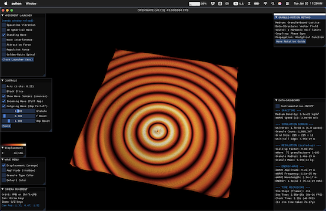
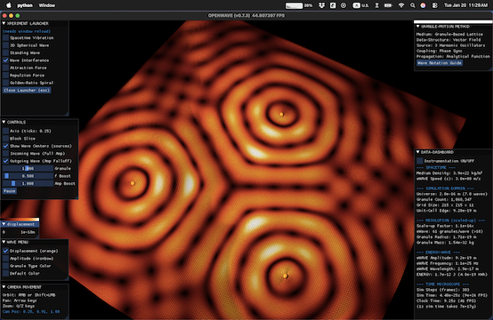
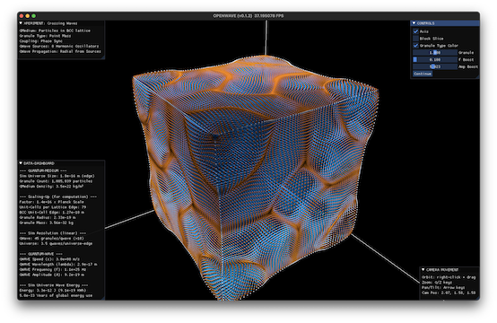
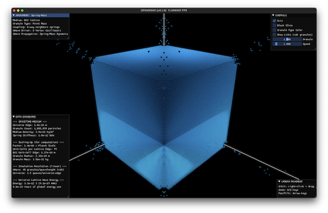
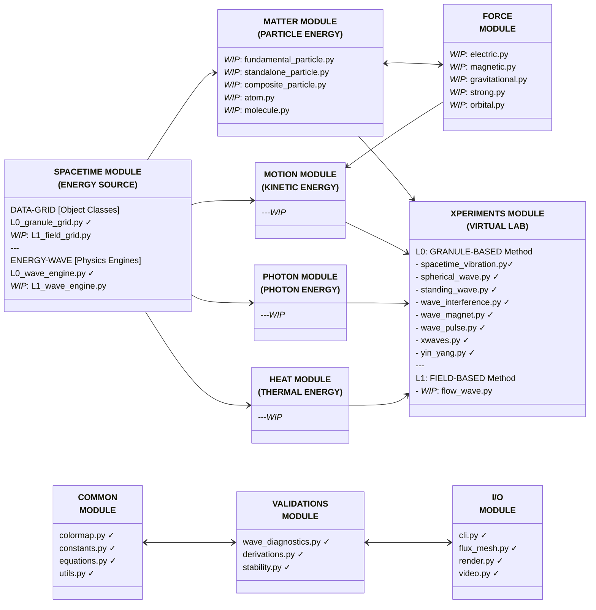
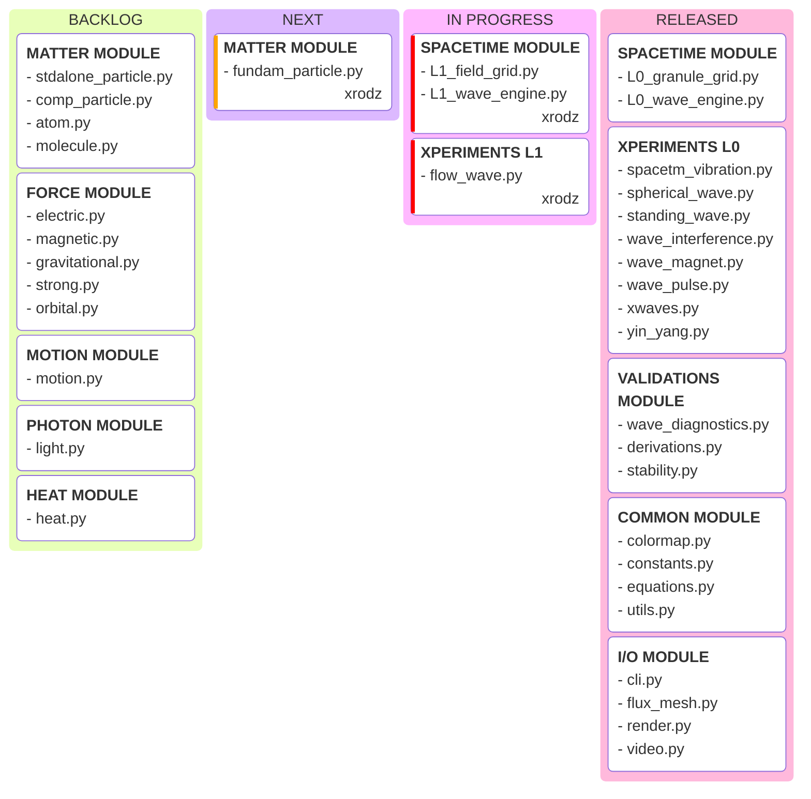

# OpenWave

<div align = "center">

  [](https://www.gnu.org/licenses/)
  [](https://www.python.org/)
  [](https://github.com/openwave-labs/openwave)
  [](https://www.reddit.com/r/openwave/)
  [](https://x.com/openwavelabs/)
  [](https://youtube.com/@openwave-labs/)

  

</div>

## What is OpenWave?

OpenWave is an open-source computational physics toolkit for modeling matter and energy phenomena using wave-field dynamics. The project implements a proposed mathematical framework through two complementary computational approaches: a field-based method (similar to lattice gauge theory) for research simulations, and a granule-based method for educational visualization.

### Two Computational Approaches

#### Level-1: Field-Based Method (Research Oriented)

- 3D vector field using partial differential equations (PDEs)
- Similar methodology to lattice QCD (quantum chromodynamics)
- Scalable for matter formation and force simulations
- Indexed by spatial coordinates with field properties at each voxel

#### Level-0: Granule-Based Method (Education Oriented)

- Discrete particle visualization with phase-shifted oscillations
- Intuitive for understanding wave mechanics
- Ideal for education and visualization

### Research Goals

OpenWave aims to:

- Model matter, force unification and energy phenomena through wave-field dynamics
- Simulate particle emergence from standing wave patterns in fields
- Validate wave-field mechanics against known physics
- Provide computational and visualization tools for wave-dynamics models

**Scientific Status:** OpenWave is a research tool for computational exploration using lattice field theory methodology to investigate alternative field equations and their predictions.

## Core Scope

OpenWave provides computational and visualization tools to explore, demonstrate, and validate predictions through three main functions:

### Numerical Validation

- Runs simulations derived directly from built-in equations and energy-wave phenomena
- Validates outcomes by comparing them against experimental observations
- Generates numerical analysis and data support for scientific publications

### Visual Demonstration

- Illustrates complex, often invisible phenomena for better comprehension
- Represents graphically wave equations and analyses
- Automates animation export for online video publishing

### Exploratory Simulations

- Models experimental wave-field configurations for parametric studies
- Supports hypothesis testing and comparative analysis against theoretical predictions

## Explore Wave-Field Dynamics with 3D Visualization


## Scientific Background

OpenWave implements [Energy Wave Theory (EWT)](https://energywavetheory.com "Energy Wave Theory"), a proposed deterministic subatomic wave mechanics framework that provides an alternative mathematical formalism to quantum field theory (QFT). Key points:

### Computational Approach

- **QFT Standard Method:** Lattice gauge theory - discretizes spacetime into a grid with quantum field values at each point
- **OpenWave Level-1:** Lattice wave-field mechanics - discretizes spacetime into a grid with classical wave-field values at each voxel
- **OpenWave Level-0:** Granule-based particles - educational visualization of wave mechanics
- **Both QFT and OpenWave:** Produce predictions about particle behavior, forces and interactions from field dynamics

### Scientific Context

- Quantum field theory is the experimentally validated standard framework
- Lattice QCD is the standard computational method for QFT (Nobel Prize 2004, 2008)
- OpenWave Level-1 uses similar lattice methodology but with different field equations
- Research question: Can classical wave-field dynamics reproduce quantum-like phenomena?
- EWT provides testable predictions that can be validated against experimental data

### Goal: Computational Utility

OpenWave serves two distinct purposes depending on implementation level:

**At LEVEL-1 for Research:**

Research questions to investigate:

- 🔬 Can wave-field dynamics reproduce experimentally observed particle properties?
- 🔬 Can standing wave patterns model matter formation (electrons, nuclei, atoms, molecules)?
- 🔬 Can fundamental forces (electric, magnetic, gravitational, nuclear) emerge from wave-field gradients?
- 🔬 Can computational predictions be validated against experimental data?
- 🔬 Can this approach provide computationally efficient alternatives for specific simulations?

**At LEVEL-0 for Education:**

Current capabilities (Released):

- ✅ Makes wave mechanics intuitive and visual
- ✅ Demonstrates wave interference, standing waves, propagation
- ✅ Helps students understand wave-field thinking

## Theoretical Source

OpenWave is a programmatic computing and rendering package based on the [Energy Wave Theory (EWT)](https://energywavetheory.com "Energy Wave Theory") mathematical framework.

Prior to using and contributing to OpenWave, it is recommended to study and familiarize yourself with this approach to subatomic physics from the following resources:

### EWT Resources

- Main Entry Point: [EWT Website](https://energywavetheory.com)
- Research Papers: [Publications](https://www.researchgate.net/profile/Jeff-Yee-3)
- Explainer Videos: [Video Channel](https://www.youtube.com/@EnergyWaveTheory)
- Literature: [eBooks](https://www.amazon.com/gp/product/B078RYP7XD)

### Pioneers and Origins

The [Energy Wave Theory (EWT)](https://energywavetheory.com "Energy Wave Theory") is a deterministic quantum mechanics model proposed by [Jeff Yee](https://www.youtube.com/@EnergyWaveTheory) that draws conceptual inspiration from historical work on wave interpretations of quantum mechanics:

**Historical Inspiration:**

- [Albert Einstein](https://en.wikipedia.org/wiki/Einstein%E2%80%93Podolsky%E2%80%93Rosen_paradox) - EPR paradox, determinism debates
- [Louis de Broglie](https://en.wikipedia.org/wiki/Pilot_wave_theory) - Pilot wave theory foundations
- [Dr. Milo Wolff](https://www.amazon.com/dp/0962778710) - Wave structure of matter explorations
- Gabriel LaFreniere - Standing wave visualizations

**Theoretical Classification:** EWT is a deterministic wave mechanics framework that provides mechanistic explanations for quantum phenomena through classical wave-field dynamics.

## Installation Instructions

For development installation refer to [Contribution Guide](CONTRIBUTING.md)

```bash
# Make sure you have Python >=3.12 installed
# If not, refer to Python installation instructions below

# Clone the OpenWave repository, on your terminal run:
  git clone https://github.com/openwave-labs/openwave.git
  cd openwave # point to local directory where OpenWave was installed

# Install OpenWave package & dependencies
  pip install .  # reads dependencies from pyproject.toml
```

### Python installation instructions

- Recommended: Anaconda Package Distribution
- Install from: <https://www.anaconda.com>

## Usage

### Play with the /xperiments module

XPERIMENTS are virtual lab scripts where you can explore wave mechanics and simulate various phenomena.

- **Highly Recommended:**
  - Read the [**WELCOME TO OPENWAVE**](WELCOME.md) to get started.
- Then, on your terminal run:

```bash
# Launch xperiments using the CLI xperiment selector

  openwave -x

# Run sample xperiments shipped with the OpenWave package, tweak them, or create your own
```

<div align = "center" style="text-align: center">
  <table>
    <tr>
      <td style="text-align: center">
        <div align = "center">
          <a></a>
          <br>Standing Wave Xperiment
        </div>
      </td>
      <td style="text-align: center">
        <div align = "center">
          <a></a>
          <br> Wave Interference Xperiment
        </div>
      </td>
    </tr>
    <tr>
      <td style="text-align: center">
        <div align = "center">
          <a></a>
          <br>X-Waves Xperiment
        </div>
      </td>
      <td style="text-align: center">
        <div align = "center">
          <a></a>
          <br>Spring-Mass Xperiment
        </div>
      </td>
    </tr>
  </table>
</div>

## System Architecture

### Modular Design

This diagram illustrates the architecture of the OpenWave system, broken down into the following system modules:

- ✓ = module already released
- *WIP* = work in progress



### DEVELOPMENT ROADMAP



### Scalability & Performance

- Support increasing simulation resolution to handle extreme granularity of Planck-scale interactions
- Efficient handling of large particle counts and ultra-small wavelength resolution
- GPU optimized parallel processing for computational performance

### Tech Stack

- **Primary Language**:
  - Python (>=3.12)
- **Parallel Processing**:
  - Taichi Python Acceleration: GPU optimization for computationally intensive wave simulations
- **Math/Physics Libraries**:
  - NumPy, SciPy
- **Visualization**:
  - Taichi: 3D rendering
  - Matplotlib: numerical analysis plots and cross-sectional graphs
  - Export of 3D images and GIFs for visual inspection
- **Data Output**:
  - Numerical datasets, graphs, and analysis reports in open formats (CSV, JSON, PNG, STL)

## Wanna Help Developing this Project?

- Please read the [Contribution Guide](CONTRIBUTING.md)
- See `/dev_docs` for coding standards and development guidelines
  - [Coding Standards](dev_docs/CODING_STANDARDS.md)
  - [Performance Guidelines](dev_docs/PERFORMANCE_GUIDELINES.md)
  - [Loop Optimization Patterns](dev_docs/LOOP_OPTIMIZATION.md)
  - [Markdown Style Guide](dev_docs/MARKDOWN_STYLE_GUIDE.md)
- **This is the Way!** ... Real human power comes from collaboration.

## License and Attribution

OpenWave is licensed under the [GNU Affero General Public License v3.0 (AGPL-3.0)](LICENSE).

This means:

- ✅ You can use, modify, and distribute OpenWave
- ✅ Commercial use is permitted
- ⚠️ If you distribute modified versions (including as a web service), you must release your source code under AGPL-3.0
- ⚠️ You cannot create closed-source proprietary versions (this PROTECTS against misuse while keeping the project truly open-source)

### Third-Party Software

OpenWave uses several open-source libraries. See [THIRD_PARTY_NOTICES](THIRD_PARTY_NOTICES) for full attribution and license information for:

- **Taichi Lang** (Apache 2.0) - GPU-accelerated computing and rendering
- **NumPy** (BSD-3) - Numerical computing
- **SciPy** (BSD-3) - Scientific computing
- **Matplotlib** (BSD-compatible) - Visualization
- **PyAutoGUI** (BSD-3) - GUI automation

All dependencies use licenses compatible with AGPL-3.0.

### Trademark

"OpenWave" is a trademark of OpenWave Labs. See [TRADEMARK](TRADEMARK) for usage guidelines.
