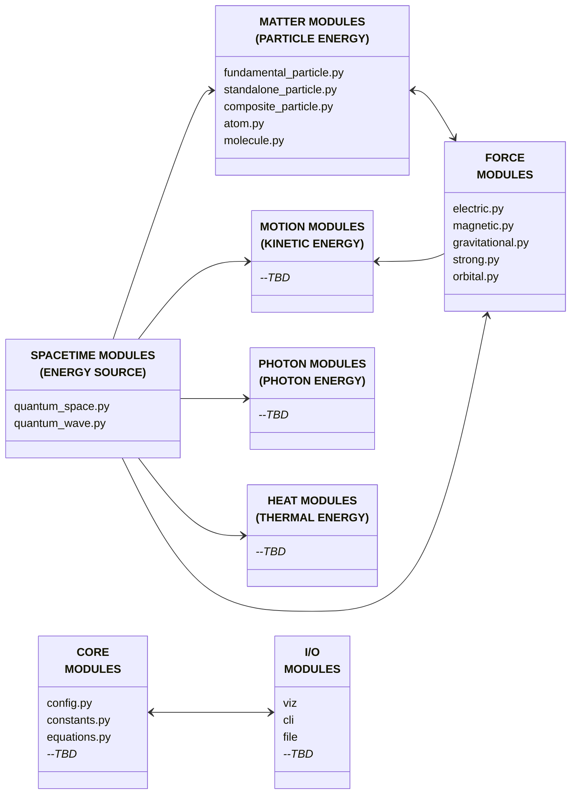

# OpenWave

`>simulate(the_universe)`

[](LICENSE)
[](https://github.com/openwaveHQ/)
[](https://www.python.org/)
[](https://www.reddit.com/r/openwave/)
[](https://x.com/openwave_HQ/)
[](https://youtube.com/@openwaveHQ/)

[](https://openwavehq.com/)

## What is OpenWave?

OpenWave is an open-source application designed to simulate the formation and behavior of matter and other identities of energy — from the emergence of spacetime and quantum waves, through the creation of subatomic particles, to the development of matter, motion, light, and heat — based on the [Energy Wave Theory (EWT)](https://energywavetheory.com "Energy Wave Theory") model.

## Core Scope

OpenWave provides computational and visualization tools to explore, demonstrate, and validate EWT predictions through three main functions:

### Numerical Validation

- Runs simulations derived directly from equations.
- Validates outcomes by comparing them against observed reality.
- Generates numerical analysis reports for scientific publications.

### Visual Demonstration

- Illustrates complex, often invisible phenomena for better comprehension.
- Represents graphically wave equations and analyses.
- [PLANNED] Automates animation export for online video publishing.

### Experiments Simulation (#energy_hacking)

- [PLANNED] Models experimental conditions to explore new tech derived from subatomic-scale energy exchange simulations.
- [PLANNED] Generates schematics to serve as baseline for patent applications.

## System Architecture

### Modular Design

This diagram illustrates the architecture of the OpenWave system, broken down into the following system modules:



### Scalability

- Support increasing simulation resolution to handle extreme granularity of Planck-scale interactions
- Efficient handling of large particle counts and ultra-small wavelength resolution
- Distribute computation across clusters if needed

### Tech Stack

- **Primary Language**: Python (>=3.12)
- **Parallel Processing**:
  - Multi-CPU/GPU utilization for computationally intensive wave simulations
- **Math/Physics Libraries**: NumPy, SciPy
- **Visualization**:
  - 3D rendering
  - Matplotlib for numerical analysis plots and cross-sectional graphs
  - Export of 3D images and GIFs for visual inspection
- **Data Output**:
  - Numerical datasets, graphs, and analysis reports in open formats (CSV, JSON, PNG, STL)

## Installation *--WORK IN PROGRESS--*

### On macOS / conda

```bash
# Clone the repository
git clone https://github.com/openwaveHQ/openwave.git

# Create virtual environment
conda create -n openwave312 python=3.12 -y
conda activate openwave312

# Install dependencies
cd openwave
pip install -e .  # reads dependencies from pyproject.toml

# Install LaTeX and FFmpeg (macOS)
brew install --cask mactex-no-gui ffmpeg
echo 'export PATH="/Library/TeX/texbin:$PATH"' >> ~/.zshrc
exec zsh -l
```

#### Verification

```bash
# Verify LaTeX installation
which latex && latex --version
which dvisvgm && dvisvgm --version
which gs && gs --version

# IF issues, remove virtual environment and start over again
conda env remove -n openwave312
```

### On Linux

```bash
TBD
```

### On Windows

```bash
TBD
```

## CLI Usage *--WORK IN PROGRESS--*

Note: CLI implementations are currently incomplete but will follow the pattern below.

### Quantum Space

- Use `space -h` to get the following help or `python openwave/space.py -h`

```bash
usage: space [-h] [-R] [-t]
             [-p PREFIX]
             [-asis] [-dnr] [-env] [-run]

optional arguments:
      -h, --help                    show this help message and exit
      -R, --use-ray
      -t, --test
      -p PREFIX, --prefix PREFIX    modifies name, useful for report folder customization
      -asis, --execute-as-is
      -dnr, --dont-refresh          refresh
      -env, --print-env-var         prints all environmental variables
      -run, --run-analysis          runs at selected locations
```

### Quantum Wave

- Use `wave -h` to get the following help or `python openwave/wave.py -h`

```bash
usage: wave [-h] [-R] [-t]
             [-p PREFIX]
             [-asis] [-dnr] [-env] [-run]

optional arguments:
      -h, --help                    show this help message and exit
      -R, --use-ray
      -t, --test
      -p PREFIX, --prefix PREFIX    modifies name, useful for report folder customization
      -asis, --execute-as-is
      -dnr, --dont-refresh          refresh
      -env, --print-env-var         prints all environmental variables
      -run, --run-analysis          runs at selected locations
```

## Todo

- [ ] Implement CLI entry points
- [ ] Develop documentation
- [ ] Define pre-commit hooks and style enforcement tools to ensure consistent formatting
- [ ] Introduce automated testing and continuous integration to validate code changes

## Contributing to this Project

Please refer to the [Contribution Guide](CONTRIBUTING.md)

See `/dev_docs` for coding standards and development guidelines

## License

This project is licensed under the MIT License - see the [LICENSE](LICENSE) file for details

## Credits Timeline

Real human power comes from collaboration.

| Public Legacy             | Credit                                            | Work |
| :---                      | :---                                              | :--- |
| Wave Structure of Matter  | Dr. Milo Wolff, Gabriel LaFreniere and Xavier Borg| Pioneer models (books, webpages) |
| Energy Wave Theory        | Jeff Yee                                          | Physics modeling, numerical validation and initial simulator design (research papers, books, webpages and videos) |
| OpenWave Simulator        | Rodrigo Griesi & Jeff Yee                         | Initial work on a programmatic validation, visualization and experimentation tool for the Energy Wave Theory (open-source computer based simulator) |
| OpenWave Simulator        | development community (coming soon)               | Continuous development                        |
| Open-Source Libraries     | numpy, scipy, matplotlib, taichi, ffmpeg          | Development of open-source software packages by multiple communities (open-source libraries) |
| Others to come...         |                                                   |  |
