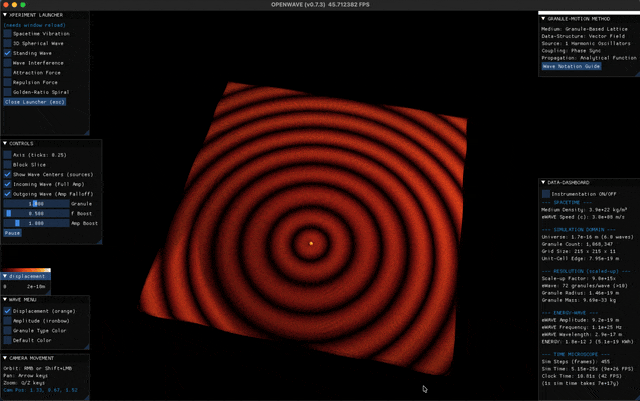

# WELCOME TO OPENWAVE

## What is OpenWave?

OpenWave is an open-source subatomic wave simulator that supports exploration of fundamental physics theories. It's built as a computational physics toolkit applying classical wave mechanics for modeling matter and energy phenomena using wave-field dynamics.

The project implements a proposed mathematical framework through various complementary approaches: the SCALAR-FIELD method (similar to lattice gauge theory), the VECTOR-FIELD method, both for research simulations, and the GRANULE-MOTION method for educational visualization.


## Computational Approaches

OpenWave provides complementary ways to explore wave mechanics:

### Scalar and Vector-Field Methods (Research Oriented)

**Status:** Work in Progress (WIP)

- **Methodology:** Lattice wave-field theory - similar to lattice QCD computational methods (Nobel Prize 2004, 2008)
- **Implementation:** 3D vector field grid with PDE-based wave propagation equations
- **Scale:** Wavelength-scale to molecules
- **Purpose:** Research simulations for matter formation, force modeling, numerical validation
- **Use Case:** Scientific research, advanced simulations, subatomic engineering

### Granule-Motion Method (Education Oriented)

**Status:** Released and Available

- **Methodology:** Particle-based visualization with phase-shifted oscillations
- **Implementation:** Discrete granules representing wave simulation
- **Scale:** Planck-scale to wavelength
- **Purpose:** Educational visualization, understanding wave formation
- **Use Case:** Learning, illustration, animation, introduction to wave concepts

**Key Insight:** WAVE-FIELD methods uses the same computational approach as quantum field theory (lattice discretization), while GRANULE-MOTION method provides intuitive visuals. Both are computational tools for investigating wave dynamics models of physical phenomena.

## Xperiments

OpenWave Xperiments is a collection of interactive physics simulations that brings wave-field dynamics to life through real-time visualization and computation.

**Currently Available: GRANULE-MOTION method Demos** showcase wave mechanics fundamentals through intuitive visualizations. These xperiments demonstrate how waves propagate, interfere, and create standing patterns - the foundational concepts that will be scaled up in WAVE-FIELD research simulations.

Each Xperiment is fully customizable (via user controls and Python scripting), enabling you to adjust parameters such as universe size, wave source configurations, and visualization settings to investigate wave behavior at different scales.

**Recommended:**

- **Follow the GRANULE-MOTION demo sequence below if you are new to OpenWave**
- **WAVE-FIELD research tools** are under development for matter formation simulations

## XPERIMENTS GRANULE-MOTION DEMO (start here)

### 1. Spacetime Vibration

**In this model:**

- Spacetime is computationally represented as oscillations at extremely high frequencies (~10^25Hz in EWT's framework)
- If you slow down the simulator frequency and increase the amp boost, you can observe WAVE PATTERNS (these waves are the effect of harmonic oscillations)
- The wave patterns serve as the energy source for modeling all energy forms, forces, and matter development in the simulation
- Now reduce the granule size and observe the wave pulse - this rhythm represents the model's fundamental time parameter (the wave's frequency defines the simulation's clock)
- These waves are called ENERGY WAVES in EWT's framework - the computational primitives for this modeling approach

**What you're seeing:** A computational representation of wave mechanics as the foundation for physical phenomena.

<div align = "center">

  

</div>

### 2. Spherical Wave

This xperiment demonstrates in a 3D view how a spherical longitudinal wave propagates through the granular simulation. In EWT's framework, longitudinal waves are the primary mode for modeling ENERGY WAVE propagation.

**Educational value:** Helps visualize how waves spread through a medium and how energy transfers from one location to another.

<div align = "center">

  

</div>

### 3. Standing Wave

This xperiment demonstrates standing wave patterns that emerge from inward and outward wave interactions. In EWT's model, standing waves are proposed as the mechanism that gives matter its structure, from fundamental particles to atoms and molecules.

- Play with the granule size control and see the emergence of crystal-like structures
- **Observation:** Notice how stable patterns form when waves interfere constructively

**Research question:** Can standing wave patterns account for particle properties like mass, charge, and spin? OpenWave helps explore this computationally.

<div align = "center">

  

</div>

### 4. Play with other Xperiments and Start your Research

Now that you're introduced to the basic concepts of wave phenomena in this computational framework, you can start experimenting with different wave configurations and parameters. Use the tools provided in the OpenWave platform to create your own simulations and explore how waves behave in various scenarios.

**What you can explore:**

- Wave interference patterns
- Energy transfer mechanisms
- Stable wave structures
- Resonance phenomena
- How changing parameters affects outcomes
- Experiment the WAVE-FIELD methods with more advanced wave equations and numerical analysis

To launch the Xperiments Selector Menu:

- Follow installation instructions at [README file](README.md)
- Then, on your terminal run:

```bash
# Launch xperiments using the CLI xperiment selector

  openwave -x

# Run sample xperiments shipped with the OpenWave package, tweak them, or create your own
```

<div align = "center" style="text-align: center">
  <table>
    <tr>
      <td style="text-align: center">
        <div align = "center">
          <a></a>
          <br>Standing Wave Xperiment
        </div>
      </td>
      <td style="text-align: center">
        <div align = "center">
          <a></a>
          <br> Wave Interference Xperiment
        </div>
      </td>
    </tr>
    <tr>
      <td style="text-align: center">
        <div align = "center">
          <a></a>
          <br>X-Waves Xperiment
        </div>
      </td>
      <td style="text-align: center">
        <div align = "center">
          <a></a>
          <br>Spring-Mass Xperiment
        </div>
      </td>
    </tr>
  </table>
</div>

## Scientific Background

OpenWave implements [Energy Wave Theory (EWT)](https://energywavetheory.com "Energy Wave Theory"), a proposed deterministic subatomic wave mechanics framework that provides an alternative mathematical formalism to quantum field theory (QFT). For more details on the theoretical framework, mathematical derivations, and research papers, refer to: [EWT Main Entry Point](https://energywavetheory.com).

**Context:** EWT is a deterministic wave mechanics framework that provides an alternative mathematical formalism to quantum field theory for describing physical observations.

**OpenWave's Computational Implementation:**

- **WAVE-FIELD Methods** uses lattice wave-field theory methodology (similar to lattice QCD) with EWT's field equations
- **GRANULE-MOTION Method** provides particle-based visualizations for intuitive understanding
- Both are computational frameworks for investigating EWT's mathematical predictions against experimentally observed physics

## OPENWAVE METHODS

| OPENWAVE | GRANULE-MOTION (shipped) | WAVE-FIELD (WIP) | (future release) |
| ---------- | --------------------- | --------------- | ------------------ |
| SCALE | planck-scale to λ | λ-scale to molecules | molecules to human-scale |
| LOGIC | GRANULE-MOTION METHOD | FIELD-BASED METHOD | ADVANCED COMPUTING PLATFORMS |
| system requirements | runs on personal computers | runs on personal computers | computing-clusters <br> quantum-computing |
| data-grid | granule-motion lattice | field-based grid | to be developed |
| wave-engine | phase shifted harmonic oscillations | vector field wave propagation | to be developed |
| USE-CASE | EDUCATIONAL, ILLUSTRATION | ADVANCED SIMULATIONS | LARGE-SCALE SIMULATIONS |
| | Learning <br> Visualization, Animation <br> Welcome to OpenWave | Numerical Analysis <br> Scientific Research <br> Subatomic Engineering | large simulation domain <br> large quantities of matter (atoms/molecules) |
| DESCRIPTION | granules INTO waves <br> waves modeled as granules <br> how waves are made <br> wave formation <br> spacetime & wave phenomena <br> universe foundation <br> energy source | waves INTO matter <br> matter modeled as waves <br> how waves make matter <br> wave interaction <br> matter, forces, EM & heat <br> material universe <br> energy effects | TBD |
| PLATFORM | OPENWAVE Platform <br> (from v0.1.0+) | OPENWAVE Platform <br> (from v0.2.0+) | OPENWAVE Platform <br> (vTBD) |
| | GPU optimization <br> Xperiments module <br> CLI, Rendering engine <br> Common & I/O modules <br> Open-Source code | GPU optimization <br> Xperiments module <br> CLI, Rendering engine <br> Common & I/O modules <br> Open-Source code | GPU optimization <br> Xperiments module <br> CLI, Rendering engine <br> Common & I/O modules <br> Open-Source code |

## Getting Help and Contributing

- See the main [README](README.md) for contribution guidelines
- Follow development on [GitHub](https://github.com/openwave-labs/openwave)
- Join discussions on [Reddit](https://www.reddit.com/r/openwave/)
- Watch tutorials on [YouTube](https://youtube.com/@openwave-labs/)

**Welcome to the exploration!** 🌊
