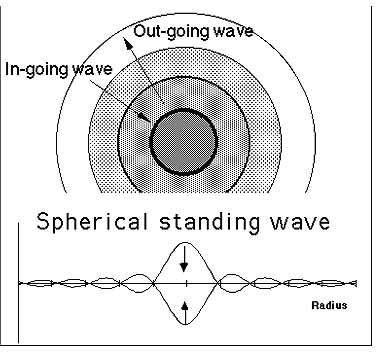

# Spin Theory - Longitudinal to Transverse Wave Conversion

## Core Hypothesis

**What if standing waves around wave centers require SPIN?**

The missing ingredient in our wave center experiments may be the **conversion of longitudinal waves to transverse waves** at the wave center — the physical origin of particle spin.

## Physical Intuition (Not Just Numerical Model)

### The Problem We Faced

In `12_WAVE_CENTER.md`, we documented 12 experiments trying to create emergent standing waves around a wave center. All failed in an isotropic (omnidirectional) wave field because:

- Reflections from all directions cancel out
- No net change to field structure
- WC becomes "invisible"

### The Missing Physics: Spin as Wave Polarization Conversion

**Hypothesis**: Wave centers don't just reflect waves — they **transform** them:

- **Incoming waves**: Pure longitudinal (compression/rarefaction)
- **At wave center**: Longitudinal amplitude converts to transverse amplitude
- **Outgoing waves**: Mixed longitudinal + transverse (reduced L, increased T)

This is analogous to a **polarizing lens** that converts one wave mode to another.

### Why This Might Create Standing Waves

If the WC converts L→T:

1. Incoming longitudinal waves arrive from all directions
1. At WC, some longitudinal energy becomes transverse
1. Outgoing waves have **different character** than incoming
1. This **breaks the symmetry** that caused cancellation!
1. Standing waves can now form because in ≠ out

## Milo Wolff's Wave Structure of Matter

From *Schrodinger's Universe and the Origin of the Natural Laws*:

### Spherical In-Wave and Out-Wave

> **Spherical in-wave** - A quantum wave propagating spherically towards a wave center. It is formed from the Huygens' combination of the out-waves of all other spherical standing waves in the Hubble Universe.
>
> **Spherical out-wave** - A quantum wave propagating spherically outward from a wave center. It is a continuation of the in-wave that has come in to a wave center.
>
> **Spin** - The unique result of an in-wave becoming an out-wave in 3D space.

### Physical Spin Mechanism

> Section 1. What is physical spin? As discussed throughout this book, the electron is comprised of two spherical scalar waves, one inward and one outward. A phase shift of the inward wave occurs in the wave-center region near where r = 0, and spin appears as a required rotation of the inward wave in order to become the outward wave. This requirement is a property of 3D space termed spherical rotation. To transform the inward wave to an outward wave and obtain the out-wave with proper phase relations requires phase shifts of the in-wave at the center. These phase shifts produce a spin value of h/4π in the entire wave structure as seen below. Because spin is the result of required wave phase shifts, a property of 3D space, spin has the same value for all charged particles independent of other particle properties.

### Spherical Rotation Property

> Spherical rotation is an astonishing property of 3D space. It permits an object structured of space to rotate about any axis without rupturing or twisting-up the coordinates of space. Space is flexed but after two turns, space regains its original configuration. This property allows the electron to retain spherical symmetry while imparting a quantized "spin" along any arbitrary axis. The inward wave converges to the center, undergoes phase shifts to become the outward wave. The in-waves and out-waves continuously go through the phase shift process; the spin is a property of the entire wave structure that exists in the 3D space medium.

### 720° Phase Shift

> **Spin**: A QM change of angular momentum accompanying the phase shift (spherical rotation) of the in-waves that become out-waves upon arrival at the wave-center. The phase shift required is 720° and the spin produced is ± h/4π. Spin is a property of 3D space. A theoretical calculation by Dirac (1926) first yielded this value.

### Electron vs Positron

> The required phase shift is a 720° rotation that changes inward wave amplitudes to become those of the outward wave. There are only two possible directions of rotation, CW or CCW. One direction produces an electron with spin of h/4π, and the other is the positron with spin of -h/4π.

## Key Insight: The Wave is Spinning, Not the Particle

**Critical distinction**:

- It's NOT the particle spinning like a ball
- The **wave character is being disturbed/transformed**
- The **wave is spinning** as it converts from in-wave to out-wave
- Spin is an intrinsic property of **how waves must transform in 3D space**

This is why:

- Spin is quantized (only certain rotations work in 3D)
- Spin is the same for all particles (it's a property of space, not the particle)
- 720° rotation needed (spherical rotation property of 3D space)

## Proposed Physical Model for OpenWave

### Energy Wave Fundamentals

```text
ENERGY WAVE (fundamental) = PURE LONGITUDINAL
                            ↓
                    [WAVE CENTER]
                            ↓
                    SPIN TRANSFORMATION
                    longitudinal → transverse (component)
                            ↓
                    OUTGOING WAVE = longitudinal + transverse
```

### Conservation of Energy

- `ampL_am` decreases at WC (longitudinal component reduced)
- `ampT_am` increases at WC (transverse component created)
- Total energy preserved: `E ∝ amplitudeL² + amplitudeT²`

### Electromagnetism Duality

If this theory holds, wave centers explain the **duality of electromagnetism**:

- **Electric field** ← Longitudinal wave component
- **Magnetic field** ← Transverse wave component
- **90° geometric offset** because L and T are perpendicular by definition
- **Same phase** because they come from the same wave

This could be the physical origin of:

- Electric charge (longitudinal wave interaction)
- Magnetic moment (transverse wave interaction)
- Fine structure constant (ratio of L to T conversion?)

## Complex Numbers as the Natural Representation

### Why Complex Sinusoids?

The Schrödinger equation uses complex numbers:

```text
iℏ ∂ψ/∂t = Ĥψ
```

Where `ψ` is complex: `ψ = ψ_real + i·ψ_imaginary`

**Hypothesis**: The complex representation naturally encodes L/T duality:

- **Real part** = Longitudinal amplitude
- **Imaginary part** = Transverse amplitude (spin component)

This would explain:

- Why QM requires complex numbers (not just convenience, but physics!)
- Why probability is `|ψ|² = ψ_real² + ψ_imaginary²` (total energy from both components)
- Why wave centers must exist for Schrödinger equation to be valid

### Implementation Idea — Efficient Approach

**Key Insight**: Since L and T are 90° out of phase (complex number on unit circle), we DON'T need to track both displacements in the expensive PDE loop!

**We already have what we need**:

```python
# Already stored in L1_field_grid.py:
psiL_am      # current longitudinal displacement
psiL_old_am  # previous timestep displacement
ampL_am        # envelope tracker for L
ampT_am        # envelope tracker for T (to be added)
```

**The Math (Euler's Formula)**:

```text
Complex wave: ψ = A·e^(iωt) = A·cos(ωt) + i·A·sin(ωt)
                            = L + i·T

Where:
  L = A_L · cos(θ)    ← longitudinal (real part)
  T = A_T · sin(θ)    ← transverse (imaginary part, 90° shifted)
```

**The Phase Ambiguity Problem**:

`arccos(dispL / ampL)` returns θ in [0, π], but we need the full [0, 2π] range.

**Solution**: Use velocity to determine which half of the cycle we're in!

```text
velocity_L = (psiL_am - psiL_old_am) / dt

- If velocity_L < 0: θ in [0, π]     → sin(θ) positive  → dispT positive
- If velocity_L > 0: θ in [π, 2π]   → sin(θ) negative → dispT negative
```

**Computing dispT from existing fields**:

```python
@ti.func
def compute_dispT(i: ti.i32, j: ti.i32, k: ti.i32) -> ti.f32:
    """Compute transverse displacement from longitudinal + velocity."""
    dispL = psiL_am[i, j, k]
    dispL_old = psiL_old_am[i, j, k]
    ampL = ampL_am[i, j, k]
    ampT = ampT_am[i, j, k]

    # Avoid division by zero
    if ampL < 1e-10:
        return 0.0

    # Compute normalized position on unit circle
    cos_theta = ti.math.clamp(dispL / ampL, -1.0, 1.0)

    # sin(θ) = ±√(1 - cos²θ), sign determined by velocity
    sin_theta_magnitude = ti.sqrt(1.0 - cos_theta * cos_theta)

    # Velocity determines sign: negative velocity → positive sin (ascending)
    velocity_L = dispL - dispL_old  # dt cancels out for sign check
    if velocity_L > 0:  # descending from peak → sin negative
        sin_theta_magnitude = -sin_theta_magnitude

    return ampT * sin_theta_magnitude
```

**At Wave Center — L→T Conversion (envelope level)**:

```python
@ti.kernel
def apply_wave_center_spin(cx: ti.i32, cy: ti.i32, cz: ti.i32,
                           conversion_factor: ti.f32):
    # Only modify the ENVELOPES, not the displacement field
    amp_L = ampL_am[cx, cy, cz]
    amp_T = ampT_am[cx, cy, cz]

    # Transfer some longitudinal amplitude to transverse
    delta = amp_L * conversion_factor
    ampL_am[cx, cy, cz] = amp_L - delta
    ampT_am[cx, cy, cz] = amp_T + delta

    # Total energy preserved: E ∝ amp_L² + amp_T²
```

**Why This Works**:

1. The PDE propagates `psiL_am` (longitudinal) — unchanged, no extra cost
1. We already store `psiL_old_am` — velocity is free!
1. Amplitude trackers (`ampL_am`, `ampT_am`) update periodically
1. At WC, we modify the **envelope ratio**, not the displacement
1. When we need dispT (for visualization or physics), compute on-demand from:
   - `psiL_am` (current)
   - `psiL_old_am` (previous) → gives velocity sign
   - `ampL_am`, `ampT_am` (envelopes)

**Cost**: Only computed when needed (visualization, WC physics), NOT every voxel every timestep!

## Related Physical Quantities

All potentially connected through spin/L-T conversion:

| Quantity | Possible Relation |
|----------|-------------------|
| **Spin** | Rate/amount of L→T conversion |
| **Angular momentum** | Integrated transverse component |
| **Magnetic moment** | Spatial distribution of T component |
| **Fine structure constant** | Ratio of L/T coupling strength |
| **Thermal energy** | Disordered L+T fluctuations |

## Experimental Plan

### Phase 1: Add Transverse Tracking

1. Add `ampT_am` tracker to wave field
1. Modify WC to convert L→T (small percentage per frame)
1. Observe if standing waves emerge with different L/T patterns

### Phase 2: Complex Wave Representation

1. Convert displacement to complex: `ψ = L + iT`
1. Modify wave equation for complex propagation
1. WC applies phase rotation (720° over time?)

### Phase 3: Validate Against Physics

1. Check if spin value matches h/4π
1. Verify energy conservation
1. Look for electron/positron distinction (CW vs CCW)

## Connection to Standing Wave Problem

**Why this might solve our WC standing wave issue**:

In an isotropic (omnidirectional) longitudinal field:

- Reflections cancel (as we observed)
- No net structure change

With L→T conversion at WC:

- Incoming: all longitudinal
- Outgoing: partly transverse
- **The transverse component doesn't cancel** because it wasn't in the incoming field!
- Standing waves form from L/T interference pattern

## Milo Wolff Diagram: Spherical IN/OUT Waves

From Wolff's diagram, the electron wave structure:



```text
                    IN-waves
                       ↓↓↓
           ╔══════════════════════════╗
           ║                          ║
      →→→  ║      ●  WAVE CENTER      ║  →→→
           ║                          ║
           ╚══════════════════════════╝
                       ↓↓↓
                   OUT-waves

Amplitude vs Radius:
────┬────┬────┬────┬────┬────┬────┬────
    │ ◠  │ ◡  │ ◠  │ ◡  │ ◠  │ ◡  │
────┴────┴────┴────┴────┴────┴────┴────
    λ   2λ   3λ   4λ   5λ   6λ   7λ
```

Key observations:

1. **IN-waves converge** from all directions to the center
1. **OUT-waves diverge** from center in all directions
1. **Standing wave pattern** shows alternating peaks at λ intervals
1. **Amplitude decreases** with distance (1/r envelope)

This is exactly what we're trying to create — but the IN/OUT transformation at the center is the key mechanism!

Key insight from the Wolff image: The standing wave pattern shows amplitude peaks at λ intervals with a 1/r envelope — exactly what we need to create. The IN→OUT transformation at the center (with 720° phase shift / spin) is the mechanism that creates this pattern.

## Connection to SABER Project: Heat as Wave Oscillations

From `SABER/feasibility.md`, our hypothesis about heat:

> Heat is NOT molecular vibration (particle kinetic energy), but rather:
>
> - Energy wave oscillations inside particle standing waves
> - Photons (electromagnetic waves) becoming standing waves when trapped inside particle standing wave radius
> - Related to electron magnetic moment or spin generating magnetic waves

This connects to spin theory:

### Heat → Standing Waves → Spin

If heat is **wave oscillations inside standing waves**, then:

1. **Thermal energy** = increased amplitude of L+T oscillations at WC
1. **Heat absorption** = photon (EM wave) entering particle standing wave
1. **Heat emission** = standing wave releasing energy as outgoing EM wave

The **spin mechanism** (L→T conversion) may explain:

- Why heat is related to **magnetic properties** (transverse component)
- How **photons interact** with standing wave structures
- The connection between **thermal energy and spin**

### Photon Trapping Inside Standing Wave Radius

The feasibility document suggests:

> Photons (electromagnetic waves) becoming standing waves when trapped inside particle standing wave radius

This implies:

- Particle standing wave has a **characteristic radius**
- EM waves (photons) within this radius **become part of the standing wave**
- This is the mechanism for **heat storage** at subatomic level

For our simulation:

- **Standing wave radius** ~ λ (or multiples thereof)
- Incoming waves within radius **add to standing wave amplitude**
- L→T conversion at WC **traps energy** as both longitudinal and transverse

## Open Questions

1. What determines the conversion factor (L→T ratio)?
1. Is the 720° phase shift related to wavelength or frequency?
1. How does conversion direction (CW/CCW) affect the pattern?
1. Can we derive fine structure constant from this model?
1. How does temperature/thermal motion affect L/T balance?
1. **NEW**: How do photons "become trapped" in standing wave radius?
1. **NEW**: Is thermal energy stored as L oscillations, T oscillations, or both?
1. **NEW**: Does heat change the L/T ratio at wave centers?

---

**Status**: Theoretical hypothesis, needs implementation and testing

**Last Updated**: 2025-12-04

**Related Files**:

- `12_WAVE_CENTER.md` - Standing wave experiments (problem statement)
- `03_FUNDAMENTAL_PARTICLE.md` - Wave center architecture
- `L1_wave_engine.py` - Implementation target

## Smoliński Paper: Geometric Wave Model and Soliton Structure

From *"The Geometric Identity of Gravity"* (Smoliński, November 2025):

### Geometric Hierarchy of EWT

The paper establishes a clear hierarchy of entities:

| Scale | Entity | Key Parameters |
|-------|--------|----------------|
| **Micro** | Elastic Medium Constituent (EMC) | Elastic constant (k), radius r_EMC ~ Planck length |
| **Meso** | Wave Center (WC) / Neutrino Soliton | Geometric count (Nν), Magnetic correction (εM), Gravitational deficit (εG) |
| **Macro** | Particles / Black Holes | Total gravitational deficit (ΣεG) |

### Wave Center Definition

> "The **Wave Center (WC)** is a point in the elastic medium that undergoes oscillation, generating standing waves. A single WC represents the fundamental unit of stored energy in the medium."

Key insight: **Complex particles are composed of multiple WCs**:

- Electron: K = 10 wave centers
- Muon: K = 208 wave centers
- Tau: K = 2177 wave centers

### Soliton as Standing Wave Structure

> "A **Soliton** (or particle) in EWT is a stable structure of standing waves created by one or more WCs."
>
> - **Standing Wave Boundary**: The Soliton is defined by the boundary where standing waves transition into traveling waves
> - **Energy and Mass Relation**: Energy stored in standing waves = particle's rest mass (E = mc²)

This is exactly what we're trying to simulate!

### Elastic Interaction (Hooke's Law)

> "Interactions between EMCs are modeled as **elastic compression interactions (repulsion)**"
>
> F = -kx (Hooke's Law)

This is critical for our simulation:

- The medium has **fundamental elasticity**
- Prevents unlimited compression
- Guarantees **minimal stable volume** (Vν) in the Soliton
- Preserves symmetry of wave center structure

### The Magnetic Deficit Factor (εM) — Connection to Spin

The paper defines:

```text
|εM| ≡ 1 / (N_final · π³)
```

Where:

- N_final ≈ 778.818 (stiffness modulator)
- π³ relates to **modal density** (standing-wave density) in 3D

**Key insight for our spin theory**: The magnetic deficit factor connects:

1. **Soliton stability** (internal magnetic coherence)
1. **Gravitational constant G** (emergent from geometry)
1. **Anomalous magnetic moment** (muon g-2)

The same geometric parameter N that defines magnetic properties ALSO defines gravity!

### Gravity as Emergent Surface Phenomenon

> "The Square Root scaling with Nν,effective confirms that gravity acts as an **emergent surface phenomenon** (G ∝ 1/√N)"

This aligns with our hypothesis:

- Standing waves exist in **volume** (3D)
- Gravity emerges at the **surface** (2D holographic)
- The transition involves geometric scaling

### Non-linear Wave Equation for Soliton Stability

The paper proposes a stabilizing non-linear term:

```text
(∂²/∂t² - c²∇²)Ψ(r,t) + F(Ψ, εG, |εM|, Nν) = 0
```

With stabilizing term:

```text
F = k(|εM|) · Ψ³
```

**Critical insight**: The non-linear term depends on the magnetic deficit factor!

This means:

- Soliton stability requires **non-linear wave equation**
- Stability is linked to **magnetic/spin coherence**
- The εM factor connects magnetism to gravity

### Energy Density vs Packing Density — Two Types of Density

The paper distinguishes:

1. **Energy density ρE(r)**: HIGH inside Soliton (localized standing wave energy → mass)
1. **Packing density ρ(r)**: LOW inside Soliton (geometric deficit → gravity)

> "The Soliton is a region of **high energy** but **low geometric packing efficiency**."

This dual density concept may explain:

- Why particles have mass (high energy density)
- Why gravity is weak (low packing density)
- How spin transforms wave character (L→T conversion affects both)

### BEC Test Prediction

The paper predicts:

> "Systems with strong local magnetic moments (e.g., in the BEC state) should exhibit a subtle enhancement in their effective gravitational constant (G_eff > G)"

This is testable! If spin/magnetism affects gravity, we should see:

- G changes in Bose-Einstein Condensates
- G changes in strong magnetic fields
- Correlation between magnetic coherence and gravitational coupling

### Implications for Our Standing Wave Problem

From Smoliński's framework:

1. **WC must be a Soliton** — stable standing wave structure
1. **Stability requires non-linearity** — F = k(|εM|) · Ψ³
1. **Magnetism/spin is intrinsic** — εM defines both stability and gravity
1. **Surface emergence** — gravity (and perhaps standing waves) emerge at boundary

For our simulation:

- We may need **non-linear wave equation** for stable WC
- The **L→T conversion (spin)** may be the source of εM
- Standing waves might emerge from the **non-linear stabilizing term**
- The boundary between standing/traveling waves defines the particle radius

## Unified Picture: Spin, Standing Waves, and Gravity

Combining Wolff, SABER, and Smoliński:

```text
INCOMING LONGITUDINAL WAVES
            ↓
    ┌───────────────────┐
    │   WAVE CENTER     │
    │                   │
    │  ● Non-linear     │  ← F = k(|εM|) · Ψ³ (stability)
    │  ● Spin (L→T)     │  ← 720° phase shift
    │  ● High ρE(r)     │  ← Mass/Energy
    │  ● Low ρ(r)       │  ← Gravity source
    │                   │
    └───────────────────┘
            ↓
OUTGOING WAVES (L + T mixed)
            ↓
    STANDING WAVE PATTERN
    at r = nλ intervals
```

The missing ingredient in our simulation may be:

1. **Non-linear term** in wave equation (for stability)
1. **L→T conversion** at wave center (spin/magnetism)
1. **Proper boundary condition** (standing ↔ traveling transition)

**References**:

- Milo Wolff, *Schrodinger's Universe and the Origin of the Natural Laws*
- Dirac (1926) - Spin calculation
- Smoliński, Ł. (2025) - *The Geometric Identity of Gravity: Derivation of G via the Universal Volume Deficit*
- EWT Papers in `/research_requirements/scientific_source/`
