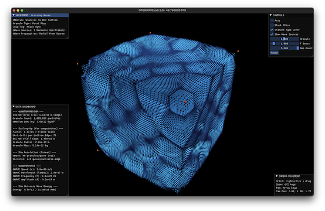

# WELCOME TO OPENWAVE

## OpenWave

OpenWave is an open-source computational physics toolkit that explores whether matter and energy phenomena can be modeled using wave field dynamics. The project implements the mathematical framework of [Energy Wave Theory (EWT)](https://energywavetheory.com) through two complementary approaches: **Level-1 field-based simulations** (research-grade lattice field theory) and **Level-0 granule-based visualizations** (educational wave mechanics demonstrations).


## Two Computational Approaches

OpenWave provides two complementary ways to explore wave mechanics:

### Level-1: Field-Based Medium (for Research)

**Status:** Work in Progress (WIP)

- **Methodology:** Lattice field theory - similar to lattice QCD computational methods
- **Implementation:** 3D vector field grid with PDE-based wave propagation
- **Scale:** Wavelength-scale to molecules
- **Purpose:** Research simulations for matter formation, force modeling, numerical validation
- **Use Case:** Scientific research, advanced simulations, subatomic engineering

### Level-0: Granule-Based Medium (for Education)

**Status:** Released and Available

- **Methodology:** Particle-based visualization with phase-shifted oscillations
- **Implementation:** Discrete granules representing wave medium
- **Scale:** Planck-scale to wavelength
- **Purpose:** Educational visualization, understanding wave formation
- **Use Case:** Learning, illustration, animation, introduction to wave concepts

**Key Insight:** Level-1 uses the same computational approach as quantum field theory (lattice discretization), while Level-0 provides intuitive visuals. Both are computational tools for exploring whether wave dynamics can model physical phenomena.

## Xperiments

OpenWave Xperiments is a collection of interactive physics simulations that brings wave field dynamics to life through real-time visualization and computation.

**Currently Available: Level-0 Demos** showcase wave mechanics fundamentals through intuitive visualizations. These xperiments demonstrate how waves propagate, interfere, and create standing patterns - the foundational concepts that will be scaled up in Level-1 research simulations.

Each Xperiment is fully customizable (via user controls and Python scripting), enabling you to adjust parameters such as universe size, wave source configurations, and visualization settings to investigate wave behavior at different scales.

**Recommended:**

- **Follow the Level-0 demo sequence below if you are new to OpenWave**
- **Level-1 research tools** are under development for matter formation simulations

## XPERIMENTS LEVEL-0 DEMO (start here)

### 1. Spacetime Vibration

**In this model:**

- Spacetime is represented as oscillations at extremely high frequencies (10^25Hz)
- If you slow down the simulator frequency and increase the amp boost, you can observe WAVE PATTERNS (these waves are the effect of harmonic oscillations)
- The wave patterns serve as the SOURCE for modeling all energy forms, forces, and matter development in the simulation
- Now reduce the granule size and observe the wave pulse - this rhythm represents TIME ITSELF in the model (the wave's frequency defines the simulation's fundamental clock)
- These waves are called ENERGY WAVES in EWT's framework - the computational primitives for this modeling approach

**What you're seeing:** A computational representation of how wave mechanics might underlie physical phenomena.

<div align = "center">

  

</div>

### 2. Spherical Wave

This xperiment demonstrates in a 3D view how a spherical longitudinal wave propagates through the granular medium. In EWT's framework, longitudinal waves are the primary mode for modeling ENERGY WAVE propagation.

**Educational value:** Helps visualize how waves spread through a medium and how energy transfers from one location to another.

<div align = "center">

  

</div>

### 3. Standing Wave

This xperiment demonstrates standing wave patterns that emerge from inward and outward wave interactions. In EWT's model, standing waves are proposed as the mechanism that gives matter its structure, from fundamental particles to atoms and molecules.

- Play with the granule size control and see the emergence of crystal-like structures
- **Observation:** Notice how stable patterns form when waves interfere constructively

**Research question:** Can standing wave patterns account for particle properties like mass, charge, and spin? OpenWave helps explore this computationally.

<div align = "center">

  

</div>

### 4. Play with other Xperiments and Start your Research

Now that you're introduced to the basic concepts of wave phenomena in this computational framework, you can start experimenting with different wave configurations and parameters. Use the tools provided in the OpenWave platform to create your own simulations and explore how waves behave in various scenarios.

**What you can explore:**

- Wave interference patterns
- Energy transfer mechanisms
- Stable wave structures
- Resonance phenomena
- How changing parameters affects outcomes

To launch the Xperiments Selector Menu:

- Follow installation instructions at [README file](../../../README.md)
- Then, on your terminal run:

```bash
# Launch xperiments using the CLI xperiment selector

  openwave -x

# Run sample xperiments shipped with the OpenWave package, tweak them, or create your own
```

<div align = "center" style="text-align: center">
  <table>
    <tr>
      <td style="text-align: center">
        <div align = "center">
          <a></a>
          <br>X-Waves Xperiment
        </div>
      </td>
      <td style="text-align: center">
        <div align = "center">
          <a></a>
          <br>Pulse Xperiment
        </div>
      </td>
    </tr>
    <tr>
      <td style="text-align: center">
        <div align = "center">
          <a></a>
          <br>Radial Wave Xperiment
        </div>
      </td>
      <td style="text-align: center">
        <div align = "center">
          <a></a>
          <br>Spring-Mass Xperiment
        </div>
      </td>
    </tr>
  </table>
</div>

## SCIENTIFIC SOURCE

For more details on the theoretical framework, mathematical derivations, and research papers, refer to: [Energy Wave Theory (EWT)](https://energywavetheory.com).

**Context:** EWT is an alternative formalism to quantum field theory that proposes deterministic, wave-based explanations for quantum phenomena. Like Bohmian mechanics or stochastic electrodynamics, it offers a different mathematical approach to describing physical observations.

**OpenWave's Computational Implementation:**

- **Level-1** uses lattice field theory methodology (similar to lattice QCD) with EWT's field equations
- **Level-0** provides particle-based visualizations for intuitive understanding
- Both are computational frameworks for testing whether EWT's mathematics can reproduce experimentally observed physics

## OPENWAVE LEVELS

| OPENWAVE | LEVEL-0 (shipped) | LEVEL-1 (WIP) | LEVEL-2 (future) |
|----------|---------------------|---------------|------------------|
| SCALE | planck-scale to λ | λ-scale to molecules | molecules to human-scale |
| LOGIC | GRANULE-BASED MEDIUM | FIELD-BASED MEDIUM | ADVANCED COMPUTING PLATFORMS |
| system requirements | runs on personal computers | runs on personal computers | computing-clusters <br> quantum-computing |
| wave-medium | granule-base lattice | field-based grid | to be developed |
| wave-engine | phase shifted harmonic oscillations | vector field wave propagation | to be developed |
| USE-CASE | EDUCATIONAL, ILLUSTRATION | ADVANCED SIMULATIONS | LARGE-SCALE SIMULATIONS |
| | Learning <br> Visualization, Animation <br> Welcome to OpenWave | Numerical Analysis <br> Scientific Research <br> Subatomic Engineering | large simulation domain <br> large quantities of matter (atoms/molecules) |
| DESCRIPTION | granules INTO waves <br> waves modeled as granules <br> how waves are made <br> wave formation <br> spacetime & wave phenomena <br> universe foundation <br> energy source | waves INTO matter <br> matter modeled as waves <br> how waves make matter <br> wave interaction <br> matter, forces, EM & heat <br> material universe <br> energy effects | TBD |
| PLATFORM | OPENWAVE Platform <br> (from v0.3.0+) | OPENWAVE Platform <br> (from v0.4.0+) | OPENWAVE Platform <br> (vTBD)|
| | GPU optimization <br> Xperiments module <br> CLI, Rendering engine <br> Common & I/O modules <br> Open-Source code | GPU optimization <br> Xperiments module <br> CLI, Rendering engine <br> Common & I/O modules <br> Open-Source code | GPU optimization <br> Xperiments module <br> CLI, Rendering engine <br> Common & I/O modules <br> Open-Source code |

## Getting Help and Contributing

- See the main [README](../../../README.md) for contribution guidelines
- Join discussions on [Reddit](https://www.reddit.com/r/openwave/)
- Follow development on [GitHub](https://github.com/openwave-labs/openwave)
- Watch tutorials on [YouTube](https://youtube.com/@openwave-labs/)

**Welcome to the exploration!** 🌊
