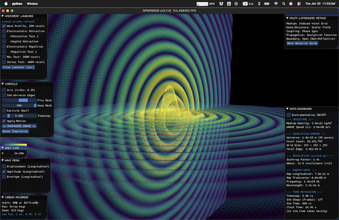

# M4 EWT (Energy Wave Theory): Model Briefing

> **What M4 brings.** Jeff Yee's Energy Wave Theory as a live vector-field non-linear PDE
> engine: the successor to M3's scalar core, carrying EWT's analytic wave constants +
> equations into a time-integrated solver. The substrate upgrade is complete; the
> electron-soliton search is the live open work. It shares the "EWT (M4)"
> [`MODELS.md`](../../../MODELS.md) column with M3.

## Identity

| Field | Value |
| --- | --- |
| Model ID | M4 |
| Name | EWT (Energy Wave Theory) |
| Author | Jeff Yee, built on Milo Wolff + Gabriel LaFreniere pioneer work |
| Author contact | GitHub [@jeffsyee](https://github.com/jeffsyee), for author-gated questions (definitions, intent, what the model does and does not claim); routing convention in [`dev_docs/CROSS_MODEL_TESTING.md`](../../../dev_docs/CROSS_MODEL_TESTING.md) § 6 |
| Co-author | Łukasz Smoliński, GitHub [@lsmolinski](https://github.com/lsmolinski). Scope: the Enhanced EWT extension (BCC lattice formulation, ψ³ soliton stabilizer, the 1-3-6 arrangement, and the M4.3 onward weak-field encoding chain). Author-gated questions inside that scope route here, per [`ONBOARDING_MODELS.md`](../../../ONBOARDING_MODELS.md#model-co-authors) |
| Relationship | the vector-PDE successor to M3 (Wolff-LaFreniere scalar); same EWT family, shares the coverage column (see [`../m3_wolff_lafreniere/__M3_model_briefing.md`](../m3_wolff_lafreniere/__M3_model_briefing.md)) |
| Primary sources | Yee energywavetheory.com papers (01-10 + supplements); Smoliński soliton paper (`theory/`) |
| In-repo | `medium.py` + `particle.py` + `wave_engine.py` + `force_motion.py` + `_launcher.py`; `research/M4_engine_upgrade.md`; validation record under `../m3_wolff_lafreniere/research/` |

## Model Profile (what it brings, short form)

| Attribute | M4 |
| --- | --- |
| Substrate | indexed cubic voxel grid (attometer f32); 3-component displacement field ψ (triple-buffer leapfrog) |
| Particle | a WaveCenter: a localized wave-deflector that emits spherical waves and responds to energy gradients; neutrino = K = 1 seed |
| Approach | EWT wave constants + equations: non-linear vector wave PDE `∂²ψ/∂t² = c²∇²ψ − dV(ψ)`; energy `E = ρV(fA)²`; force `F = −∇E` |
| Charge | phase offset (0 = electron, π = positron), imposed not emergent |
| V(ψ) modes | linear / cubic / saturating / double-well (swappable) |
| Free parameters | EWT analytic wave constants (A, λ, f, ρ, c) + electron K = 10, outer-shell Oe, orbital gλ |
| Anchor | electron (K = 10 tetrahedron), neutrino (K = 1 seed); constants calibrated to measured electron radius / energy / mass |

## Decision-Relevant Attributes

Model-level attributes to weigh the column: parameter economy, the formal artifacts that
back the claims, and what would falsify the model next. The EWT record lives on the M3
scalar engine, so these link into `m3_wolff_lafreniere/`. (Held here for now; a consolidated
cross-model version may return to `MODELS.md` later.)

| Attribute | M4 (EWT) |
| --- | --- |
| Free parameters | EWT's analytic wave constants (amplitude, wavelength, density); in-sim runs add documented envelope/threshold choices per script [`../m3_wolff_lafreniere/research/0a_equations.md`](../m3_wolff_lafreniere/research/0a_equations.md) |
| Formal artifacts | Runnable scripts + an explicit honest-blockers status doc [`../m3_wolff_lafreniere/research/0_STATUS.md`](../m3_wolff_lafreniere/research/0_STATUS.md) |
| Falsifiable near-term tests | K-selectivity under perturbation (currently failing, and documented as such) [`../m3_wolff_lafreniere/research/0_STATUS.md`](../m3_wolff_lafreniere/research/0_STATUS.md) |

## Field Configuration of Particles

Same particle picture as M3 (the EWT family), now on a vector substrate. All configurations
use **standing-wave interference, not topology** (no winding number, no vortex):

| Particle | Field configuration in M4 | Topological vortex? |
| --- | --- | --- |
| Electron / positron | K = 10 "1-3-6 tetrahedron" of in-phase wave-centers; positron = phase π | ❌ standing wave |
| Electron neutrino | K = 1 fundamental wave-center seed | ❌ standing wave |
| Annihilation pair | two opposite-phase WCs, head-on | ❌ |

The vector engine adds the machinery (L / T split, swappable `V(ψ)`) intended to make
selectivity and far-field EM *emerge*, but the electron-soliton core is not yet obtained.

## Implementation Status

The EWT family shares one [`MODELS.md`](../../../MODELS.md) column, "EWT (M4)"; the live
per-criterion counts are on its score-board. The validation record is authored on the M3
scalar engine; M4 is the vector-PDE successor whose in-sim validation is in progress. The
engine substrate upgrade (P0-P4) is complete.

| Sector | Status |
| --- | --- |
| Vector-PDE substrate | ✅ built + runs (medium, leapfrog PDE, swappable `V(ψ)`, WC modes, `F = −∇E`, annihilation detection) |
| Electron mass | ⚠️ analytic EWT values, not in-sim dynamics |
| Charge quantization | ❌ imposed via `cos(offset)` (#203) |
| Lepton K-selectivity | ❌ all K = 2..10 equally stable at perfect placement (#201) |
| Coulomb far-field | ❌ needs the L / T divergence-curl split (#202) |
| Soliton core / oscillon | 🚧 not yet obtained (pure cubic collapses; saturating quintic does not arrest at CFL dt) |

Deep dives: [`research/M4_engine_upgrade.md`](research/M4_engine_upgrade.md); the shared EWT
record under
[`../m3_wolff_lafreniere/research/0_STATUS.md`](../m3_wolff_lafreniere/research/0_STATUS.md).

## Mode of work

Headless first: scripts, data, plots and a written note under
[`research/`](research/), which carries its own
[layout and conventions](research/README.md). The rendered launcher in this model root
is the later step, and it runs the kernels the headless work has already validated. The
two solvers and what each is for: [`TUTORIAL.md § 3`](../../../TUTORIAL.md#3-the-two-solvers-headless-sandbox-vs-rendered).

The program lives in [`research/m4_roadmap.md`](research/m4_roadmap.md) and the spec of
record in [`research/m4_theory_canonical.md`](research/m4_theory_canonical.md), both
scaffolded as skeletons for whoever extends the model. AI agents bootstrap on this column
by reading [`research/m4_agent_orientation.md`](research/m4_agent_orientation.md).

### Before you cite a number as evidence

Review rounds on this column keep turning on the same defect, so it is worth
stating once, for contributors and for the agents that help them write. A check,
or an agreement quoted in a note, is evidence for a claim only if it could have
come out differently had the claim been false. The shapes that have appeared
here:

| Shape | The test that catches it |
| --- | --- |
| A PASS line whose two sides evaluate the same expression | Replace the rule under test with something wrong and confirm the line goes red |
| A quantity offered as confirming a constant that does not enter its derivation | Follow the constant through the call graph. If it is absent, the quantity is the same number for every value of it |
| A restatement of a number in another form (a power, a ratio, a unit change) counted as a second confirmation | Ask what the second form could have shown that the first did not |
| A target constant that is a theory prediction carrying an experimental-looking name | Trace the target to its source. `A_TAU_EXP` is the Standard Model value for `a_tau`, and the experimental bound is wider than the value itself, so no measurement of it discriminates between models at the precision a note would quote |
| A sensitivity quoted where an accuracy is meant | Ask what the number is a distance between. A scan's resolution says how sharply an observable locates a parameter; it is not the residual against the measured value, and the two can differ by an order of magnitude |

Where a quantity has no independent target to compare against, the honest label
is *asserted* or *consistent with*, not *confirmed*. Writing "this is a
consistency observation, not a discriminator" costs a line and is what makes
the rest of a note credible. The reviewer-side versions are
[`PR_REVIEW_STANDARDS.md`](../../../dev_docs/PR_REVIEW_STANDARDS.md) rows D10 to
D13; the contributor-side self-check shapes are in
[`CONTRIBUTING.md`](../../../CONTRIBUTING.md).

### Reading the two gravity criteria

The two gravity rows are worded differently and are earned differently.

`Gravity: Newton limit (GEM)` credits the strength "only when it follows from the
model's own mechanism, never fitted". That clause has two halves, and discharging
one is not discharging the other:

| Half | What discharges it |
| --- | --- |
| Circularity | The constant does not re-enter the chain through an input. Deriving `lambda_l` rather than setting it to the Planck length discharges this, since the Planck length carries `G` |
| Accuracy | The derived value is compared against its target with the residual stated against the target's own uncertainty, never against a scan's resolution |

A dimensional anchor is not a fitted parameter. A chain that predicts a
dimensionless ratio and multiplies it by measured quantities is deriving, not
fitting, and the anchor belongs in the note at the point of use rather than left
for a reader to reconstruct.

`Gravity: local metric phenomena` carries no strength clause. Its test is light
bending, gravitational time dilation and Shapiro delay. Sourcing the amplitude
from the model instead of from CODATA strengthens the row and does not gate it:
the row is gated by whatever the shape derivation still assumes.

## Roadmap

| Next | What lands |
| --- | --- |
| Electron soliton (#201) | the oscillon route: localized seed + sub-CFL dt + mass term |
| Smoliński ψ³ stabilizer | coupling γ ≈ 2.41e4 from BCC geometry (γ = 8π⁷); verify the 1-3-6 stability postulate numerically |
| Emergent Coulomb (#202) | add the L / T divergence-curl split for far-field EM |
| Absorbing boundary | replace the Dirichlet reflections that pollute the soliton search |

## Help Wanted

| You can contribute | How |
| --- | --- |
| Land the electron oscillon | find a localized, stable soliton core in the vector PDE (the headline open problem) |
| Implement the L / T split | unlock emergent Coulomb (#202) |
| Verify the Smoliński stabilizer | test whether ψ³ with γ = 8π⁷ holds the 1-3-6 arrangement |
| A documented negative | a runnable "this does not work, here is why" counts as much as a positive |

Flow: open a discussion → fork → branch → PR with a DCO sign-off
(`git commit -s`), under Apache 2.0. See [`../../../MODELS.md`](../../../MODELS.md)
§ Contributing, [`../../../ONBOARDING_MODELS.md`](../../../ONBOARDING_MODELS.md),
[`../../../CONTRIBUTING.md`](../../../CONTRIBUTING.md). Model discussion runs in the
Models-of-Particles group.

## Rich Context for Deep Reader

This is a top level documentation and orientation content. For additional context on this model, a detailed read in the /theory and /research folders is recommended, as well as the production files in this model root folder, that may contain the canonical full PDE implementation of the theory.
