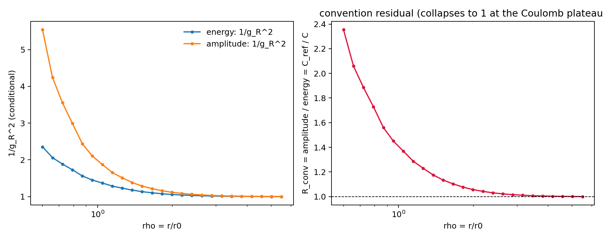

# M5.31 companion — convention admissibility: a non-target-fitting selection procedure for the two coupling readings

**Status:** independent companion analysis to [M5.31](../findings/m5_31_coupling_curvature_note.md). It selects among M5.31's two preregistered `C -> g_R` readings by physical admissibility legs rather than by a comparator. The result is a **declared null** (the legs do not separate the two readings) plus the **exact convention residual** that quantifies the remaining ambiguity. It selects no convention (that stays author-gated on the M5 action), touches no `MODELS.md` cell, and imports no M5.31 physics module. Coordination: [Discussion #438](https://github.com/openwave-labs/openwave/discussions/438).

## 0. Why this note exists

M5.31 measured the dimensionless curvature form factor `C(rho)` and reported two conditional inverse-coupling readings side by side, stating (its section 1.3) that the dictionary "must be settled by the field/action dictionary rather than by agreement with a target." That is a request for a **principled, non-target-fitting selection procedure**. This note supplies one, transferred from an adjacent, independently-reviewed public induced-gravity result that faces the structurally identical problem — several mathematically valid schemes for one coupling — and resolves it by physical legs, never by fitting a target (Substrate Framework, accepted claims **C-IGR-004** and **C-GRV-002**, release v0.162.0, Apache-2.0; provenance in section 6). The mathematics is rederived here so the analysis stands on its own; the public claims are cited as provenance, not as load-bearing evidence.

**One honesty boundary, stated up front.** The cited result's scale factor `J(z)` (a proper-time/cutoff object) is **not** M5.31's radial form factor `C(rho)`. Only the *selection procedure* transfers; no number and no `C`-to-`J` identification is claimed. This note does not import, assert, or depend on any specific value from the cited framework.

## 1. Equations first

### 1.1 The two readings (rebuilt from scratch)

With the farthest shell as reference, `C_ref = C(rho_max)`, and `mu/mu0 = 1/rho`, M5.31's two preregistered readings are

- energy/action:   `1/g_R^2 = (C_ref / C)^1`
- field-amplitude: `1/g_R^2 = (C_ref / C)^2`

Both are rebuilt here independently and cross-checked against the shipped arrays (gate G1).

### 1.2 The admissibility legs

A candidate reading is admitted only if it satisfies every **Group A** leg; **Group B** asks the separate question of whether the object is already a renormalized coupling.

Group A — admissibility of a running curve:

- **A1 positivity:** `1/g_R^2 > 0` for all `rho`.
- **A2 strict monotone running:** `1/g_R^2` strictly decreasing in `rho` (strictly increasing in `mu`); no interior extremum.
- **A3 finite non-zero plateau:** `1/g_R^2(rho_max)` finite and positive, and the far log-slope has died off, `|d(1/g_R^2)/d log mu|_far| < 0.10`.

Group B — is it already a coupling:

- **B1 one-loop scale-constancy:** a genuine one-loop coupling has a scale-constant log-slope `d(1/g_R^2)/d log mu ~ -b0`. Operationally, the coefficient of variation of the interior slope is below `0.05`. A classical form factor fails this.

Selection rule (reported, never assumed): if a leg admits exactly one reading, it selects it; if every leg treats both readings identically, the discrimination is a **declared null** and the residual is quantified rather than resolved.

### 1.3 The exact convention residual

When both readings survive Group A, the honest residual is their exact ratio,

```
R_conv(rho) = (amplitude reading) / (energy reading)
            = (C_ref/C)^2 / (C_ref/C)^1
            = C_ref / C(rho),
```

which equals the energy reading itself. This is the "report the spread, do not pick" discipline the cited framework applies to its own scheme residual: the convention choice is a measurable, bounded ambiguity, largest in the core and vanishing where the two readings coincide.

## 2. Equation-to-code map

| Object | Auditable implementation |
| --- | --- |
| Rebuilt readings `(C_ref/C)^power` | [`inverse_coupling`](../scripts/m5_31_convention_admissibility_scan.py#L72-L77) |
| Independent local-cubic slope | [`local_cubic_slope`](../scripts/m5_31_convention_admissibility_scan.py#L79-L90) |
| A1 / A2 / A3 legs | [`leg_positivity`, `leg_strict_monotone`, `leg_finite_plateau`](../scripts/m5_31_convention_admissibility_scan.py#L93-L107) |
| B1 one-loop scale-constancy | [`leg_one_loop_constant`](../scripts/m5_31_convention_admissibility_scan.py#L110-L117) |
| Residual `R_conv`, discrimination, gates | [`analyse`](../scripts/m5_31_convention_admissibility_scan.py#L120-L212) |

The driver reads only the tracked `data/m5_31_coupling_curvature_scan.json` (M5.31's finest field shells) and writes `data/m5_31_convention_admissibility_scan.json` plus the plot.

## 3. Results against frozen gates

Deterministic run, `C_ref = 0.998216` (finest field shells, `n = 107`).

| Gate | Result | Verdict |
| --- | --- | --- |
| G1 rebuilt readings match shipped arrays (`max\|Δ\|`) | `0.0` | PASS (`< 1e-9`) |
| G2 both readings pass Group A (admissible running curves) | true | PASS |
| G3 discrimination is null (no leg separates the two) | `discriminating_legs = []` | PASS |
| G4 neither reading passes B1 (neither is a one-loop coupling) | true | PASS |
| G5 residual equals `C_ref/C` (`max\|Δ\|`) | `< 1e-12` | PASS |
| G6 mutation breaks the monotone leg | true | PASS |

G1 and G5 are same-input consistency identities and A1 is near-vacuous for this positive `C`; the falsifiable, load-bearing leg is **A2**, shown to fail by the mutation gate G6 (§ 4).

Interior slope coefficient of variation: **1.13** (energy), **1.32** (amplitude) — both far above the `0.05` one-loop bar, so B1 fails for both. The object is a form factor under either convention, independently reconfirming M5.31's own headline by a different check (slope non-constancy rather than the exact-shell oracle).

The residual across the scan:

| `rho` | `1/g_R^2` energy | `1/g_R^2` amplitude | `R_conv` |
| ---: | ---: | ---: | ---: |
| 0.600 | 2.3540 | 5.5415 | **2.3540** |
| 1.044 | 1.3697 | 1.8761 | 1.3697 |
| 1.817 | 1.0767 | 1.1593 | 1.0767 |
| 3.161 | 1.0109 | 1.0218 | 1.0109 |
| 5.500 | 1.0000 | 1.0000 | **1.0000** |

`R_conv` runs from **2.354** at the core (`rho = 0.6`) to **1.000** at the Coulomb plateau (`rho = 5.5`): the convention choice matters at most a factor ~2.35 in the core and is asymptotically irrelevant where `C` plateaus.



## 4. Mutation sensitivity

The admissibility legs are real checks, not definitions restated against themselves. Denting one interior `C` value to half its value makes the energy reading non-monotone, and **A2 fails** (gate G6). A leg that cannot fail on corrupted input would not have caught it.

## 5. What this contributes — and what it does not

Contributes:

- an independent reimplementation of both M5.31 readings, reproducing the shipped arrays exactly;
- a reusable, machine-checked **admissibility-leg primitive** for convention/scheme selection, applicable to future openwave questions of this shape, with public accepted-claim provenance;
- the exact **convention residual** `R_conv(rho) = C_ref/C`, bounding the ambiguity (≤ 2.354 here, → 1 at the plateau);
- an independent reconfirmation, via slope non-constancy, that the object is a form factor rather than a one-loop coupling under either reading.

Does not:

- select between `C ∝ g_R` and `C ∝ g_R^2` — the legs do not separate them (declared null); the dictionary stays author-gated on the M5 action;
- identify `C` with the cited framework's `J`, or import any value from it;
- compute a `b0`, a beta function, a two-core coupling, or touch any `MODELS.md` cell.

## 6. Provenance

The selection procedure is transferred from two accepted, publicly-openable claims in the now-public [Substrate Framework](https://github.com/vantasnerdan/substrate-framework) (Apache-2.0, release v0.162.0):

- **C-IGR-004** — a derived usable total gravitational-coupling composition whose *usable scheme set* is the output of physical legs (spectral positivity, monotone large-mass decoupling, cutoff-ontology closure), with the residual scheme-dependence reported as an exact spread rather than a picked value. [`governance/claims.yaml`](https://github.com/vantasnerdan/substrate-framework/blob/main/governance/claims.yaml).
- **C-GRV-002** — the exact attractive-sign map `sign(Δ) = sign(1 − 6ξ)` for that induced coupling, conformal-marginal at `ξ = 1/6`.

Every citation here is openable by any reader. The legs above are the M5-appropriate analogue of that method, rederived independently; the substrate values are not used. (An offered, non-blocking direction: C-GRV-002's sign map may be a useful lens on M5's Gravity/GEM force-sign reversals — a question for the model owner, not a claim of this note.)

## 7. Adversarial audit

Per `AI_HYGIENE.md` § 1, an independent agent re-derived every reading and leg from scratch with its own numpy pipeline (no import of the audited script), under a REFUTE mandate. It read `spatial_refinement[-1]["C"]` (`n = 107`, 25 shells), `C_ref = 0.9982163262549684`.

| # | Claim | Verdict | Auditor's own number |
| --- | --- | --- | --- |
| 1 | energy `(C_ref/C)¹`, amplitude `(C_ref/C)²`; reproduce shipped | CONFIRMED | `max\|Δ\| = 0.0`, bit-identical both |
| 2 | both pass Group A | CONFIRMED | far-slope 0.0075 / 0.0149 `< 0.10`; A1–A3 all true |
| 3 | discrimination null | CONFIRMED | `discriminating_legs = []` |
| 4 | neither passes B1; interior CV ≫ 0.05 | CONFIRMED | CV 1.13 / 1.33 (gradient), 1.13 / 1.33 (central FD), 1.15 / 1.37 (width-7 fit) |
| 5 | `R_conv = C_ref/C`, range [1.0, 2.354] | CONFIRMED | `max\|Δ\| = 2.2e-16`; [1.000000, 2.354032] |
| 6 | mutation is a real check | CONFIRMED | `C[12]×0.5 → A2 False`; positivity stays true on the same data (a cannot-fail leg misses it) |

Disclosed non-falsifiable gates (QUALIFIED, non-blocking): **G5** (`R_conv = C_ref/C`) is an algebraic identity, and **A1 positivity** is near-vacuous for this positive-monotone `C`. Both are consistency checks, honestly labeled; the load-bearing discriminating leg **A2 is falsifiable and is demonstrated to fail** by the mutation gate G6. **G1** is a same-input/same-formula consistency check, not an independent numerical path.

Honesty boundary CONFIRMED: no convention selected, `C` not identified with the cited `J`, `MODELS.md` untouched. No machine-local paths; all equation-to-code `#L` anchors bracket their functions.

**Auditor bottom line: honest and mergeable as written; no refutations.**

## 8. Reproduction

From the repository root:

```bash
python3 openwave/xperiments/m5_liquid_crystal/research/scripts/m5_31_convention_admissibility_scan.py
```

Outputs `data/m5_31_convention_admissibility_scan.json` and `plots/m5_31_convention_admissibility.png`; exit status is `0` only if all six gates pass.
