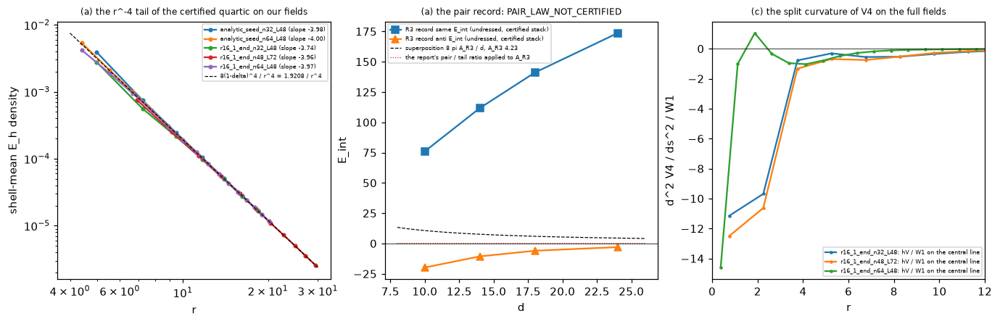
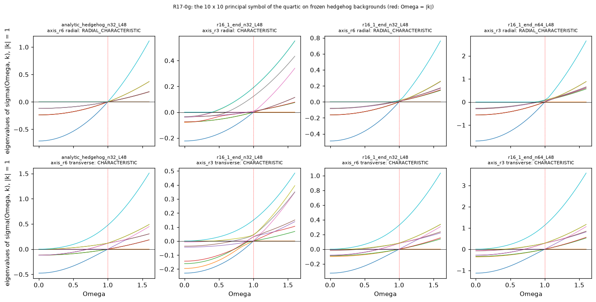
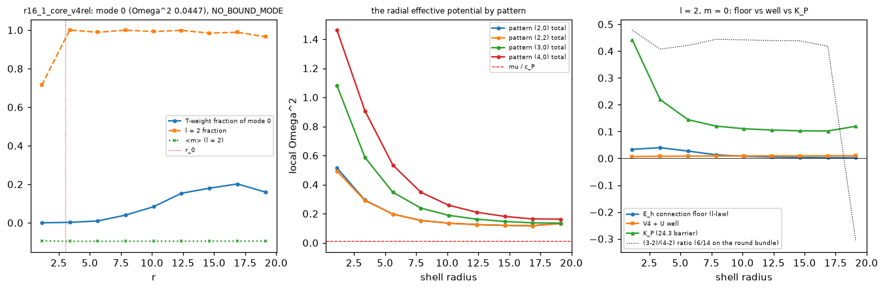
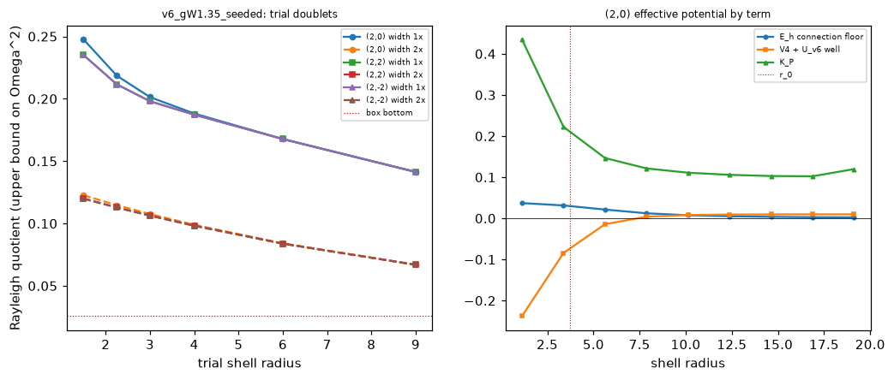

# M5.32 method note: the autonomous Lagrangian hunt (rungs R0 to R10)

> **Status: the task is PAUSED, not finished.** This note is built to the
> [`METHOD_NOTE.md`](../../../../../dev_docs/METHOD_NOTE.md) standard: the reader must be able to
> audit every number below by reading, without trusting the run and without reverse-engineering
> Python. It is written for the model author and for the maintainer re-reading it later, who are the
> same reader. Section 8 carries the open questions.
>
> Task record: [`tasks/m5_32_task_details.md`](../tasks/m5_32_task_details.md) (plan, RUNG LOG, the
> pause records). Machine ledger: [`data/m5_32_ledger.json`](../data/m5_32_ledger.json).
> Code links resolve once the task's branch is merged to `main`.

## 1. The physics, before any result

### 1.1 Field, metric, conventions

```text
M(x)            a real 4x4 matrix field on a periodic cubic lattice
eta             diag(-1, +1, +1, +1); index 0 is time, as a derivative index AND as
                the internal row of M
A_mu            d_mu M, the jets, with RAW CONTRAVARIANT internal entries
Lorentz action  M -> L M L^T   (raw entries contravariant)
                under M -> L^-T M L^-1 the roles swap; the two agree on M_cov = eta M eta,
                so any covariant-metric object must be converted before mixing
vacuum          M_vac = diag(-s g, 1, delta, 0);  toy point s = -1, g = 32, delta = 0.3
lattice         h = L / n, certified symmetric stencil: the density is formed per
                forward and backward branch, then weight-averaged
```

Contraction rule, locked at R0 and audited: a derivative-derivative index pair contracts with
`eta`, an internal-internal pair with `eta`, and a MIXED derivative-internal pair with `delta`.
The all-`eta` reading is not covariant (measured boost drift 32.2, the R0 audit's figure) and is retained only as the
control term `I3_mixed_eta`.

### 1.2 The certified action

```text
F_mu nu      = A_mu eta A_nu  -  A_nu eta A_mu            (curvature, quadratic in the jets)
<F, G>_eta   = tr( eta F eta G^T )                        (the bracket)
I1           = sum_{mu < nu} eta^mu mu eta^nu nu <F_mu nu, F_mu nu>_eta
             = (1/2) F_abcd F^abcd
V4           = w sum_{p = 1..4} ( tr((M eta)^p) - C_p )^2 ,  C_p = (s g)^p + 1 + delta^p
w            = 7.24023879e-4
L_cert       = -4 I1  -  V4                               (CERTIFIED_COEFFS)
```

### 1.3 The clock, and the two energies

The clock is a one-parameter internal rotation applied in the body frame of the hedgehog ansatz.
Its tangent at `t = 0` is the field `a0`, and the time jet is `A_0 = omega a0`:

```text
a0(x)        = Qh(x) ( G1 d4 + d4 G1^T ) Qh(x)^T          (the co-moving flow)
G1           the (2,3)-plane rotation generator: G1[2,3] = -1, G1[3,2] = +1
Qh(x)        = R3(phi) R2(theta), the Euler frame carrying the eigenvalue-1
             eigenvector to n-hat = x / |x|
```

Every term in the registry is a polynomial in `omega`, so the Lagrangian read and the Hamiltonian
(energy) read are related term by term by a Legendre transform:

```text
quadratic terms    I(omega) = A + B omega + C omega^2
                   H_I      = C omega^2 - A
quartic terms      I(omega) = A + C2 omega^2 + C4 omega^4
                   J        = dI/domega = 2 C2 omega + 4 C4 omega^3
                   H_I      = C2 omega^2 + 3 C4 omega^4 - A
lattice energy     E_cert   = 4 (U + omega^2 T) + V4      (the factor 4 is |CERTIFIED_COEFFS[I1]|)
clock inertia      kin      = -4 x (the omega^2 coefficient of I1) = INS4.kin_of(M, a0, cfg)
                            the two measures agree on the rigid ansatz to ten digits
fixed-J energy     E_J      = E_stat + J^2 / (4 kin)  ,  omega* = J / (2 kin)
```

`B` (the `omega`-odd piece) is zero for `I1` and nonzero for the mixed contractions `I2` to `I6`;
it shifts the fixed-J relation to `omega* = (J - B) / (2 C)` but leaves `H` even, so it never
creates a free minimum. That Legendre argument is re-verified symbolically per term.

### 1.4 The candidate families tested

```text
lambda-family (class C2, rung R2)
    L_lambda = -4 [ (1 - lambda) I1 + lambda I1_h ] - V4
    h_cov    = eta + 2 (eta u)(eta u)^T ,  u the timelike unit eigenvector of M eta, u^T eta u = -1
    I1_h     the bracket with eta -> h_cov on the INTERNAL pair only

K_T (class C4, rung R7)
    K_T      = (1/2) sum_mu eta^mu mu [ tr(h A_mu h A_mu) - tr(eta A_mu eta A_mu) ]
             = 2 sum_mu eta^mu mu sum_j (A_mu)_{0j}^2      in the u-frame
    L        = -4 [ (1 - lambda) I1 + lambda I1_h ] - c2 K_T - V4 ,  c2 > 0

quartics (classes C5 and C6, rung R8)
    Q_I1sq   = (I1 density)^2
    Q_I4sq   = (I4 density)^2 ,  I4 = R_ac R^ac ,  R[nu, a] = sum_mu F[mu, nu, a, mu]
    Q_Fpair  = sum_{mu<nu, rho<sigma} eta-weighted <F_mu nu, F_rho sigma>_eta^2
    Q_C6a    = [ sum_mu eta^mu mu tr(A_mu eta A_mu eta) ]^2
    Q_C6b    = sum_{mu nu} eta^mu mu eta^nu nu [ tr(A_mu eta A_nu eta) ]^2
    Q_BI     = b^2 ( sqrt(1 + 2 I1 / b^2) - 1 ) ,  b^2 = 1e4      (not polynomial in omega)
```

### 1.5 The ansatz, the relaxation, and the degree

```text
ansatz       M = Q d4 Q^T ,  Q = Qb Qh ,  d4 = diag(-s g, 1, delta, 0)
             Qb = I + sinh(m) K + (cosh(m) - 1) K2, the boost dressing built from n-hat
             at m = 0 (used throughout R7 to R10) Q = Qh, the Euler frame alone
relaxation   FIRE on E_static only (a0 = None, omega = 0), boundary shell pinned at the ansatz
             by ~pin_shell(n, h) with default depth 1.6
degree       read_charge_from_M on the SPATIAL 3x3 block of M (every caller passes
             M[..., 1:4, 1:4]): eigh, take V[..., -1] (the LEADING eigenvector, n-hat), lift
             its sign field over a centered cube surface, integrate the RP^2 degree
```

The last line is stated here in full because rung R10 turns on it: the instrument reads ONE
eigenvector of the spatial block, not the full order parameter, and the time row is invisible to
it. The sign of that degree is a lift convention, so it is reported as `+-1` throughout.

### 1.6 The gate and class vocabulary used below

The run pre-registered seven gates a candidate had to pass, and worked through term classes in a
fixed order. Both are defined in full in the task record
([`tasks/m5_32_task_details.md`](../tasks/m5_32_task_details.md), sections 4 and 8); the short
form, so the tables below can be read without it:

| Gate | Statement |
| --- | --- |
| G1 | Coulomb kept: like charges repel with a 1/r trend, the static sector unchanged |
| G2 | Newton reversed: two boost-dressed defects attract |
| G3 | Electron clock: a finite nonzero omega* at positive energy, the vacuum preferring omega = 0 |
| G4 | Lorentz covariance of the energy functional, verified numerically |
| G5 | Bounded below with no guard on every runaway family |
| G6 | Collateral: the certified positives survive (census ordering, protection, the fixed-J clock) |
| G7 | Parsimony and robustness: few terms, O(1) coefficients, every sign holding over a factor >= 4 |

| Class | Content |
| --- | --- |
| C0, C1 | the author's two contractions, and the full quadratic basis of `F x F` |
| C2 | field-dependent internal metrics (`h_cov`), `M`-inserted contractions, projector currents |
| C3 | the potential axis: eigenvalue penalties, the LdG lift, dressing-sensitive `V` |
| C4 | the lower-order 2-derivative term (`K_T`) |
| C5, C6 | curvature^4 and saturation; non-commutator quartics |
| C7, C8 | higher-order timelike-current / Skyrme contractions; cross-model imports (never opened) |

## 2. Equation-to-code map

Base: `https://github.com/openwave-labs/openwave/blob/main/openwave/xperiments/m5_liquid_crystal/research/`

| Object in section 1 | Function | File and lines |
| --- | --- | --- |
| `F_mu nu` from the jets | `F_of_A` | [`scripts/m5_32_lagrangian.py#L134`](https://github.com/openwave-labs/openwave/blob/main/openwave/xperiments/m5_liquid_crystal/research/scripts/m5_32_lagrangian.py#L134-L141) |
| the bracket and every contraction pattern | `_K_from_pattern`, `density_from_K` | [`#L142`](https://github.com/openwave-labs/openwave/blob/main/openwave/xperiments/m5_liquid_crystal/research/scripts/m5_32_lagrangian.py#L142-L182) |
| `I1` (sympy reference) | `I1_sym` | [`#L313`](https://github.com/openwave-labs/openwave/blob/main/openwave/xperiments/m5_liquid_crystal/research/scripts/m5_32_lagrangian.py#L313-L321) |
| `I4 = R_ac R^ac`, the mixed trace | `I4_sym`, `R_readings_np` | [`#L355`](https://github.com/openwave-labs/openwave/blob/main/openwave/xperiments/m5_liquid_crystal/research/scripts/m5_32_lagrangian.py#L355-L360), [`#L205`](https://github.com/openwave-labs/openwave/blob/main/openwave/xperiments/m5_liquid_crystal/research/scripts/m5_32_lagrangian.py#L205-L219) |
| `V4` and its weight `w` | `V4_sym`, `v4_density_np`, `W1` | [`#L371`](https://github.com/openwave-labs/openwave/blob/main/openwave/xperiments/m5_liquid_crystal/research/scripts/m5_32_lagrangian.py#L371-L382), [`#L236`](https://github.com/openwave-labs/openwave/blob/main/openwave/xperiments/m5_liquid_crystal/research/scripts/m5_32_lagrangian.py#L236-L242), [`#L109`](https://github.com/openwave-labs/openwave/blob/main/openwave/xperiments/m5_liquid_crystal/research/scripts/m5_32_lagrangian.py#L109) |
| `L_cert = -4 I1 - V4` | `CERTIFIED_COEFFS` | [`#L469`](https://github.com/openwave-labs/openwave/blob/main/openwave/xperiments/m5_liquid_crystal/research/scripts/m5_32_lagrangian.py#L469) |
| `A_0 = omega a0`, the stencil branches | `lattice_jets` | [`#L479`](https://github.com/openwave-labs/openwave/blob/main/openwave/xperiments/m5_liquid_crystal/research/scripts/m5_32_lagrangian.py#L479-L491) |
| `H_I = C omega^2 - A` | `term_hamiltonian` | [`#L500`](https://github.com/openwave-labs/openwave/blob/main/openwave/xperiments/m5_liquid_crystal/research/scripts/m5_32_lagrangian.py#L500-L510) |
| `(A, B, C)` per term | `omega_decompose` | [`#L515`](https://github.com/openwave-labs/openwave/blob/main/openwave/xperiments/m5_liquid_crystal/research/scripts/m5_32_lagrangian.py#L515-L522) |
| `K_T` density, both readings | `kt_density_np`, `kt_density_sym` | [`scripts/m5_32_r7_a_kt_form.py#L122`](https://github.com/openwave-labs/openwave/blob/main/openwave/xperiments/m5_liquid_crystal/research/scripts/m5_32_r7_a_kt_form.py#L122-L154) |
| the u-frame time row | `uframe_time_row` | [`#L410`](https://github.com/openwave-labs/openwave/blob/main/openwave/xperiments/m5_liquid_crystal/research/scripts/m5_32_r7_a_kt_form.py#L410-L419) |
| `E_stat` and `kin` under `L_lambda + c2 K_T` | `es_kin` | [`scripts/m5_32_r7_b_kt_lattice.py#L207`](https://github.com/openwave-labs/openwave/blob/main/openwave/xperiments/m5_liquid_crystal/research/scripts/m5_32_r7_b_kt_lattice.py#L207-L213) |
| `E_J` minimized over the dressing | `min_over_amp`, `scan_R` | [`#L230`](https://github.com/openwave-labs/openwave/blob/main/openwave/xperiments/m5_liquid_crystal/research/scripts/m5_32_r7_b_kt_lattice.py#L230-L275) |
| the six quartic densities | `d_I1`, `d_I4`, `d_Fpair`, `d_C6a`, `d_C6b`, `d_BI`, `QUARTICS` | [`scripts/m5_32_r8_a_quartics.py#L68`](https://github.com/openwave-labs/openwave/blob/main/openwave/xperiments/m5_liquid_crystal/research/scripts/m5_32_r8_a_quartics.py#L68-L140) |
| the exact degree-4 `omega` extraction | `omega_poly` | [`#L158`](https://github.com/openwave-labs/openwave/blob/main/openwave/xperiments/m5_liquid_crystal/research/scripts/m5_32_r8_a_quartics.py#L158-L175) |
| the generator enumeration `[X, M_vac]` | `generators`, `stage_generators` | [`scripts/m5_32_r8_b_ir_theorem.py#L53`](https://github.com/openwave-labs/openwave/blob/main/openwave/xperiments/m5_liquid_crystal/research/scripts/m5_32_r8_b_ir_theorem.py#L53-L94) |
| the far-field tail measurement | `stage_tail` | [`#L95`](https://github.com/openwave-labs/openwave/blob/main/openwave/xperiments/m5_liquid_crystal/research/scripts/m5_32_r8_b_ir_theorem.py#L95-L136) |
| the frame-free identity at `delta = 0` | `stage_equivalence` | [`scripts/m5_32_r9_b_string.py#L74`](https://github.com/openwave-labs/openwave/blob/main/openwave/xperiments/m5_liquid_crystal/research/scripts/m5_32_r9_b_string.py#L74-L109) |
| the continuum ring (the string, measured) | `M_continuum`, `stage_continuum_ring` | [`#L110`](https://github.com/openwave-labs/openwave/blob/main/openwave/xperiments/m5_liquid_crystal/research/scripts/m5_32_r9_b_string.py#L110-L147) |
| the fixed-physical-radius excision | `rho_of`, `run_box` | [`scripts/m5_32_r9_a_tube.py#L48`](https://github.com/openwave-labs/openwave/blob/main/openwave/xperiments/m5_liquid_crystal/research/scripts/m5_32_r9_a_tube.py#L48-L82) |
| `kin` on a relaxed field, and its shells | `kin_c2`, `kin_shells` | [`scripts/m5_32_r10_relaxed_ladder.py#L72`](https://github.com/openwave-labs/openwave/blob/main/openwave/xperiments/m5_liquid_crystal/research/scripts/m5_32_r10_relaxed_ladder.py#L72-L91) |
| the relaxation protocol | `relax` | [`#L92`](https://github.com/openwave-labs/openwave/blob/main/openwave/xperiments/m5_liquid_crystal/research/scripts/m5_32_r10_relaxed_ladder.py#L92-L125) |
| FIRE, the pinned shell, `kin_of`, `e_parts` | `fire`, `pin_shell`, `kin_of`, `e_parts` | [`scripts/m5_21_3_a_4d.py#L327`](https://github.com/openwave-labs/openwave/blob/main/openwave/xperiments/m5_liquid_crystal/research/scripts/m5_21_3_a_4d.py#L327), [`#L109`](https://github.com/openwave-labs/openwave/blob/main/openwave/xperiments/m5_liquid_crystal/research/scripts/m5_21_3_a_4d.py#L109), [`#L274`](https://github.com/openwave-labs/openwave/blob/main/openwave/xperiments/m5_liquid_crystal/research/scripts/m5_21_3_a_4d.py#L274), [`#L179`](https://github.com/openwave-labs/openwave/blob/main/openwave/xperiments/m5_liquid_crystal/research/scripts/m5_21_3_a_4d.py#L179) |
| the ansatz and the clock tangent | `dressed`, `a0_unit` | [`scripts/m5_21_8_b_lattice.py#L56`](https://github.com/openwave-labs/openwave/blob/main/openwave/xperiments/m5_liquid_crystal/research/scripts/m5_21_8_b_lattice.py#L56-L87) |
| **the degree instrument** (the record's) | `read_charge_from_M` on the spatial 3x3 block | [`scripts/m5_22_e_audit.py#L192`](https://github.com/openwave-labs/openwave/blob/main/openwave/xperiments/m5_liquid_crystal/research/scripts/m5_22_e_audit.py#L192-L200), called through [`m5_32_r6_a_deltaladder.py#L156`](https://github.com/openwave-labs/openwave/blob/main/openwave/xperiments/m5_liquid_crystal/research/scripts/m5_32_r6_a_deltaladder.py#L156-L169) |
| the R10 audit's own degree reader (a different lift and triangulation) | `directors`, `read_surface` | [`scripts/m5_32_r10_audit.py#L142`](https://github.com/openwave-labs/openwave/blob/main/openwave/xperiments/m5_liquid_crystal/research/scripts/m5_32_r10_audit.py#L142), [`#L247`](https://github.com/openwave-labs/openwave/blob/main/openwave/xperiments/m5_liquid_crystal/research/scripts/m5_32_r10_audit.py#L247) |
| the degree-0 vacuum-interior seed (the 78 % figure) | `unwound_seed` | [`scripts/m5_32_r10_audit.py#L260`](https://github.com/openwave-labs/openwave/blob/main/openwave/xperiments/m5_liquid_crystal/research/scripts/m5_32_r10_audit.py#L260) |
| the melt paths, the clock taper, the `g = 32` probe (the R10 audit's typed results) | the `zero_barrier_robustness`, `clock_taper`, `scope_g32` blocks | [`scripts/m5_32_r10_audit.py#L1036`](https://github.com/openwave-labs/openwave/blob/main/openwave/xperiments/m5_liquid_crystal/research/scripts/m5_32_r10_audit.py#L1036-L1092) |
| the note audit's independent re-derivation of all of the above | `path_energy`, `stage_barrier`, `stage_boundary`, `stage_taper`, `stage_g32` | [`scripts/m5_32_note_audit.py#L446`](https://github.com/openwave-labs/openwave/blob/main/openwave/xperiments/m5_liquid_crystal/research/scripts/m5_32_note_audit.py#L446-L708) |

## 3. The physics module

[`scripts/m5_32_lagrangian.py`](https://github.com/openwave-labs/openwave/blob/main/openwave/xperiments/m5_liquid_crystal/research/scripts/m5_32_lagrangian.py)
is the single-purpose registry: each term has ONE definition string (hashed, so a term is never
silently re-tried under a different meaning), a sympy implementation on the notebook conventions,
and a numpy implementation on the certified stencil, plus per-term selftests. Every driver imports
it; no driver re-implements physics. Run `python3 scripts/m5_32_lagrangian.py --selftest` for the
17-line check, and `--mutant eta_time_row` for the negative control that must redden it.

## 4. Results, each with its pre-registered gate

| # | Result | Gate it was pre-registered against | Convergence evidence |
| --- | --- | --- | --- |
| R0 | The stack, the record and the author's 2026-08-17 Newton notebook all reproduce | selftests within 1e-3 of the record | 17/17 selftests; 10/10 record items at <= 2.2e-15; notebook fit `A = 863.733`, `B = 167.668`, sign `+`, to six digits |
| R1 | **The whole constant-coefficient current-order class is infeasible**: no coefficients make the energy's `omega^2` form PSD on every time channel with the boost weight reversed | a coefficient region existing under either Coulomb gate | Farkas / LP certificates at `(g, delta)` = (32, 0.3), (8, 0.3), (32, 0.1), with and without the parity-odd terms, on every channel alone, even at `c_I1 = +4` |
| R2 | The covariant flip family `L_lambda` is bounded below for `lambda >= 1/2` by a pointwise theorem wherever `M eta` has a real timelike eigenvector, keeps the static sector exactly, and gives `lambda* = 1/2` on every channel | G4, G5, the sector half of G1 | 0 negative densities in 27,560 random non-Lorentz samples; 36 channel x g cases; lattice probes bounded with no guard |
| R3 | G2 not met on any of three constructions | sign robust across 2 of 3 constructions, 2 boxes, both boundary types | ansatz repulsive at 348 reads; 44 relaxed pair heals; the cross-inertia undecidable at this resolution |
| R4 | The fixed-J minimizer runs to the box wall on every localized dressing family, `omega*` proportional to `1/L` | an interior `R*` with `omega*` stable across the domain ladder | 96/96 producer cases and every audit case; `omega* L` constant at 7.1 |
| R6 | **C3 orbit-blindness theorem**: any Lorentz-invariant derivative-free `V` is constant along a Lorentz dressing | a potential that localizes the dressing | variation <= 2e-7 on 50 dressed points and the whole R4 family up to rapidity 3; Euclidean controls O(1e4) |
| R7 | `K_T` moves the fixed-J minimizer off the box wall, but the audit found the interior minimum is the dressing switching off (0.43 % deep), and the term is exactly inert on the realized clock channel; G7 fails on the drift gate alone | interior `R*` with `omega*` drift <= 10 % over a c2 range >= factor 4 | interior at `c2` = 0.03 and 0.1 in both boxes; drift never below 0.301 against the 0.10 bar; the range half is MET on a dense ladder (factor 4.87) |
| R8 | C6's `omega^4` inertia is exactly VOLUME extensive and h-independent | an IR-convergent `omega^4` inertia | L exponent 3.0000 to 1e-13, ratio 8.000 over a factor 2 in L; h exponent -3.6e-14 |
| R9 | The ansatz carries a topologically protected biaxial disclination on the z axis; at `delta = 0` the field is exactly frame-free and the PERIODIC clock vanishes identically (a smooth radial-boost flow survives). The audit's headline: a relaxation resolves the line into a finite core (radius 3.98 at h = 1.5, 3.58 at h = 0.75) with the clock surviving at an h-convergent inertia 351.17 / 351.14, at `g = 8` | a string-free hedgehog with a nonzero clock | frame-free identity to 2.08e-17 relative; continuum ring spread exactly `delta / 2` and radius-INDEPENDENT over a 1e4 shrink, against a spread proportional to the radius at `delta = 0` |
| R10 | **No energy barrier protects the ansatz's degree, and the extensive inertia is not a property of an object** | the relaxed core-resolved soliton's inertia still extensive (the producer's registered prediction; the unwinding and boundary claims below are the AUDIT's findings and carry no pre-registered gate of their own) | from the UNRELAXED ansatz, a straight-line melt to the degree-0 state never rises above its start (energy 62.852 at the start, 14.794 at the end, \|Q\| 1 -> 0 inside each of five melt windows, 201 points each); the barrier from the RELAXED state was not computed, and the probes run from it rise 0.73 to 4.49; a degree-0 configuration with a vacuum interior out to `r = 15` still carries 78 % of the inertia (272.20 of 351.17, equal-budget unconverged comparison); a linear taper of the clock flow over `r = 12` to `15` leaves 32.9 % and removes the box dependence, as any compactly supported clock on a box-independent interior must |

### 4.1 The two results that reverse earlier readings

**The degree instrument is not an invariant of this order-parameter space.**
`read_charge_from_M` takes `V[..., -1]` of the spatial 3x3 block, the leading eigenvector alone, so
it measures an `RP^2` degree of one eigenvector. The stabilizer of `d4` in `SO(1,3)+` is the Klein
four-group (an `L` with `L^T eta L = eta` and `L d4 L^T = d4` must commute with `d4 eta`, whose
spectrum is distinct, so `L` is a diagonal sign matrix; `det = +1` and `L_00 = +1` leave four), so
`pi_1 = Q8` and `pi_2 = 0`. With `pi_2 = 0` and the eigenvalues frozen on the `SO(1,3)+` orbit of
`d4`, any CONTINUOUS map `S^2 -> OPS` has leading-eigenvector degree 0; the degree `+-1` reading is
possible only because the ansatz is discontinuous on the measurement surface. On the same three
surfaces the instrument calls conflict-free, the MIDDLE eigenvector admits no consistent sign lift
at all. What was measured about protection is narrower than a barrier: from the unrelaxed ansatz a
straight-line melt to degree 0 never rises above its start, while the relaxed state's own barrier
was not computed and FIRE holds `|Q| = 1` on every surface through 12000 iterations; the protection
argument is `pi_2 = 0`, not a measured barrier.

**The extensive clock inertia belongs to the boundary and the frozen-clock convention.**
`kin` is quadratic in `a0`, so the frozen (non-tapering) clock flow is only an UPPER BOUND on the
fixed-J inertia, and an upper bound that grows with `L` cannot establish that the inertia grows with
`L`. A linear taper of the clock flow to zero over `r = 12` to `15` leaves 32.9 % of it, and a
compactly supported clock on a box-independent interior is L-independent by construction.

## 5. Minimal inspection set (physics first, driver last)

| Order | Artifact | Why |
| --- | --- | --- |
| 1 | [`scripts/m5_32_lagrangian.py`](https://github.com/openwave-labs/openwave/blob/main/openwave/xperiments/m5_liquid_crystal/research/scripts/m5_32_lagrangian.py) | the functional: every term's definition, sympy and numpy side by side |
| 2 | [`scripts/m5_22_e_audit.py#L192`](https://github.com/openwave-labs/openwave/blob/main/openwave/xperiments/m5_liquid_crystal/research/scripts/m5_22_e_audit.py#L192-L200) | the degree instrument, because section 4.1 turns on what it measures |
| 3 | [`scripts/m5_32_note_audit.py`](https://github.com/openwave-labs/openwave/blob/main/openwave/xperiments/m5_liquid_crystal/research/scripts/m5_32_note_audit.py) | the independent instrument behind section 9: its own ansatz, energy, clock tangent and degree reader, so every load-bearing number here has a second implementation to read against |
| 4 | [`data/m5_32_ledger.json`](../data/m5_32_ledger.json) | every rung's hypothesis, claims and audited verdicts in machine form; the drivers are listed there and are the last thing to read |

## 6. What was NOT computed

| Not computed | Why it matters |
| --- | --- |
| Any candidate carried through the full G1 to G7 battery | no candidate survived far enough; the `lambda`-family died at G2 and G3, `K_T` at G3 and G7 |
| The classes C7 (higher-order timelike-current / Skyrme contractions) and C8 (cross-model imports) | never opened; R10's criterion says they cannot move G3, but that is an argument, not a measurement |
| A relaxed two-box ladder at the toy point `g = 32` | every relaxation here is at `g = 8`, where `V4` is 4096x softer; the `g = 32` probe reached `V4 = 0.00097` with no cell isotropized (the smallest top eigenvalue gap 0.616 against the 0.35 threshold that defines the melt front) but ended unconverged at `fmax` 5.14 |
| Whether a protected object exists in this space at all | `pi_1 = Q8` suggests a disclination LOOP rather than a point hedgehog; not tested |
| A converged relaxation anywhere | every FIRE run stops on `max_iter`; the audited slope decrements per doubling depend on which box pair is read (-0.267 / -0.403 on (24, 36), -0.159 / -0.130 on (36, 48)), so neither convergence nor decay is established |
| The unwinding barrier of the RELAXED state | only the melt from the unrelaxed ansatz was run; the probes from the relaxed state rise 0.73 to 4.49, and FIRE never moves the degree |
| A degree instrument that sees the time row | the instrument reads the spatial 3x3 block only, so anything the relaxation does to the time row is invisible to it |
| Converged comparisons behind the 78 % and 32.9 % figures | both are equal-budget, unconverged comparisons |
| The physical clock localization | which clock flow is the physical one is a convention question the run could not settle from inside |
| `J = hbar / 2` in program units | undefined in the record; never invented, so every fixed-J number is at an arbitrary `J` |
| The Coulomb pair half of G1 on the 4x4 stack | the like-charge static control fails on this stack (the string form), so the instrument could not decide it |

## 7. The adversarial audit record

Every rung was audited by an independent agent instructed to REFUTE, with its own implementation
(different stencil branch order, own amp grid, own minimizer, own densities) and forbidden from
reading the producer's scripts. The audits are the reason several headline claims below R7 no longer
stand as first written.

| Rung | Verdicts | What the audit changed |
| --- | --- | --- |
| R7 | 8 CONFIRMED, 5 QUALIFIED, 0 REFUTED | found that the LP channel list contains no channel built from the clock the model actually runs, so `c2` gives exactly zero help there; found the dressed-pair Coulomb anchors are not `c2`-independent |
| R8 | 4 CONFIRMED, 4 QUALIFIED, 2 REFUTED | found the ansatz's z-axis discontinuity and that 73 to 98 % of every C5 quartic coefficient sits beside it; refuted the producer's `c5` coefficient ladder as an h-artifact (`h^+2.99`) |
| R9 | 5 CONFIRMED, 2 QUALIFIED, 2 REFUTED | refuted the producer's exclusion theorem by RELAXING it: the line resolves into a finite core and the clock survives; established `pi_1 = Q8`, `pi_2 = 0` |
| R10 | 2 CONFIRMED, 3 REFUTED | refuted the degree's topological meaning, measured the unwinding barrier at exactly 0.0, showed the inertia belongs to the boundary, and scoped the whole core-melt effect to `g = 8` |

Producer errors caught and logged rather than buried: an off-center excision mask (built on a
cell-centered grid while the density lives on the certified offset grid); a spherical-shell
integration biased 18.5 % low because it discards the cube corners; a generator table built from
`X M - M X^T`, which is antisymmetric and not a tangent; a "converging to a nonzero value" claim
withdrawn by the producer on its own 12000-iteration point and sent to the auditor as a claim to
refute BEFORE that auditor ruled.

One certified-stack defect was found and is owed as a platform issue: `gen_catalog` normalizes `a0`
by `max(norm, 1e-300)`, so at `delta = 0` it returns a unit-norm noise field and reports a phantom
`kin` of 2.25. Any `delta -> 0` study routed through it sees a clock that is not there.

## 8. Open questions for the author

Each of these is author-gated in the strict sense: the run can measure around it but cannot settle
it from inside, because the answer is a statement of intent or of convention about the model.

| # | Question | Why it is author-gated |
| --- | --- | --- |
| 1 | Which clock localization is physical: the rigid co-moving flow, or one that decays away from the defect? | the run measured that the answer decides whether the clock inertia is extensive at all: tapering the flow at `r = 12` leaves 32.9 % of it and removes the box dependence entirely |
| 2 | Is the electron intended as a point hedgehog, given `pi_2 = 0` and `pi_1 = Q8` in this order-parameter space? | the protected objects here are lines, and a disclination loop is a different object |
| 3 | The intended reading of the mixed trace `R_ac` | exactly one independent mixed trace exists up to sign, and it is not symmetric, so `I4 != I5` |
| 4 | `J = hbar / 2` in program units | undefined in the record; every fixed-J number is at an arbitrary `J` without it |
| 5 | Whether a spectral function of `M` (a projector, `h_cov`) is admissible under the model's own boundary | `h_cov` is undefined past the degeneracy locus `t* = (g + 1) / 2`, where the spectrum of `M eta` goes complex |
| 6 | The earlier open questions carried from the M5.21 series | in the model's question tracker ([`m5_question_tracker.md`](../m5_question_tracker.md)), unchanged |

## 9. The pre-send audit of this note

Per the standard, an independent agent (a different model from the one that produced the run)
audited THIS DOCUMENT before it was sent: it re-derived the six load-bearing claims with its own
ansatz, stencil energy, clock tangent, kin density, degree reader (a different sign lift and
triangulation) and melt paths, traced every number in the note to its artifact, re-walked all rows
of the equation-to-code map on the working tree, and checked every section 1 equation against the
code term by term. Instrument: [`scripts/m5_32_note_audit.py`](https://github.com/openwave-labs/openwave/blob/main/openwave/xperiments/m5_liquid_crystal/research/scripts/m5_32_note_audit.py);
record: [`data/m5_32_note_audit.json`](../data/m5_32_note_audit.json).

| Load-bearing claim | Verdict | The auditor's own number |
| --- | --- | --- |
| the degree instrument reads one leading eigenvector | CONFIRMED, with a correction to the note's wording (it acts on the spatial 3x3 block; fed the 4x4 it raises) | `+-1` on three surfaces; the middle eigenvector admits no lift |
| stabilizer = Klein four-group, `pi_1 = Q8`, `pi_2 = 0` | CONFIRMED by its own derivation | stabilizer order 4; the SU(2) lift closes on a non-abelian group of order 8 containing `-1` |
| the unwinding barrier is exactly 0.0 | **QUALIFIED, and the note's lead claim was re-scoped on it**: the number reproduces exactly (five melt windows, 201 points each, endpoint 14.7940) but the path starts at the UNRELAXED ansatz; from the relaxed state the probes rise 0.73 to 4.49 and FIRE holds `\|Q\| = 1` through 12000 iterations | 0.0 from the rigid start; 0.725 / 3.037 / 4.490 from the relaxed states |
| a degree-0 vacuum-interior state carries 78 % of the inertia | CONFIRMED from its own seed | 272.204 / 351.170 = 77.5 % |
| a clock taper at `r = 12` leaves 32.9 %, L-independent | CONFIRMED, with the taper's shape made explicit (a linear ramp to zero over 12 to 15) | 115.385 / 351.170 = 32.86 %; L = 36 / 48 / 60 agree to 4 digits |
| at `g = 32` the relaxation leaves `V4 = 0.00097` and no melt | CONFIRMED | own `V4` 0.000970; smallest top gap 0.616 against the 0.35 threshold |

Beyond the six: all code-map anchors resolved to the named function; every section 1 equation
matched the code (`I1 = (1/2) F_abcd F^abcd` to 8e-15, `E_cert = 4(U + omega^2 T) + V4` to 2e-16,
both Legendre forms, `kin = -4 C(I1)`, the six quartics); the per-rung audit verdict counts matched
the audit records. Six blocking findings were applied before sending (the barrier re-scope above,
the instrument's input block, "monotone" replaced by "never above the start", the gate and class
legend added as section 1.6, two transcription errors corrected: the boost drift figure and a
mid-run `fmax` reported as an endpoint) and the fourteen minor findings were folded into the rows
they concerned. The audit did not edit this note; the producer applied its findings and this
section records them.

## 10. Addendum (2026-08-29): the author's reply and the two rungs it triggered

The author's reply to this note (record: [`m5_32_convo.md`](../tasks/m5_32_convo.md) § 2026-08-29) attached a same-sign version of the Newton notebook and proposed `(F_abcd F^abcd)^2` against the omega divergence; on the object question it named the charged ring as acceptable. Two rungs ran the same day, each with its independent audit; the rung rows and the record section are in the [task doc](../tasks/m5_32_task_details.md#r11--r12-record-2026-08-29-the-staged-rungs-after-the-authors-reply).

| Rung | What was measured | Audited outcome |
| --- | --- | --- |
| R11 | the 08-29 notebook = the 08-17 notebook with the spatial density globally negated (same-sign centers in both); negating the static curvature sector has no floor on exact Lorentz orbits (`E_u[M_s] = s E_u[M]`, V4 ~ s^-3); the same-sign pair stays repulsive under the certified action; `(F_abcd F^abcd)^2` = the C5 quartic of § 4 (R8): its well-opening coefficient grows with L and the clock frequency at fixed coefficient drifts 42 % across the box ladder in both Hamiltonian readings, with the static energy driven negative at threshold | 4 / 4 CONFIRMED; one producer explanation refuted (a grid artifact); qualifiers: the notebook's fit constants scale as 1/sqrt(cutoff) |
| R12 | the charged disclination ring (the M5.21.2 seed) under the § 1.5 relaxation protocol: half-winding q = 1/2 survives 3000 iterations at two radii and two boxes (a protected object exists here); the cord shrinks 6.5 % sub-grid and decelerating (park or collapse undecided); the rigid clock inertia is extensive exactly as for the hedgehog, and the tapered density peaks at r = 9-12 for both objects | instrument CONFIRMED; three producer readings REFUTED (no-shrink, energy lead, seed-level fixed-J minimum) |

What changed in the reading of § 4.1: the extensive inertia has the same radial shape for the ring and the point, so it is a property of the clock CONVENTION (the rigid rotation of the vacuum frame), not of the object; the § 8 question 1 (which clock localization is physical) is now the load-bearing one, and a clock flow that vanishes in the vacuum is the candidate to build. Not computed here: the 12000-iteration ring ladder, relaxed-ring fixed J with a box-scaled taper, the direct dilation test of the (F·F)² class against a flipped static sector.


## 11. Addendum (2026-09-05): R13-W and the R14 ladder (the two-derivative class and the coexistence conjecture)

The coordination thread (record: [`m5_32_convo.md`](../tasks/m5_32_convo.md), 2026-08-29 to 2026-09-05) carried the author's degenerate-wall clock convention (tested as R13-W, [ledger § 6.2](m5_32_candidate_ledger.md)), then the author's 2026-09-03 analysis with three two-derivative candidate terms and a structural conjecture, and the corrections of 2026-09-05; the R14 packet was frozen in [ledger § 6.3](m5_32_candidate_ledger.md) before any number and ran as an autonomous ladder ([task record](../tasks/m5_32_task_details.md), R14 section, with five independent audits). Equations first, the code map, then the results with their gates.

### 11.1 The entrants (equations; the E-orientation: a positive coefficient is the energy-positive sense of the certified `4 I1`)

| Term | Definition | Character |
| --- | --- | --- |
| `K_lambda` | `E = (1/2) sum_a [ sum_i (d_i lambda_a)^2 + omega^2 (d_t lambda_a)^2 ]`, `lambda_a` the eigenvalues of `N = M eta`; on the lattice the static part is the certified finite difference of the sorted spectrum fields; `d_mu lambda_a = (v_a^T eta A_mu eta v_a) / (v_a^T eta v_a)` | zero on every Lorentz-orbit texture and on every generator channel: an eigenvalue-channel stiffness only |
| `R_G` | `sum_{mu nu} G_cd [ (A_mu)^{nu c} (A_nu)^{mu d} - (A_mu)^{mu c} (A_nu)^{nu d} ]`, the derivative index of one jet contracted by delta with a raw internal index of the other, `G` a covariant (0,2) tensor: `eta`, `eta M eta`, `M^-1`, `h_cov = eta + 2 (eta u)(eta u)^T` | no `eta^{mu nu}`, hence no omega^2 content for any `G`; `R_eta` has EL identically zero; `M^-1` is undefined on the certified vacuum (eigenvalue 0) |
| `K_P^h` | `E = (1/2) [ sum_i tr(Om_i^T H Om_i H^-1) + omega^2 tr(Om_0^T H Om_0 H^-1) ]`, `Om_mu = P A_mu eta P`, `P = (N - lambda_t)(N - 1)` with `lambda_t = -g` the vacuum's timelike eigenvalue, `H = eta + 2 (eta u)(eta u)^T`, `H^-1 = eta + 2 u u^T`: the Frobenius norm of the projected jet in the eta-orthonormal eigenbasis of `N` (PSD everywhere) | blind to boosts and tilts at the vacuum; phase stiffness `[f(lambda_2) f(lambda_3)]^2 (lambda_2 - lambda_3)^2` on the (2,3) block, `f(x) = (x + g)(x - 1)`; the plain trace `tr(Om^2)` is indefinite off the vacuum spectrum, and the transposed placement `tr(Om H Om^T H^-1)` is not invariant (R14-0 audit) |
| `T1 .. T4` | `T1 = eta^{mu nu} tr(A_mu eta A_nu eta)`, `T2 = eta^{mu nu} tr(A_mu eta) tr(A_nu eta)`, `T3 = div_b eta^{bd} div_d` with `div^b = sum_mu (A_mu)^{mu b}`, `T4 = sum_{mu nu} (A_mu)^{mu nu} tr(A_nu eta)` | the covariant constant-coefficient quadratic jet forms; `T5 = T3 + R_eta`; the Frank form with zero splay `Q_F = T1 - T3` is in the span |

The modified potential of R14-D: `V' = V4 + mu (m2 - m3)^2` (the (2,3) eigenvalue penalty, class C3).

### 11.2 Equation-to-code map (additions)

| Equation | Code |
| --- | --- |
| the entrants, their selftests (covariance, positivity on the orbit, the perturbation formula against finite differences, complex-step gradient gates) | [`m5_32_r14_terms.py`](../scripts/m5_32_r14_terms.py): `klam_static_fd`, `klam_kin`, `klam_energy_grad`, `rg_density`, `rg_grad`, `rg_hcov_energy_grad`, `kp_static` (plain), `kp_h_static`, `kp_h_kin`, `kp_h_energy_grad` (jets and eigenbasis chained) |
| the R14-0 statements, each with a named mutation | [`m5_32_r14_0_verify.py`](../scripts/m5_32_r14_0_verify.py) |
| the LP: basis, rows, the exact UV quadratic forms, cutting planes, the rational certificate | [`m5_32_r14_a_lp.py`](../scripts/m5_32_r14_a_lp.py): `build_basis`, `build_rows`, `uv_quadratic_forms`, `stage_refine`, `farkas`; the quadratic forms `d_T1 .. d_T4` |
| the fixed-J descent with `K_P^h` | [`m5_32_r14_b_fixedj.py`](../scripts/m5_32_r14_b_fixedj.py): `fire_kph` |
| the Newton arms | [`m5_32_r14_c_newton.py`](../scripts/m5_32_r14_c_newton.py): `wrapped_energy_grad` (over `m5_32_r2_b_bounded.energy_grad`), `stage_klambda` |
| the rotating-frame potential of uniform states, the modified potential, the split line | [`m5_32_r14_d_bridge.py`](../scripts/m5_32_r14_d_bridge.py): `v4`, `iota`, `main` |
| the coexistence wall on the reduced 1D functional and its lattice cross-check | [`m5_32_r14_d2_wall.py`](../scripts/m5_32_r14_d2_wall.py): `F_reduced`, `relax_wall`, `lattice_check` |
| the LP corner under the descent | [`m5_32_r14_b2_vertex.py`](../scripts/m5_32_r14_b2_vertex.py) |
| the term catalog | [`m5_32_term_catalog.md`](m5_32_term_catalog.md) |

### 11.3 Results, each with its pre-registered gate (the numbers and the audit counts in the task record)

| Rung | Gate | Audited outcome |
| --- | --- | --- |
| R13-W (2026-09-02) | the wall convention gives a localized fixed-J clock on `L_cert` (W1 tension, W2 decoupling, W3 bag) | `ESTABLISHED_KINEMATIC` at best: every planar profile has `E_u = 0` (walls tensionless), the phase field on the vacuum has no action, a non-commuting planar twist carries inertia at zero static cost (no fixed-J minimizer on `L_cert`, a theorem), W3 not stationary (eigenvalue-zigzag flank inertia) |
| R14-0 | the author's 09-03 statements, CONFIRMED / QUALIFIED / REFUTED each with a mutation | 10 / 4 / 0 in the audit; the orbit theorem holds on rotation orbits and single-plane boost textures and fails on two-plane boost textures for the three `M`-dependent `G`; the free inertia (S5) survives the whole two-derivative set |
| R14-A | `CLASS_INFEASIBLE` (certificate) or `CONE_FEASIBLE` (vertices) over the frozen basis and rows, exact UV forms included | the two-derivative class, with or without the quartics: `CLASS_INFEASIBLE` with an exact rational certificate on both the producer's and the auditor's assembly (the binding structure: the like-charge 1/d form against the two hedgehog tails, with the zigzag sheet or the relaxed pair); the full basis has no point below coefficient norm 100, and its bounded corners above that (an `I1_h` corner at 675, an `I6` corner at 200 on the auditor's Coulomb block) are outside the linear-response validity of the rows; the certified `4 I1` has a negative omega^2 coefficient on the hedgehog boost tangents, repaired by `K_T >= 0.064` in every feasible point |
| R14-B | `PERIODIC_ORBIT_EXISTS` (ladder convergence) or `CANDIDATE_REFUTED` | `CANDIDATE_REFUTED` at c = 1, 3: no stationary state (logarithmic plateau), the fixed-J term numerically invisible, `omega = J / (2 kin)` a lattice cell count (the exterior ticks; the descent is h-blind); the pre-registered (2,3) closure started and stalled; the boost sector never sampled (a saddle at c = 0.3, undecided there) |
| R14-C | G2-lite per term and sign | `R_G`: the pair slope is `(certified) + c_R (R_G slope)`, `-882 + 2058 c_R` at lambda 0 and `-2316 + 2058 c_R` at lambda 1 on the g = 32 pairs, so the sign follows `c_R` only above 0.43 and never within `\|c_R\| <= 1` at lambda 1; the R_G slope scales with g; the static 3x3 record is changed; on the ansatz the R_G pair energy is a boundary-flux term with no power law. `K_lambda`: no long-range static exchange on `V4` (core overlap, exponent 6); an attractive Yukawa only with an assumed light mass |
| R14-D | `MAXWELL_CROSSING_EXISTS` or `NO_CLOCK_ACTIVE_BULK` | on `L_cert + c K_P^h` the exterior ticks and the fixed-omega functional is unbounded along the split (sealed behind eigenvalue collisions; a far-split pocket is born at omega 1.0e-3): the P250 object (an exterior at rest) does not exist with the certified potential. On `V4 + mu (m2 - m3)^2`, `mu >= 5.6e-4`, a first-order crossing exists at the plane level (audit): an exterior at rest at the diagonal minimum 0.157, a rotating interior off the fixed-sum line, tension 0.63 to 4.0, thin-wall radius 1100 down to 54 |
| R14-D2, R14-B', R14-B2 (overnight, 2026-09-05) | the wall constructed on the reduced 1D functional and cross-checked on a lattice slab; the boost-seeded descents; the `I6` corner under the descent | to be filled from the task record at the close |

### 11.4 Not computed (in addition to § 6)

The author's gates 1 to 3 of 2026-09-05 (an exact Noether clock charge of a cyclic action, the principal symbol and strong hyperbolicity after constraints, the constrained second variation of `E - omega J`); a Hamiltonian time integrator (the Floquet lifetime, wall formation); the other eight directions of the 4x4 field at the D and D2 phases (`m0`, `m1` and the off-diagonals frozen); the R14-B ladder beyond 3000 / 1000 / 600 iterations; the Lovelock class (dropped: every ghost-free epsilon-epsilon structure vanishes on planar profiles).

### 11.5 The adversarial audit record of the ladder

| Rung | Claims | CONFIRMED | QUALIFIED | REFUTED | Applied |
| --- | --- | --- | --- | --- | --- |
| R14-0 | 14 | 10 | 4 | 0 | the V4-type flat count (7), the H-adjoint order, the stencil dependence of the tail exponent |
| R14-A | 9 | 4 | 4 | 1 | the certificate's support reading, the norm ladder above 100, the eps artifact of the stored `K_P^h` forms, the negative certified boost inertia |
| R14-B | 8 | 4 | 3 | 1 | the volume-law reading (an h-blind descent), the iteration-100 start values, the unsampled boost sector |
| R14-C | 9 | 1 | 4 | 4 | the wrapper-stacking defect (heals rerun), the threshold in `c_R`, the pair law, the g = 32 cfg |
| R14-D | 8 | 5 | 1 | 2 | the box artifact of the fixed-omega scan, the plane-level first-order crossing |

## 12. Addendum (2026-09-06): R15, the floor witness, the tilt channel, and the author's projector object

The author's 2026-09-05 reply (record: [`m5_32_convo.md`](../tasks/m5_32_convo.md), the 16:54 UTC entry) accepted the R14 verdicts and pre-registered a new object on the degenerate vacuum, a floor witness for the certified kinetic term, and a tilt-channel claim; the R15 packet was frozen in [ledger § 6.4](m5_32_candidate_ledger.md) before any number and ran 2026-09-05 20:18 UTC to 2026-09-06 (every number and the five audits in the [task record](../tasks/m5_32_task_details.md), R15 section).

### 12.1 The objects (equations; E-orientation as in § 11.1)

| Object | Definition |
| --- | --- |
| the degenerate vacuum | `d = diag(g, 1, delta, delta)`, `N = M eta` with spectrum `(-g, 1, delta, delta)`; `V4^dd = W1 sum_{p=1..4} (tr N^p - C_p)^2`, `C_p = (-g)^p + 1 + 2 delta^p` |
| the split stiffness | `mu (lambda_2 - lambda_3)^2 = mu (s^2 - 4 p)`, `s = tr N - lambda_g - lambda_1`, `p = det N / (lambda_g lambda_1)`, `lambda_g`, `lambda_1` the two isolated eigenvalues (read per cell, Newton-polished on the characteristic polynomial so the map is holomorphic and the complex-step gate is exact) |
| the projector | `P23 = I - P_g - P_1`, `P_g = (N - lambda_1)(N^2 - s N + p) / [(lambda_g - lambda_1)(lambda_g^2 - s lambda_g + p)]`, `P_1` likewise; equals the author's `(N - g)(N - 1) / [(lambda_23 - g)(lambda_23 - 1)]` at `lambda_2 = lambda_3` and is a projector everywhere (the reading asked back to the author) |
| `K_P^23` | `E = (1/2) [ sum_i tr(Om_i^T eta Om_i eta) + omega^2 tr(Om_0^T eta Om_0 eta) ]`, `Om_mu = P23 A_mu eta P23`; THEOREM: `tr(Om^T H Om H^-1) = tr(Om^T eta Om eta)` on the projected block for `H = eta + 2 (eta u)(eta u)^T`, because `P23 u = 0` |
| `L_P` (our reading of the author's object) | `E_stat = E_u + V4^dd + mu SPLIT + c_P K_P^23`, descents under the certified `-4 I1` (`E_u`), `-4 I1^h` read on the end fields (`E = +4 x` the Lagrangian read at omega 0) |
| the floor witness (jets) | `M = L_a(chi) R_12(psi) D R_12^T L_a^T` (twist inside) or `R_12 L_a D L_a^T R_12^T` (after); `F_st = [b d_chi M, k d_psi M]_eta`; `U_G = 4 <F_st, F_st>_G = b^2 k^2 c_G` |
| the tilt channel | `M = R_23(omega t) R_12(theta(t, z)) D_s R_12^T R_23^T`, `D_s = diag(g, 1, delta + s, delta - s)`; `L_2 = alpha theta_t^2 + gamma theta_z^2 + eps theta^2`; regulator `w [tr(A_0 G A_0 G) - tr(A_z G A_z G)]` |
| the reduced planar functional | `F = int dz { (c/2)(m2'^2 + m3'^2) + V4^dd + mu s^2 - omega^2 [c s^2 + 8 s^2 s'^2] }` on `diag(g, 1, m2(z), m3(z))`, `s = m2 - m3`; `V_eff = V4^dd + (mu - omega^2 c) s^2` |
| the fixed-J functional | `E_J = E_stat + J^2 / (4 kin_tot)`, `kin_tot = kin_I1 + c_P kin_KP23`, `a0 = a0_local(M)` refreshed each step and frozen in the gradient |

### 12.2 Equation-to-code map (additions)

| Equation | Code |
| --- | --- |
| the trace targets, the split, the projector, `K_P^23` energy and exact gradient, `L_P`, the fixed-J FIRE, the 19 selftests | [`m5_32_r15_common.py`](../scripts/m5_32_r15_common.py): `cp_dd`, `spectrum_parts`, `projectors`, `kp23_cells`, `kp23_energy_grad`, `split_cells`, `split_energy_grad`, `lp_parts`, `lp_grad`, `lp_kin_grad`, `fire_lp`, `i1h_static`, `selftest` |
| the floor-witness jets and the tilt channel | [`m5_32_r15_vh_symbolic.py`](../scripts/m5_32_r15_vh_symbolic.py): `va_mode`, `h_mode` (`taylor2`) |
| the witness on the lattice | [`m5_32_r15_vb_lattice.py`](../scripts/m5_32_r15_vb_lattice.py): `boost_field`, `twist_field`, `run_grid` |
| the Hessian, the relaxations, the reads, the calibrated verdict | [`m5_32_r15_m_hedgehog.py`](../scripts/m5_32_r15_m_hedgehog.py): `hess_mode`, `relax_mode`, `reads`, `static_density`, `collect_mode` |
| the tails | [`m5_32_r15_p2_tail.py`](../scripts/m5_32_r15_p2_tail.py) |
| the reduced functional, the theorem check, the onset, the diagonal-sector wall, the slab check | [`m5_32_r15_p3_wall.py`](../scripts/m5_32_r15_p3_wall.py): `veff`, `F_reduced`, `theorem_check`, `onset_scan`, `ising_wall`, `slab_check` |
| fixed J and the stationarity test | [`m5_32_r15_p4_fixedj.py`](../scripts/m5_32_r15_p4_fixedj.py): `main`, `stationarity`, `verdict` |

### 12.3 Results, each with its pre-registered gate

| Rung | Gate | Audited outcome |
| --- | --- | --- |
| R15-V | V1 sign eta negative growing `k^2`, V2 sign h positive, V3 twist-after hides, V4 the symbolic coefficient | V1, V2 CONFIRMED (jets: `c_eta = -8 (delta - 1)^2 (g + d_a)^2 = -c_h`, rapidity-independent; lattice n64: `-515 / -1739 / -3583` against `+557 / +1835 / +4002`); V3 QUALIFIED (both positive, unequal, the jet-level equality only at rapidity 0); V4 the author's coefficient is the large-g leading form at ratio exactly 4; on the relaxed hedgehog both forms go negative; the lattice numbers are grid-divergent through the dressing's origin |
| R15-H | H1 no `theta_t^2` from curvature terms, H2 the `omega^2 k^2 theta^2` coefficient, H3 the hyperbolicity inequality, H4 `K_P^23` blind to the (1,2) sheet | all CONFIRMED exactly: `gamma(-4 I1) = 32 omega^2 s^2 (delta + s - 1)^2`, `alpha` only from the regulator, hyperbolic iff `w > 16 omega^2 s^2`, the static `K_P^23` exactly zero on any (1,2) twist sheet (a free direction: no fixed-J minimizer by the R13-W theorem) |
| R15-M | ADMISSIBLE / NOT_LOCALIZED / RUNAWAY | ADMISSIBLE on all eight (calibrated rule; the pre-registered 0.8 fraction fails the certified reference itself); a finite-energy hedgehog with a `1/R` tail, the pair staying degenerate, the exterior the seed's; the Hessian null counts as predicted (7 then 5, split stiffness `4 mu`) |
| R15-P-ii | L-exponent 0 (finite) against 1.34 | TAIL_FINITE: `K_P^23 ~ r^-4.1`, exponent 0.08 to 0.11 (the seed's `1/L`) |
| R15-P-iii | CONTINUOUS_ONSET at `omega_c^2 = mu / (c kappa_P)` or FIRST_ORDER_CROSSING | CONTINUOUS_ONSET on all nine points, a theorem (`V4^dd >= 0`); no coexistence wall; the Ising wall a Goldstone saddle (audit); the decay length `(1/2) sqrt(c/mu)` is not what the hedgehog's split shows (2.1 to 2.4 regardless of `c_P`) |
| R15-P-iv | PERIODIC_ORBIT_EXISTS / CANDIDATE_REFUTED / BLIND_BY_THEOREM | CANDIDATE_REFUTED (no stationary state): the descent inflates the split in the innermost cells to buy inertia (`E_J` 3.7e5 to 89 in 600 iterations, the fixed-J term 43 of 89, the kinetic density lattice-scale) and pins itself on the `lambda_1 = lambda_3` eigenvalue crossing, the branch cut of the ordered-label `P23` and of `a0_local` (the audit: the finite-difference curvature is a kink, 90 percent of the reported inertia a labeling artifact); n48 L72 replicates it (`E_J` 98.72, six cells on the crossing at r 1.3, gap 3.6e-6) |

### 12.4 Not computed (in addition to §§ 6 and 11.4)

A fixed-J descent under `-4 I1^h` (no exact gradient in the registry); a label-free fixed-J functional (a `P23` defined off the crossing, the author's call); the M-b descents to stationarity and n64 L96; the P-iii functional with the off-diagonal (2,3) entry free beyond the audit's Goldstone identification; the diagonal-entry reading of the split term (the author's choice is asked).

### 12.5 The adversarial audit record of the ladder

| Rung | Claims | CONFIRMED | QUALIFIED | REFUTED | Applied |
| --- | --- | --- | --- | --- | --- |
| R15-V | 7 | 5 | 2 | 0 | the hedgehog cross terms relative to the hedgehog's own `E_u`; the grid divergence of the dressed baseline; the stencil attenuation of the k growth; the h-column normalization mismatch |
| R15-H | 5 | 5 | 0 | 0 | the regulator's `s = 0` term (the Coriolis partner); the (2,3) sheet not free for `K_P^23` |
| R15-M | 6 | 2 | 4 | 0 | the tail is the seed's; the certified reference's z-axis line; the split identities; the gradient level; the mu dependence at `c_P 0` |
| R15-P-iii | 5 | 3 | 2 | 0 | the 32-vs-16 criterion; the Ising wall a Goldstone saddle; the decay length `(1/2) sqrt(c/mu)`; the two readings of the split term |
| R15-P-iv | 5 | 3 | 2 | 0 | the branch-cut pinning replaces the stiff-valley reading; the split sits in six cells, not a shell; the label-free inertia |

## 13. Addendum (2026-09-06): R16-0, the author's 2026-09-06 claims verified on our stack

The four comments of 2026-09-06 (the coordination-thread record in the task folder) answered the two R15 definitions, diagnosed the two failed R15 predictions by Coleman's condition, corrected one sentence of our post, and proposed the local-circle object v4 with a pre-registered ladder. R16-0 is the verification rung: every checkable claim through our own scripts before any instrument is built on the new object. Nothing was relaxed.

### 13.1 The objects (equations; E-orientation as in § 11.1)

| Object | Equation |
| --- | --- |
| the two H-adjoint completions | `F^eta_mn = A_m eta A_n - A_n eta A_m`, `F^G_mn = A_m G A_n - A_n G A_m`, `G = eta + 2 (eta u)(eta u)^T`; `I_norm = sum_{m<n} eta^m eta^n tr(G F^eta G F^eta^T)` (the registry's `I1_h`), `I_rebuild = sum_{m<n} eta^m eta^n tr(G F^G G F^G^T)`; static energies `E = +4 x` the read |
| the local circle | `T_alpha M = R_n(alpha / 2) M R_n(alpha / 2)^T`, `R_n` the rotation about the local director `n` (the eigenvector of the isolated eigenvalue 1 of `N`); on the sheet `M = R12(psi) R23(phi) D_s R23^T R12^T` it is `phi -> phi + alpha / 2` |
| the split block | `B = P23 N P23 - (1/2) tr(P23 N) P23`, `rho^2 = (1/2) tr B^2` (`= s^2` on the diagonal sheet); the eigenvalue metric `(d lambda_+)^2 + (d lambda_-)^2 = 2 (a da + b db)^2 / (a^2 + b^2)` for `B = [[a, b], [b, -a]]` |
| the reduced line | `E_J = int 4 pi r^2 [(c / 2) s'^2 + V(s)] dr + J^2 / (4 int 4 pi r^2 c s^2 dr)`, `c` the `K_P^23` inertia of the uniform split (`4 c_P` per `s^2`); Coleman: a crossing needs an interior minimum of `V / s^2`; the sextic `V = mu s^2 - nu s^4 + kappa s^6` has it at `s*^2 = nu / (2 kappa)`, value `mu - nu^2 / (4 kappa)` |
| the weighted condition | `C(s) = c s^2 W(s)`, `W = [w(delta + s) w(delta - s)]^2`, the rational `w = f(lambda) / f(delta)`, `f(x) = (x - g)(x - 1) / ((x - g)^2 + (x - 1)^2)` |
| biaxiality | `beta^2 = 1 - 6 (tr Q^3)^2 / (tr Q^2)^3`, `Q` the traceless spatial triple; the `beta^2`-weighted quadrupole `Q_ij = sum beta^2 (x_i x_j / r^2 - delta_ij / 3) / sum beta^2` (a great-circle ring: `(-1/6, 1/12, 1/12)`) |
| the spin-weight-2 content | `zeta = S_ee - S_ff + 2 i S_ef` in the oriented transverse frame, `c_m = (4 pi / N) sum zeta conj(2Y_2m)`, `P_m = abs(c_m)^2`, `<m> = sum m P_m / sum P_m`; the rotation tangent `[G_z, M] - (x d_y - y d_x) M` |
| the chiral pseudo-scalar | `tau = eps_ijk S_il d_j S_kl`, `T2 = sum tau^2 h^3`; on a uniaxial texture `tau = (1 - delta)^2 n . (curl n)` |

### 13.2 Equation-to-code map (additions)

| Equation | Code |
| --- | --- |
| the completions on jets, the circle on the sheet and on point jets, the lattice invariance defects, the sheet inertias, the tilt substitution, the boost sheets, the eigenvalue metric | [`m5_32_r16_0_symbolic.py`](../scripts/m5_32_r16_0_symbolic.py): `c1`, `c4` (`numzero`, `jets`, `dens`, the lattice block), `c5`, `c6` |
| the sheet `V4^dd`, the inertia coefficient, `V / s^2`, the uniform-limit ladder, the thin-wall estimate, the 1D profiles with the analytic gradient, the weighted condition | [`m5_32_r16_0_reduced.py`](../scripts/m5_32_r16_0_reduced.py): `v4dd`, `a_coef`, `main` (`EJ_grad`, `w_rational`) |
| the completions per cell, the witness and hedgehog reads, the biaxiality and quadrupole, the tangent, the `2Y_2m` builder and shell decomposition, `tau` | [`m5_32_r16_0_fields.py`](../scripts/m5_32_r16_0_fields.py): `completions_density`, `both`, `c1`, `c3`, `spatial_triple`, `biaxiality`, `c7`, `sY2`, `shell_decomp`, `frame_zeta`, `c8`, `c9` |

### 13.3 Results, each against the author's statement

| Claim | The author | Ours |
| --- | --- | --- |
| C1 | two completions, counterexample; 2 to 6 percent apart on the witness | counterexample exact; equal on the witness JET; 24 to 46 percent apart on the witness LATTICE; the author's h column is `I_rebuild / 4`, ours `I_norm` |
| C2 | Coleman: no crossing for `V4 + mu s^2`, the sextic crosses at 9e-3 and `s* = 0.2236`; the rational weight kills it (0.01117), the plateau restores it | all numbers reproduced; `omega_c^2 = mu / (4 c_P)` for `U = mu rho^2`; 0.01117 is the value at `s*`, the minimum is `mu`; the Q-ball needs J above 2.6e4, radius above 69 |
| C3 | `E_h >= 0` pointwise, the cross terms mean non-stationarity | CONFIRMED for both completions; our floor sentence retracted; `I_rebuild` keeps the sign flip on the hedgehog (`+195 / +629 / +1500`), `I_norm` does not |
| C4 | the local circle is an exact symmetry of `L_v4` (potential, projected `K_P` invariant; `I1` averaged) | potential and `K_P^23` invariant (exact on jets, `O(h^2)` on the lattice); `I1` and BOTH completions not; the regulator `E2` NOT invariant either (not averaged in v4 as written) |
| C5 | the sheet inertias, `K_P` blind on the sheet, `rho^2 E2` stiffness, `c_s > 16 omega^2`, the boost-sheet law | all exact; the boost-sheet law reads `(g + delta +- s)^2` |
| C6 | the eigenvalue metric discontinuous, `rho^2` smooth | exact |
| C7 | the P-iv end state is the Landau-de Gennes biaxial-ring core | oblate uniaxial center (= the R15 crossing), a `beta^2 = 1` ring of radius 2.9 with the great-circle quadrupole signature, axis on the lattice body diagonal, identical in cell units on both boxes: lattice-scale until refined |
| C8 | `J_z = 0` on axisymmetric configurations; report the `2Y_2m` content | tangent `O(h^2)` on a smooth axisymmetric split field; builder gates pass; the P-iv split is achiral (`<m> = 0.00`, `P_m` symmetric) |
| C9 | `T2` = 2e-29 / 1e-2 / 91 / 0 | 1.7e-29 / 2.9e-2 / 630 / 0; the identity holds |

### 13.4 Not computed

The h-refinement of the P-iv end state; any relaxation under `I_rebuild` (no gradient); the circle-averaged instrument and the four lattice stages (the second go); the atomic gates, the Q-hopfion, the bend theorem beyond C9, the Longa-Trebin LP.

### 13.5 The adversarial audit record

| Rung | Claims | CONFIRMED | QUALIFIED | REFUTED | Applied |
| --- | --- | --- | --- | --- | --- |
| R16-0 | 17 | 13 | 4 | 0 | the completion ratios not converged in h, the author's-column reading an interpretation; the sextic threshold is a localized-profile statement; the two prolate body-diagonal core cells; the l = 2 fraction and the twist `T2` counting |

Audit: [`m5_32_r16_0_audit.py`](../scripts/m5_32_r16_0_audit.py), [`m5_32_r16_0_audit.json`](../data/m5_32_r16_0_audit.json) (own sympy, own jets by the analytic chain rule, own lattice fields at three resolutions, own reduced-line minimizer with a pinned-edge variant, own frame and least-squares projection).

## 14. Addendum (2026-09-06/07): R16-1 to R16-4, the author's object v4 on the lattice

The instrument ([`m5_32_r16_common.py`](../scripts/m5_32_r16_common.py), selftest 38/38) realizes the author's local-circle object v4 under the two readings of the packet (`Pi = P23`; the director from `P_1`) with every term circle-averaged (the R16-0 amendment), and the four stages ran on it.

### 14.1 The objects (equations; E-orientation as in § 11.1)

| Object | Equation |
| --- | --- |
| the frame | `u u^T = -P_g eta`, `n n^T = P_1 eta` (the director lifted outward, `n . r_hat > 0`, then propagated step to step), `G = eta (I - 2 P_g)`, `J^a_b = eta^aa eps_abcd u^c n^d` (`J^2 = -P23`, eta-antisymmetric), `R(beta) = I + sin(beta) J + (1 - cos beta) J^2`, `T_alpha M = R(alpha / 2) M R(alpha / 2)^T`, the clock `a0 = J M + M J^T` |
| the plateau weight | `w(N) = sum_k w(lambda_k) P_k`, `w = 1` on `abs(lambda - delta) <= 0.5`, cosine tapers to 0 at 1 and at -1; realized as `w(N) = I - (1 - w(lambda_g)) P_g - (1 - w(lambda_1)) P_1` (exact in the run's spectral domain, the director's projector multiplied by exactly 0 wherever the director sits inside the plateau: the hedgehog's isotropic center); Frechet derivative `dw = -(1 - w_1) dP_1 + w'(lambda_1) tr(P_1 dN) P_1` (+ the g piece), `dP_j = -(S_j dN P_j + P_j dN S_j)`, `S_1 = P_g / (lambda_g - lambda_1) + R_1` |
| the plain action | `E_stat = 4 sum_{i<j} tr(G F_ij G F_ij^T) + V4^dd + mu rho^2 + c_P K_P^proj + c_s rho^2 E2`, `kin_tot = 4 sum_i tr(G F_0i G F_0i^T) + c_P kin_KP + c_s rho^2 tr(a0 G a0 G)`; `F_mn = A_m G A_n - A_n G A_m` (`I_rebuild`) or with `eta` (`I_norm`); `K_P^proj` the R15 E-density with `w(N)` for `P23`; `rho^2 = (s^2 - 4 p) / 4` |
| the averaged action | `E_v4 = (1 / n_s) sum_k E[T_(2 pi k / n_s) M, R_k a0 R_k^T]`; the lattice density has trigonometric degree 4 in alpha (the finite difference of `R(x) M R(x)^T` carries `R(x)^T R(x + h)`), so `n_s = 8` is exact and `n_s = 4` (the descents) carries an `O(h^2)`-level defect (1e-9 on `E_stat`, 1e-6 on `kin_h`, stated); the gradient by the chain rule through `R(n(M), u(M))` (the adjoint in the module docstring), gated by complex step at 1e-15 |
| fixed K | `E_K = E_stat + K^2 / (4 kin_tot)`, `a0` refreshed each step and frozen in the gradient (R15's protocol), the true directional derivative read at the end |
| the clock operator (R16-2) | the doublet `delta M = a (e e^T - f f^T) + b (e f^T + f e^T)`; `H zeta = Omega^2 (2 T) zeta`, `H` the Hessian of the averaged `E_stat` in the doublet subspace (central differences of the analytic gradient), `T` the per-cell 2 x 2 inertia (`kin_tot` is pointwise quadratic in `a0`), `Omega = 2 omega` (B rotates at twice the clock rate); thresholds `Omega_c^2 = mu / c_P` (infinite box), `mu / c_P + (pi / L)^2` (the pinned box) |
| the principal symbol (R16-4) | `sigma(Omega, k) = H_00 Omega^2 + 2 Omega H_0i k_i + H_ij k_i k_j`, `H_mu_nu = d^2 l / dA_mu dA_nu [xi, xi]` of the Lagrangian density in the jets at the background `(M, omega a0, A_i)`, circle-averaged with `xi -> R xi R^T`; hyperbolic iff `H_00 > 0` and `Q = H_0 H_0^T - H_00 H_ij` PSD (one component) or all roots of the 2 x 2 pencil real (the doublet) |

### 14.2 Equation-to-code map (additions)

| Equation | Code |
| --- | --- |
| the frame, the weight and its derivative, the plain action with every adjoint, the circle sampler and its adjoint, fixed K, FIRE, the gates | [`m5_32_r16_common.py`](../scripts/m5_32_r16_common.py): `frame`, `w_plateau`, `dw_plateau`, `W_through_w`, `W_through_G`, `quartic_pair`, `e2_cells`, `kp_cells`, `v4_cells`, `action`, `circle_adjoint`, `averaged`, `kin_a0_grad`, `energy_and_grad`, `fire_v4`, `selftest` |
| the statics, the texture reads (biaxiality, ring quadrupole, spin-2 shells, split profile), the end-field gates, the verdict rule | [`m5_32_r16_1_statics.py`](../scripts/m5_32_r16_1_statics.py): `relax`, `texture_reads`, `exterior_read`, `instrument_gates`, `collect` |
| the doublet basis, `T` per cell, `H` matrix-free, the Lanczos solve, the Morse index, the ten-direction core Hessian | [`m5_32_r16_2_operator.py`](../scripts/m5_32_r16_2_operator.py): `doublet_basis`, `run` |
| the fixed-K descents, the four escapes, the stationarity read, `dE/dK = omega`, the bound | [`m5_32_r16_3_fixedk.py`](../scripts/m5_32_r16_3_fixedk.py): `escape_reads`, `stationarity`, `relax` |
| the Lagrangian density in the jets, the channels, the symbol, the hyperbolicity tests | [`m5_32_r16_4_symbol.py`](../scripts/m5_32_r16_4_symbol.py): `lag_density`, `channels`, `symbol_at_cells`, `hyperbolicity` |

### 14.3 Results, each against the author's prediction

| Stage | The author's prediction | Ours |
| --- | --- | --- |
| R16-1 statics | the biaxial torus or the split core at Morse index 0, the radial hedgehog a transition state | `UNIAXIAL_RADIAL` on n32 L48, n48 L72 and n64 L48 (h 0.75): the seed's residual split shrinks tenfold, `beta^2` from 0.17 to 4e-4 (2.5e-8 at h 0.75); the exterior a regular `r^-4` texture; the radial hedgehog at Morse index 0 in the split sector (R16-2); descents unconverged (max_iter), the texture verdict monotone |
| R16-2 the clock operator | a core-bound doublet below `omega_c` | `NO_BOUND_MODE`: the core's lowest doublet modes (`Omega^2` 0.0448) sit above the empty box's bottom (0.0256) and above `mu / c_P = 0.01`; every localized doublet direction raises the energy (the auditor's 24 trials); the first numbers were a factor 2 high (audit-corrected) |
| R16-3 fixed K | a relative equilibrium with `E(K) < omega_c K`, none of the escapes | `CANDIDATE_REFUTED` at n32 K 50 (escape d: isolation lost at a six-cell split spike, plus the prolate-spike-with-tilt read of b), `NUMERICALLY_UNRESOLVED` at n32 K 200 and both n48 runs (the same lattice-scale spike, not stationary); every run 3.5x to 6.6x above the delocalized bound; the inertia the spike builds is the quartic's (82 to 97 percent), not `c_P K_P^proj`; the n64 refinement (nucleated shell, 200 it) inconclusive |
| R16-4 the principal symbol | hyperbolic in the tilt channel iff `c_s > 16 omega^2`; the exterior degenerate | every channel `HYPERBOLIC` on the relaxed cores at every `omega` to 0.25 (the `omega` term of the symbol is `32 omega^2 rho^2`, invisible at the cores' `rho^2` 5e-5); the hedgehog exterior NOT degenerate (the quartic's inertia through the gradient tail); at the fixed-K spikes (`rho^2` 0.26 to 0.42) the channels flip at `omega* = sqrt(stiffness(0) / (8 norm([a0, xi])^2))` = 0.16 to 0.19, the author's mechanism generalized: the K 50 spike (`omega` 0.276) `NOT_HYPERBOLIC` in tilt, doublet and pair boost, the K 200 spike (0.152) in the doublet only (the audit refuted the producer's first attribution to a concave static quartic) |

The figures (the run's plots, in `plots/`):


*R16-1 on n64 L48 (h 0.75) from the analytic hedgehog: the uniaxial radial end texture (the biaxiality planes zero, the half split 8e-6), the spatial triple on the x axis with the isotropic center resolved in 8 cells, the shell reads, the descent.*


*R16-2 on the relaxed core: the lowest doublet mode's amplitude (a two-lobe box mode), its shell profile (the weight at r 10 to 15, nothing bound to the core), the lowest four `Omega^2` against `mu / c_P`.*


*R16-3 n64 K 50 (h 0.75) from a nucleated doublet shell: `E_K` rises under the frozen-a0 protocol, `omega` climbs, no spike forms (the half split stays at the nucleated 0.05): the h-refinement of the spike left undecided by the protocol (deviation 12, the R16-3 audit's finding).*

### 14.4 Not computed

The 3+1 time integration of any state (`NUMERICALLY_UNRESOLVED` by design); the Dirac constraint analysis of the exterior; converged statics (every descent stopped at max_iter); the n64 fixed-K spike at a stationary state (the run from the nucleated shell did not descend under the frozen-a0 protocol); the Gaussian control of the author's comment (undefined in the thread); the `(mu, c_P, c_s)` scan; any boosted field (where the two completions differ).

### 14.5 The adversarial audit record

| Stage | Claims | CONFIRMED | QUALIFIED | REFUTED | Audit |
| --- | --- | --- | --- | --- | --- |
| R16-1 | 7 | 4 | 3 | 0 | [`m5_32_r16_1_audit.py`](../scripts/m5_32_r16_1_audit.py), [`m5_32_r16_1_audit.json`](../data/m5_32_r16_1_audit.json): own evaluator and reverse-mode gradient; the end fields are descent states, not minimizers |
| R16-2 | 6 | 1 | 2 | 3 | [`m5_32_r16_2_audit.py`](../scripts/m5_32_r16_2_audit.py), [`m5_32_r16_2_audit.json`](../data/m5_32_r16_2_audit.json): the first doublet frequencies refuted by an exact factor 2 (corrected and re-run: `Omega^2 = lambda / 2`), `T`'s circle dependence measured; the relational verdicts confirmed by variational upper bounds |
| R16-3 | 7 | 4 | 3 | 0 | [`m5_32_r16_3_audit.py`](../scripts/m5_32_r16_3_audit.py), [`m5_32_r16_3_audit.json`](../data/m5_32_r16_3_audit.json): every energy and read to the last digit; the frozen-a0 protocol found not to descend the true `E_K` at these states |
| R16-4 | 5 | 2 | 2 | 1 | [`m5_32_r16_4_audit.py`](../scripts/m5_32_r16_4_audit.py), [`m5_32_r16_4_audit.json`](../data/m5_32_r16_4_audit.json): the spikes' negative stiffness is the kinetic quartic's `32 omega^2 rho^2`, the author's mechanism; the producer's static attribution refuted |

## 15. Addendum (2026-09-08): R17, the true fixed-K gradient, the dual-reading falsifier, and the author's v6 and c_X candidates

The instrument of § 14 was extended read-only ([`m5_32_r17_common.py`](../scripts/m5_32_r17_common.py), selftest 21/21) by the true fixed-K gradient, the director-relative plateau weight, the v6 core coupling with its sextic, the `X_M` inertia and the angular decomposition of the doublet operator; the foreground stage R17-0 decided the report's falsifier and the two agents' symbol disagreement on our own fields, and the four lattice stages ran on the extended instrument. Every author number below is a claim reproduced or refuted here; the run's record with every number is the [task record](../tasks/m5_32_task_details.md) R17 section.

### 15.1 The objects (equations; E-orientation as in § 11.1)

| Object | Equation |
| --- | --- |
| the true fixed-K gradient | `dE_K/dM = grad_stat - (K^2 / 4 kin^2) [grad_kin (a0 frozen) + (d a0 / d M)^T grad_a0]`, `a0 = J M + M J^T`, `(d a0 / d M)^T Lam = sym(J^T Lam + Lam J) + [dJ / dM]^T (2 Lam M)`, the last through `J(u(M), n(M))` (the column normalization and the projector derivatives of § 14.1); `grad_a0 = d kin / d a0` pulled back to the sample-0 frame by the circle sampler |
| the director-relative plateau weight (object B) | `w(lambda_1) = w(lambda_g) = 0` at the local isolated eigenvalues, so `w(N) = P23` exactly wherever the director is isolated (the § 22.4 weight read in the projector form; its derivative the projector's, with the resolvent `1 / (lambda_1 - lambda_2)` as the § 27.2 caveat and escape (d) as the boundary) |
| v6 (object C) | `L_v6 = -4 Ibar_1^h - [V4^dd + (mu - g_W W) rho^2 - nu rho^4 + kappa rho^6] - c_P K_P^proj - c_s bar(rho^2 E2)`, `W = [(1 - lambda_1) / (1 - delta)]^2`, `rho^2 = (lambda_2 - lambda_3)^2 / 4`, `(mu, nu, kappa, c_s) = (1e-2, 1e-2, 0.4, 0.5)`, the relative weight, `g_W` in {0.5, 1.1, 1.35, 2.0}; `U_v6` circle-invariant, added once; Coleman's plateau `s* = sqrt(nu / 2 kappa) = 0.1118` |
| the `X_M` inertia (object D) | `X_M = (1/2) eps_{mu nu a b} eta^mu eta^nu F[mu nu a b]` (one epsilon over F's four slots, the E-family's rule); affine in `A_0`, the kinetic term from the linear part `X_1(v; A_i)`: `kin_X = c_X h^3 sum X_1(a0)^2`, in the operator the rank-one `c_X l_d l_d^T`, `l = dX_M / dA_0`; `X_M^2 = -2 I1 - I2 + 4 I3` exactly (in R1's span), `X_M = d_mu J^mu`, `J^mu = eps^{mu nu a b} (M eta A_nu)_{ab}` |
| the angular decomposition | the mode `zeta = a + i b` (the pair frame, handedness measured: `f = J e = -(n x e)`, so `zeta_frame = a - i b`) projected on `2Y_lm`, `l = 2, 3, 4`, per shell; the radial effective potential per term from second differences of the static energy on `2Y_lm x` a shell bump over `<zeta, 2 T zeta>`; the connection floor from the l-law `l (l + 1) - 4` (`[E_h(3) - E_h(2)] / [E_h(4) - E_h(2)] = 6 / 14`) |
| the falsifier's algebra (R17-0a) | `I1 = 2 (1 - delta)^4 sum_{i<j} Omega_ij^2` on any uniaxial texture, `Omega_ij = n . (d_i n x d_j n)`; on the unit hedgehog `sum Omega_ij^2 = 1 / r^4`, `E_h = 4 I1 = 8 (1 - delta)^4 / r^4 = A / r^4`; two such fields read as `(1/2) E^2`, `E = q / r^2`, `q^2 = 2 A`: `U = q^2 int E_1 . E_2 = 4 pi q^2 / d = 8 pi A / d` (pair / tail `= 8 pi`, convention-free) |
| the frozen-background symbol (R17-0g) | `sigma(Omega, k) = Omega^2 H_00 + 2 Omega k_i H_0i + k_i k_j H_ij` over the ten symmetric directions, `H_mu_nu[p, q] = d^2 l / dA_mu[p] dA_nu[q]` symmetric under the simultaneous swap only; on a static background `H_0i = 0`, `H_00 = 4 sum_i <C_i, C_i>` (positive semidefinite); on the hedgehog with radial k: `sigma = (Omega^2 - k^2) K_bg`, `spec K_bg` proportional to {0, 0, 1, 1, 1, 1, 2, 2, 2, 6} |

### 15.2 Equation-to-code map (additions)

| Equation | Code |
| --- | --- |
| the a0 chain rule, the relative weight switch, `U_v6` with its gradient, the `X_M` kinetic, the object dispatch, FIRE with the true gradient, the 21 gates | [`m5_32_r17_common.py`](../scripts/m5_32_r17_common.py): `J_adjoint`, `a0_adjoint`, `energy_and_grad_true`, `frame_relative`, `weight_mode`, `cfg_v6`, `u_v6_cells`, `energy_and_grad_v6`, `energy_object`, `fire_object`, `xm_cells`, `xm_kin_cells`, `selftest` |
| the falsifier's fits, the record's pairs, the § 28 reads (`d^2 V4 / ds^2`, `Delta_min`, `r_0`), the spin-2 shells, `K_coll` | [`m5_32_r17_0_record.py`](../scripts/m5_32_r17_0_record.py): `densities`, `tail_fit`, `core_reads`, `spin2_shells`, `main` |
| the uniaxial identity, the Gauss-flux cross term, the convention chains, the `X_M` map and span, the divergence identity, `l = dX / dA_0` on the cores, the Legendre identity | [`m5_32_r17_0_symbolic.py`](../scripts/m5_32_r17_0_symbolic.py): `stage_a`, `xm_weight`, `X_of_F`, `stage_e`, `stage_f` |
| the 10 x 10 symbol, the signature scan, the factorization test | [`m5_32_r17_0_symbol.py`](../scripts/m5_32_r17_0_symbol.py): `full_symbol`, `analyze`, `verdict` |
| the true-gradient fixed-K descents of v4 (R17-1) and of v6 (R17-3c) | [`m5_32_r17_1_fixedk.py`](../scripts/m5_32_r17_1_fixedk.py), [`m5_32_r17_3_fixedk.py`](../scripts/m5_32_r17_3_fixedk.py): `relax`, `stationarity_true` |
| the statics of objects B and C with the R16-1 reads plus the § 28 reads | [`m5_32_r17_2_statics.py`](../scripts/m5_32_r17_2_statics.py): `make_cfg`, `reads_object`, `relax` |
| the doublet operator with the `X_M` inertia, the angular decomposition, the effective potential by term, the l-law gate | [`m5_32_r17_2_operator.py`](../scripts/m5_32_r17_2_operator.py): `inertia`, `decompose_mode`, `pattern_field`, `effective_potential`, `run`, `gate` |
| the independent audit of R17-0 | [`m5_32_r17_0_audit.py`](../scripts/m5_32_r17_0_audit.py) |

### 15.3 Results, each against the author's statement

| Stage | The author's statement | Ours |
| --- | --- | --- |
| R17-0a the falsifier (§ 60.2, § 61.4) | the tail amplitude `8 (1 - delta)^4 = 1.92080` and the pair coefficient `4 (1 - delta)^4 / pi = 0.30570` are both already measured; the certified 1/d coefficient must equal the second or the dual reading fails | the tail is our `E_h` unit exactly (median `E_h r^4` 1.897 to 1.925 on our fields, the identity `I1 = 2 (1 - delta)^4 sum Omega_ij^2` exact); the pair coefficient is a normalization error in the report: the superposition cross term of the same density is `8 pi A / d = 48.27 / d`, the ratio pair / tail `= 8 pi` in every self-consistent convention (the audit: convention-free), the report's `1 / (2 pi)` is that divided by `16 pi^2`; the record's like-charge pair RISES with d (76.0 to 173.6 at d 10 to 24, a string form), so no 1/d coefficient exists to compare: `NORMALIZATION_SUPERPOSITION`, `PAIR_LAW_NOT_CERTIFIED` |
| R17-0c the reconstruction (§ 27.1, § 27.2, § 28) | `min d^2 V4 / ds^2 = -0.0081 / -0.0106`, `Delta_min 0.0525 / 0.1203`, `r_0 sqrt(mu) = 0.30` | reproduced to four digits on the central line (-0.008072 / -0.010572, 0.0525 / 0.1203, 0.304); the free-cell minimum at h 0.75 is -0.0133 (25 percent lower), `hV` is not grid-converged (31 percent between h 1.5 and 0.75); the § 27.3 gate `nu / kappa < 2 Delta_min^2` fails on the h 1.5 cores (0.005 to 0.006) and passes on the h 0.75 core (0.023) |
| R17-0e `X_M` (§ 66.4, § 67, § 82.1) | a declared candidate, affine in `A_0`, zero on the static hedgehog, `X / omega = 5.7135e-2`, `dX / dA_0` nonzero at (1,2), (1,3), (2,3) with value 0.3479, `X_M = d_mu J^mu` | `X_M` covariant, odd, zero on static spatial jets, `X_M^2 = -2 I1 - I2 + 4 I3` exactly (`IN_SPAN`: R1's certificates apply, no new term), `E1 = -2 X_M R`, the divergence identity exact with the report's J (`TOTAL_DERIVATIVE`; `X_M` alone is dynamically inert, the audit's remark); `l = dX_M / dA_0` vanishes on the curl-free radial hedgehog in the continuum (not on every uniaxial texture: the audit's correction) and is a lattice residual on the static cores (0.03 / 0.01 at h 1.5 / 0.75), nonzero on the rotating end states (clock projections 0.04 to 0.14); the report's two values belong to its own configuration |
| R17-0f the Legendre identity (§ 66.1) | `H_c = H_0 - c R_0^2 / (1 + 2 c I)`, the clock case `K^2 / [2 (I_0 + 2 c_X l^2)]` | exact (sympy, two degrees of freedom; the clock case exact); the rank-one caveat carried |
| R17-0g the frozen-background symbol (§ 65 vs the Complete Picture report § 40) | the hunt report: signature (3, 2, 5) at every omega, no characteristics; the Complete Picture report: `sigma = (omega^2 - k_r^2) K_bg`, `spec K_bg = {0,0,1,1,1,1,2,2,2,6}`, a radial characteristic | the Complete Picture report is right on the axis of the hedgehog (the spectrum to 1e-5, eight crossings at `Omega = abs(k)`, the factorization residual 5e-7 at r 18) and the audit makes it structural (`H_0k = 0` on any static background, `H_00` positive semidefinite, so three negative eigenvalues at every omega are impossible); transverse characteristics at speeds `1 / sqrt(2)` and 1 exist too (neither report); on the relaxed cores the factorization degrades in the melted core but the crossings persist; the full v4 keeps the characteristic and loses the spectral pattern |
| R17-0h `K_coll` (§ 28.1, § 28.2) | `K_coll = 2 omega Delta_min^2 int f^2` on the bound mode; `r_0 sqrt(mu) >= 0.5` required | the saved lowest mode is a box mode (0.011 percent of its weight inside `r_0`), so `K_coll` = 6.19 measures the box; `r_0 sqrt(mu)` = 0.30 on the h 1.5 cores; a core capacity in the § 28 sense needs a bound mode, which no R17 stage found |
| R17-1 the true fixed-K gradient on v4 | (our own queued fix, the R16-3 audit's finding) | the a0 chain rule gated by complex step (4.6e-14); the bare static core is a `1 / split^2` singularity of `E_K` under the true gradient (deviation); n32 K 50: a stationary DELOCALIZED state (force 3e-4, `dE/dK = 1.008 omega`, the split spread to rms radius 0.34 L), 27 percent above the delocalized bound, no core-bound clock; n32 K 200: escape (d) on a higher branch (57.9 vs the frozen run's 48.8); n64 K 50: descending from the nucleated shell (56.97 to 21.05 in 300 iterations, the frozen protocol had risen), unresolved. The R16-3 verdicts re-issued: the K 50 spike replaced by the delocalized split, the K 200 cell refuted by escape (d), the n64 cell still unresolved |
| R17-2 the director-relative weight (§ 22.4, § 24.3, § 25.3) | the absolute weight's director admission is the barrier; with the relative weight a weak attractive tail; report the lowest mode by shell angular index and the floor-versus-well split | the relative weight is `P23` exactly; the static core melts further without the director's admission (`Delta_min` 0.037, `E_stat` 7.28 vs 13.82); the lowest doublet is the same box mode under both weights on the same core (0.04466 vs 0.04478) and on the relative weight's own core (0.04449), the empty box 0.025632 under both: `NO_BOUND_MODE`, § 24.3 refuted in the spectrum; the mechanism is a third of `K_P`'s core barrier (0.44 vs 0.62 at r 1.1), the rest the projector's own stiffening; the well `V4 + U` positive on every shell; the lowest mode is pure l = 2 (0.99 to 1.00 on every shell inside r 20), lives on the shells 13.5 to 20, no binding region; the l-law `l (l + 1) - 4` reproduced on the shells (0.42 to 0.48 for the 6 / 14 ratio) |
| R17-3a v6 statics (§ 26.3, § 26.4, § 27.3, § 30.1) | (1') uniaxial between the thresholds, a biaxial ring or split core above condensation at `g_W` 0.53 (m = 0) / 1.35 (m = 1) / 1.12 (exact) at r0 = 3 | the split-free core is the saddle of `U_v6` at every `g_W` (the unseeded control at 2.0 relaxes to the v4 state); a core-seeded split (0.05) decays monotonically at 0.5, 1.1 and 1.35 (to 0.008 / 0.012 / 0.015) and holds at 2.0 while the core melts past the instrument's domain (escape d): the condensation threshold brackets in (1.35, 2.0], above the author's values; the energies are unconverged and not decisive (the audit); the § 27.3 gate fails on every core v6 produced |
| R17-3b v6 operators | (2') a bound doublet above the lower threshold, localized in the melted core; (3') the floor outside the core and its absence inside; the m = 1 threshold reported | the converged operator on the unseeded `g_W` 2.0 control: 0.0349 (pulled inward, T-weight rms radius 10.7, not bound, box 0.0256); on the seeded 0.5 and 1.1 fields the bounded Lanczos reads converged (0.0451 and 0.0445, `NO_BOUND_MODE`, the box mode); on the 1.35 field the solves did not converge within the wall clock and the bounded read stands: no trial doublet below the box bottom, the core sector (trials at r <= 4) bounded at >= 0.08 to 0.12 in `Omega^2`; the well `V4 + U_v6` turns negative inside the core with growing `g_W` (-0.08 to -0.35 at r 1.1) and the core's local `Omega^2` falls (0.43 to 0.17), but `K_P` (0.44 at r 1.1, the projector's own stiffening) keeps every shell far above the box, the connection term (0.015 at r 1.1, present inside the melted core against (3')) a minor part of it: (2') not observed at any `g_W` <= 2.0 |
| R17-3c v6 fixed K (§ 26.3 (4'), § 30.1) | the Q-ball branch, `E / K < Omega_c`, `dE/dK = omega + m Omega` | K 50 and K 200 on the 1.35 field both `CANDIDATE_REFUTED` (escape d at it 200 / 400): the rotating core melts the director into the pair, `E_K` 12 and 67 above the static against `omega_c K` 2.5 and 10, `<m>` = 0 on the split shell (the radial-lift reads quoted; the reads' lift dependence found by the audit and fixed for the record) |
| R17-4 the `c_X` inertia (§ 67.2, § 67.3) | binding needs `2 c_X l^2 / I_0 > 0.75`; `Omega^2 (c_X)` against `K_coll (c_X)` | on the static radial core the added inertia is `1.6e-6 c_X` (the lattice residual of `l`) and `Omega^2` shifts by `-1.0e-7 c_X`: no crossing at `c_X <= 100`, the crossing extrapolating to `c_X ~ 2e5` where the term is not a perturbation and the coupling not a continuum quantity; the term acts only on rotating cores, where the operator is undefined; `K_coll (c_X)` has no bound mode |

The figures (the run's plots, in `plots/`):



*R17-0a: the `r^-4` tail of the certified quartic on the analytic seed and the three R16-1 end fields against `8 (1 - delta)^4 / r^4` (left); the record's pair energies on the certified stack with the superposition line and the report's ratio applied to the same amplitude (center); the split curvature of `V4` on the central lines (right).*



*R17-0g: the eigenvalues of the 10 x 10 quartic symbol against `Omega` at `abs(k) = 1` on the analytic hedgehog and the relaxed cores, radial (top) and transverse (bottom) `k`: eight branches cross at `Omega = 1` for the radial direction, sub-luminal crossings for the transverse one.*



*R17-2b on the R16-1 core under the relative weight: the lowest doublet mode's shell weight, l = 2 fraction and `<m>` (left, a box mode); the radial effective potential by pattern (center); the (2, 0) pattern's connection floor, well and `K_P` part by shell (right).*



*R17-3b on the seeded v6 field at `g_W` 1.35: the Rayleigh quotients of the trial doublets against the box bottom (left); the (2, 0) effective potential by term: the negative well inside the core, the connection floor still present there, `K_P` dominant (right).*

### 15.4 Not computed

The 3+1 time integration of any state; converged statics (every R17 static stopped at max_iter, the seeded v6 runs still descending at 0.03 per 100 iterations); a like-charge pair relaxed on the degenerate vacuum (the comparison the corrected falsifier would need); the `X_M` term on a rotating core (the operator is undefined off a stationary state); the `(mu, nu, kappa)` scan of v6 and any other `W`; the constrained angular / radial energy and inertia matrix at specified `(K, J, Q_e)` of the Complete Picture report (a new instrument); request (iii) (`lambda_eff`, `hbar omega - E` along a branch: no branch); the n64 fixed-K branch beyond 300 iterations; the § 79 scale-degree constraint on v6's prefactors (parked in the ledger § 7).

### 15.5 The adversarial audit record

| Stage | Claims | CONFIRMED | QUALIFIED | REFUTED | Audit |
| --- | --- | --- | --- | --- | --- |
| R17-0 | 9 | 7 | 1 | 1 | [`m5_32_r17_0_audit.py`](../scripts/m5_32_r17_0_audit.py), [`m5_32_r17_0_audit.json`](../data/m5_32_r17_0_audit.json): own prolate-spheroidal quadrature and Monte Carlo for the cross term, own exact continuum symbol (the (3, 2, 5) signature impossible), own five-point differences of `V4`; REFUTED: "`l` vanishes on any uniaxial texture" (curl-free hedgehogs only; corrected in place); the symbol script's (mu, nu, p, q) mirroring caught and fixed before the record |
| R17-2 / R17-3a / R17-3c | 8 | 3 | 5 | 0 | [`m5_32_r17_2_audit.py`](../scripts/m5_32_r17_2_audit.py), [`m5_32_r17_2_audit.json`](../data/m5_32_r17_2_audit.json): own projectors, own Rayleigh quotients (6e-6) and 8-d variational bounds (no trial below the box bottom), own harmonics (the handedness necessary); QUALIFIED: the seeded statics unconverged, the fixed-K reads lift-dependent (H9, fixed: the lift is now saved; the radial-lift reads quoted), "identical from r 7.9" is 0.24 percent |
| R17-1 / R17-4 | 7 | 2 | 5 | 0 | [`m5_32_r17_1_audit.py`](../scripts/m5_32_r17_1_audit.py), [`m5_32_r17_1_audit.json`](../data/m5_32_r17_1_audit.json): own Richardson differences of the full `E_K` (2e-9 along the gradient), own spectra and reads to every digit, own Levi-Civita for `X_M`, own inertia-fraction rebuild; QUALIFIED: the frozen gradient's failure is STRONGER than claimed (44 x too small along the true direction, a wrong sign on one direction), the K 200 comparison with R16-3 is confounded by the seed, 40 percent of the K 50 split's weight is already beyond 0.35 L, the `c_X` crossing is an extrapolation 2000 x past the ladder |
| R17-3b | 4 | 2 | 2 | 0 | [`m5_32_r17_3_audit.py`](../scripts/m5_32_r17_3_audit.py), [`m5_32_r17_3_audit.json`](../data/m5_32_r17_3_audit.json): own Rayleigh quotients (the saved mode reproduced to 3e-5), own harmonics and handedness (dropping the conjugation raises a core trial 5 x), no trial of its own below the box; QUALIFIED: the box-bottom comparator is the x-lift vacuum (the smooth lift there) while the cores use the radial one (the smooth lift there), the operator is singular on the pinned cells (every `Omega^2` is the free-cell restriction), the trial grid's best sits at its edge, and the `E_h` split's labels were swapped (corrected in the record) |

## 16. Addendum (2026-09-09): R18, the radial solve, the condensate with its Goldstone reads, and the like-charge pair on the degenerate vacuum

The instrument of § 15 was extended read-only ([`m5_32_r18_common.py`](../scripts/m5_32_r18_common.py), selftest 20/20) by the per-cell-weighted static action, the tube radial instrument, the pinning penalty, the static twist and the spin-2 zero counter; the foreground stage R18-0 closed the author's three cheap items and the three lattice stages ran on the extended instrument. Every author number below is a claim reproduced or refuted here; the run's record with every number is the [task record](../tasks/m5_32_task_details.md) R18 section.

### 16.1 The objects (equations; E-orientation as in § 11.1)

| Object | Equation |
| --- | --- |
| the weighted static action | `E_w = sum_c w_c e_c(M)`, `e_c` the per-cell static density of § 14.1 (`E_h + V4 + U + c_P K_P^proj + c_s rho^2 E2`, plus `U_v6` of § 15.1 for object C), `w_c` an arbitrary per-cell weight; `w_c = h^3` is the lattice action; the gradient is the § 14 adjoint with the weight applied at the weighted cell |
| the tube (the spherically symmetric sector) | four radial profiles on `r_j = (j + 1/2) h`: `M(x) = Lambda(beta, rhat) [m_g e_0 e_0^T + lambda_1 rhat rhat^T + lambda_23 (I_3 - rhat rhat^T)] Lambda^T`, `Lambda = I + (cosh beta - 1)(e_0 e_0^T + rhat rhat^T) + sinh beta (e_0 rhat^T + rhat e_0^T)` (the N spectrum `(-m_g, lambda_1, lambda_23, lambda_23)`, the director radial, the pair degenerate: the local circle acts trivially, the averaged action equals the plain one); the field on the one-ray lattice `(2 N_g, 3, 3)` (the diameter `x_i = (i + 1/2 - N_g) h` with its two transverse neighbors at `+-h` on each other axis), `E_tube = sum_i 2 pi x_i^2 h e(x_i)` (the spherical quadrature of `4 pi int r^2 e dr` with the 3D stencil's own densities on the center line); the profile gradient `dE / dP_k[j] = sum_c (interpolation weight of j at c) <grad_M(c), dM / dp_k(c)>`; the descent on `(m_g, lambda_23, Delta = lambda_1 - lambda_23, beta)` with `Delta >= GAP_MIN` (the admissible domain), the variables scaled by `1 / sqrt(diag Hessian)` |
| the pinning penalty (the R14-C protocol as a quadratic hold) | `E_pin = (k / 2) sum_{c in mask} \|M_c - M_c^seed\|_F^2`, `k = 10`, the mask the cells within `r_pin = 2.6` of each core center |
| the pair seed on the degenerate vacuum | the director `n = normalize(rhat_1 + rhat_2)` about the centers `(+-d / 2, 0, 0)`, `S = lambda_23 I + Delta n n^T`, `Delta = Delta_1(r_1) Delta_1(r_2) / Delta_vac`, `lambda_23 = lambda_23,1(r_1) + lambda_23,1(r_2) - delta`, `m_g` likewise, the single's profiles from the R16-1 core's shell means; the vector sum vanishes on the segment between the centers: the seed carries the +1 disclination line there (the string) |
| the static twist | `M_q = T_theta M`, `theta = q . x` through the field's own frame (`R(theta / 2) M R(theta / 2)^T`, `R = R(J)`); `E(q) + E(-q) - 2 E(0) = S q^2`; the odd part `E(q) - E(-q) = 2 q tau` is the first-order torque, zero on a stationary field |
| the Goldstone reads | `I = int rho^2 d^3x = h^3 sum (lambda_2 - lambda_3)^2 / 4` (the author's `b = rho`); the clock inertia `2 kin_tot` from the a0 read (`E_K = E_stat + K^2 / 4 kin`); the rotor law `E(K) - E(0) = K^2 / 2 I` (the author) against `K^2 / 4 kin` (the instrument) against the delocalized branch `omega_c K`, `omega_c = sqrt(0.025632)` |
| the spin-2 zero counter | on a lattice shell the section `zeta = S_ee - S_ff + 2 i S_ef` at the cells, in the polar frame about z of the outward-oriented director, fitted with `2Y_lm` (`l <= 4` under 150 cells, else 6); the zeros are the faces of a `(theta, phi)` grid where `arg zeta` winds; the pole caps carry `ring_N + 2` and `2 - ring_S` (the polar frame's own spin-2 defect); Poincare-Hopf: the indices sum to 4 (the Euler number of the spin-2 bundle over the sphere), which tests the counter; the content is the zeros' clusters and axes |
| `H_00` in a basis | the 10 x 10 form `H_00[p, q] = d^2 l / dA_0[p] dA_0[q]` of § 15.1 read in the Frobenius-orthonormal basis (`E_aa`, `(E_ab + E_ba) / sqrt 2`), the coordinate basis (`E_ab + E_ba`), the eta-weighted inner product (`G = diag(eta_aa eta_bb)`), and its spatial and time-row blocks; on the exact axis from the closed-form jets `d_i S = (1 - delta)(d_i rhat rhat^T + rhat d_i rhat^T)`, `d_i rhat = (e_i - rhat rhat_i) / r`, by the polarization identity (the density is exactly quadratic in `A_0`) |

### 16.2 Equation-to-code map (additions)

| Equation | Code |
| --- | --- |
| the weighted action and its adjoint, the tube (setup, interpolation, ansatz, the 3D embedding, the energy and profile gradient, the reads, the preconditioned solve), the pinning penalty, the static twist, the spin-2 counter, the 20 gates | [`m5_32_r18_common.py`](../scripts/m5_32_r18_common.py): `action_weighted`, `tube_setup`, `interp_profiles`, `ansatz_cells`, `field_3d_from_profiles`, `tube_energy`, `profile_reads`, `hessian_diag`, `solve_tube`, `pin_penalty`, `energy_object_pinned`, `fire_pinned`, `twist_field`, `twist_stiffness`, `zeta_at`, `spin2_fit_zeros`, `spin2_zero_count`, `selftest` |
| `H_00` in the four conventions on the lattice cells and on the exact axis, the section-177 rows, the zero clusters | [`m5_32_r18_0_closures.py`](../scripts/m5_32_r18_0_closures.py): `H00_at`, `H00_continuum_axis`, `conventions`, `multiplicities`, `part_a`, `part_b`, `part_c` |
| the tube ladders (the chains and the melted checks), the gap reads, the Richardson and L reads, gate 3 on the 3D lattice sum, the outcomes | [`m5_32_r18_1_radial.py`](../scripts/m5_32_r18_1_radial.py): `seed_profiles`, `job`, `chain`, `scan`, `gap_reads`, `gate3`, `gate3_3d`, `collect` |
| the condensation table, the Goldstone reads, the fixed-K descents (the R17-3c descent under an R18 tag), the rotor-law rows | [`m5_32_r18_2_goldstone.py`](../scripts/m5_32_r18_2_goldstone.py): `reads`, `collect`; the statics by [`m5_32_r17_2_statics.py`](../scripts/m5_32_r17_2_statics.py) with `--seed_r` |
| the pair seed from the director, the pinned and free descents, the axis and ring reads (the string), the tail, the `A + B / d` fit and the `8 pi` test | [`m5_32_r18_3_pair.py`](../scripts/m5_32_r18_3_pair.py): `field_from_director`, `seed_pair`, `ring_reads`, `axis_reads`, `tail_read`, `run`, `collect` |
| the independent audits | [`m5_32_r18_0_audit.py`](../scripts/m5_32_r18_0_audit.py), [`m5_32_r18_1_audit.py`](../scripts/m5_32_r18_1_audit.py), [`m5_32_r18_2_audit.py`](../scripts/m5_32_r18_2_audit.py), [`m5_32_r18_3_audit.py`](../scripts/m5_32_r18_3_audit.py) |

### 16.3 Results, each against the author's statement

| Stage | The author's statement (evidence) | Result (the gate) |
| --- | --- | --- |
| R18-0a `H_00` | rev-155 reply: the multiplicities are `{1, 1, 1, 1, 1, 2, 2, 3}`, ours `{1, 1, 1, 1, 2, 2, 2, 6}` | A BASIS CONVENTION (the pre-registered reading): the author's pattern is our `H_00` in the coordinate basis `E_ab + E_ba` on the exact axis (the closed-form jets, r 6 and 12), ours the Frobenius-orthonormal reading of the same form; the eta-weighted reading flips the time-row signs; the speeds are basis-independent. Refuted first from a lattice cell 5.4 degrees off the axis (7 percent distortion of the coordinate reading), corrected by the audit |
| R18-0b section 177 | the h 0.75 run resolves 0.41 cells (the 0.304 read as a width in box units) | `r_0` is 3.04 / 3.11 / 1.00 box units = 2.03 / 2.07 / 1.33 cells on the three cores: unresolved, the fine grid smaller; decided by R18-1 |
| R18-0c the spin-2 zeros | (our pre-registered point: a condensate has zeros of total index 4 per shell) | the total is 4 on every shell of every field (the theorem; it tests the counter); the content: two index-2 clusters on `+-z` on the seeded fields (the m = 0 pattern), on `+-(1, 1, 1)` on the split-free statics (the cubic residual); the simple-zero count is fit-dependent, the clusters are not |
| R18-0d mode 9 | section 138: the Fresnel surface, `2 / sqrt 5` an artefact | recorded closed in our favor; nothing run |
| R18-1 the radial solve | section 180.6 item 1: `r_0 sqrt(mu)` to 5 percent by a radial solve; sections 176 to 179: the eighth-power chain on 0.304 | `RADIAL_CONVERGED` on both objects (h to 0.03, L to 144, the two seeds at one minimum to 1e-8): object B `r_0 = 6.068` (0.04 percent in h, 0.25 percent in L), `r_0 sqrt(mu)` 0.607 on the author's definition and 0.460 on the gap read, the center isotropic (the gap bound active: the regular hedgehog center); object A keeps `lambda_1 >= 0.8` everywhere below h 0.75 (no crossing; the gap read 2.141, 0.214) with the three spatial eigenvalues meeting at 0.8035, just above the absolute weight's plateau edge, a genuine stationary point; a second basin at h 0.75. On the same 3D lattice sum the tube profiles lie 15 to 28 percent below the R16-1 / R17-2 cores and 3D descents from them go down: the R16 / R17 cores (the author's 0.304 / 0.311 / 0.100) were unconverged. The definition dominates the eighth power: `(0.607 / 0.460)^8 = 9`, `(0.460 / 0.214)^8 = 454` |
| R18-1 the v6 identity | (ours) | `E_v6 = E_v4rel` on every split-free (B) profile at g_W 2.0 (1e-11): object C's radial sector is object B's |
| R18-2 the condensate | rev-155 reply section 5 and rev-200 section 129: a core condensate `b != 0`, the clock its Goldstone phase, `I = int b^2`, `E = K^2 / 2 I`; the seeded g_W 2.0 run "if it can be brought back inside the domain" | `NO_CONDENSATE_REACHED_IN_DOMAIN`: no seeded run at g_W 1.5 to 2.0 (both seeds, 3000 iterations) condensed, the g_W 1.8 and 2.0 core-seeded and the 2.0 shell-seeded runs leaving the domain by the director gap; the audit: every run is a parallel unconverged descent, and the admissible domain's central isolation margin (0.03 to 0.05) is below the seed amplitude and the sextic plateau 0.112: the condensate of the author's amplitude is not representable inside the domain on which the object is defined |
| R18-2 the Goldstone reads | `I`, the phase stiffness, `E(K) = K^2 / 2 I` | `S = 2 I C_x + 0.34 kin_h` and `kin_KP = 4 I` are identities of the object (a uniform synthetic split reproduces them to five digits), so `2 kin = 9 I` on any field: the rotor law overestimates the frozen-field `K^2 / 4 kin` ninefold; the fixed-K descents at K 1 and 5 from the nearest-to-condensed field leave the domain within 200 iterations with `E(K) - E(0)` 39 and 140 times below the rotor law (0.127 and 0.870 against 4.93 and 123): `ROTOR_NOT_MINIMUM` without a condensate |
| R18-3 the pair | section 180.6 item 3: the like-charge pair or the statement that the string is generic (the `8 pi` test retired) | `PAIR_LAW_RETIRED`: the string is generic (a +1 line-field disclination with a melted core of radius about 1 between the cores at every d 12 to 24, pinned and free), `E_int = -19.9 + 0.973 d` on n48 L72 (linear, no `1 / d` regime; the `A + B / d` fit worse), the far field that of ONE unit hedgehog (`A_pair / A_1` 0.87 to 0.98), the sign at d 15 (-5.5) opposite to the superposition's +4.7; the audit: the construction has total charge ONE (a split-core unit hedgehog, not two like charges: a charge-2 object is not representable on the radial far field, so the `8 pi` test is inapplicable by topology), the tension is budget-dependent (0.80 to 1.19), the free cores contract slowly, and the linear law extrapolates to `E(d) = E_1` at d 5.7 (open); the n64 L96 box at 300 iterations reproduces the string and the one-charge far field but not an L read |

### 16.4 Not computed

The 3+1 time integration of any state; the 3D lattice minimum of either object at any h (the tube profiles are radial-sector minima and lie below the R16 / R17 cores on the lattice sum, but a 60-step 3D descent from them still goes down); the tube for a non-degenerate pair or a boosted core (`beta` stays 0 by symmetry, its stability probed at one bump only); converged v6 statics (every run, the saddle included, still descends at 0.03 per 100 iterations at 3000); a condensate representable inside the plateau weight's domain (the central isolation margin is below the sextic plateau on this core: a different `W` or `(lambda, nu, kappa)` is the author's); `E(K)` at K 2 and 10; the anti-pair (not constructible on a degree-1 boundary); the pair at d beyond 24 or on a uniform-director boundary; the author's coupled radial model (its `b` equation and `W` profile are not in the report); `R~`; the eighth-power chain of the de Broglie `kappa_6` (downstream of the definition choice, the author's)

### 16.5 The adversarial audit record of the ladder

| Stage | Claims | CONFIRMED | QUALIFIED | REFUTED | Audit |
| --- | --- | --- | --- | --- | --- |
| R18-0 | 5 | 2 | 2 | 1 | [`m5_32_r18_0_audit.py`](../scripts/m5_32_r18_0_audit.py), [`m5_32_r18_0_audit.json`](../data/m5_32_r18_0_audit.json): own polarization-identity `H_00` (equal to ours to 2e-11), fifteen basis readings, own `r_0` from the field (3.5e-14), own chart-free spin-2 counter (a transverse-tensor harmonic fit) validated on five synthetic sections; REFUTED: "no convention reproduces the author's pattern" (the coordinate basis does, on the exact axis; the producer's lattice cell sat 5.4 degrees off it), corrected before the record; QUALIFIED: the total index 4 is unfalsifiable (a theorem), the simple-zero count is fit-dependent (2 to 8 on the statics), a low residual certifies the section not the count |
| R18-1 | 6 | 2 | 4 | 0 | [`m5_32_r18_1_audit.py`](../scripts/m5_32_r18_1_audit.py), [`m5_32_r18_1_audit.json`](../data/m5_32_r18_1_audit.json): own ansatz on the 3D lattice (the ray identity 1.6e-14), own radii and Richardson (p 2.00 exact), minimum tests in ten random directions at three h, own 3D embeddings (to 1e-6) and two 60-step 3D descents (down, no escape); QUALIFIED: the seeds agree to 1e-8 not 1e-9, the v6 identity holds at 1e-11 not 1e-12, object A's center pair is 0.8035 ABOVE 0.8 (a genuine stationary point), the finest rungs end at a free-node gradient 1e-4 (the line-search floor), object B's bound is the regularization of a center that wants `Delta = 0`, E is not L-converged while the radii are, the definition dominates the eighth power |
| R18-2 | 5 | 2 | 3 | 0 | [`m5_32_r18_2_audit.py`](../scripts/m5_32_r18_2_audit.py), [`m5_32_r18_2_audit.json`](../data/m5_32_r18_2_audit.json): own eigenvalues for `I`, the splits and the gaps (to 1e-4), own twist (to 2e-12), own K 50 reads, the analytic anchors on synthetic splits (`S / I` 1.94143 own and predicted, `kin_tot / I` 4.01000), own zero second moments, the traces re-analyzed; QUALIFIED: the statics are parallel unconverged descents (the seeded excess shrinks with iteration), the shell-seeded splits at `g_W >= 1.8` stop decaying and migrate into the core, escape (d) is the domain boundary at a core whose isolation margin is below the seed amplitude and the sextic plateau, the Goldstone ratios are instrument identities |
| R18-3 | 6 | 0 | 6 | 0 | [`m5_32_r18_3_audit.py`](../scripts/m5_32_r18_3_audit.py), [`m5_32_r18_3_audit.json`](../data/m5_32_r18_3_audit.json): own energies (to 3e-3 by an independent path), own fits (a third form with a `1 / d` part: undetectable), own interpolated rings (winding 1.000 on all 30), the far-sphere degree (1.00 at every d) and the per-core degrees (about 0.95 on the continuity lift), the three-zone energy split, the core centroids; QUALIFIED throughout: the mixed budgets (d 12 and 18 at 800 iterations) make the tension 0.80 to 1.19, the melted line core is below the lattice resolution, the pair tail window contains the cores at d 18 and 24, the free cores contract, and the construction has total charge one, so "PAIR_LAW_RETIRED" retires a test the construction never ran (inapplicable by topology) |

## 17. Addendum (2026-09-11): R19, the mixed bracket, the boost sector at the connection level

The author's rev-294 § 255.4 fixes the reading of the 2026-09-10 mixed-bracket proposal: replace the boost-boost curvature `R^gg = Gamma^g x Gamma^g` of the 2021 paper's eq. (8) by the traceless symmetric bilinear `S^gg_mu nu = {Gamma^g_mu, Gamma^g_nu} - trace`, keeping the commutator for the spatial sector. R19 realizes that object on the 4x4 field exactly (the eigenframe map of § 17.1), certifies it at the form level with R1's machinery extended by the new columns, and measures the static Newton read on the R3 boost-dressed pair instrument. Every author number below is a claim reproduced or refuted here; the run's record with every number is the [task record](../tasks/m5_32_task_details.md) R19 section; the pre-registration is [ledger § 6.8](m5_32_candidate_ledger.md).

### 17.1 The objects (equations; E-orientation as in § 11.1)

| Object | Equation |
| --- | --- |
| the eigenframe and the connection | `M = O D O^T`, `O` Lorentz (`O eta O^T = eta`), `D = diag(lambda_0, lambda_1, lambda_2, lambda_3)` with the vacuum `diag(g, 1, delta, 0)` (the spectrum of `M eta` is `(-g, 1, delta, 0)`); `Omega_mu = O^-1 d_mu O` in so(1, 3): `Omega eta` antisymmetric, i.e. a symmetric time row (the boost 3-vector `a_mu`, the paper's `Gamma^g_mu` up to the sign of the row) and an antisymmetric spatial block (the rotation part) |
| the time-row map (C9a) | `d_mu M = O (Omega_mu D + D Omega_mu^T + d_mu D) O^T` exactly; in the frame `A~[0, i] = a_i (lambda_i + lambda_0)`, `A~[i, j] = Omega_ij (lambda_j - lambda_i)`, `A~[i, i] = d lambda_i`: the boost content of the connection is the jet's time row in the field's own frame and nothing else lands there; the shape factors `(1 + g, delta + g, g)` never vanish, `(1 - delta, 1, delta)` vanish at a melted core |
| the frame-free split | `u` the timelike unit eigenvector of `M eta` (`u^T eta u = -1`), `Pi_u = -u u^T eta`, `Pi_s = 1 - Pi_u`, `A^t = Pi_u A Pi_s^T + Pi_s A Pi_u^T`, `P^tt_mu nu = A^t_mu eta A^t_nu`, `X_a = P^tt - P^tt^T` (the boost-boost commutator, in `F` already), `X_s = P^tt + P^tt^T` (the anticommutator); in the frame `P^tt_mu nu = (v_mu . v_nu) e_0 e_0^T - v_mu v_nu^T` with `v = (lambda_i + lambda_0) a`, so `X_a`'s spatial block is `-(v_mu v_nu^T - v_nu v_mu^T)` (the cross product `R^gg` with the shape factors, the SO(1, 3) sign of the paper's eq. (39)) and `X_s = 2 (v_mu . v_nu) e_0 e_0^T - (v_mu v_nu^T + v_nu v_mu^T)` |
| the entrants | `I1`: `X = F = P - P^T`; (A) `GG`: `X = G = P + P^T`; (T): `F` on spatial derivative pairs, `G` on `(0, i)`, `(i, 0)`, `(0, 0)`; (B-u) `Bu`: `Pi_s F Pi_s^T + Pi_u G Pi_s^T + Pi_s G Pi_u^T + Pi_u G Pi_u^T`; (Γ) `Gam`: `X = F - X_a + X_s = F + 2 (P^tt)^T`; (Γ, tl) `Gam_tl`: `F - X_a + T_tl(Pi_s X_s Pi_s^T)`, `T_tl(Y) = Y - (1/3) tr(eta Y)(eta + u u^T)` (the author's literal `S^gg`: spatial, traceless, no corner); densities `f_X = (1/2) sum_{mu nu} eta^mu eta^nu <X_mu nu, X_mu nu>_eta`; `<F - X_a, X_s>_eta = 0` identically (internal-pair symmetry), so `f_Gam = I(F - X_a) + I(X_s)` and eq. (9)'s EM-GEM cross term has no survivor |
| the family and its rigid-clock Hamiltonian | `L(c) = -4 [(1 - c) I1 + c X] - V4`, `E_stat = 4 h^3 sum_br wt sum_cells [(1 - c) f_I1 + c f_X] + V4`; on `A_0 = omega a0` every density is `A + C omega^2 + D omega^4` with `C` a quadratic form in the static jets and `D = (1/2) <X_00, X_00>_eta` independent of them; `H = omega dL / d omega - L = 4 A + V4 - 4 C(c) omega^2 - 12 c D_X omega^4` |
| the gradient | the stencil adjoint of `df / dA_i` (the sandwich adjoints `S1^T W S2`, `W S2 Z^T`, `W^T S1 Z`; the transpose map `W^T`; `T_tl`'s adjoint `W - (1/3) <eta + u u^T, W> diag(eta)` plus `-(1/3) tr(eta Y)(W + W^T) u` to `df / du`; the product `P = B eta C` with `W C eta` and `eta B W`), `df / du = -(dPi_u eta u + eta dPi_u^T u)`, chained through the R2 first-order eigenvector perturbation of `M eta`, then `sym4`; V4 by the registry |
| the R19-1 instrument | the R3 arm (ii) seeds unchanged (the M5.21.14 dressed electron twice, the like pair with the +z escape tube, the per-cell boost dressing `Q_c = exp(b*(r_c) n_c . K)` with the record's `b*`, the pair the ordered product), embedded with `M_00 = g` at g 8; the R3 FIRE with the pinned Dirichlet shell and the kill rules (RUNAWAY, DIVERGED, LOCUS-HIT), 1500 accepted steps; `E_int(d) = E(pair) - 2 E(single)`, the static part from the undressed rows (object-independent by the Coulomb identity), the dressing part `E_int(dressed) - E_int(undressed)`, the far-field fits `A + B / d^p`, `p` in {1, 3, 5}, and `A + B / d + C ln(d) / d` |

### 17.2 Equation-to-code map (additions)

| Equation | Code |
| --- | --- |
| the time-row map, the two-way construction of (Γ), the covariance and lift checks, the span, the sectors, eq. (9)'s cross term at both levels, the omega degree, the hedgehog core ladder with the rigid null and the partition | [`m5_32_r19_c9_c12.py`](../scripts/m5_32_r19_c9_c12.py): `so13`, `jet_of`, `M_lift`, `fd_jet`, `projectors`, `objects`, `u_of`, `frame_B`, `lorentz_transform`, `c9`, `c10`, `c11`, `rigid_single`, `lattice_totals`, `c12` |
| the 30-jet polarization, the `omega^4` coefficient, the `c` windows by eigenvalue scan with bisected edges, the joint windows, the closed forms | [`m5_32_r19_certificate.py`](../scripts/m5_32_r19_certificate.py): `jet30`, `channels`, `omega_coeffs`, `Q_matrices`, `window_of`, `intersect`, `certify` |
| the five entrants with their exact gradients, the eigenframe chain, the block reads, the five gates | [`m5_32_r19_entrants.py`](../scripts/m5_32_r19_entrants.py): `projectors`, `fwd_bwd`, `_fwd_bwd`, `dP_to_dA`, `u_chain`, `energy_grad`, `block_reads`, `gate` |
| the R19-1 jobs (the seeds, the descent, the reads, the fits, the outcomes, the plots) | [`m5_32_r19_1_pair.py`](../scripts/m5_32_r19_1_pair.py): `descend`, `run_job`, `job_list`, `stage_relax`, `fit_pow`, `outcome_of`, `collect`, `plots`; the seeds by [`m5_32_r3_ii_pair.py`](../scripts/m5_32_r3_ii_pair.py) `seed_field` |
| the independent audits | [`m5_32_r19_0_audit.py`](../scripts/m5_32_r19_0_audit.py), [`m5_32_r19_1_audit.py`](../scripts/m5_32_r19_1_audit.py) |

### 17.3 Results, each against the author's statement

| Item | The author's statement (evidence) | Result (the gate) |
| --- | --- | --- |
| the reading | rev-294 § 255.4: `S^gg = {Gamma^g, Gamma^g} - trace` for the boost sector, the commutator for the spatial sector | realized exactly: the boost content of the connection is the jet's time row in the field's frame with the factors `lambda_i + lambda_0` (C9a to 2e-11), (Γ) built two ways agrees to 1e-14, is Lorentz covariant to 1e-13 and lift-independent; the fixed-frame (B) breaks by 3.8 under a boost |
| "already in the R1 basis" (rev 249) | `tr({A, B}^2) = tr([A, B]^2) + 4 tr(A^2 B^2)` puts the anticommutator in the R1 basis; § 255.5: the boost sector "must be recomputed" | ranks 8 (the F-built basis) to 9 (+`GG`), 10 (+`B`), 11 (+(Γ)), 12 (+(Γ, tl)): four new directions; the product norm is outside the F-built basis (C3 of the pre-check stands) |
| eq. (9)'s EM-GEM cross term | § 254: the SO(1, 3) block is `R^ee - R^gg`, "verified for the constraint, conjectural for the energy" | the SO(4) and SO(1, 3) cross terms opposite on every sample; under the replacement the cross term is EXACTLY zero at the connection level and at the field level with the shape factors (internal-pair symmetry); the certified `F^rr . F^bb` term carries the SO(1, 3) sign on 66 percent of random samples |
| "attraction" from the even-spin bilinear | § 220 and § 233: the spin rule and the scalar toy; no computation with `S^gg` | at the form level the replacement changes only NON-NEGATIVE static pieces (`I(X_a)`, `I(X_s)` on the static sector) and leaves the negative `R^eg` time-row piece untouched; the sign of a texture-texture force is R19-1's measurement: at the instrument's vacuum (g 32, the M5.21.14 dressing twice, this code reproducing R3's certified rows to every digit) the dressed like pair under (Γ) is REPULSIVE and monotone, `E_int` +35555 / +29144 / +14841 / +4114 at d 10 / 14 / 18 / 24 (the certified +3869 / +2989 / +2987 / +2784), the interaction the anticommutator overlap of the two non-decaying dressings (within 3 percent), `CANDIDATE_REFUTED (repulsive)`; (Γ, tl) the same on two points; at the pre-registered g 8 the instrument itself is unbounded (the certified dressed rows run away first, the time-row piece diving), no object for every entrant and the reference, the (Γ) single the one bounded row |
| "finite nonzero frequency" | § 269.7: `omega = K / I` at the split vacuum | on the rotation channels `Q_X = Q_I1` and `D = 0` for (Γ), (Γ, tl), (B-u) (1e-9), so on a Coulomb-sector core the clock is the record's by identity (`C(L) ~ L`); on the boost channels `D > 0` for every object (`D_Gam = 4 (1 + g)^4`), the Hamiltonian unbounded below in `omega` with the certified sign; (A) and (T) have `D > 0` on every channel |
| the flipped `R~^2` and the floor (§ 260) | "the instability", the energy floor removed | the kinetic form's minimal eigenvalue on every Lorentz channel is exactly the certified action's for every entrant (`-16 (lambda_k + g)^2` on `boost_k`, its direction the diagonal jet `d_k M_00 = d_k M_kk` in the kernel of `Q_Gam - Q_I1`), so no mixing coefficient in [-3, 3] (the audit: in [-200, 200]) makes it PSD: `CANDIDATE_REFUTED` at the form level for the constant-coefficient family (R1's pattern with five new columns); the unit-sphere infima of the static densities (Γ) -0.106, (Γ, tl) -0.128, I1 -0.148, (B-u) -0.370, `GG` -0.209 |
| the core of a connection-level density | (ours, C12) | the rigid-director null scales exactly `1 / h` in the core ball for every quartic density; the melted core ball is bounded; the boost shape factor does not melt, and the record's `b*` saw is unresolved at h 1.5 / 1.0 (the R3 instrument's caveat, the same seed R3 relaxed) |
| the `1 / d^5` prediction (§ 256) | the flip "gives `1 / d^5`" by the derivative count | not observed: the (Γ) interaction at g 32 fits `1 / d` (R^2 0.910, the coefficient positive) and `1 / d + ln d / d` (0.986) better than `1 / d^3` (0.756) or `1 / d^5` (0.630); the certified part alone is the record's `1 / d^5` (0.979) |
| the instrument at g 8 (ours) | (the pre-registered point) | the certified action's own dressed rows RUNAWAY in 200 to 500 s (the time-row piece from -172 to -12588 on d 12, the amplitude tripling), every entrant killed except the (Γ) single (bounded, its anticommutator piece 367 to 61): the M5.21.14 dressing is the g 32 record and `V4`'s boost stiffness at g 8 does not hold it; the g 8 batch is `CANDIDATE_REFUTED (no object)` for every entrant and for the reference, so no Newton read exists at the pre-registered point |
| R19-3, the R18 carry-over (the R18-3 open question: does the string law bend below d 12) | | the pinned like pairs at d 6 and 9 on the R18-3 instrument: `E_int` -12.59 and -10.53 against the four-point line's -13.53 and -10.61; the six-point line `E_int = -18.66 + 0.935 d` (rms 0.59) holds to d 6, no bend; the split-core object at d 6 costs 1.23 more than the radial single; the ring-winding string read is undefined below d 12 (the rings inside the melted cores) |
| the box (ours, the pre-registered n48 L72 ladder) | | at g 32 the (Γ) sign is box-independent: `E_int` +31381 / +9282 at d 14 / 24 on n48 L72 against +29144 / +4114 on n32 L48, the certified +3021 / +2828 against +2989 / +2784, the single 56905 against 56902; the undressed rows equal R3's n48 record to every digit |

### 17.4 Not computed

The 3+1 time integration of any state; a converged (Γ) pair (the R3-budget descents end still descending, the extension stage's rows the nearest read: at 4500 and 10500 accepted steps `E_int` is +32703 / +24317 / +12374 / +3331 and +29364 / +18622 / +9862 / +3276, the d 24 value settled and the per-quarter drift of `E_int` down to 1e2 against values of 3e3 to 3e4, the sign robust; at round 2 the `1 / d` fit has R^2 0.993 with a positive coefficient (the log form 0.998), a Coulomb-like repulsive tail); a dressing profile of (Γ)'s own (the record's `b*` is the certified action's g 32 minimizer, a unit-wavelength saw unresolved at h 1.5 and 1.0); any Newton read at g 8 on this instrument (unbounded for the certified action itself); the fixed-frame (B) on the lattice; R19-2's lattice ladder and the R3.iii cross inertia (closed at the form level); the mixing family at any `c` other than 0 and 1 on the lattice; the R18 carry-overs (d 6 and 9, the converged 3D cores, the finer-h pair box, a condensate on a domain that holds it) and the report's § 257.6 asks; the R20 candidates (`(inc M)^2`, the source-contracted boost propagator, the bounce).

### 17.5 The adversarial audit record of the ladder

| Stage | Claims | CONFIRMED | QUALIFIED | REFUTED | Audit |
| --- | --- | --- | --- | --- | --- |
| R19-0 | 6 (34 lines) | 4 | 2 | 0 | [`m5_32_r19_0_audit.py`](../scripts/m5_32_r19_0_audit.py), [`m5_32_r19_0_audit.json`](../data/m5_32_r19_0_audit.json), 21 s: own lift (a rotation times a Cayley boost, Richardson differences of `M(t)` and `O(t)`, 48 trials with a melted spectrum), own eigen-solve, non-symmetric and boosted-`u` jets for the identities, own basis gated to the registry (3.7e-16) with SVD gaps over six sampling families, own Gram matrices for the kinetic forms (no polarization) with a concave `c` search over [-200, 200], own fields for the gradients (per-cell `expm` boosts to rapidity 0.45, a gap of 0.38, ten directions incl. a single cell's time row and a boundary cell), own stencils for the core ladder to h 0.375; QUALIFIED: on static jets the basis has the exact relation `I2 - 4 I5 + I6 = 0` (rank 7), and the rigid core's `1 / h` is the asymptote of `a / h + b` (`b / a = -0.27`) with the axis-growth statement holding on the finer pairs only; SHARPENED: `Bu = I1` needs the corner jet zero as well (`Bu - I1 = 2 (sum eta^mu c_mu^2)^2`), the cross term vanishes by `(mu, nu)` parity for any jets, and the boost channel's negative direction is the diagonal jet `d_k M_00 = d_k M_kk` in the kernel of `Q_Gam - Q_I1` (`Q_Gam <= Q_I1`) |
| R19-1 | 8 (23 lines) | 5 | 2 | 1 | [`m5_32_r19_1_audit.py`](../scripts/m5_32_r19_1_audit.py), [`m5_32_r19_1_audit.json`](../data/m5_32_r19_1_audit.json), 216 s: own densities for every object (the trace-form contraction, the index swap for `(P^tt)^T`, its own eigenframe) on all 44 saved end fields (3e-13 against the rows, 4e-16 against the pieces), the seeds rebuilt, own `E_int` and lstsq fits, the stops from the traces, own amplitude ratios, the pin shell, the far spectrum, the per-cell time-row identity; REFUTED as worded: "the overlap reproduces `E_int` within 2 percent" (it is 2.2 / 2.5 / 0.02 / 3.0 percent); QUALIFIED: the attribution wording (the rest of `I1` reaches 1115, the (B-u) and (A) kills dive in the anticommutator sector) and the convergence (last-quarter drifts -1783 and -3180 to -4269, 200 times R3's, the d 24 margin below its one-quarter bound, a geometric tail would flip the outer window); SHARPENED: the g 32 verdict sits at a non-pre-registered point (the pre-registered g 8 point gave no object for every entrant and the reference) |
