# M5.32: The Lagrangian hunt: an autonomous search for the corrected 4×4 M5 action

> The successor of [M5.21.16](m5_21_16_task_details.md) and of [Q48](../m5_question_tracker.md#q48-detail). The author's quest (2026-08-17 to 2026-08-22, record: [`m5_32_convo.md`](m5_32_convo.md)): the current 4×4 Lagrangian `L = −F_abcd F^abcd − V(M)` is "definitely incorrect" on two counts (the Newton sign from boosts, the clock frequency diverging), the repair is "additional term(s), preferably Lorentz-covariant", and the author would rather the search ran on AI time ("I am just slow human ... AI should do it faster"). This task runs that search as ONE long autonomous rung ladder: no per-rung human or author checkpoint, an independent adversarial audit between rungs, and a stop only at a pre-registered breakthrough, at pre-registered exhaustion, or at a safety trigger.

## TASK PLANNING (2026-08-27)

**Scope**: find a Lorentz-covariant modification `L' = L_M5 + Σ_k c_k T_k` (with the potential `V` a search axis, not a constant) of the verified 4×4 action such that, measured on the certified instrument stack, (1) the Coulomb sector is preserved while the mass-mass (boost-mediated) interaction becomes attractive, and (2) the vacuum prefers ω = 0 while the electron hedgehog acquires a finite nonzero clock frequency at positive energy; keep everything the model already gets right. The search space, the rung order, the gates, and the stop rules are pre-registered below; the rung ladder beyond R5 is chosen by the agent from the audited ledger under the next-rung policy, never by a human mid-run.

**Definition of done** (one of two, both closing with the full FINISH workflow: method note, one-script reproduction, terminal TASK REVIEW, mobile ping):

| Outcome | Criterion |
| --- | --- |
| BREAKTHROUGH | one candidate `L'` passes the whole breakthrough battery (§ 8, G1 to G7) at instrument grade, in the STRONG clock form, and survives the three-lens breakthrough panel (no REFUTED verdict on a load-bearing claim) |
| EXHAUSTION (the pre-committed terminal negative) | every term class of § 4 scanned to `exhausted`, the free-rung budget spent, no candidate alive; the deliverable is the term catalog with every sign structure measured and audited (a documented negative is a result, [`AI_HYGIENE.md` § 5](../../../../../AI_HYGIENE.md)) |

A candidate passing G1 to G7 in the WEAK clock form is a `CANDIDATE, weak clock` (reported, the loop continues toward the strong form until exhaustion). Nothing is ADOPTED by this task: every candidate enters the canonical registry as "CANDIDATE variant, NOT adopted", the adoption decision is the author's, at the close.

**Gating**: the M5.21.16 record (the certified 4D stack, the M5.21.15 fixed-J machinery, the M5.21.14 analytic dressed family); the user's "go" with a reset time; the 2026-08-20 WAIT posture lifted by the user on 2026-08-27 (§ 13). The author's 2026-08-17 Newton notebook is on disk (§ 14, filed 2026-08-27) and is R0's first reproduction.

**Blindspot pass**: § 12 (unfamiliar territory: a term-space search run without checkpoints).

**Research body**: this record (planning on top, the RUNG LOG appended by the run, the TASK REVIEW at the close); the mandate record [`m5_32_convo.md`](m5_32_convo.md); the method note `findings/m5_32_note.md` (equations first, equation-to-code map, audit recorded); the term catalog `findings/m5_32_term_catalog.md`; scripts / data / plots under `research/` with the `m5_32_` prefix (§ 15); checkpoints `research/checkpoints/m5_32_progress.md`; the tracked ledger `research/data/m5_32_ledger.json`.

**Model / effort (evaluated, user 2026-08-27)**: Fable 5 / high for the run (the research default; the burn of a multi-day run sits in the subagent fan-outs and the context, not in reasoning depth, and higher effort would exhaust the weekly cap in about a day); the user may raise `/effort` for ONE bounded rung (R1's symbolic classification, the breakthrough panel) at a rung boundary and drop it back, the RUNG LOG recording the setting per rung; auditors are fresh Fable 5 subagents; mechanical scans may run as Opus / medium subagents; heavy reads stay in subagents and the main session compacts at rung boundaries.

### 0. The 4×4 problem (what the hunt is about, and what it is not)

The author's tiering of the model (the 2026-07-25 public statement, the 2026-08-19 three-tier separation, 2026-08-23): (1) EM-only, the Faber quaternion / Oseen-Frank level; (2) EM+QM, the 3×3 Landau-de Gennes field, where "up to 3x3 everything seems as expected" (Coulomb, charge quantization, Klein-Gordon, the three leptons, the baryon census); (3) EM+QM+GEM, the 4×4 tensor with the `(g, 1, δ, 0)` spectrum, which ADDS the time axis: boosts (gravitational mass, GEM) and clock propulsion (energy minimization preferring nonzero time derivatives). The 3×3 sector is the settled part; every measured negative of the record is a 4×4 fact (the indefinite H, the ill-posed free-EL IVP, the 24 negative time-mixing curvatures, the boost-channel runaway, the flat dressing gain, the Newton sign). The hunt is therefore ENTIRELY a search for the time-axis physics: which covariant term acting on the time-mixing sector (the `(0, i)` block `v` of `M = [[τ, vᵀ], [v, A]]`, the boost curvature R̃, the time-axis length g) gives the boost sector the right sign and the clock a finite frequency while leaving `A` (the 3×3 sector) alone.

| Rule that follows | Content |
| --- | --- |
| 4×4-specific hypotheses | every rung's hypothesis names the 4×4 sector it acts on (the boost-curvature weight, the clock inertia, the time-axis length g, the mixed `(0, i)` block); a term with no 4×4-specific content is not a hypothesis |
| The 3×3 reduction identity | every admissible term is evaluated on static uniform-time-row fields FIRST: it vanishes there (the strict identity) or changes the 3×3 sector only by a physically inert rescaling (the physical Coulomb gate); the identity status is a column of the term catalog |
| No 3×3-only rungs | the 3×3 sector is re-run only as regression gates (G1, G6); the hunt spends no rung re-deriving 3×3 physics |
| The Schur-block catalog | R1 also enumerates the covariant invariants built from what is ABSENT in 3×3: `v`, `τ`, their covariant derivatives and commutators, the Schur complement `τ − vᵀA⁻¹v`; the systematic way to list 4×4-only terms (class C2) |
| Where the sign lives | the internal time-row components of F enter H with the η minus sign and on the boost hedgehog they are the whole curvature (spatial part measured 0); the sign map (R2) is a map of how each term re-weights exactly those components |
| Realistic parameters | the author's 2026-08-07 "we should also focus on reaching realistic parameters": every sign result carries the (g, δ) mini-ladder; the physical point (g ~ 1e10, δ ~ 1e-10) stays Q33 |
| The scorecard says the same | in [`m5_particle_hunt.md`](../m5_particle_hunt.md) every validated electron row is a 3×3 fact (charge, Coulomb, the 511 keV anchor, spin-½ statistics, annihilation) and every open row is a time-sector fact (the free clock, the J observable, the g-factor, beta decay, the oscillation dynamics); the M5.8-era self-starting clock existed only on the signed-quartic regulator `u + βu²` (cutoff-dependent β), the one precedent for a free finite ω on this field and the reason class C5 exists |

### 1. The quest, in the author's words (the acceptance criteria are not ours to soften)

| Date | Verbatim (public unless marked) |
| --- | --- |
| 2026-08-13 | "for empty space, shouldn't preferred frequency be omega = 0? Definitely cannot be infinite"; "For electron and neutrinos there should be preferred omega = mc² / hbar"; "naively we get wrong sign for Newton" |
| 2026-08-17 (1:1 + Maciej; quoted in full by the author on the public 2026-08-18 list message) | "continue search for similar Lagrangian, preferably Lorentz invariant, satisfying: Coulomb remains, but Newton gets opposite sign - one can start with approximated ansatz, if it works there should be performed energy minimization to check if getting ~1/r effective Newton potential; energy minimization in empty vacuum doesn't lead to infinite omega, for hedgehog as electron leads to finite nonzero ... if successful, then for neutrino as topological vortex loop"; "maybe higher order terms will be required, but I still have hope to handle without"; "box boundary conditions need to be fixed to avoid approaching infinity" |
| 2026-08-18 | "we need to reverse sign of squared boost curvature (R̃), but not spatial curvature (R) in Hamiltonian. Currently M5 EM+GEM is in (R² + g² R̃²)² Hamiltonian contributions ... imaginary g doesn't do it - as finally we always get g⁴ in Hamiltonian. But before searching for higher order terms (as Skyrme people do), just realized that there should be more curvature² current order Lorentz covariant terms to test. The current is F_abcd F^abcd, but there are also contractions, e.g. F_ab = F_abc^d then F_ab F^ab term, or F = F_ab^ab then F² term" |
| 2026-08-20 (the PR #448 thread, forwarded to the group; also as a comment on substrate-framework issue #146) | "the current 4x4 Lagrangian is definitely incorrect - both the Newton e.g. sign, and omega frequency diverging to infinity"; "1) Coulomb from spatial dynamics needs to stay, but Newton from boosts needs to reverse sign, 2) energy minimization for electron as field hedgehog needs to lead to finite nonzero frequency omega, without particles cannot diverge to infinite omega"; "The modification should rather be additional term(s), preferably Lorentz-covartiant, added to current Lagrangian"; "I hope just more of current order curvature^2 terms should be sufficient"; "In Skyrme model there are considered higher order terms, which might be also required here, but we need to be careful not to deform Coulomb potential"; "which might be the final Lagrangian of physics" |
| 2026-08-22 | "finding The Final Lagrangian (mine was only initial guess), then its consequences"; "without charge quantization there are no charged particles - e.g. electrons would explode"; "3 leptons - same quantized charge, just different mass - as hedgehog of 1 of 3 axes in 3D" |
| 2026-08-23 | "you need all the particles/agreements at once - what quickly kill all bad ideas: gives natural selection"; "first qualitatively getting sketch of the entire physics, then focus on polishing the details - of e.g. potentials, adding more terms" |
| 2026-08-24 / 26 (cc chains, routing only) | the author restated that the OpenWave M5 action "was just initial guess" and, after reviewing the parallel agent program (§ 3), wrote "currently I am out of ideas"; objected to that program's extra fields ("fundamentally there should be only M field") |

Reading (evidence, not resolution): a NEIGHBORHOOD search (same field `M`, same derivative order first, covariance kept, functionals of `M` alone), the two named contractions first, higher-order terms as the fallback, the two-step Newton protocol (ansatz sign, then pinned-box minimization to a ~1/r effective potential), and the whole-scorecard rule (a term that wins one property by breaking another is "a single puzzle piece"). Q48's variant-B half is dead by the author's own g⁴ argument; its invariance half is answered by "preferably Lorentz invariant": the M5.21.16 flip (variant A, 26% SO(1,3) break) is the CONTROL row of this hunt, not a candidate.

### 2. What the record already proves (the hunt starts here, not from zero)

| Fact | Status | Consequence |
| --- | --- | --- |
| The certified functional is `H = Σ_{μ<ν} ⟨F_μν, F_μν⟩_η + V`, `⟨F,G⟩_η = tr(ηFηGᵀ)`, `F_μν = M_μ ξ M_ν − M_ν ξ M_μ`, and the author's notebook H is exactly this (bridge exact, 3e-16) | ✅ [M5.21.16](../findings/m5_21_16_note.md) | every candidate is a modification of ONE registry (the physics module), symbolic and lattice sharing the term definitions |
| The boost channels' curvature is pure time-row (spatial part 0); their ω² coefficient is `−2Σ(Γ̃)²` at leading order; the M5.21.14 runaway is this term | ✅ [M5.21.14](../findings/m5_21_14_note.md), M5.21.16 | the sign target is the internal time-row weight of the boost-type components; a covariant term changes it only through its contraction structure |
| The Coulomb sector lives on static 3×3-embedded fields; the flip is the identity there; a mixed contraction (`F_abc^b`) is generically NOT | ✅ M5.21.16; 🔶 the mixed-trace footprint (Q55) | a candidate's Coulomb footprint is computable symbolically (its restriction to block-diagonal static fields) and measured on the pair instrument before any 4D run |
| The vacuum boost response is QUARTIC in amplitude (no quadratic kernel, ratio 16.0 = 2⁴); two-bump overlap repulsive, metric-insensitive | ✅ M5.21.16 § 3.5 | the Newton sign cannot be read at vacuum level under the current L; it needs relaxed two-defect boost-dressed states, or a term that restores a quadratic kernel (then a linear-response read exists and must be confirmed on the relaxed pair) |
| Free minimization can never select interior nonzero ω when E is affine in ω² per configuration (the envelope-concavity theorem), under ANY internal metric | ✅ theorem, [M5.21.15](../findings/m5_21_15_note.md) § 1.2, M5.21.16 § 1.3 | every term quadratic in F is at most quadratic in Ṁ, and a Lagrangian piece LINEAR in ω (a mixed derivative-internal contraction can pair `F_i0c0 ∝ ω` with `F_ijcj ∝ ω⁰`) drops out of the Hamiltonian under the Legendre transform (`L = A + Bω + Cω²` gives `H = Cω² − A`), so the theorem's premise holds for the WHOLE current-order class: the free finite ω\* (the strong clock form) is provably unreachable there and needs ω⁴ content in H (curvature⁴, non-commutator quartics, saturation); an ω-odd piece still matters as a shift of the fixed-J relation `ω\* = (J − B)/(2C)` (the Q54 check) |
| The fixed-J branch carries a finite ω\* at positive energy under the flip with the guard moot; under η the guard bracket [0.02, 0.05] decides the energy sign | ✅ M5.21.15/16 | the weak clock form is reachable now; the potential form `V` decides the energy sign ([Q25](../m5_question_tracker.md#q25-detail)), so `V` is a search axis |
| The static 3D electron is well-posed only on the symmetrized stencil with the Eq-12 eigenvalue penalty (T2); other term sets hide curvature in stencil blind directions | ✅ [M5.21.2b](../findings/m5_21_2b_note.md) | every new term needs its own stencil-consistency gate (complex-step gradient, two-stencil agreement) before its numbers mean anything |
| `m\* ≈ 1/g` is essentially exact and lattice-real; the boost-dressing gain is FLAT in g (q ≈ 0 vs the required ≥ 2) | ✅ [M5.21.8](../findings/m5_21_8_note.md), [M5.21.11](m5_21_11_task_details.md) | the "mass" of a Newton-test defect is the boost dressing at `m\*` (the M5.21.14 analytic family); the g-arm is the cheapest already-instrumented boost-sector discriminator (rerun per candidate) |
| The free-EL initial-value problem of the purely quartic L is ill-posed; no commutator-class term lifts the η-null (lemma L1) | ✅ [M5.20.3](m5_20_3_task_details.md), [M5.20.4](m5_20_4_task_details.md) | dynamics is never the verdict instrument; statics, fixed-J families, and the symbolic ω-coefficient pipeline are |
| The static anchors: Coulomb 1/r with `c₂ = αħc/64π`, `r_half = 2.926 fm`, the 3-lepton census A < C < B, exact far-field degrees ±1, the baryon-analog census | ✅ M5.16 to M5.22 | the collateral set (G6) that every candidate must keep |

### 3. The parallel program (public, AI-agent-run): what it claims, what M5.32 verifies, the posture

The author named the public repository `vantasnerdan/substrate-framework` as "currently searching for it" (2026-08-22) and commented on its issues [#146](https://github.com/vantasnerdan/substrate-framework/issues/146) (the candidate-directions RFC) and #177. Everything below is AI-agent output with public artifacts and no reproduction outside that repository: **evidence, not resolution** until an M5.32 script reproduces it with its own implementation. It is consumed as a claims list to confirm or refute, never as a starting point to transcribe.

| Their claim (campaigns P239 to P246, 2026-08-20 to 27) | What M5.32 does with it | Rung |
| --- | --- | --- |
| With `F = [∂M, ∂M]_η` the parity-even quadratic invariants span SIX (`I1 = F_abcd F^abcd`, `I2 = F_abcd F^cdab`, `I3 = F_abcd F^acbd`, `I4 = R_ac R^ac`, `I5 = R_ac R^ca`, `I6 = R²`) plus four one-ε pseudoscalars; the subspace preserving the complete 3×3 action OFF SHELL is 3-dimensional and vanishes identically on an affine clock witness, so "no constant-coefficient curvature² term, the author's two included, can flip the clock sign" under that gate | re-derive the basis with our own enumeration in our own conventions (rank on random configurations, own witness set); decide the GATE explicitly: their off-shell identity is STRONGER than the author's "Coulomb remains"; the catalog reports both readings | R1 |
| The author's collaborator (Mikulski) reports, relayed by the author to the list on 2026-08-21 (a private working repository, AI-assisted): the same no-go for the six quadratic invariants under the 3×3-preserving gate, extended to the parity-odd invariants and to the Newton sign and stability of the whole quadratic family on the author's boost-hedgehog ansatz; a "field-selected Euclideanizer" candidate with a finite ω\* whose local form delocalizes on the lattice | two independent AI-assisted implementations agree on the quadratic-family no-go under the strong gate: R1 is the third, our own, and adds the physical-gate reading; the Euclideanizer is a class C2 relative (a field-dependent internal metric), derived independently if the author supplies its definition | R1 / R2 |
| The covariant internal metric `h^{ab}(M) = η^{ab} + 2 u^a u^b` (u = the timelike eigenvector of `η⁻¹M`, the "spectral-Cartan" contraction) is a Lorentz tensor, equals Frobenius in the vacuum eigenframe, flips the clock coefficient −2 → +2, keeps the 3×3 sector on uniform-time-row fields, `H ≥ 0` | the covariantized form of OUR M5.21.16 flip: the first named member of class C2; derived independently; the author's "only M field" objection is recorded as the author-gated question whether a spectral (non-polynomial) function of `M` is admissible | R1 / R2 |
| A projector current `−κ η^{μν} q(∂_μP_t, ∂_νP_t)` is `O(ε²)` where curvature is `O(ε⁴)`: it restores a quadratic (massless Laplace) boost kernel | class C2 member; the linear-response Newton read becomes possible; the risk (a new massless mode in the time-axis sector) is a gate | R1 / R3 |
| Fixed-J two-clock algebra: like clocks `ΔE_J = −j² C / [2 I₀ (I₀ + C)]`, attraction iff the cross-inertia `C(r) = A/r` has `A > 0`; the fixed-ω ensemble has the OPPOSITE leading sign; their boxed pair oracle could not measure `C` and found only a REPULSIVE static frame coupling `+456.6 d^−1.70` | the Newton observable is defined per ensemble; the fixed-J ensemble (each electron carries `J = ħ/2`) is pre-registered as physical, both reported; the cross-inertia `I₁₂(r)` of two separately relaxed fixed-J electrons with independent clock phases is one of R3's three constructions | R3 |
| Their fixed-J hedgehog is a Morse-index-1 saddle at domain radius R = 6, marginally stable for R ≥ 7.5 with λ_min at +1e-5 ("close to the float64 noise floor"), λ_min(A) < 0 on every background ("structural marginality"); the electron exists only inside a box | the compact-arena false positive made concrete: G3 demands persistence across a domain ladder and a basis-free Morse certification (their radial-reduction protocol is imported as method, § 10) | R4 |
| The P236 "GEM force curve, exponent driven to −2 across 24³ → 48³" relayed by email on 2026-08-20 | re-derived by the digest from stored rows (−2.03 / −2.04 / −2.06); it measures IMPOSED overlapping textures with one relaxed scalar on the UNCORRECTED action's negative time-mixing block, was disowned in-thread, and never reached OpenWave; not a Newton limit | none (context) |
| The accepted "gravity" claims (`sign(1 − 6ξ)` map, `G_total = 46.8`, a horizon-bearing clock) | scalar heat-kernel (Sakharov) ledgers and torch numerics consuming the conditional candidate; strong coupling `GM/R = 213`; not an M5 boost-sector statement | none (context) |

Posture (standing, user 2026-08-20 and this plan): independent run; no co-scoping; every external claim verified by an independent script before it steers a rung; provenance via `gh api` first for anything that lands as a PR; if their PR lands mid-run it is reviewed under [`PR_REVIEW_STANDARDS.md` § 12.1](../../../../../dev_docs/PR_REVIEW_STANDARDS.md); neither program's candidate is merged over the other's without the author's adoption call. Citations of their artifacts carry the path and the commit.

### 4. Term classes (opened in this order; each closed by a bounded scan before the next opens)

Admissibility boundary (the author's): a local Lorentz-covariant functional of `M` alone (spectral functions of `M` such as projectors are functionals of `M`, flagged as non-polynomial for the author's call), no auxiliary field, no imposed profile, no external phase charge.

| Class | Content | Why here | ω-content expected | Tried before (do not rediscover) |
| --- | --- | --- | --- | --- |
| C0 the author's two | `R_ac R^ac` with `R_ac = F_abc^b` and `R²` with `R = F_ab^ab`; every non-vanishing index-pairing reading enumerated (the pure-internal and pure-derivative traces vanish for a doubly antisymmetric F, so the author's trace is a MIXED one) | named 2026-08-18 / 20 | ω² in H (an ω-odd Lagrangian piece, if any, shifts the fixed-J relation only) | never on this stack |
| C1 the full quadratic basis | every full contraction of `F ⊗ F` with η's and with one ε, reduced by the two antisymmetries and the exchange to the independent set (rank measured); includes the pair-exchange `F_abcd F^cdab` and the cross `F_abcd F^acbd` | the complete current-order covariant neighborhood; C0 is a subset; the external six-plus-four count is the claim to confirm or refute | ω² in H; ω-odd Lagrangian pieces for mixed and ε pairings (fixed-J offsets) | never |
| C2 field-dependent internal metrics | `h(M) = η + 2uu` (the covariantized flip); the interpolated `⟨F,F⟩_λ = (1−λ)η + λ Frob` (a diagnostic, not a candidate: covariance breaks for 0 < λ < 1); `M`- and `ηM`-inserted contractions (`tr(MFMF)`-type); projector-gradient terms `−κ η^{μν} q(∂_μP_t, ∂_νP_t)` | the author's picture (the field acts as the metric: gravity = the g-axis boost) makes them "similar"; the natural place to separate R̃² from R² | ω² in H | the plain flip = M5.21.16 (control) |
| C3 the potential axis | the T2 eigenvalue-penalty coefficients (per eigenvalue); the covariant LdG lift (the external `V_G` form as a comparison; they flag the M5.17-vs-M5.18 potential difference off shell); the det-hedge with the spectrum shifted off zero; dressing-sensitive invariants (a `V` that sees `b(r)`); a velocity-coupled `V` (the theorem's named escape) | "V is just a first guess" (2026-08-09); Q25's guard bracket makes the electron energy sign V's decision | ω⁰ (ω² if velocity-coupled) | T1 / T2 / T3 discrimination (M5.21.2b); Eq.13 has no biaxial minimum (M5.6) |
| C4 the lower-order term | `tr(η ∂_μM η ∂^μM)` and its trace variant | changes the Derrick balance (E₂ ∝ λ) and adds a positive ω² floor for uniform boost twists | ω² | the simple kinetic `½‖Ṁ‖²` was a documented REGULARIZATION, not the theory (M5.20.2) |
| C5 curvature⁴ and saturation | `(F_abcd F^abcd)²`, `(R_ac R^ac)²`, `F⁴`-type contractions (c > 0 small); Born-Infeld-type saturation `b²(√(1 + F²/b²) − 1)` | the author's fallback ("as Skyrme people do"): a positive ω⁴ term turns a negative ω² coefficient into a FINITE preferred frequency (the regularized runaway); the M5.8-era molten clock (bounded, self-starting, frequency-rigid) lived on exactly such a regulator, so C5 tests whether its covariant relative delivers the strong form without a cutoff-dependent coefficient | ω⁴ | the signed quartic `u + βu²` (M5.8.2d) saturates but β runs with the cutoff (7× at 48³); the covariant `𝒮 + β𝒮²` was deferred (cubic in Ṁ) |
| C6 non-commutator quartics | `[tr(∂_μM η ∂^μM η)]²`, `tr(∂_μM ∂_νM) tr(∂^μM ∂^νM)` | same derivative order as F², covariant, ω⁴ from first derivatives; class cost: quartic time derivatives (non-standard Hamiltonian), reported | ω⁴ | never |
| C7 higher-order timelike-current / Skyrme contractions | the external L2 family: the sextic axis-weighted current `−κ n² P_t^{μν} tr([Y,Z_μ][Y,Z_ν])` (their claim: vanishes on all static 3×3 fields, inertia `∝ (λ_θ − λ_φ)⁴`), the BPS-alternating sextic; the exact fact that equal tangent eigenvalues give zero clock inertia | the Skyrme fallback in its time-mixing form | ω² in H (their reduction `A + 2Cω + Iω²` has the linear piece drop out of H; ω⁴ only from genuinely quartic-in-Ṁ members) | the Skyrme `β_E u_E²` saturates but damps the clock 10× (M5.8.2e); the single-term closure kills statics (M5.20.4/5) |
| C8 cross-model imports | the vacuum-vanishing coefficient `c(M) = c₀ h(V(M))` (I3); auxiliary-mediator completions and the timelike dilaton (a NEW field: outside the boundary, reported as an extension, never run as a candidate) | the user's cross-pollination brief (§ 10) | per import | M7.11 planned, M4 imposed profile |
| C9 signature variants (control) | variant A (the Frobenius flip) as the standing control row; variant B not built (author-retracted, g⁴) | calibrates every gate | ω² | M5.21.16 |

### 5. The pre-registered skeleton R0 → R5

| Rung | Content | Gates it owns | Envelope |
| --- | --- | --- | --- |
| R0 bootstrap | (a) the physics module `research/scripts/m5_32_lagrangian.py`: a term registry where each term has ONE definition with a sympy implementation (the notebook conventions: `Γ_μ` packing, `ξ = diag(−1,1,1,1)`, `coms`, `d = diag(g, 1, δ, 0)`) and a numpy implementation on the certified stencil, plus per-term selftests (I1 reproduces the certified `⟨F,F⟩_η` energies on stored fields to 1e-12; complex-step gradient; invariance table; a wrong-sign mutant reddens); (b) baseline reproduction on this machine: the M5.21.16 CHAN / INV / IDENT tables, the M5.21.15 fixed-J minimum (ω = 0.59, E = +115.9 at guard 0.02), the M5.17 / M5.21.4 like-charge repulsion, the M5.21.11 g-arm controls (vacuum null, field identity 3e-14, recorded E_min); (c) the author's 2026-08-17 Newton notebook (`theory/duda_2026-08-17_newton_for_boost_hedgehogs.pdf`, filed 2026-08-27) reproduced in sympy: `M0 = diag(g, 0, 0, 0)`, two boost hedgehogs `o₁,₂ = exp(m f(r±) (x, y, z ± d)·G_b)` to first order in m with `f(r) = 1/√r`, the product ansatz `o = o₁o₂`, `M = o M0 oᵀ`, the spatial-block curvature² `H_s = Σ com²` over the `(2,3), (3,4), (4,2)` entries to order m⁴, the integral over the half-plane with the 0.001 cutoff, and the fit `E(d) = 863.733 + 167.668/d` (the positive 1/d coefficient IS the "incorrect sign": the energy falls with separation, like charges); the reproduction gate is the fit's two coefficients to 1% and the sign exactly, and the construction then becomes R3's construction (i) with the full η-contraction, the full vacuum spectrum, and higher orders in m; (d) the conventions table LOCKED in the progress file (index-0 time, the η-spectrum vacuum `diag(−g, 1, δ, 0)`, `s = −1` main with `s = +1` carried, the F index reading, the two Coulomb gates, the fixed-J ensemble, the invariance bar, the box ladder); (e) the ledger and progress file initialized | selftests = the record numbers to ≤ 1e-3 relative (or the record's own tolerance) | ≤ 4 h |
| R1 the covariant term basis | enumerate C0 + C1 (+ the C2 insertions) symbolically; rank on random configurations; per basis element: covariance (numerical SO(1,3) + SO(3) conjugations, the SO(4) probe), the ω⁰ / ω¹ / ω² content as forms in (Γ, Γ̃) on THREE backgrounds (the affine clock witness, the boost-dressed twisting hedgehog of the M5.21.14 family, vacuum perturbations per channel), the Coulomb footprint under BOTH gates (off-shell identity on static block-diagonal fields; the physical like-charge trend on the pair instrument at n = 32), the vacuum boost kernel order (quadratic vs quartic), the null-direction boundedness sketch | the catalog complete (rank check audited by an independent enumeration); the external no-go claim CONFIRMED / REFUTED / QUALIFIED under each gate; the Q54 ω-odd question answered per term (as a fixed-J offset, never as a free minimum: the Legendre argument of § 2 is re-verified symbolically on every term) | ≤ 1 day |
| R2 the sign map | per term and per pair, the coefficient region where ALL kinetic channels are ≥ 0 (vacuum stable at ω = 0), the boost-sector static curvature weight is REVERSED relative to the spatial one (the author's R̃² vs R² target), and the Coulomb footprint keeps its sign; the lattice screen at the certified toy point (g = 32, δ = 0.3, s = −1, n = 32) for every surviving region; the boundedness probe (the M5.21.14 wide dressing family, the sawtooth family) with NO guard; the g-arm rerun; the coupling-switch attribution ladder | G4, G5, the sector half of G1 | ≤ 2 days |
| R3 the Newton instrument | three constructions on two boost-dressed hedgehogs at `m\*` (the M5.21.14 family) at separations d: (i) the author's ansatz (superposition), sign of dE/dd; (ii) FULL lattice relaxation with Dirichlet (vacuum-pinned) frame boundaries and, separately, soliton-tail (Robin) boundaries so the far-field tail survives; box ladder (n = 32, 48; L ladder); charges and dressing amplitudes held; `E_int(d) = E(pair) − 2E(single)` fitted to `A + B/d` over the outer window, the d-scan spanning ≥ 2 wavelengths of the slowest channel; (iii) the fixed-J two-clock cross-inertia `I₁₂(r)` of two separately relaxed fixed-J electrons with independent clock phases (the M5.21.9/15 machinery), sign and 1/r trend, with the two-clock Legendre algebra re-derived; plus the linear-response read where a candidate restores a quadratic kernel (the dressed-background response operator: the Hessian about one relaxed defect, its massless branch and kernel sign); the like-charge pair on the SAME instrument as the control (must repel); the calibration control: under the current L the instrument must reproduce the author's WRONG sign before it is trusted; the mutation pair (vacuum null; coefficient flip must reverse the sign); the reference-matched Poisson / Yukawa comparison in the same box | G2, the pair half of G1 | ≤ 3 days |
| R4 the clock instrument | per surviving candidate: (i) the fixed-J electron (J ladder, ω\*, E sign, guard need, `dE/dJ = ω\*` closure ≤ 3%, the tangent-eigenvalue splitting behind the inertia); (ii) the FREE ω scan with the concavity certificate (envelope slopes), so a free interior minimum is either measured or its absence proven per candidate; (iii) for ω-odd candidates the sign of ω\* vs the hedgehog chirality (particle / antiparticle) as the falsifiable by-product; (iv) the domain ladder (n = 32 → 48, L ladder) for any minimum claimed, with a basis-free Morse certification (radial reduction, nested-basis monotonicity, explicit trial-function Rayleigh quotient); (v) the radiation window ω\* < μ with the vacuum gap recomputed per candidate | G3 (strong or weak), G6's clock item | ≤ 2 days |
| R5 synthesis | the surviving terms combined into the minimal candidate set; the full battery G1 to G7 on each; the collateral gates (3-lepton ordering, protection, degree, baryon-analog existence, the breather / fixed-J clock regression); the breakthrough panel on any candidate passing everything; the one-script reproduction | all | ≤ 3 days |
| R6+ exploration | classes C2 → C8 in order, each bounded; free rungs from measured surprises; a class is `exhausted` after its scan and one free follow-up produce no gate progress | per rung | until a stop rule |

Decision points written into R1 (pre-registered): if a constant-coefficient region flips the boost-sector sign under the physical Coulomb gate, C0 / C1 proceed to R2; if only the off-shell-identity gate kills them, the run proceeds under the author's physical gate and reports the identity status as a column; if NO region exists under either gate, C0 / C1 are exhausted at R1 (a headline finding with our own proof) and R2 opens C2 directly.

### 6. The rung engine (how the hunt runs itself)

The unit of autonomous work is a RUNG: one hypothesis about the Lagrangian carried from symbolic derivation to lattice measurement to an independent adversarial audit, then entered in the ledger. No rung consumes a human decision; the next rung is selected by the policy below from the AUDITED ledger, never from an unaudited number.

| Stage | What happens | Artifact |
| --- | --- | --- |
| 1 Hypothesis | one term set (or construction, or potential form) with its coefficient range and the gates it targets, written BEFORE any number is produced | ledger entry (`status: open`) |
| 2 Derive | symbolic: covariance, the ω-structure (ω⁰ / ω¹ / ω² / ω⁴ content), the Coulomb footprint, the vacuum boost kernel, all in sympy on the notebook conventions | `data/m5_32_r<k>_symbolic.json` |
| 3 Screen | cheap lattice: per-channel kin table + vacuum + 3×3-embed identity at the certified toy point | `data/m5_32_r<k>_screen.json` |
| 4 Measure | instrument grade: the gate battery the rung targets, box ladder where the gate demands it | `data/m5_32_r<k>_measure.json`, local `.npz`, plots |
| 5 Audit | an independent agent instructed to REFUTE: own implementation (different stencil / quadrature / seed / construction), own hand re-derivation, verdict per claim CONFIRMED / REFUTED / QUALIFIED, mutation tests (a wrong-sign mutant must redden a gate); the auditor receives the term DEFINITION and the claims, never the producer's script | `data/m5_32_r<k>_audit.json` + the audit's own script |
| 6 Verdict + ledger | the rung's claims with their audited status; the term's ledger row updated (`killed` / `survives` / `candidate`); the deviations log if the rung departed from its hypothesis | `data/m5_32_ledger.json` + `checkpoints/m5_32_progress.md` + one row in the RUNG LOG below |
| 7 Select next | the policy applied to the ledger; the choice and its reason written into the progress file BEFORE the next rung starts | the progress file `next:` line |

| Rule | Content |
| --- | --- |
| Pre-registration | gates and thresholds are written in stage 1; a rung never moves its own goalposts; a gate found wrong (an instrument defect) is fixed as a logged deviation and the rung re-run |
| Try cap | machine-checkable gates get 3 tries; on the cap the rung STOPS and records the failing check (the goal-loop discipline), it never fiddles past it |
| Exhaustion rule | a fork decidable by running is RUN as branches (both constructions, both signs of g, both Coulomb gates, both ensembles); a result that depends on the fork is reported convention-dependent, not resolved |
| Steering discipline | only AUDITED rungs steer the next selection; an unaudited number is a draft ([`AI_HYGIENE.md` § 1](../../../../../AI_HYGIENE.md)) |
| Ledger discipline | every term ever tried has one ledger row with its definition hash; a term is never re-tried silently; a re-try cites what changed; the tried-before column of § 4 is read before every hypothesis |
| Checkpoint before fan-out | every completed sub-result is written to disk BEFORE the next fan-out launches |
| Resolution honesty | every number carries its box (n, L) and stencil; a sign claim needs two boxes; a "converged" claim needs the ladder that shows it; a gate the instruments cannot decide is logged `undecidable at this resolution`, never `passed` |
| Physics-first inspection set | each rung's note section lists ≤ 4 artifacts, the physics module first, the driver last |
| Barred inputs | no lepton mass, mass ratio, g-factor, α, or Newton constant enters as a fit input; the criteria are structural (signs, finiteness, preservation of the locked anchors) |
| The kill switch (user 2026-08-27) | the ONE control the user holds during the run: a message containing the keyword `killswitch` in any letter case (`KILLSWITCH`, `killswitch`, `Killswitch` all count). On receipt the agent launches nothing new, stops in-flight background chains (their partial output is discarded, the last checkpoint stands), writes `state: HALTED by user at <UTC>` with the preserved `next:` decision into the progress file, parks the resume ping, and replies with the totals; `go M5.32` resumes from the progress file. Any other mid-run message is logged and folded in at the next rung boundary without stopping. If a long foreground command is running, Esc first, then the keyword |
| The rung notification (user 2026-08-27) | at every rung close the agent pushes ONE mobile notification: the rung's audited one-line verdict, the next rung's hypothesis, and the running totals `rungs / elapsed since go / GB of local arrays`; the user, not a cap, decides when the hunt is exhausted |

Next-rung policy:

| Priority | Rule |
| --- | --- |
| 1 | the skeleton R0 → R5 runs in order; a skeleton rung is skipped only if the ledger already holds its audited answer |
| 2 | a CANDIDATE (a term set passing every gate it has met so far) is pushed through the remaining gates before any new class opens |
| 3 | classes open in the § 4 order, each closed by its bounded scan before the next opens |
| 4 | a free rung (an idea born from a measured result, not on the menu) is allowed at any time, logged as a deviation with its trigger, charged against the free-rung budget (12) |
| 5 | ties break toward the cheaper rung; near a usage-window boundary, toward the rung that checkpoints sooner |

### 7. Stop rules

| Stop | Trigger | What happens |
| --- | --- | --- |
| BREAKTHROUGH | a candidate passes G1 to G7 at instrument grade in the STRONG clock form and the breakthrough panel (three independent auditors with distinct lenses: symbolic re-derivation, independent lattice implementation, a convention / units / sign hunt) returns no REFUTED verdict on a load-bearing claim | FINISH: the method note, the one-script reproduction, the terminal TASK REVIEW, the mobile ping; the result IS the workflow's escalation trigger ("a result that strongly supports the core hypothesis"), so the run stops here by design |
| EXHAUSTION | every class scanned to `exhausted`, the free-rung budget spent, no candidate alive | FINISH with the negative map (the term catalog); the pre-committed terminal note |
| SAFETY | any escalation trigger that is not the breakthrough itself (real money, outbound, git, a document contradiction, anything that would touch another repository) | stop and surface |
| USER | the `killswitch` keyword, any case (§ 6); the user monitors the per-rung totals (rungs, elapsed time, GB) and is the only cap: no rung, wall-clock, or disk limit is pre-set (user 2026-08-27, "lets not spare resources") | halt as specified in § 6; the progress file is always resume-complete |

There is no author checkpoint and no user checkpoint between rungs: every fork the tracker would have routed to the author is run as branches, and the batch of author-gated residue (which convention is canonical, whether a measured cost is accepted physics, whether a spectral function of `M` is admissible) is assembled ONCE, in the final method note, for the user to send. The tracker's outbound policy (one email per round, method-note-grade context) therefore applies to exactly one outbound: the close.

### 8. The breakthrough battery (pre-registered gates)

A candidate `L' = L_M5 + Σ_k c_k T_k` (with `V` possibly modified) is a BREAKTHROUGH only if it passes all seven at instrument grade, each with its own audited artifact. G1 to G3 are the author's two criteria made numeric; G4 to G7 are the conditions under which passing them means anything (the author's whole-scorecard rule).

| Gate | Statement | Threshold | Instrument |
| --- | --- | --- | --- |
| G1 Coulomb kept | two like-charge hedgehogs REPEL with a 1/r trend; the static sector's sign structure unchanged; the far-field degree stays exactly ±1; the three axis hedgehogs keep equal degree with distinct energies | `E_int(d)` decreasing in d, 1/r fit R² ≥ 0.95 over the outer window, sign identical to the M5.17 / M5.21.4 record, at n = 32 and n = 48; degree within 1e-6 of ±1 on a converged grid; the off-shell identity status reported as a column | the certified two-hedgehog instrument under `L'`; the Q37 degree instrument |
| G2 Newton reversed | two boost-dressed (massive) defects ATTRACT: `E_int(d)` INCREASES with d (force = −dE/dd toward each other) | sign robust across ≥ 2 of the three R3 constructions, 2 boxes, both boundary types, and a (g, δ) mini-ladder (g = 8, 32, 128; δ = 0.3, 0.1); the fixed-J ensemble is the physical reading, the fixed-ω reading reported; a linear-response read counts only when confirmed on the relaxed pair; the sign survives the reference-matched comparison and its own mutation pair | the R3 instrument |
| G3 Electron clock | the electron hedgehog has a finite nonzero ω\* by energy minimization, at POSITIVE total energy, with the vacuum preferring ω = 0 | STRONG: a FREE interior minimum in ω, persisting across n = 32 → 48 and an L ladder, `E_total > 0`, Morse index certified basis-free (by the § 2 Legendre argument this form is reachable only by the ω⁴ classes C5, C6, and the quartic-in-Ṁ members of C7; a current-order candidate can meet the WEAK form at most; this is stated to the author in the close-out note only, no pre-run message, user decision 2026-08-27); WEAK: all kin ≥ 0 (vacuum stable at ω = 0) and the fixed-J minimum at `J = ħ/2` finite and positive without a guard, `dE/dJ = ω\*` ≤ 3%; either form inside the radiation window ω\* < μ | the R4 instrument |
| G4 Covariance | SO(1,3) invariance of the energy functional by construction, verified numerically | ≤ 1e-10 relative under random boosts and rotations (the M5.21.16 INV stage) WITH the no-η negative control that must fail (the M5.18 pattern, drift 3.1e+4); the M5.18 battery re-passed at Lagrangian level | symbolic + lattice |
| G5 Bounded | no runaway channel: the wide dressing family, the sawtooth family, the null-direction set, and the free lattice descent with pinned boundaries stay bounded below with NO guard | every start lands in a finite well; the sawtooth family closes; the descent plateaus on an L ladder | the R2 probes |
| G6 Collateral | the certified positives survive: the 3-lepton census ordering A < C < B, topological protection, the fixed-J clock thermodynamics, the time-periodic escape (the breather / fixed-J regression), the baryon-analog census existence (a protected proton-analog minimum), the tilt modes at c; observed, not gated: whether the candidate moves the point-hedgehog vs charged-ring near-degeneracy (M5.21.10) and the ring radius against the Q30 scattering bound | each re-measured under `L'` at its record resolution; any loss is a fail | the record instruments, re-run |
| G7 Parsimony + robustness | the fewest added terms; coefficients O(1) in the model's units; every sign outcome holds over a coefficient RANGE (≥ a factor 4), not at a tuned point; the sign-carrying term identified by the switch ladder; the functional depends on `M` alone | measured on the coefficient grid | the ledger |

### 9. The harness (a long run that survives caps, compactions, and model switches)

| Layer | Mechanism | Standing |
| --- | --- | --- |
| Correctness | `research/checkpoints/m5_32_progress.md` (rung-by-rung, resume-complete: the conventions table, state, the `next:` decision and its reason, in-flight work, the deviations table) + `research/data/m5_32_ledger.json` written at every rung boundary; local `.npz` arrays kept, gitignored, each with its regen command | the only layer that guarantees nothing is lost |
| In-session cap survival | Claude Code `autoContinueAtUsageLimit` (v2.1.234+, installed 2.1.247, default ON): at a 5-hour or weekly cap the session WAITS and continues the same conversation with full context after the reset. Documented for interactive sessions; the fate of in-flight subagents is not documented, so a cap is treated as a possible loss of in-flight work: on continue, re-read the progress file, relaunch only dead work | the primary mechanism; the run stays in ONE interactive terminal session |
| Out-of-session backstop | the server-side resume ping armed at `resets_at` + 5 min per the workflow recipe, with the reset-time watchdog; it covers a crashed or quit session (tap to resume) and doubles as the notice that a cap wait happened | convenience, never correctness |
| Cap logging | every rung start / end timestamped UTC in the progress file; a gap > 30 min with no rung boundary is logged as a probable cap wait; the TASK REVIEW's `Usage Cap Triggered` line reports YES with the count if any wait or ping fire occurred; the usage caps themselves are the user's to watch (user 2026-08-27) | the workflow's two log lines |
| Per-rung ping | the § 6 rung notification: verdict, next hypothesis, totals `rungs / elapsed / GB` (elapsed from the "go" timestamp in the progress file; GB from the `m5_32_` arrays under `research/data/`) | the user's exhaustion instrument |
| Context | the conversation is not the state: a compaction or a fresh session resumes from the progress file + this plan + the ledger; the resume protocol is the progress file's header | cardinal for a multi-day run |
| Model switch | a weekly cap may force a different model; the checkpoints carry definitions, conventions, and the next decision so a fresh model resumes without the conversation | |
| Compute | M4 Max, 16 cores, 48 GB; the certified stack is numpy; sweeps parallelized with multiprocessing; per-rung envelopes (planning aids, not caps): screen ≤ 30 min, measure ≤ 6 h, a two-defect box ≤ 12 h; no total envelope (the user is the cap); long chains detached (`nohup`, nice 10) | no cloud spend without a user checkpoint |
| Git | the user's, at the user's cadence; each rung close writes "rung R<k> commit-ready" in the progress file and appends its RUNG LOG row (tracked), so committed rung logs are the public progress record; nothing in the loop commits, pushes, posts, or emails | cardinal rule |
| Doc checks at FINISH | the doc checker over every touched `.md`; `check_roadmaps.py` on the M5 roadmap; `check_models_md.py` if MODELS.md / the briefing / the roadmap move; `check_no_local.py --tracked`; `gen_datasets_manifest.py research/data --write` | mandatory |

### 10. Cross-pollination imports (method imports used by every rung; term imports are class C8)

| # | Import | From | Evidence there | Use here |
| --- | --- | --- | --- | --- |
| I1 | fixed-Noether-charge frame: extremize E at fixed Q, ω the multiplier, `dE\*/dω = Q` | M7.3 / M7.5; M6.2 | ✅ conjugacy 1-2% | the fixed-J branch IS this frame; `dE/dJ = ω\*` stays a PASS line that can fail |
| I2 | vacuum spectrum FIRST: linearize about `M_vac`, every channel's dispersion, the ω-window where all channels decay | M7.5 / M7.6; M6.4 | ✅ ω_max = 0.786 by two derivations | per candidate: the kinetic operator's spectrum per sector, tilt modes still at c, the gap μ; a finite ω\* is certified only inside the decaying window |
| I3 | vacuum-vanishing coefficient `c(M) = c₀ h(V(M))` | M7.11 (planned), M4 variants C-E, the author 2026-05-15 | M7.10 ✅ the binding bilinear is the tachyon source | class C8 candidate; M5 has the local order parameter to source it |
| I4 | signature audit: derive under both (+,−,−,−) and (−,+,+,+); a sign that flips with the signature is a convention | M6.1, M6.2, M7.3 | ✅ each caught a real sign fault | R1 |
| I5 | Legendre-inversion bookkeeping: read the sign from the force on a probe with the mediator solved, never from the raw minimized value | M7.6 § 4; M9.2 C5 | ✅ | R3 |
| I6 | reference-matched box comparison (Poisson / Yukawa with the same sources and boundary; read forces, not potentials) | M7.6 (ratio 1.17 ± 0.02); M9.2 (Dirichlet images 26-35% on Φ, 1% on the force) | ✅ | R3, the DST-I Poisson reference ported from `m9_2_newton_limit.py` |
| I7 | scaling-symmetry closure of the coefficient space before scanning | M6 § 3.7 | ✅ | R1 |
| I8 | radiating-tail screen: a sign at one separation, or with a propagating channel at the clock ω, is not a sign; scan d over ≥ 2 wavelengths and 2 boxes | M3 / M4; M7.6 RKKY | ✅ | R3 gate |
| I9 | dilation probe as the Derrick verification (E₄ ∝ μ⁻¹, E_V ∝ μ³, a 2-derivative term ∝ μ, a curvature⁴ term ∝ μ⁻⁵) | M7.4 `dilation_probe` | ✅ | every candidate hedgehog |
| I10 | boundedness on null directions | M7.4 (E → −3.6e6 via null-J directions); the author 2026-04-29 | ✅ | R2, G5 |
| I11 | constraint-projected relaxation (Gram-Schmidt tangent projection, exact restores) | M7.6 / M7.8 | ✅ | the fixed-J relaxer + the degree hold |
| I12 | coupling-switch ladder: the sign-carrying term identified by measurement | M7.10 E4 | ✅ | R2 / R3, G7 |
| I13 | source-sign × response-sign factorization with mutation gates (vacuum null, coefficient flip) | M9.2 (C3, C5) | ✅ | R3 gate pair |
| I14 | derived coefficient by stationarity through an algebraic auxiliary (an extension, named as such) | M9.1 (3/16 both signatures) | ✅ | class C8 note |
| I15 | gravity as clock slowing (one-body proxy): `δω/ω < 0` near mass ⇒ attraction | M4 Smoliński extension | ✅ arithmetic | R3 proxy, pre-registered as a CLAIM to test against the pair force |
| I16 | mediator parity: even-spin exchange attracts like sources, odd-spin repels; the contraction decides which index structure propagates | standard field theory | ⚠️ | R1 / R3: the linearized boost-sector kernel decomposed into symmetric-tensor and antisymmetric channels; also the content bullet for the author's 2026-08-18 group question |
| I17 | self-checks that can fail; blind vs independent-method labels; no calibrated conventions; grade the structural ladder | M8 conventions | standing | every PASS line mutation-tested |
| I18 | precision then efficiency; run before write; conventions locked in a table before the run; an honest FAIL shipped as a scored gate | M9.1 / M9.2 | standing | R0 conventions table; f64 on every decisive number |
| I19 | the flat boost-dressing gain in g as the cheapest boost-sector discriminator | M5.21.11 g-arm | ✅ | R2 |
| I20 | degree conservation and the explosion test (`e → e/2 + e/2` must not undercut the point hedgehog without a barrier) | the author 2026-08-22; the Q37 instrument | ✅ degrees −1.000000 | G1 |
| I21 | the radial-reduction stability protocol (1D Sturm-Liouville reduction, nested-basis monotonicity, basis-free trial-function Rayleigh quotient, aliasing gate) | substrate-framework attempt 0041 and their numerics skill (AI-derived methodology; the techniques are standard) | evidence | R4 Morse certification |
| I22 | the fixed-J two-clock cross-inertia as a Newton observable and the fixed-J vs fixed-ω sign difference | substrate-framework P240 (algebra re-derived by our digest, 18/18) | evidence | R3 construction (iii), re-derived |

### 11. Rigor checklist (pre-flight, every rung self-checks)

| # | Rule | Applied as |
| --- | --- | --- |
| E1 | a borrowed structure carries only what its author declared; an assumed index reading is an unregistered assumption | every contraction reading enumerated; the intended one is author-gated residue; the default reading locked in R0 |
| E2 | author silence is a terminal state; no program blocks on an inbox | the run never waits for the author |
| E3 | author-gated questions travel author-to-author in public; relayed answers are hearsay | the final note carries the batch; the user sends |
| E4 | program units on the certified stack; no physical units in the hunt | |
| E5 | f64 on every decisive number; exact (sympy) where the object is exact | |
| E6 | the adversarial audit on every headline claim, recorded in the deliverable | stage 5 of every rung; the breakthrough panel |
| E7 | method-note shape, one small physics module | `m5_32_lagrangian.py` + `findings/m5_32_note.md` |
| E8 | mutation-test every PASS line; label un-discriminating checks ASSERTED | the per-rung mutation set |
| E9 | pre-register gates, conventions, search spaces, terminal criteria before numerics; forks reported with all numbers | this plan is the pre-registration; the ledger is the fork record |
| E10 | Dirichlet images fake potentials; read forces; two spacings, a box ladder; probes inside r ≥ 0.30 L | R3 |
| E11 | cross-stencil ratios before any absolute energy; refinement rungs; mirror tests by conjugation | per-term stencil gate |
| E12 | deviations logged as they happen; contaminated rungs deleted before any read; long chains detached | the progress file's deviations table, open from R0 |
| E13 | heavy arrays local + manifest; summary JSON + plots + scripts tracked | FINISH |
| E14 | MODELS.md + roadmap linters clean; frozen docs may quote counts, live docs may not drift | close-out |
| E15 | the roadmap row and this task doc exist before any `m5_32_` artifact | this PLAN |

### 12. Blindspot pass (unknown unknowns) and the unknowns map

| Blindspot | Route |
| --- | --- |
| Index-pairing ambiguity in the author's `F_ab = F_abc^b` (several pairings are non-vanishing) | enumerate every pairing, test all; report which does what; the intended one is author-gated residue |
| Terms that vanish identically or are linearly dependent (Gauss-Bonnet-like combinations) | the rank check on random configurations; a term enters the catalog only with its independent content |
| Term-fitting: with enough coefficients any two signs can be tuned | G7 and the collateral gates G6; a candidate needing a tuned point is reported as such |
| Stencil blind directions for new terms (the M5.21.2 lesson) | per-term complex-step gradient gate + two-stencil agreement before any number is quoted |
| The "attraction = energy rewards curvature" runaway (the author's own warning) | pinned frame boundaries, an L ladder, and the boundedness probe BEFORE the Newton read; a diverging relaxation kills the candidate, it is never fitted |
| Which mass is held in the Newton test (gravitational `m\*` vs inertial E) and which ensemble (fixed J vs fixed ω) | both run; the difference reported; fixed J pre-registered as physical |
| A finite box faking a mass gap and a finite-ω minimum (the external program's R-window) | every minimum claim carries the domain ladder and the basis-free Morse certificate |
| Ostrogradsky-type instability for second-derivative or quartic-time-derivative terms (C6) | class-level: energy boundedness and a small-amplitude dynamics probe; reported as the class's cost |
| The toy point (g = 32, δ = 0.3) is not the physical regime (Q33) | every sign result on the (g, δ) mini-ladder; a sign that flips along the ladder is `regime-dependent`, not a pass |
| Silent re-tries across a multi-day run | the ledger's definition hash; the § 4 tried-before column; the progress file's `tried` list read before every hypothesis |
| The audit agent inheriting the producer's mistake (relay drift) | the auditor gets the term definition and the claim, never the producer's script |
| The potential-form dependence hiding a term's effect (Q25) | every candidate measured on the T2 base AND on one alternative `V` from C3 before a verdict |
| Convention traps already paid for: `(−g)^p` vs `g^p`, index-0 time, the η-spectrum vacuum, the factor-2 bridge, electric charge = negated degree | the R0 conventions table; both g signs carried |

| Quadrant | Content → route |
| --- | --- |
| Known knowns | the certified stack; the record facts of § 2; the author's criteria of § 1; the external claims of § 3 as claims |
| Known unknowns, machine-checkable | the basis rank and the ω-parity content per term (Q54, as fixed-J offsets); the consequences of each Coulomb gate (Q55); the Newton sign per construction and ensemble (Q52); the stability window and Morse index; the potential-form sensitivity; the g / δ scaling of new terms (Q58); the radiation window (Q56); IVP well-posedness under a candidate (Q57); the η-null persistence (Q50) |
| Known unknowns, author-gated (the batch in the final note) | the intended index pairing (Q49); the acceptance reading of criterion 2 (free vs fixed-J); the Coulomb gate (off-shell identity vs physical); the two-center construction (Q52); the energy-invariance bar (Q53); whether a spectral function of `M` is admissible; the potential form (Q25); the sign of g (Q27); the coefficient-selection principle (Q51) |
| Known unknowns, nature-gated | the physical regime (Q33); compute for n ≥ 64 boxes |
| Unknown unknowns | the table above; the deviations log; the adversarial audit per rung; the quiz gate at REVIEW before any outbound |

### 13. Declared deviations from the standing workflow

| Deviation | From | Mitigation |
| --- | --- | --- |
| No per-rung author checkpoint | the checkpoint-bounded series policy and the author's 2026-07-18 request for regular reports | the pre-committed terminal condition; the RUNG LOG rows are tracked and become the committed progress record at the user's commit cadence; one consolidated note at the close |
| Planning and running on the 2026-08-20 quest | the user's 2026-08-20 WAIT posture ("the next move belongs to Vantasner or the author") | lifted by the user 2026-08-27 ("let's try something new ... a Lagrangian hunt"); recorded here and in the roadmap change-log |
| Filing the 2026-08-17 to 2026-08-22 exchange retroactively | the convo-record discipline (capture at arrival) | filed at PLAN as [`m5_32_convo.md`](m5_32_convo.md) with the Q48 receipt |
| A parallel contributor program on the same question | the no-co-scoping posture | independent run; their claims verified by our own scripts before they steer; if a PR lands it is reviewed under § 12.1 with provenance first; adoption stays the author's call |
| No user checkpoint on surprising or negative results mid-run | the "proceed but flag" tier | every such result is flagged in the RUNG LOG and the progress file the moment it lands, and reaches the user through the mobile ping at rung close |

### 14. Record bookkeeping owed at PLAN, and the user's downloads

| Item | Action | Where |
| --- | --- | --- |
| The mandate exchange (2026-08-13 to 2026-08-27) | datestamped entries, verbatim spine for public messages, routing only for cc chains | [`m5_32_convo.md`](m5_32_convo.md) + a pointer at the tail of [`m5_21_convo.md`](m5_21_convo.md) |
| Q48 receipt | the variant-B half SUPERSEDED (author-retracted, "always g⁴"); the invariance half answered by "preferably Lorentz invariant"; successor task M5.32 | [`m5_question_tracker.md`](../m5_question_tracker.md) |
| New questions Q49 to Q59, opened at PLAN, not sent | the term-class definitions, the η-null persistence, the coefficient-selection principle, the Newton observable construction, the energy-invariance bar, the ω-odd premise, the static-sector footprint, the radiation window, IVP well-posedness, the g / δ scaling, the baryon consequences | tracker rows + details |
| The author's corpus items from the exchange | FILED 2026-08-27 (user decision) with `_CITATIONS.md` rows (67 local-only documents): the 2026-08-17 Newton notebook (`duda_2026-08-17_newton_for_boost_hedgehogs.pdf`, reproduced at R0), the 2026-08-20 current-Lagrangian formula image, the 2026-08-23 score-board screenshot, the 2026-08-26 atomic-models campaign text, the 2026-08-27 negative-radiation-pressure slide, the 2026-08-27 BSE / SE "needed precise simulations" slide, and the row for Fleury's 2026-08-02 knot note (already local) | `theory/` (gitignored corpus) + `theory/_CITATIONS.md` (tracked) |
| The M5 roadmap | the M5.32 row at the head of BACKLOG (moves to IN PROGRESS at "go"); a CHANGE-LOG entry | [`m5_roadmap.md`](../m5_roadmap.md) |
| The canonical registry + briefing | untouched at PLAN (nothing measured); the sweep rides the close | |

### 15. Artifact map

| Artifact | Path |
| --- | --- |
| Physics module (the term registry, equations in the docstring) | `research/scripts/m5_32_lagrangian.py` |
| Rung scripts | `research/scripts/m5_32_r<k>_<arm>_<name>.py` (audits: `m5_32_r<k>_audit_<name>.py`) |
| Data | `research/data/m5_32_r<k>_*.json` (tracked), local `.npz` (gitignored, in `_DATASETS.md`), `research/data/m5_32_ledger.json` (tracked) |
| Plots | `research/plots/m5_32_r<k>_*.png`, embedded in the note and the RUNG LOG |
| Checkpoints | `research/checkpoints/m5_32_progress.md` (gitignored) |
| Findings | `research/findings/m5_32_note.md` (method note), `research/findings/m5_32_term_catalog.md` |
| Records | this file; [`m5_32_convo.md`](m5_32_convo.md) |

## PAUSE RECORD (2026-08-28, user decision: the weekly usage cap)

The run was paused by the user at 01:20 UTC on 2026-08-28 (8 h 17 min after "go"), not by a stop rule. Nothing is in flight; the resume ping is parked.

| Item | State at the pause |
| --- | --- |
| Closed and audited | R0, R1, R2, R3, R4, R6 (rows above) |
| Halted mid-flight | R7 (class C4): arm a done, arm b stopped after its scan grids were checkpointed locally in `research/checkpoints/m5_32_r7/` (gitignored: `grid_n32_L48.json`, `grid_n48_L72.json`, `box_*.json`, `scan_*.json`); no grid needs recomputing |
| Candidate | the λ-family closed as a candidate (G2 + G3 failed), kept as the audited C2 control row |
| Classes | C0/C1 exhausted; C2 closed; C3 killed as a localizer (theorem); C4 open (R7); C5-C8 untouched; C9 the control |
| Free rungs | 1 of 12 used (R6) |
| Local state | `research/checkpoints/m5_32_progress.md` (gitignored) carries the HALT RECORD, the conventions table, every arm's findings, the cap log, the deviations, and the resume protocol; `research/data/m5_32_ledger.json` (tracked) is the machine-readable term + rung ledger |

How to restart: say `go M5.32, reset <time>, ping me`. The agent then (1) re-reads this plan and the progress file, (2) re-arms the resume ping and the reset watchdog, (3) resumes R7.b at its post-processing step (the refinement branch `use = m` lacked `R`; fix, then the localization table and the G7 c2 range), runs the R7 audit and writes the R7 row, (4) applies the next-rung policy: a localized candidate goes back through R4 (ω\* across L) and R3 (Newton); otherwise C4 closes and C5 (curvature⁴, the strong-clock class) opens on the λ-family base, (5) keeps the per-rung pings and the `killswitch` rule as before.

## RUNG LOG

> Appended by the run, one row per rung at its close (the deviations log lives here too). Empty at PLAN.

| Rung | Start / end (UTC) | Hypothesis | Audited verdict | Gates moved | Deviation | Next |
| --- | --- | --- | --- | --- | --- | --- |
| R0 | 2026-08-27 17:10 / 18:20 | bootstrap: registry reproduces the certified stack; the record reproduces on this machine; the 2026-08-17 Newton notebook reproduces to 1% | PASSED, all claims CONFIRMED by two independent audits ([`m5_32_r0_audit.json`](../data/m5_32_r0_audit.json), [`m5_32_r0_audit_notebook.json`](../data/m5_32_r0_audit_notebook.json)): 17/17 selftests, mutant reddens 4 lines; 10/10 record items at <= 2.2e-15; notebook A = 863.733, B = 167.668, sign + (6 digits). Steering findings: (a) static 3×3 rank of {I1..I6} is 3 (`I1 = 2a`, `I2 = 4b`, `I6 = 4c`, `2I3 = I1 + I2/2`, `4I4 = 2I1 + I6`, `4I5 = I2 + I6`), so I3 / I4 / I5 are unidentifiable on the Coulomb sector; (b) every mixed contraction I2..I6 carries an ω-odd Lagrangian piece B = O(1) (the Q54 offset made concrete; H stays even); (c) the author's ansatz has NO time-row curvature at its own order (first at m³ in F), so neither the η contraction nor the full spectrum can change its sign there; (d) audit finding: the ansatz far field is `(32π/3)(ln d)/d + β/d`, not 1/d (α = 32π/3 = 33.51 vs measured 33.59; E(∞) = 8π/√cut2 = 794.77), repulsive at every order it can see | conventions locked; instruments certified | plan § 5 (c) misread the notebook profile (it is 1/r, plain commutator); the reproduction follows the PDF | R1: the covariant basis (C0 + C1 + C2 insertions + ε terms), ω-content on three backgrounds, both Coulomb gates, the boost-kernel order, the external no-go under each gate |
| R1 | 2026-08-27 18:25 / 19:05 | the covariant term basis C0 + C1 (+ ε terms + C2 insertions): does any constant-coefficient current-order term give vacuum stability with the boost weight reversed, under either Coulomb gate? | EXHAUSTED, audited ([`m5_32_r1_audit_symbolic.json`](../data/m5_32_r1_audit_symbolic.json), [`m5_32_r1_audit_screen.json`](../data/m5_32_r1_audit_screen.json)). Catalog: parity-odd quadratic rank is 3 (E1-E3; the external "four" not reproduced), all ε terms vanish on the static sector; extended rank 13 with I1_h, J1, J2, Pgrad. The external no-go: premise REFUTED (the static-null subspace N1-N3 does NOT vanish on the affine clock witness), conclusion CONFIRMED by a stronger route: at form level (H₂ ⪰ 0 for every spatial jet on every time channel) the whole constant-coefficient class is INFEASIBLE, Farkas / LP certificates at (g, δ) = (32, 0.3), (8, 0.3), (32, 0.1), with or without ε terms, on every channel alone, even with c_I1 = +4; the best achievable only halves the runaway (t* = −4696 vs −8712). Lattice: the single-field reversal windows (I3, I4, I5) are catalog artifacts (one extra channel empties I4; the record CHAN a0 is an antisymmetric probe) and every window is UNBOUNDED below on the dressing family, converged in h (G5 fail). Physical Coulomb gate: bounded regions I2 \|c\| ≤ 1/2, I6 c ≥ −1/6, I4 c ≥ −1/2, no 1/d window; I6 > 0 makes like charges bind. Live C2 member: `I1_h` (h = η + 2uu; covariant 1e-14; = I1 off shell on the static sector; H₂ ⪰ 0 on all nine channels; clock inertia +748 at b\*), cost: unbounded below at the eigenvector-degeneracy locus t\* = (g+1)/2, undefined beyond | G4 met by all covariant terms (lattice Lorentz action ≤ 1e-12); G5 failed by every C0/C1 window; G1 undecidable on the it = 120 instrument (deviation logged) | the pair instrument at it = 120 cannot decide the absolute G1 bar (the control is flat); the "attractive ω-overlap" lead withdrawn after audit (orientation-odd cross term) | R2 opens C2 directly (the pre-registered decision): the sign map on the covariant λ-family `(1−λ) I1 + λ I1_h` (static sector = I1 exactly, boost weight ∝ (1−2λ)), J2 (PSD form) and Pgrad mixtures, the degeneracy-locus boundedness probe on the dressing family and the fixed-J electron, the g-arm rerun |
| R2 | 2026-08-27 19:10 / 20:45 | the C2 sign map: does a field-dependent internal metric (the covariantized flip `I1_h`, h = η + 2uu), a J-insertion, or the projector current give vacuum stability with the boost weight reversed, the static sector kept, and boundedness with no guard? | CANDIDATE, weak clock (audited: [`m5_32_r2_audit_formmap.json`](../data/m5_32_r2_audit_formmap.json), [`m5_32_r2_audit_lattice.json`](../data/m5_32_r2_audit_lattice.json)). EXACT STRUCTURE: for the covariant λ-family `L_λ = −4[(1−λ) I1 + λ I1_h] − V4`, in the u-frame the curvature energy density is `4[S − (1−2λ) T]` with S (spatial-spatial) and T (internal time-row) both ⪰ 0, for ANY symmetric jet, so: λ\* = 1/2 exactly on every channel (36 channel × g cases; boost sector killed at 1/2, reversed above, weight 2λ−1); THEOREM: for λ ≥ 1/2 the energy is ≥ 0 pointwise wherever `Mη` has a real timelike eigenvector (0 negative densities in 27,560 random non-Lorentz samples; the no-u region is guarded by a V4 wall ~1e3 per cell on the vacuum's connected u-sector), so G5 holds with no guard (lattice: wide family, sawtooth, descents bounded at λ = 0.75, 1; the certified UV runaway reproduced at λ = 0); static sector = I1 off shell (pair instrument identity 1.3e-11 at relaxation level); `I1_h` is the UNIQUE sign carrier in C2 (J1, J2 infeasible alone or together; Pgrad's ω² coefficient is a jet-independent constant, a massless boost mode); the fixed-J electron at λ ≥ 3/4 is finite, positive, guard-free (closure ≤ 3e-5) with amp\* ≈ 0.02-0.03 box-stable, but ω\* and E_total are box labels on the rigid family (kin ∝ L; ω\* ∝ 1/L over L = 48/72/96), and the free minimum sits at ω = 0 (concavity certificate): G3 WEAK only, the STRONG form provably out of reach at this order. g-arm: q stays flat; the boost-dressing gain shrinks with λ and vanishes on branches C, B at λ = 1 (the m\* ~ 1/g dressing is no longer energetically selected) | G4 ✅ (≤ 2.3e-15 lattice); G5 ✅ (theorem + lattice, λ ≥ 1/2); G1 sector half ✅ (identity); G3 🔶 WEAK, ω\* undecidable at this resolution (box label); G7 🔶 one term, any λ > 1/2 (range trivially ≥ 4); G2, G6 open (R3, R5) | J = ħ/2 in program units is undefined in the record (not invented; author-gated); the notebook clock with a boost part is not a symmetric tangent (author-gated convention) | R3 (already in flight): the Newton instrument on the λ-family; from R3.i the pair energy of any static-curvature-dominated construction is λ-blind (T/S ~ m²), so G2 rests on the relaxed pair (ii) and the kinetic sector |
| R4 | 2026-08-27 20:50 / 2026-08-28 00:10 | the clock instrument on the λ-family (λ = 0.75, 1): does a LOCALIZED fixed-J electron exist (the rigid family's inertia is IR-extensive), with ω\* stable across the domain ladder? | G3 FAILED in the physical reading, audited ([`m5_32_r4_audit_clock.json`](../data/m5_32_r4_audit_clock.json)): on every localized family (Gaussian p = 1, 2; hard support; power-law tails q = 1, 2, 3) the fixed-J minimizer runs to the box wall (R\* = L/2 in 96/96 producer cases and every audit case; E_J(R) monotone through R = 6..L/2), ω\* drifts −28 to −36 % per box step (L = 48 → 72 → 96; ω\* ∝ 1/L, ω\*·L = 7.1 constant), so ω\* and E_total are box labels; the wall state is Morse-stable (index 0) but a boundary minimum. MECHANISM (audit correction): at λ ≥ 3/4 the pure STATIC dressing gain grows with the dressing radius without saturating (−0.7 at R = 6 to −7.8 at R = 36; still to the wall at J = 5), while the certified action's gain saturates by R = 12 and localizes (interior R\* = 9-18 with interior amp\* 0.036-0.043); the J²/4kin term dominates only at J = 800. So the reversed boost weight trades the UV amplitude runaway for an IR spreading of the boost dressing: no localized clock in the candidate. Sharpened vacuum fact: any single plane wave has F ≡ 0 identically (I1 and I1_h alike), a continuum of zero-energy directions of arbitrary amplitude; crossed waves quartic (ratio 16.000); no plane-wave gap. Inertia sits ~70 % in the (1, δ)/(1, 0) eigen-pairs, kin ∝ δ^2.03; the time-row pairs are the λ sign carriers | G3 ❌ (WEAK formal conditions hold, the domain ladder fails); G6 clock item ✅ (dE/dJ = ω\* closure ≤ 0.3 %) | the producer's "amp pinned at the kin > 0 edge at λ = 0" not reproduced by the audit (interior amp\*); the R4 agent stalled 1 h 45 min on a dead monitor (harness deviation, stall watchdog armed) | R3 close (the relaxed pair ladder + audit); then, with G3 failed, the λ-family is a puzzle piece at most (whole-scorecard rule): the class C2 closes on R3's verdict and the ladder opens C3 (the potential axis, `V` as the localizer of the dressing) per § 4 |
| R3 | 2026-08-27 20:18 / 2026-08-28 00:55 | the Newton instrument on the λ-family (λ ∈ {0, 0.75, 1}): do two boost-dressed (massive) defects attract under any of the three pre-registered constructions? | G2 NOT MET, audited ([`m5_32_r3_audit_ansatz.json`](../data/m5_32_r3_audit_ansatz.json), [`m5_32_r3_audit_crossinertia.json`](../data/m5_32_r3_audit_crossinertia.json), [`m5_32_r3_audit_pair.json`](../data/m5_32_r3_audit_pair.json)). (i) The author's ansatz at finite m (348 reads): repulsive at every point; the pair energy is `4[S − (1−2λ)T] + V4` with T/S ∝ m² (2.4e-4 at m = 0.02), so λ is blind to it below rapidity ~1; at rapidity 2 the certified action itself turns attractive through the η-negative T (the runaway direction), λ = 1 stays repulsive. (ii) Relaxed dressed pairs (44 heals of 1500 steps, n = 32 / 48): calibration met (λ = 0 repulsive), amplitudes held to 0.03 %, no runaway; the dressing part of E_int falls 1400-2300 units over d = 10 → 18 at every λ, B > 0 in every fit, box-independent to 2 % (n = 48 slope −141/unit); the only rise (18 → 24, +47 same / +171 anti at λ = 1) is a seed feature carried by the time-row part, untouched by a linear non-converging heal; the like-charge static control FAILS on this 4×4 stack (E_int rises with d, the string form), so the pair half of G1 is undecidable here. (iii) The fixed-J two-clock cross-inertia (un-relaxed): the ensemble sign algebra holds (fixed J opposite to fixed ω, convention-free), but C(d) has no power-law tail, its sign is a window AND amplitude choice, the electron-in-pair self-inertia drifts 4-25× from I₀: undecidable | G2 ❌ on (i) (λ-blind), (ii) (repulsive / non-monotone), (iii) (undecidable); G1 pair half undecidable on the 4×4 pair instrument | the R3.ii heals never converge (dt ~1e-4, the stiff core: every dressed trace a straight line at budget); the R3.ii agent stalled 1 h 45 min on a dead monitor; the anti ladder and d = 18 at n = 48 dropped for the cap | with G2 and G3 both failed, the λ-family is closed as a CANDIDATE and kept as the audited control row of C2 (vacuum stability + boundedness by theorem, Coulomb kept, clock delocalized, Newton unchanged); the ladder continues on the localization problem (R6, R7) |
| R6 (free rung 1/12) | 2026-08-28 00:15 / 01:15 | trigger: R4's kin ∝ δ^2.03 in the far-field texture. (a) Is the extensive clock inertia a toy-point (δ = 0.3) artifact that vanishes toward δ → 0, restoring a localized clock? (b) Can any C3 potential localize the boost dressing? | (a) REFUTED by an exact identity, audited ([`m5_32_r6_audit.json`](../data/m5_32_r6_audit.json)): the record clock generator is `a0 = δ·Qh(E₂₃ + E₃₂)Qhᵀ` (exact in sympy, 6.7e-9 on the lattice, at every boost amplitude), so kin = δ² × a texture integral for core and far field alike: kin linear in L (p = 1.001-1.004) at δ = 0.3, 0.1, 0.03, 0.01, slope ∝ δ^1.96, negative intercept at every δ; the core-scaled fixed-J electron runs to the wall in 24/24 cases with a δ-independent −35 % drift per box step; the static dressing gain at λ ≥ 3/4 keeps growing with R at every δ (shape converging to 1, 2.42, 3.49, 4.9, 5.9; size growing as δ → 0), while λ = 0 plateaus within 2 % by R = 12; the hedgehog itself exists down to δ = 0.01 (degree ±1, gap open). The far-field clock inertia lives in the texture, not in δ. (b) C3 KILLED as a localizer by theorem ([`m5_32_r6_orbitblind.json`](../data/m5_32_r6_orbitblind.json), audited): `(QMQᵀ)η = Q(Mη)Q⁻¹`, so every Lorentz-invariant derivative-free V (V4, the covariant T2 per-eigenvalue penalty, the det-hedge, the LdG lift, any c(M) multiplier) is constant along a Lorentz dressing (≤ 2e-7 on the family; Euclidean controls O(1e4)); Derrick: a 2-derivative term (E ∝ μ, coefficient > 0) is the only bounded localizer of a wide dressing | none moved; G3 ❌ stands toward the physical δ direction | the producer's "kin_core" is not the L → 0 intercept (which is negative and scales with δ² too); the λ = 0 gain "saturates" = plateaus within 2 % by R = 12 | R7 (C4: the time-row gradient penalty K_T), opened in parallel |
| R7 | 2026-08-28 00:40 / 13:57 (paused 01:10 to 13:09, user cap) | C4: the covariant, PSD, static-blind 2-derivative term `K_T = ½ Σ_μ η^μμ [tr(h ∂_μM h ∂_μM) − tr(η ∂_μM η ∂_μM)]` (the u-frame time-row gradient penalty) added to the λ-family with c2 > 0: does it localize the boost dressing (interior R\*, ω\* stable across L) without touching the static sector? | C4 CLOSED, G3 still ❌, audited 13/13 with 0 REFUTED ([`m5_32_r7_audit.json`](../data/m5_32_r7_audit.json), 8 CONFIRMED / 5 QUALIFIED). The term is exactly what it claims: covariant (auditor's own floor 3.9e-14 at rapidity 1, a cosh⁴ cancellation floor, four mutants O(1)), zero on block-diagonal static fields (3.0e-17), ω²-free on the R4 dressing family by STRUCTURE (9-sample degree-4 fit, quartic ≤ 4.1e-13), `K₀ = 2(g + M_jj)²` exactly on boost tangents, and unable to move the R1 no-go (λ\* = 1/2 for c2 up to 1000; the min-eig is affine in λ while c2K₀ is a jet-independent constant). It DOES localize: at λ = 0.75 the wall minimizer moves interior at c2 = 0.03 (R\* 14.4 / 12.0) and c2 = 0.1 (R\* 6.0 / 6.0), E_total stays positive, c2 ≥ 0.3 switches the dressing off, and the c2 = −0.1 mutation reddens (E_J −26 / −108, deepening with the box). But the localization is NOT a clock localizing: across the window amp\* collapses 0.0251 → 0.0141 → 0 and the dressing's worth falls 23.3 % → 0.96 % → 0 of E_J, the c2 = 0.03 minimum is 0.43 % deep on a plateau spanning a factor 2.3 in R, and R\* itself drifts 11 % between boxes. THE HEADLINE (B7, audited on four boxes): the ω\* box drift is a property of the UNDRESSED hedgehog, not of the dressing. Its fixed-J clock inertia is AFFINE in the box, `kin = 9.66997 L − 37.78` (residual 3.1e-4, 11× better than any power law, so the asymptotic exponent is exactly 1), because \|a0\| is exactly r-independent (0.3√2 at every shell) while the hedgehog gradient falls as r^−0.983, giving a kinetic density r^−1.973 and a flat shell plateau 16.25 per unit r out to the wall, only 6 % of it inside r = 6. Not a boundary or stencil artifact: the density is BIT IDENTICAL between the L = 48 and L = 120 boxes on every shared interior cell, and fwd / bwd / sym stencils agree to 1e-13. So ω\*·L → 10.6 and the fixed-J electron frequency goes to ZERO in infinite volume for every candidate that leaves the hedgehog tail and the clock generator unchanged | G3 ❌ confirmed for a deeper reason than R4's wall; G4 ✅ (covariance, own floor); G5 ✅ (K_T is PSD, and its mutation is the only runaway); G7 ❌ but for HALF the stated reason: the coefficient range is actually MET (dense 33-point ladder gives c2 ∈ [0.0281, 0.1369], factor 4.87, against a producer ladder whose own spacing was 3.33), G7 fails SOLELY on the ω\* drift gate (min \|drift\| 0.301 vs the 0.10 bar); G1 ⚠️ NOT untouched: 30 of the 44 stored R3 pair anchors carry a time row, so K_T shifts the dressed-pair interaction by −1.6e3 (d = 10) to −4.7e3 (d = 24) per unit c2 | the pause split the rung across two blocks; the arm-b scans were regenerated from the checkpointed grids after the refinement-branch fix (`use = m` lacking `R`), the pre-halt partials preserved in `checkpoints/m5_32_r7/prehalt_scans/`; audit corrections carried: the Derrick exponent 1.087 is a lattice artifact (1.021 at half the spacing) and the R ladder has no single exponent (2.01 down to 0.73); "the drift is INDEPENDENT of c2" overstated (spread 14.4 %, every value still 3× the gate) | R8 opens C5 (curvature⁴ / Skyrme-like saturation) with the B7 IR question FIRST as a cheap pre-screen: an ω⁴ inertia is core-dominated (density r^−4) while the ω² inertia is tail-dominated (r^−2), so C5 is the only class that can carry a box-stable clock frequency; if the pre-screen kills it, the ladder reports the IR obstruction as the run's structural result |
| R8 | 2026-08-28 14:00 / 14:55 | C5 + C6 (curvature⁴, saturation, non-commutator quartics) under the R7-B7 IR question: an ω⁴ inertia has a density quartic in the jets, so it should be IR-convergent where the certified quadratic one is not. Does a quartic class carry a box-stable clock frequency? | C6 CLOSED, C5 UNDECIDABLE ON THIS ANSATZ, the escape closed by a theorem. Audited 10 claims, 4 CONFIRMED / 4 QUALIFIED / **2 REFUTED** ([`m5_32_r8_audit.json`](../data/m5_32_r8_audit.json)). CONFIRMED: the certified control (kin = −4 C2 = 426.50701214839734 against the record 426.5070121483972, rel dev 2.7e-16, and an η-mutation breaks it); C6's ω⁴ inertia is exactly VOLUME-extensive (L exponent 3.0000 to 1e-13, ratio 8.000 over a factor 2 in L), exactly h-independent and exactly uniform in space, and the two C6 terms are one and the same coefficient (4e-16); the far-field structure (jet exponent −0.967, deviation from a CONSTANT vacuum flat at 0.9609 with exponent 3.5e-18, spectrum of Mη equal to the vacuum's to 1.3e-15 at every shell, so the degree is carried at infinity and the 1/r jets are forced); the fixed-J clock stays ∝ 1/L (ω\*·L spread 1.04 at c5 = 0 and still 1.31 at c5 = 300). REFUTED: the producer's MECHANISM for the C5 divergence (excluding a two-cell tube restores the squared shell integrand to r^−1.883, the convergent behavior the claim said did not occur) and the c5 coefficient ladder (c5_required scales as h^+2.99, so it VANISHES in the continuum, 312.6 at h = 1.5 down to 11.7 at h = 0.5). CAUSE, the audit's find: the author's ansatz `M = Qh d4 Qhᵀ` with the Euler-angle frame is genuinely DISCONTINUOUS along the whole z axis (a φ-ring of M has spread 0.150 at ρ = 1e-4, unchanged from z = 5 to 40), and 73 to 98 % of every C5 ω⁴ coefficient sits in the 256 lattice columns beside that line, 0.098 % of the cells; at fixed L every C5 coefficient diverges under refinement (C4 as h^−1.65 to h^−2.03, C2 as h^−3.0, static A as h^−5.001) while the certified I1 coefficients are h-stable at h^−0.05. So the C5 quartics have no continuum limit on this ansatz and their box growth is not an IR statement. R7-B7 SURVIVES the discovery, checked on the spot: the certified inertia's tube fraction is only 0.187, 0.166, 0.155 and FALLING with box size (0.155 to 0.145 under refinement) while the bulk grows exactly linearly (346.6, 549.1, 752.2, increments 202.5 and 203.1), so the extensivity is a bulk tail effect, not the string | G3 ❌ stands (C6 closed cleanly, C5 undecidable rather than open); G7 ⚠️ the parsimony reading of R8 withdrawn (the c5 ladder was an h-artifact); the escape named at R7 is CLOSED by the audit's theorem: on `M = Q d4 Qᵀ` the co-moving flow is `Q(X d4 + d4 Xᵀ)Qᵀ`, so a generator that annihilates the vacuum annihilates the whole hedgehog and the clock inertia is exactly zero (measured at δ = 0) | the producer's generator table used `X M − M Xᵀ`, which is antisymmetric and not a tangent; the true tangent `X M + M Xᵀ` gives 0.700 / 1.000 / 0.300 for the rotations (the eigenvalue GAPS) and 33.0 / 32.3 / 32.0 for the boosts (the SUMS), so the conclusion is unchanged and its numbers are now exactly the spectral gaps; Q_BI is not polynomial in ω (degree-6 content 1.6e-3 of its C4), so the 5-sample extraction is exact only for the six polynomial terms | R9 (free rung 2/12): the ansatz itself is now the instrument under suspicion. Two arms: (a) re-measure every C5 coefficient with a tube of FIXED PHYSICAL radius excised (h-independent), which decides whether C5's ω⁴ inertia is IR-convergent once the coordinate string is out, and re-run the B7 bulk test the same way; (b) build a STRING-FREE hedgehog from the director `n̂n̂ᵀ` alone (smooth away from the origin, and the natural variable for a liquid crystal) and re-measure the certified anchors on it. Nothing nonlinear in the density can be trusted on the Euler-angle ansatz |
| R9 (free rung 2/12) | 2026-08-28 14:20 / 16:15 | trigger: the R8 audit's discovery that the author's ansatz carries a coordinate string. (a) With the string excised at a FIXED PHYSICAL radius, is the C5 ω⁴ inertia IR-convergent and h-stable? (b) Can a string-free hedgehog exist at all? | THE ANSATZ IS NOT BROKEN, THE DEFECT IS PHYSICAL. Audited 9 claims, 5 CONFIRMED / 2 QUALIFIED / **2 REFUTED** ([`m5_32_r9_audit.json`](../data/m5_32_r9_audit.json)), all five mutation gates firing. Arm a is a correctly TARGETED diagnostic: the C5 ω⁴ h-divergence is cured only by a cut on the z axis, while four volume-matched controls (an x-axis tube, an offset tube, a spherical core, random cells) leave it at −1.6, and moving the hedgehog to x = 12 moves the cure with it; with the cut correctly centered the h-exponent is +0.019, better than claimed. Two instrument defects logged: the producer's mask was OFF-CENTER by (h/2, h/2) because it was built on a cell-centered grid while the density lives on the certified offset grid, so its center moved with the lattice; and the L exponent is NOT ρ_cut independent (0.115 to 0.400 over ρ_cut 1.5 to 9), so "IR-convergent" is NOT established, only h-stability. Arm b's theorem SURVIVED both topological attacks and came back stronger: the stabilizer of `d4` in SO(1,3)⁺ is the Klein four-group, so π₁ = Q8 and the z-axis line is the class −1, a topologically protected BIAXIAL DISCLINATION rather than a coordinate artifact, while **π₂ = 0, so the hedgehog carries no point charge at all**. But B4 FAILS on the attack that decides the rung: a FIRE relaxation resolves the line into a finite PHYSICAL core (radius 3.98 at h = 1.5, 3.58 at h = 0.75, a length not a lattice scale) by MELTING the biaxiality on the axis (on-axis gap 0.300 → 0.166 with the far field holding at 0.297, V4 rising 1.7e-23 → 0.26) rather than escaping into the third dimension (the leading eigenvector stays along n̂ to 1.4e-3); the near-axis discontinuity disappears (ring spread ratio 1.031 before relaxation, 0.702 after) and THE CLOCK SURVIVES with an h-convergent inertia (351.17 at h = 1.5 and 351.14 at h = 0.75, against 426.51 and 445.22 rigid). B4 also fails on its own terms: at δ = 0 the radial boost `K₁` has an exactly smooth orbit with `a0 = 33 sym(e₀n̂)` nonzero, and the null space over the whole 6-dimensional algebra is 2-dimensional. So the exclusion holds ONLY inside the rigid eigenvalue-pinned family | R7-B7 STANDS (A3 confirmed: the certified inertia's C2 h-exponent stays within 0.062 at every excision radius, and its L-drift 1.063 to 1.443 is reproduced by an equal-volume sphere, so it is volume and not string); C5 is NOT closed and NOT open, it is measurable only on a core-resolved field; C6's ω⁴ inertia is confirmed but VACUOUS (it equals the derivative-free `Σ (tr(a0 η a0 η))² h³` to 1.3e-15, a constant times the volume) | the producer's B4 was overstated in exactly the way the engine is built to catch: a theorem asserted from a rigid family and refuted by relaxing it; B5 refuted below δ = 0.3 (the quartic weight sits at the ORIGIN core, not the line: axis excess −0.0072 at δ = 0.003); B3's δ² law is asymptotic only (kin/δ² drifts 2.19×); a certified-stack trap found: `gen_catalog` normalizes `a0` by `max(norm, 1e-300)`, so at δ = 0 it reports a phantom kin of 2.25 from a unit-norm noise field, and any δ → 0 study routed through it sees a clock that is not there (platform issue, to file) | R10, now the decisive rung and cheap: re-run the B7 box ladder on the RELAXED core-resolved field. Its inertia is h-convergent at 351.1, so the one question left is whether it is still LINEAR IN L. If yes, the IR obstruction is a property of the physical soliton and G3 is structurally out of reach at this order; if no, R7-B7 was an artifact of the rigid ansatz and the clock question reopens completely. Then re-measure C5 on the same field, where its coefficients are finally well defined |
| R10 | 2026-08-28 16:18 / 17:55 | after R9 resolved the ansatz's axis line into a physical core, one question decided whether the run's obstruction is physics or an artifact of the rigid ansatz: is the RELAXED, core-resolved soliton's clock inertia still extensive? | **THE OBSTRUCTION IS NOT A PROPERTY OF A SOLITON, BECAUSE THERE IS NO SOLITON.** Audited 5 claims, 2 CONFIRMED / **3 REFUTED** ([`m5_32_r10_audit.json`](../data/m5_32_r10_audit.json)), all four self-gates passing and all four mutations breaking. CONFIRMED: the R9 endpoint reproduces exactly (rel dev 7.6e-14 on kin, 0.0 on E_u and V4, from the auditor's own rerun and its own density); core resolution is NOT local (fraction of the drop inside r = 6 is 0.573258, identical to the producer's, refuting the producer's own pre-registered prediction). REFUTED, and each refutation removes a load-bearing piece of the run's story. (i) **Q37 IS NOT A TOPOLOGICAL INVARIANT OF THIS SPACE**: `read_charge_from_M` takes `V[..., -1]`, the LEADING eigenvector alone (verified by the producer directly in the source), so it is an RP² degree of one eigenvector; on the same three surfaces it calls conflict-free the MIDDLE eigenvector carries 37, 30 and 87 frustrated edges. Since π₂(OPS) = 0 and the eigenvalues are frozen on the order-parameter space, any CONTINUOUS map S² → OPS has leading-eigenvector degree 0, and the degree-1 reading is possible only because the ansatz is DISCONTINUOUS on the measurement surface (z-axis neighbor jump holds at 0.431 to 0.614 at every height out to the box edge, while the x-axis control falls 0.534 → 0.091). (ii) **NO ENERGY BARRIER PROTECTS THE ANSATZ'S DEGREE**: a straight-line melt from the UNRELAXED ansatz to the degree-0 state, the pinned shell held, never rises above its start (energy 62.852 at the start, 14.794 at the end, \|Q\| 1 → 0 inside each of five melt windows). Re-scoped by the note audit the same day: the barrier from the RELAXED state was NOT computed, probes from it rise 0.73 to 4.49, and FIRE holds \|Q\| = 1 through 12000 iterations, so the protection argument is π₂ = 0 rather than a measured barrier. (iii) The extensive inertia BELONGS TO THE BOUNDARY, not to an object: a degree-0 configuration with an exactly vacuum interior out to r = 15 (E_u 0.0027, kin 3.07 there) still carries kin = 272.20, **78 % of the "core-resolved soliton" 351.17**, and 68.96 of kin sits in never-relaxed cube corners in every field including that one. Two further defects in the producer's instrument: the flat tail is the UNRELAXED rigid ansatz rather than the pin (shell ratios at r < 18 agree to six digits across pin depths 1.0, 1.6, 3.2 and with the pin removed entirely; the relaxation displacement falls 550× from the core to r = 18-21, so the melt front never reaches the shells the flatness was read from), and the spherical-shell route is structurally biased 18.5 % low because it discards the 68.98 of rigid kin in the cube corners (the correct direct rigid slope is 9.6125, not 8.112). The direct 3-box relaxed slope is 8.7531 and RISES toward the rigid slope as the box grows (8.670, 8.837, 8.887 over L = 24 to 60 against rigid 9.591, 9.634, 9.653), so the 11 % reduction is a fixed-size core diluting in a growing rigid box | G3's obstruction as stated in R7 is NOT established as a property of a physical object; it is a property of the ansatz's boundary-held far field plus the frozen-clock convention. **The frozen clock is an UPPER BOUND**: kin is quadratic in a0, so any taper strictly lowers it, and tapering the clock at r = 12 leaves 32.9 % and makes it L-INDEPENDENT, so an upper bound that grows with L cannot establish that the fixed-J inertia grows with L. G6's topological-protection item is contradicted at instrument level | SCOPE, the audit's own: the whole R9 core-melt effect is a **g = 8 soft-potential artifact**. At g = 32 with the matched effective relaxation time, V4 stays at 0.00097, the field sits on the vacuum manifold where the eigenvalues are frozen and the top gap cannot close, the melt front radius is 0.000, and kin is 98.40 % of rigid against 80.49 % at g = 8. "There is no g at which a core-resolved soliton with a stable degree and a converged extensive inertia exists." Caveat carried: that g = 32 run ends at fmax 72.8 and is not converged, so the robust part is V4 = 0.00097. Producer corrections logged mid-rung: the 12000-iteration point showed the slope decrements per doubling NOT shrinking (−0.185 then −0.222), so the producer's "converging to a nonzero value" was withdrawn and sent to the auditor as a claim to refute before it ruled | STOP AND SURFACE (plan § 7 SAFETY: a document contradiction, and one that reaches the OpenWave record's canonical claims). Hunting Lagrangian terms to give the electron a finite clock frequency is premature while the configuration whose clock is being computed has a zero unwinding barrier and a degree measured by a non-invariant. The remaining classes cannot change this by the criterion R10 itself establishes: a term that leaves the far field and the clock generator untouched cannot move G3, and no term can make a non-object into an object |
| R11 | 2026-08-29 15:12 / 16:05 | the author's 2026-08-29 same-sign notebook (the reply to the note): is its attraction a new mechanism, what does the sign flip it uses cost, and does `(F_abcd F^abcd)^2` stop the ω divergence in either reading? | ALL FOUR CLAIMS CONFIRMED, one explanation REFUTED, six qualifiers ([`m5_32_r11_audit.json`](../data/m5_32_r11_audit.json), auditor's own integrator, field builder, lattice sums, sympy; 26.6 s). (a) The 08-29 PDF is the 08-17 notebook with `Hs` globally negated and the same-sign centers it always had: fit `-863.733 - 167.668/d` = the R0 fit negated (rel 4e-7; both PDFs read line by line by the auditor). (b) The flip that buys the attraction (negating the static curvature sector) has NO FLOOR: on exact Lorentz-orbit families (V4 < 1e-16 per cell) `E_flip` runs to -4.7e9 along the m ladder; the auditor made it rigorous with the exact dilation identity `E_u[M_s] = s E_u[M]` (exponent 1.000000000000001) and showed V4 cannot rescue it (V4 ~ s^-3 under dilation, E_flip crosses to -∞ on an off-orbit field). My pre-registered squeeze exponent (+1) came out 0.21 / 0.37 and my explanation (far-field dominance) was REFUTED: `r_c = 0.5` sits below the grid at h = 1 and 2/3, so the exponent was a grid artifact (the box-growth test moves E_u 2.6 %, the h-refinement 33.6 %). (c) The same-sign pair is REPULSIVE under the certified action (19892 / 15645 / 12698 at d = 8 / 10 / 12, bit-identical in the audit, sign held at h = 0.75) and exactly attractive under the flip. (d) `(F_abcd F^abcd)^2` = R8's `Q_I1sq` (class C5, not C6): in the energy reading the well-opening coefficient grows with L (312.6 / 476.5 / 637.2, exponent 1.03), ω\* at fixed c5 drifts 42.4 % across the ladder (reading-independent: the Legendre-consistent quartic divides ω\* by √3 and leaves the drift), and at threshold the static energy is driven NEGATIVE (62.85 → -470.8 at L = 48), not merely deformed; in the fundamental reading σ = +1 has a negative static square and σ = −1 a negative ω⁴ coefficient (sympy). Qualifiers carried: the notebook's A, B are core-cutoff artifacts (∝ 1/√cutoff, not physical constants); the pair `E_int` constant is a self-energy mismatch, only its d-dependence is the force; `Q_I1sq = (1/4)(F·F)²` in registry units; the R8 field is the undressed m = 0 ansatz, not a relaxed electron. | G2 unchanged (still not met); the author's proposed mechanism and his quartic both measured out at fixed coefficient; C5 now closed on the fixed-coefficient question | the arm-b probe was changed after the first launch (random perturbation → exact-orbit families) BEFORE any arm-b number was read, recorded in the script docstring; the pre-registered squeeze exponent was mis-explained and the audit corrected it | R12 (staged): the charged disclination ring |
| R12 | 2026-08-29 15:55 / 17:15 | the charged disclination RING (the author's "two 1/2 with charged ring", the M5.21.2 production seed) as the electron object: does it survive statics in the biaxial space where `π₁ = Q8` protects lines, does it carry a localized clock, and does fixed J select a ring radius? | Audited 4 claims: instrument CONFIRMED, three producer READINGS REFUTED, one tautology named ([`m5_32_r12_audit.json`](../data/m5_32_r12_audit.json); the auditor's own seed reproduces the it1500 field BIT-IDENTICALLY, max \|dM\| = 0.0). (a) The seed carries q = 1/2 on every meridional circle (both readers), far degree +1 (record reader and a sphere-Jacobian reader), and the generalized clock generator equals the record's on the hedgehog up to the per-cell sign (\|a0\| rel 6.7e-9, kin rel 1.3e-8 = the record's finite-difference precision). (b) Under the R10 protocol the half-winding SURVIVES 3000 FIRE iterations at a = 6 and 9 (n32 L48) and at n48 L72: the protection is real. But my grid-argmin cord reader (h = 1.5) was BLIND to a 25 % collapse (it returns 5.25 for any true cord in [4.5, 6.0]); the auditor's sub-grid locators read 6.000 → 5.760 → 5.610 (a = 6, −6.5 %, decelerating, ratio 0.62 per 1500 it, geometric extrapolation 5.36) and 9.000 → 8.820 → 8.710 (a = 9). So the ring SHRINKS, slowly, and whether it parks or collapses is undecided at 3000 iterations. (c) The ring's E_u (11.06 at 3000) sits below the hedgehog's 13.54 at the SAME budget, but the hedgehog reaches 11.04 at 6000 and 9.05 at 12000 (R10): both unconverged, the lead is a matched-stopping-point artifact. (d) Clock: rigid kin extensive for the ring exactly as for the hedgehog (297 → 498 from L 48 to 72, flat ~40 per 3-unit shell to the wall); the tapered kin's box-equality (79.107 both, 1e-6) is a TAUTOLOGY (identical interiors to 6.7e-7: the far field did not back-react in 3000 iterations); the tapered density peaks at r = 9-12, NOT on the cord (same shape as the hedgehog's), and the taper (16, 20) gives 136 instead of 79: a cutoff number. Like for like (same generalized a0), the ring's tapered inertia is 12.8 % below the hedgehog's (79.1 vs 90.7), not 31 %. (e) Fixed J on the unrelaxed seed ladder: an interior minimum at a = 6 for J = 50 (ω\* 0.268) REFUTED my pre-registered no-minimum, but the auditor showed it is a property of the SEED FAMILY: the E_stat minimum tracks the cord width (a\* = 4.5 / 7.5 / 9.0 at w_c = 2 / 3 / 4, E_stat at the minimum falling 25.2 → 20.1 → 15.7, the family not stationary in w_c), a\* moves with the taper radius, ω\* is 0.268 / 0.176 / 0.083 under taper (12,15) / (16,20) / none, and at J = 200 the minimum sits at a = 1.5 once the ladder is extended toward the hedgehog limit a = 0 (which has the HIGHEST E_stat, 44.3). Qualifiers: the seed's far field deviates from the vacuum spectrum by up to 0.275 along the z axis (the e_phi axis melt runs the whole axis; the far corner is clean). | The OBJECT question moves: a protected ring exists and survives statics; the CLOCK question does not: the extensive inertia is the rotating far field, identical for ring and hedgehog, so it is a property of the clock CONVENTION (Q60), not of the object | my cord reader was under-resolved (grid argmin at h = 1.5) and the auditor replaced it; H12-c's no-minimum prediction failed at the seed level for a reason that is not physics | FINISH; owed: a 12000-iteration ring ladder (does the cord park near 5.4 or slide), relaxed-ring fixed J with the taper scaled to the box, and a vacuum-vanishing clock flow (the Q60 candidate) |
| R13-L | 2026-09-02 16:59 / 17:34 | the ledger: which candidates from the three searches are most promising, and every repair route for the two issues (the author's 2026-09-02 ask); settles the EXECUTE unknowns for R13-W | see [`findings/m5_32_candidate_ledger.md`](../findings/m5_32_candidate_ledger.md) and the R13-L section below; audit record in the ledger § 8 | none (a review rung) | order changed by the user at go: ledger first, then post, then R13-W without waiting on replies | R13-W: W0 symbolic wall identity, W1 wall tension, W2 phase decoupling, W3 bag energetics (ledger § 6.2) |
| R13-W | 2026-09-02 17:49 / 20:45 | the author's degenerate-wall clock convention on the certified action (ledger § 6.2 packet, frozen before any number): walls where `d2 = d3` decouple regions of different clock frequency; W0 symbolic, W1 1D wall, W2 slab two-frequency read, W3 hedgehog in a free spherical shell at fixed J | **THE WALL CONVENTION IS `ESTABLISHED_KINEMATIC` AT BEST, AND THE FIXED-J ENSEMBLE HAS NO MINIMIZER ON `L_cert`.** W0 (22/22): every planar profile has `E_u = 0` (walls are tensionless, `sigma_0 = h V4`), the phase field on the vacuum has no action at all, a non-commuting planar twist carries inertia at zero static cost (free inertia), the shell sharpens to the lattice floor. W1 FAIL (`sigma_0 ~ h -> 0`, the released layer unstable). W2 PASS vacuously (both gates identities of a planar slab). W3 FAIL: 20 fixed-J relaxations, none stationary; kin inflates 2x to 5000x (121x at R_s 9 J 200) in an eigenvalue zigzag of the two layers inside the region edge, `omega` falls with iterations and as h^1.7 (0.0096 at 12000 it), the shell melts, `E_J` rises with `R_s`, `dE/dJ != omega`. Audits: W0-W2 56 claims (38/15/3, all applied, re-check 14/14); W3 32 claims: 15 CONFIRMED, 10 QUALIFIED, 7 REFUTED, every item applied (collector rebuilt from the saved fields) | the omega issue reframed: any clock on `L_cert` needs a constraint that is a symmetry or a phase-gradient cost the action lacks; rank 2 of the ledger closed | W1 stability test and W2 twist controls added; W3 uses the author's two-region generator (the region indicator is the convention, not a taper) plus a frozen-generator control; 4x4xn slabs for W1/W2 | post to the coordination thread; the owed items unchanged; next candidates: rank 1 (P249 field map) and rank 5 (`(F.F)^2` dilation test) |
| R14-0 | 2026-09-04 23:42 / 2026-09-05 00:58 | the author's 2026-09-03 algebra on our stack (ledger 6.3), each statement with a named mutation | audited 10 / 4 / 0 ([`m5_32_r14_0_audit.json`](../data/m5_32_r14_0_audit.json)): P249 split exact; five Goldstones with charges (0,1,1,1,1), the split doublet charge 2; R_eta EL == 0; the orbit theorem CONFIRMED on rotation orbits and single-plane boost textures, REFUTED on two-plane boost textures for eta M eta, M^-1, h_cov; R_G no omega^2; K_lambda inert; K_P blind to tilts and boosts with the intended roots, the literal polynomial not; K_P blind to the twist sheet (continuum), charges the zigzag; S5 free inertia survives the whole two-derivative set. Own: the plain K_P indefinite off-shell (the author's H-adjoint fix, invariant order corrected), M^-1 undefined on the certified vacuum, the vacuum ticks under the local clock, K_P's tail L-divergent (1.34) | none moved; the entrants enter R14-A with their measured characters | the author's 09-05 replies folded in at this boundary (K_P^h, T1..T4, the Coulomb-form and zigzag rows, C on lambda 0 and 1, the Lovelock fallback dropped) | R14-A with R14-C detached |
| R14-A | 2026-09-05 00:15 / 01:55 | the coexistence conjecture as an LP over the frozen basis B+ with tail, sheet, pair, Coulomb, positivity and exact UV rows | audited 4 / 4 / 1 ([`m5_32_r14_a_audit.json`](../data/m5_32_r14_a_audit.json)): the two-derivative class (with or without the quartics) CLASS_INFEASIBLE with an exact rational certificate on two independent assemblies; the full basis infeasible below norm 100, corners at 200 to 675 above it outside linear-response validity; the zigzag sheet the binding row; the certified 4 I1's boost-tangent inertia negative (K_T >= 0.064 repairs it); crossed-wave UV rows added after the overnight audit, the certificate unchanged | G4, G5 as rows; no vertex carried to B | three instrument defects fixed (argv wipe, loose tail tolerance, one-field tail); the auditor-producer Coulomb-block discrepancy logged | R14-B on K_P^h |
| R14-B | 2026-09-05 01:06 / 06:55 | the fixed-J continuation on L_cert + c K_P^h across the h x L ladder | audited 4 / 3 / 1 ([`m5_32_r14_b_audit.json`](../data/m5_32_r14_b_audit.json)): CANDIDATE_REFUTED at c = 1, 3: no stationary state, the fixed-J term invisible, omega = J / (2 kin) set by an inertia extensive in the volume (h-stable at fixed L on three spacings, ~ L^-3, the exterior ticking at 0.63 to 0.78 of the vacuum inertia per unit volume); the pre-registered gap closure started and stalled, then re-opened (the 6000-it continuation); the boost sector sampled (no runaway), the H-adjoint correction inert, the g = 32 control omega / 230 | G3 ❌ for K_P^h on the certified vacuum | iterations cut to 3000 / 1000 / 600; G5 probes not run; overnight controls added | R14-C, R14-D |
| R14-C | 2026-09-05 00:40 / 06:20 | R_G on the dressed pair and K_lambda's exchange (the scalar-channel Newton route), lambda 0 and 1 | audited 1 / 4 / 4 ([`m5_32_r14_c_audit.json`](../data/m5_32_r14_c_audit.json)): the pair slope is (certified) + c_R (R_G slope), -882 + 2058 c_R at lambda 0 and -2316 + 2058 c_R at lambda 1 on the g = 32 pairs, so the sign follows c_R only above 0.43 and never within \|c_R\| <= 1 at lambda 1; the R_G slope scales with g; the static 3x3 record changed; the ansatz pair energy a boundary-flux term with no power law; K_lambda: an attractive Yukawa only with an assumed light mass, no long-range exchange on V4; tr N not constant (0.067) | G2 ❌ for R_G as a Coulomb-compatible mediator | INSTRUMENT DEFECT (wrapper stacking in the pool) found by the audit, fixed, the c_R = +-1 heals rerun; the brief's g = 8 cfg for g = 32 fields | R14-D |
| R14-D | 2026-09-05 00:45 / 03:20 | the P250 bridge: a clock-active bulk with a Maxwell crossing on L_cert + c K_P^h; the C3 fallback | audited 5 / 1 / 2 ([`m5_32_r14_d_audit.json`](../data/m5_32_r14_d_audit.json)): the exterior ticks, the fixed-omega functional unbounded along the split (sealed behind eigenvalue collisions; a far-split pocket at omega 1.0e-3); no P250 object on the certified potential; on V4 + mu (m2 - m3)^2, mu >= 5.6e-4, a first-order crossing in the plane (the audit's find; my split-line scan saw a continuous onset) | none | both refutations were artifacts of my scan geometry | R14-D2 |
| R14-D2 (free rung 2/12) | 2026-09-05 04:15 / 04:45 | the coexistence wall constructed on the reduced 1D functional of the modified potential | audited 4 / 1 / 0 ([`m5_32_r14_overnight_audit.json`](../data/m5_32_r14_overnight_audit.json)): WALL_EXISTS, tension 4.026 / 0.631 = the audit's Bogomolny 4.03 / 0.63 by three routes, the reduction certified on a lattice slab (5e-6), widths 3500 / 7700 box units, bag radii ~1e4: never on L_cert, far beyond any certified box | none | the straight-path bound quoted with a sqrt 2 slip, corrected | the morning post |
| R14-B2 (free rung 3/12) | 2026-09-05 04:22 / 04:40 | the auditor's norm-200 LP corner re-relaxed (the author's outer loop) | audited 3 / 0 / 0: RUNAWAY within fifty iterations, a localized UV blow-up at the hedgehog core (I6 at minus forty-four times I1); the audit found the single-wave UV rows blind to F-built terms | the full-basis corners closed off-shell | none | |
| R14-B' and R14-B3 (free rungs 1 and 4) | 2026-09-05 04:07 / 06:55 | the boost sector sampled; the P250 structure imposed by hand (degenerate exterior, both generator conventions) | pre-audit: no boost runaway from a rapidity-0.1 seed at c 0.3 and 1; with the exterior degenerate the core degenerates too within a hundred iterations, in the refreshed and in the frozen generator convention alike (the fixed-J reward 0.01 against the K_P^h static cost 9180): no localized clock inside an exterior at rest on L_cert + K_P^h | | the refreshed-generator descent raises the reported E_J (the R13-W J3 caveat), the frozen twin is the clean version | |
| R15-V | 2026-09-05 20:25 / 21:35 | the author's floor witness V1: is the certified `-4 I1` unbounded below on a twist inside a boost dressing, and does `-4 I1^h` repair it (jets, then the author's 64^3 profile on the lattice, then the relaxed hedgehog) | audited 5 / 2 / 0 ([`m5_32_r15_v_audit.json`](../data/m5_32_r15_v_audit.json)): V1, V2 CONFIRMED with the exact jet coefficient `-8 (delta - 1)^2 (g + d_a)^2 = -c_h` (rapidity-independent; the author's coefficient is the large-g form at ratio exactly 4); lattice n64 `-515 / -1739 / -3583` (eta) against `+557 / +1835 / +4002` (h); twist-after positive in both forms but unequal; on the relaxed hedgehog BOTH forms negative; the dressed baseline grid-divergent, the k-growth stencil-attenuated | the floor witness a symbolic fact on our stack; the H-adjoint repair a vacuum-frame statement | none | the author's h-column normalization asked |
| R15-H | 2026-09-05 20:28 / 20:45 | the tilt channel on a rotating split background: no kinetic term from any curvature term, the `omega^2 k^2 theta^2` coefficient, the hyperbolicity inequality with the regulator, `K_P^23` blind to the (1,2) sheet | audited 5 / 0 / 0 ([`m5_32_r15_h_audit.json`](../data/m5_32_r15_h_audit.json)): every coefficient exact; `gamma(-4 I1) = 32 omega^2 s^2 (delta + s - 1)^2`, alpha only from the regulator, hyperbolic iff `w > 16 omega^2 s^2`, the static `K_P^23` exactly zero on any (1,2) twist sheet (a free direction, no fixed-J minimizer by the R13-W theorem); found: the regulator's `s = 0` term (the Coriolis partner dropped by the one-tilt ansatz), the (2,3) sheet not free | prediction (iv) decided at the theorem level (the sheet is free) | sympy series replaced by differentiation | none |
| R15-M | 2026-09-05 20:26 / 21:50 | is the author's object `L_P` on the degenerate vacuum admissible on the lattice: the Hessian null count, and the uniaxial hedgehog relaxed on two boxes x mu x c_P | audited 2 / 4 / 0 ([`m5_32_r15_m_audit.json`](../data/m5_32_r15_m_audit.json)): the null counts as predicted (7 then 5, the split stiffness exactly `4 mu`); ADMISSIBLE on all eight under the calibrated rule (the pre-registered 0.8 fraction fails the certified reference); a finite-energy hedgehog with a `1/R` tail whose exterior is the seed's (the descent altered r < 14.9 only), the pair staying degenerate (max split 0.0135 at `c_P` 1), `kin_KP23 = SPLIT` an identity; the certified reference's slower decay is its z-axis line (the R9 string), invisible on the degenerate vacuum | prediction (i) holds by construction; the object admissible | the localization rule recalibrated before any end state | the descents to stationarity (not run) |
| R15-P | 2026-09-05 21:00 / 2026-09-06 01:20 | the author's predictions (ii) tail exponent 0, (iii) a wall of width `(c_P/mu)^(1/2)`, (iv) fixed J reaches the (1,2) sheet with no minimizer | P-ii (in the M audit): TAIL_FINITE, `K_P^23 ~ r^-4.1`, L-exponent 0.08 to 0.11; P-iii audited 3 / 2 / 0 ([`m5_32_r15_p3_audit.json`](../data/m5_32_r15_p3_audit.json)): CONTINUOUS_ONSET on all nine (mu, c) points, a theorem (`V4^dd >= 0`): no coexistence wall on `L_P`; the Ising wall a Goldstone saddle (audit); the decay length `(1/2) sqrt(c/mu)` is not what the hedgehog's split shows (2.1 to 2.4 regardless of `c_P`); P-iv audited 3 / 2 / 0 ([`m5_32_r15_p4_audit.json`](../data/m5_32_r15_p4_audit.json)): CANDIDATE_REFUTED: the descent inflates the split in the innermost cells to buy inertia (`E_J` 3.7e5 to 89, the fixed-J term visible) and pins itself on the `lambda_1 = lambda_3` crossing, the branch cut of the ordered-label `P23` and of the clock (a label-free reading carries a tenth of the inertia); n48 L72 replicates it (`E_J` 98.72, six cells on the crossing at r 1.3, gap 3.6e-6) | (ii) holds; (iii) fails as a coexistence object; (iv) refuted on the object as defined (the seam of `P23`) | the P-iv verdict baseline fixed; the P-iii criterion 32 not 16; the slab check matched to the fwd/bwd stencil | what `P23` projects past the crossing (the author's call) |
| R16-0 | 2026-09-06 12:42 / 13:38 | the author's four 2026-09-06 comments as claims C1 to C9 (the two H-adjoint completions, Coleman's condition, the pointwise floor, the local circle, the sheet inertias, the eigenvalue metric, the biaxial-ring reading, spin from chirality, the chiral pseudo-scalar): which survive our scripts before any instrument is built on object v4? | audited 13 / 4 / 0 ([`m5_32_r16_0_audit.json`](../data/m5_32_r16_0_audit.json)): every symbolic claim exact, every read reproduced to four digits; QUALIFIED: the completion ratios not converged in h and the author's-column reading an interpretation (C1c); the 2.6e4 threshold is for a localized profile, the box-filling state undercuts `omega_c J` at every J on the sextic (C2c); two body-diagonal cells of the P-iv core are prolate (C7); the l = 2 fraction and the twist `T2` are method-dependent, the symmetry statements not (C8b, C9) | C1: the completions differ 24 to 46 percent on the witness lattice (author 2 to 6) and the author's h column is `I_rebuild / 4`; C2: `omega_c^2 = mu / (4 c_P)` for `U = mu rho^2`, the Q-ball needs J above 2.6e4; C3: our floor sentence retracted, `I_rebuild` keeps the sign flip on the hedgehog; C4: the regulator `rho^2 E2` is NOT circle-invariant; C7: the ring is lattice-scale, axis on the body diagonal; C8: the P-iv split achiral | four instrument-level deviations logged in the section (trig simplify, two discontinuous test fields, the frame orientation, the Q-ball box) | the second go: the circle-averaged instrument (quartic AND regulator averaged) and R16-1 to R16-4; the post opens with the retraction and the naming |
| R16 | 2026-09-06 13:54 / 2026-09-07 01:45 | the author's object v4 on the lattice under our two readings, every term circle-averaged: do the statics go biaxial, is there a core-bound doublet, does fixed K reach a relative equilibrium below `omega_c K`, is the tilt channel hyperbolic iff `c_s > 16 omega^2`? | audited 4/3/0, 1/2/3, 4/3/0, 2/2/1 (the four audit JSONs in `data/`): R16-1 `UNIAXIAL_RADIAL` on three boxes, the radial hedgehog Morse index 0; R16-2 `NO_BOUND_MODE` (the first frequencies 2x, corrected and re-run); R16-3 `CANDIDATE_REFUTED` (d, b) at n32 K 50 and `NUMERICALLY_UNRESOLVED` elsewhere, lattice-scale spikes 3.5x to 6.6x above the bound, provisional (the frozen-a0 protocol is not a descent of the true `E_K`); R16-4 `HYPERBOLIC` on the cores at every `omega`, the spikes flipped by `32 omega^2 rho^2` (the author's mechanism) | the biaxial-torus, bound-doublet and relative-equilibrium predictions refuted at `(1e-2, 1, 0.4)` under our readings; the tilt inequality confirmed as the mechanism wherever `rho^2` is order one | twelve deviations logged in the section (4 / 8 circle samples, escape (d) as loss of isolation, the completions' identity on unboosted fields, the label-free weight off the plateau, the n64 seeds, the lift, the factor 2, the frozen-a0 protocol) | the fixed-K rung with the true gradient (the `a0` chain rule) at n32 and h 0.75; the results post in the method-note shape with the plots inline (drafted, the user's decision); the director's definition past isolation and the fourth scripts ask to the author |

## PAUSE RECORD 2 (2026-08-28, user decision after the R10 surface)

The user paused the task on the R10 stop-and-surface: **M5.32 is PAUSED, not finished.** The
roadmap row stays in `In Progress` (user instruction). The method note is to be SENT to the model
author for inspection and review (user decision, 2026-08-28, reversing the same day's earlier hold
after reading the note); the open questions travel with it as the note's § 8. The user sends it, in
his own voice, per the standing outbound rule.

| Item | State at the pause |
| --- | --- |
| Rungs closed and audited | R0, R1, R2, R3, R4, R6, R7, R8, R9, R10 (ten; R5 synthesis never opened, no candidate reached it) |
| Stop rule invoked | plan § 7 SAFETY: a document contradiction reaching the OpenWave record's canonical claims |
| The finding that stopped it | the M5 hedgehog is not a protected soliton: `read_charge_from_M` reads the LEADING eigenvector of the spatial 3x3 block alone (verified in source), `pi_2` of the biaxial order-parameter space is 0, and no energy barrier protects the ansatz's degree (the relaxed state's barrier was not computed); the extensive clock inertia belongs to the boundary-held ansatz texture plus the frozen-clock convention, not to an object |
| Method note | [`findings/m5_32_method_note.md`](../findings/m5_32_method_note.md), built to the METHOD NOTE standard (equations first, equation-to-code map, results with their pre-registered gates, the not-computed list, the audit record); pre-send AUDITED by an independent agent on a different model ([`data/m5_32_note_audit.json`](../data/m5_32_note_audit.json): 5 of 6 load-bearing claims confirmed, the unwinding-barrier claim QUALIFIED and re-scoped, 6 blocking + 14 minor findings applied, recorded in the note's § 9); TO BE SENT to the model author, so its code links resolve only once the branch is merged to `main` |
| In flight | nothing: no compute, no agent, no monitor; the reset watchdog was stopped and the resume ping returned to its idle slot |
| Free rungs used | 2 of 12 (R6, R9) |
| Cap events | none; the 16:50 UTC watchdog fired with the session alive and the ping was rolled one window forward before being parked |
| Owed if the task resumes | the term catalog; a converged relaxation at the toy point `g = 32`; the C7 and C8 classes if the soliton question is ever settled; the OpenWave platform issue for the `gen_catalog` `a0` normalization (phantom `kin` 2.25 at `delta = 0`) |

**How to restart:** say `go M5.32, reset <time>, ping me`. The agent re-reads
[`checkpoints/m5_32_progress.md`](../checkpoints/m5_32_progress.md) (gitignored, resume-complete),
re-arms the ping and watchdog, and takes the next decision from that file's `next:` line. The three
options put to the user at the surface, unchanged: (1) finish around the negative structural result,
(2) open a rung on the soliton question itself (does a protected object exist here at all, given
`pi_1 = Q8` suggests a disclination loop rather than a point), (3) continue the term ladder, which
the run does not recommend and would flag as such.

## STAGED NEXT RUNGS (2026-08-29, after the author's reply; BOTH RAN AND CLOSED the same day, see the R11 / R12 RECORD below)

The author's 2026-08-29 reply (record: [`m5_32_convo.md`](m5_32_convo.md)) settles the R10 surface's three options: (3) the term ladder is now closed by three independent stacks (this run's R1, Mikulski reports 001 / 006, Vantasner P247), (2) is endorsed by the author's stated intent (a charge-1 loop / ring object is acceptable), and (1) stays owed at the close. Two rungs are STAGED for the next `go M5.32`, in this order; each carries a pre-registered gate and closes by the plan § 6 engine with its adversarial audit.

| Rung | Hypothesis (pre-registered) | Gate | Size | Inputs |
| --- | --- | --- | --- | --- |
| R11 | The author's same-sign two-boost-hedgehog pair (`theory/duda_2026-08-29_newton_same_sign_boost_hedgehogs.pdf`) is REPULSIVE under the certified action and under every `L_λ`, at finite `m` and on the lattice, exactly as R3 arm i found for the 08-17 notebook (the two PDFs differ only by a global sign of `Hs`); the attraction in the PDF is the negated static sector, which R1's certificates exclude for any constant coefficients. Companion arm: `(I1)^2` (class C6) in both Legendre readings, against Mikulski report 008's repaired-metric clock: R8's volume-extensive `ω^4` inertia is re-read in the `G`-form energy ansatz | the calibration reproduces `A = 863.733, B = 167.668` with the PDF's overall sign; the finite-`m` lattice sign is stable across 2 boxes and both boundary types; the `(I1)^2` arm reports `ω*` vs `L` under each reading | 1 to 2 h | R0 audit module (`m5_32_r0_audit_notebook.py`), R3 arm i harness, R8 |
| R12 | A disclination LOOP / charged-ring object (the `π_1 = Q8` line closed on itself; the 2+2 half-vortex cross-section of the author's reply) exists as a relaxed minimum in this order-parameter space, carries a fixed-J clock, and its inertia is box-INDEPENDENT under the tapered-clock convention while the rigid convention is reported alongside (Q60 open) | a relaxed loop with `\|Q_ring\| = 1` in cross-section on 3 surfaces, core radius h-convergent over a factor 2, `ω*` drift across the L ladder `<= 10 %` under the tapered convention; the degree reader replaced by a cross-section winding reader (the M5.24 guarded instrument), never the leading-eigenvector `RP^2` reader | half a day | R9 core-resolved relaxation, M5.23.2 tracer (the closed-torus read), M5.24 winding instrument |

Owed with the R11 / R12 close, unchanged from PAUSE RECORD 2: the term catalog, the `g = 32` converged relaxation, the `gen_catalog` `a0` platform issue, and the 1:1 reply (drafted terminal-only at the close, sent by the user) carrying the plain-language `π_2 = 0` restatement (Q61), the one-line re-asks of Q60 and Q49, and the R11 / R12 results. Not staged (user's call): the Vantasner compute offer and the time-crystal co-authorship invitation.

## R11 / R12 RECORD (2026-08-29, the staged rungs after the author's reply)

Both staged rungs ran and closed in one session (go 15:12 UTC, reset 17:20 UTC, no cap event). Full rows in the RUNG LOG above; the author-facing summary is the method note's [§ 10 addendum](../findings/m5_32_method_note.md#10-addendum-2026-08-29-the-authors-reply-and-the-two-rungs-it-triggered).

### R11: the same-sign notebook and the quartic

| Arm | Result | Audit |
| --- | --- | --- |
| a: the 2026-08-29 PDF | the 2026-08-17 notebook with `Hs` globally negated and the same-sign centers it always had; fit `-863.733 - 167.668/d` = the R0 fit negated (rel 4e-7) | CONFIRMED line by line and by an independent quadrature; qualifier: A and B scale as 1/√cutoff (`Hs ~ r^-4`), not physical constants |
| b: the flip's cost | `E_flip = -4 h³ Σ I1 + V4` has no floor on exact Lorentz orbits (V4 < 1e-16 per cell): m ladder to −4.7e9; the same-sign pair is REPULSIVE under the certified action (19892 / 15645 / 12698 at d = 8 / 10 / 12) and exactly attractive under the flip | CONFIRMED, made rigorous by the exact dilation identity `E_u[M_s] = s E_u[M]` (exponent 1.000000000000001) with V4 ~ s⁻³; my squeeze-exponent explanation REFUTED (a grid artifact: `r_c = 0.5` below the grid) |
| c: `(F_abcd F^abcd)²` | R8's `Q_I1sq` (class C5): the well-opening coefficient grows with L (312.6 / 476.5 / 637.2), ω\* at fixed coefficient drifts 42.4 % across the ladder in BOTH readings, the static energy is driven negative at threshold (62.85 → −470.8 at L = 48); fundamental reading σ = +1 has a negative static square, σ = −1 a negative ω⁴ coefficient (sympy) | CONFIRMED with qualifiers (registry units `Q_I1sq = (1/4)(F·F)²`; the R8 field is the undressed ansatz); new: the (F·F)² class scales as s⁵ under dilation, the one candidate that could restore a floor to a flipped static sector |

### R12: the charged disclination ring

| Question | Result | Audit |
| --- | --- | --- |
| Is the ring a protected object here? | YES: half-winding q = 1/2 on every meridional circle survives 3000 FIRE iterations at a = 6 and 9, n32 L48 and n48 L72; far degree +1 | CONFIRMED (own readers, own seed: bit-identical field at it1500) |
| Does statics hold the radius? | NOT SHOWN: the ring shrinks 6.5 % (a = 6) / 3.2 % (a = 9) sub-grid over 3000 iterations, decelerating (ratio 0.62 per 1500), extrapolating to 5.36 / 8.54 rather than 0; my grid reader was blind to it | producer's "does not shrink" REFUTED; park-vs-collapse undecided |
| Ring below the hedgehog in energy? | NOT SHOWN: 11.06 vs 13.54 at 3000 iterations, but the hedgehog reaches 11.04 at 6000 and 9.05 at 12000; both unconverged | REFUTED as stated |
| Localized clock? | NO: rigid kin extensive (297 → 498), tapered density peaks at r = 9-12 (not the cord), same shape as the hedgehog's; the box-equality of the tapered kin is one field measured twice | tautology named; like-for-like ring/hedgehog tapered ratio 0.87 |
| Fixed J selects a radius? | at the SEED level only: the E_stat minimum tracks the seed's cord width (a\* ≈ 2.2 w_c) and the taper radius; not a property of the functional | REFUTED as an interpretation |

**What the two rungs settle.** The author's proposed Newton mechanism is a global sign flip that removes the vacuum, and his quartic cannot hold a box-stable clock at any fixed coefficient (both by our stack and by two external ones). The object he names is real in this order-parameter space and survives statics, but changing the object from point to ring does not touch the clock obstruction: the extensive inertia is the rotating vacuum frame, identical for both, so it belongs to the clock CONVENTION (tracker Q60), not to the object. A physical clock must be a flow that vanishes in the vacuum; that is the next thing to build, and it is author-gated.

**Owed after this session.** (1) the 12000-iteration ring ladder at n32 (does the sub-grid cord park near 5.4 or slide), (2) relaxed-ring fixed J with the taper scaled to the box, (3) a vacuum-vanishing clock flow as the Q60 candidate, (4) the direct dilation test of the (F·F)² class against a flipped static sector (R11 audit U2), (5) the 1:1 reply (drafted at the review, terminal-only), (6) the term catalog, the `g = 32` relaxation and the `gen_catalog` a0 platform issue from PAUSE RECORD 2.

**Deviations this session.** R11 arm b's probe was changed after the first launch, before any arm-b number was read (random perturbation → exact-orbit families; recorded in the script docstring). R12's cord reader was under-resolved and the H12-a gate threshold (kin rel 1e-10) was set below the record's own finite-difference precision (1e-8); both are recorded as-is in the JSON, the audit supplies the corrected readings. The R11 audit refuted my explanation of a measured exponent; the R12 audit refuted three of my readings. Every refutation is carried in the rung rows.

## PAUSE RECORD 3 (2026-08-29, user decision after R12: the hunt pauses on our side)

**M5.32 is PAUSED, not finished.** The roadmap row stays `In Progress`. The user's decision (2026-08-29): pause the hunt on our side, publish the state, and open a coordination issue on the parallel program's tracker so the three stacks working the same problem (the model author's, this one, and the two agent-run programs) can share the next rung rather than repeat it.

| Pointer | Where |
| --- | --- |
| The plan (classes, gates, engine, stop rules) | this doc §§ 0-15 |
| Every rung, in order, with its audit verdict | this doc § RUNG LOG (R0-R12) and [`data/m5_32_ledger.json`](../data/m5_32_ledger.json) (machine form, one entry per rung) |
| The author-facing summary | [`findings/m5_32_method_note.md`](../findings/m5_32_method_note.md) (§§ 1-9 sent 2026-08-28; § 10 addendum for R11 / R12) |
| The correspondence | [`m5_32_convo.md`](m5_32_convo.md) (the quest, the reply of 2026-08-29, the parallel programs) |
| Open author-gated questions | [`m5_question_tracker.md`](../m5_question_tracker.md): Q49 (`R_ac` reading), Q52 (Newton observable, receipted), **Q60 (clock localization, now load-bearing)**, Q61 (the object; ring endorsed by intent) |
| The physics module + term registry | [`scripts/m5_32_lagrangian.py`](../scripts/m5_32_lagrangian.py), [`scripts/m5_32_terms_ext.py`](../scripts/m5_32_terms_ext.py) |
| Relaxed fields (local, gitignored, kept) | `checkpoints/m5_32_r10/`, `checkpoints/m5_32_r12/`, `checkpoints/m5_32_r12_audit/`; regen = the producer scripts' `relax` stages (7 to 22 min per box) |
| Resume-complete state | `checkpoints/m5_32_progress.md` (gitignored; RESUME PROTOCOL at the top, NEXT list) |

**Where the hunt stands, in one paragraph.** Twelve rungs, each independently audited. No constant-coefficient term at current order reverses the boost weight while keeping the vacuum (R1, certificates). The point hedgehog is not a protected soliton in this order-parameter space (R9 / R10); the charged ring is (R12). The author's proposed Newton mechanism is a global sign flip with no floor (R11), and his quartic cannot hold a box-stable clock at fixed coefficient (R8 / R11). The one obstruction every rung ran into is the extensive clock inertia, and R12 showed it has the same radial shape for ring and point: it is the rigid rotation of the vacuum frame far from the defect, a property of the clock CONVENTION (Q60), not of the object or of the Lagrangian term.

**The next rung, declared.** R13: a clock flow that VANISHES in the vacuum. Define the clock generator as a flow `a0(x)` supported where the field departs from the vacuum (not the rigid isorotation of the whole frame), fix `J`, and ask whether a stationary open-space clock exists: `omega*` and `E_J` stable across the box ladder without a taper, the inertia carried by the defect, the frequency inside the radiation window. Candidate flows to compare: the isorotation weighted by the local departure from the vacuum spectrum; the isorotation restricted to the cord / core region found by relaxation; a flow solving the linearized dynamics around the relaxed object. This rung is author-gated at its first step (which flow is the physical clock), which is why it is posted as help wanted rather than run.

**Also owed when the task resumes** (unchanged): the 12000-iteration ring ladder (park or slide), relaxed-ring fixed J with a box-scaled taper, the direct dilation test of the (F·F)² class against a flipped static sector, the term catalog, the `g = 32` relaxation. (The `gen_catalog` a0 null-channel defect was FIXED in place on 2026-08-29 instead of filed: `m5_21_3_a_4d.py` `GEN_NULL_TOL`, the phantom kin 2.2512 at `delta = 0` now reads 0, the `delta = 0.3` channels unchanged.)

**How to restart:** `go M5.32, reset <time>, ping me`; the agent re-reads the plan and `checkpoints/m5_32_progress.md`, re-arms the ping and watchdog, and starts at R13 unless the coordination issue has moved the question.

## CORRECTION (2026-08-31, from the parallel program's review): the R12 radiation-window threshold was cross-model

The parallel program's 2026-08-31 review of this record flagged that the R12 gate constant `OMEGA_RAD = 0.786` ([`scripts/m5_32_r12_a_ring.py`](../scripts/m5_32_r12_a_ring.py)) is not an M5.32 number: it is the M7 HydroBoros stability threshold `k* = 0.7862` ([M7.5](../../../m7_hydroboros/research/tasks/m7_5_clock_stability.md)), carried into the plan's I2 row as cross-pollination. The flag is CONFIRMED, and the underlying point is stronger: the M5.32 action currently has NO derived radiation threshold of its own, because the quadratic pencil about the vacuum is degenerate (the R4 receipt: any single plane wave has `F = 0` identically, crossed waves enter at quartic order, so there is no plane-wave gap to read).

| Item | Amendment |
| --- | --- |
| Plan row I2 ("ω_max = 0.786 by two derivations") | the two derivations are M7 / M6 facts, not M5.32 facts; the row is DOWNGRADED to "no action-specific threshold derived" |
| R12 comparisons of `omega*` against 0.786 | downgraded to kinematic context; no radiation-window verdict rides on them |
| The R12 producer script | left unedited (it is the frozen record of what ran); the constant is removed from any FUTURE gate |
| R13 validation | an action-specific channel-resolved asymptotic pencil must be derived from the M5.32 action itself before any radiation-window gate is applied; if the pencil is singular, that is recorded as a representation result, not a physical threshold |

Also staged the same day: [`scripts/m5_32_p249_check.py`](../scripts/m5_32_p249_check.py), an independent re-derivation of the parallel program's P249 exterior-degenerate clock algebra (7/7 checks pass; the variational theorem bridge deliberately not checked).

## R13-L: THE CANDIDATE LEDGER (2026-09-02, the rung after the coordination thread's replies)

**Trigger.** The model author's 2026-09-02 message to the group asked for exactly this: which Lagrangian candidates from the three searches are the most promising, and what the repair options are for the two open issues (wrong Newton sign, diverging omega), "have to admit that I have lost recently". The author's 2026-08-31 thread comment had also proposed a third clock convention (constant-omega regions separated by degenerate walls). User decisions at go (2026-09-02 16:59 UTC): all messages go to the coordination thread; order = ledger, then post what runs next, then R13-W right after, no waiting on replies.

| Deliverable | Where |
| --- | --- |
| The ledger: every candidate on all three stacks, one status cell each in the review vocabulary, the two repair-route tables, the ranking, the R13-W obligation packet | [`findings/m5_32_candidate_ledger.md`](../findings/m5_32_candidate_ledger.md) |
| Source digests with the verbatim headline sentences (local, not tracked) | `scratchpad/r13l/mikulski_digest.md`, `scratchpad/r13l/vantasner_digest.md` |
| Pins | OpenWave `main` `f67bd7d0`; substrate-framework `8b74d3ab`; the-final-lagrangian-of-physics `65c6177f` |
| Reproductions run here | Mikulski 001 (2 s, all numbers match), 006 (744 s CPU, both routes, all numbers match), 007 (self-contained legs + route 2 on the committed fields, 1.8e-15; lattice producers need the 004 GPU fields) |
| Adversarial audit (independent agent, own scripts) | 70 claims: 53 CONFIRMED, 16 QUALIFIED, 1 REFUTED (the degenerate-vacuum row said untested; the record's own R8 / R9 had closed it on the rigid family); every finding applied before the post; record in the ledger § 8 |

**Findings (one paragraph).** No search has reversed the Newton sign on the 4x4 field by any local mechanism: constant-coefficient quadratics are closed on all three stacks (our R1, Mikulski 001/005/006, Vantasner P240 0032), field-dependent coefficients and pointwise connections are closed exactly (Mikulski 007), the global flip has no floor (our R11, Mikulski 006), and induced gravity is out of its regime (P243/P245). The clock line converges on one fact: the rigid isorotation is extensive on every stack (our R4 to R12, Mikulski 009, Vantasner P244/P247), and the only theorem-level localized clock (P249) lives on a new action. The one route proposed by the author that no stack has run is the degenerate-wall convention on the certified action: R13-W, pre-registered in the ledger § 6.2 in the parallel program's obligation shape.

**EXECUTE unknowns settled in this rung.**

| Unknown (from PLAN 2026-09-02) | Settled |
| --- | --- |
| Does the certified stack have a time integrator? | NO. `m5_21_3_a_4d.py` `fire` is damped descent (`v += dt F; M += dt v` with FIRE resets); the clock is the stationary-rotation read `dM/dt = omega a0`. W2 runs as the stationary two-frequency version; spontaneous wall formation is `NUMERICALLY_UNRESOLVED` unless a leapfrog on `L_cert` is built (a separate rung) |
| Did the parallel program's governance change what a packet must contain? | YES, in shape: "rung packet" is not a repo term; the unit is an obligation node with a typed license chain plus an analytic-closure receipt (PR #192, reframed by #194). The R13-W packet in the ledger uses that shape. The vocabulary posted on the thread (`ESTABLISHED_KINEMATIC` etc.) does not occur in the repo; the ledger uses it as "the review vocabulary" and says so |
| Anything in Mikulski 010/013 that changes the picture? | The fundamental-reading wells do not certify (013); the energy-reading `(I_1^G)^2` well (008) is the only convergence-certified localized clock on the original field, never box-laddered |
| Does the vacuum cost anything under the "ambient omega"? | NO in `L_cert`: `F_0i = [A_0, A_i]_eta` vanishes where `d_i M = 0`, so a rigidly rotating vacuum carries no kinetic energy (stated by Mikulski 002/007, true of our I1 by the same structure). Only defects and walls carry inertia; W2's bulk terms come from defects, not from the vacuum |

## R13-W: THE DEGENERATE-WALL CLOCK CONVENTION (2026-09-02, the rung pre-registered in the ledger § 6.2)

**Trigger.** The model author's 2026-08-31 thread comment proposed a third clock convention on the certified action: 3D regions of constant clock frequency separated by 2D walls on which the last two eigenvalues of `M` equalize, so that the (2,3)-plane isorotation acts trivially on the wall and the phases on either side decouple. The ledger (R13-L, § 6.2) froze the obligation packet before any number; this rung ran it verbatim. Go 2026-09-02 17:49 UTC, the user's order: post the ledger, run R13-W right after, no waiting on replies, all messages on the coordination thread.

| Deliverable | Where |
| --- | --- |
| W0, the symbolic closure (six statements, 19 checks that can fail, 6 s) | [`scripts/m5_32_r13w_w0.py`](../scripts/m5_32_r13w_w0.py), [`data/m5_32_r13w_w0.json`](../data/m5_32_r13w_w0.json) |
| Shared instruments (degeneracy projection, FIRE with a projection hook and the fixed-J term, the local generator, the seeds) | [`scripts/m5_32_r13w_common.py`](../scripts/m5_32_r13w_common.py) |
| W1, the 1D wall (tension ladder, release, release stability) | [`scripts/m5_32_r13w_w1.py`](../scripts/m5_32_r13w_w1.py), [`data/m5_32_r13w_w1.json`](../data/m5_32_r13w_w1.json), [`plots/m5_32_r13w_w1.png`](../plots/m5_32_r13w_w1.png) |
| W2, the slab two-frequency read (interface energy over a period, wall inertia, h and L ladders, twist controls) | [`scripts/m5_32_r13w_w2.py`](../scripts/m5_32_r13w_w2.py), [`data/m5_32_r13w_w2.json`](../data/m5_32_r13w_w2.json), [`plots/m5_32_r13w_w2.png`](../plots/m5_32_r13w_w2.png) |
| W3, the hedgehog core in a free spherical degenerate shell at fixed J (R_s, J, h, L ladders) | [`scripts/m5_32_r13w_w3.py`](../scripts/m5_32_r13w_w3.py), [`data/m5_32_r13w_w3.json`](../data/m5_32_r13w_w3.json), [`plots/m5_32_r13w_w3.png`](../plots/m5_32_r13w_w3.png); fields and per-run records in `checkpoints/m5_32_r13w/` (local, gitignored, kept) |
| Adversarial audits (independent agents, own scripts): W0 to W2 (56 claims: 38 CONFIRMED, 15 QUALIFIED, 3 REFUTED, every item applied; re-check 14/14) and W3 (32 claims: 15 CONFIRMED, 10 QUALIFIED, 7 REFUTED, every item applied (collector rebuilt from the saved fields)) | [`scripts/m5_32_r13w_audit.py`](../scripts/m5_32_r13w_audit.py) (`w012`, `w012_recheck`, `w3`), [`data/m5_32_r13w_audit.json`](../data/m5_32_r13w_audit.json); reports local in `scratchpad/r13w_audit/` |

### W0: what the certified action says about walls before any lattice number

The wall convention was checked symbolically first (sympy, the certified conventions of `m5_21_3_a_4d.py`; each line a PASS that can fail, 19/19). Vacuum in the code branch `s = -1`: `d4 = diag(8, 1, 0.3, 0)`; the clock generator `G1` rotates the (2,3) internal plane, the `(delta, 0)` eigenplane; `a0 = G1 M - M G1`.

| Statement | Result | Consequence for the wall convention |
| --- | --- | --- |
| S1 wall identity | `a0 = (d2 - d3)(E23 + E32)` in the block eigenframe; `a0 = 0` iff the (2,3) block is a multiple of the identity and decoupled (exact solve) | the wall is exactly the surface `d2 = d3`, as proposed |
| S2 derivative condition and flank inertia | `F_0z = (d2 - d3)(d3' - d2')(E23 - E32)`; kinetic density `8 (d2 - d3)^2 (d2' - d3')^2`, zero ON the wall, borne by the flanks; a linear ramp of width `w` carries `kin/area = (8/3) delta^4 / w`; the lattice one-cell layer under the sym stencil carries `4 delta^4 / h` per rotating flank | the wall's own inertia is a flank quantity that diverges as the wall sharpens |
| S3 planar flatness | for ANY profile `M(z)`, `F_xy = F_xz = F_yz = 0` identically (one nonzero jet, `[0, A_z] = 0`), so the static energy of every planar configuration is `V4` only; an orientation wall (the vacuum rotated across the plane) has zero tension at any width and every angle; a degenerate layer of thickness `w` has tension `w V4_deg`, `V4_deg = 1.80e-6` per volume at the projected vacuum, so `sigma_0 = 2.7e-6` for one cell at `h = 1.5` | no planar wall in this action has an h-converged finite tension; walls are free |
| S4 phase flatness | on a uniform vacuum with an ARBITRARY phase `phi(x, t)`, every `F_mu nu = 0` (all jets parallel to `[G1, M]`, `[X, X]_eta = 0`): the phase field has no action at all; on a non-uniform background the phase couples only through `[X, d_mu M0]`, and the inertia density and the twist stiffness are the same tensor `<[X, A_mu^0], [X, A_nu^0]>` | a region-dependent frequency costs nothing in the empty vacuum, and a wall is not needed to decouple two phases there; both cost only where the background has gradients that do not commute with the clock |
| S5 free inertia | an orientation twist in the (1,2) plane (a generator that does not commute with `G1`) has `V4 = 0` and `E_u = 0` (S3) and kinetic density `psi'^2 f(psi)` with `f = 8 (delta - 1)^2 (1 - (1 - delta^2) cos^2 psi) > 0`; lattice: twists over 2, 4, 8 cells have `E_u == 0.0`, `V4 = 0`, `kin/area x w = 1.28, 1.31, 1.32` | at fixed J the infimum of `E_J = E_stat + J^2/(4 kin)` over fields is `E_stat`, with `kin` unbounded (lattice-limited by h): NO fixed-J minimizer exists in the full field space; every finite-omega fixed-J state on the record (R4 to R12) was a constrained family minimum |
| S6 bag closure with a lattice-thin shell | `E_J(R, w) = E_core + 4 pi R^2 w V4_deg + J^2/(4 (kappa R + 4 pi R^2 c / w))` has `dE/dw > 0` termwise, so the shell sharpens to the lattice floor `w = h`; there `R*^4 = J^2/(64 pi^2 c V4_deg)` is h-independent and `omega* = sqrt(V4_deg / c) h` is LINEAR in h (J-independent); at the certified numbers `omega* = 0.0112 h/1.5` and `R* = 91, 182, 363` at `J = 50, 200, 800`, beyond every box | the pre-registered W3 fail mode ("R* tracks L") is predicted, with the shell surviving and `omega*` a lattice artifact |

### W1: the 1D wall (the packet's functional, verbatim)

4 x 4 x n slab, vacuum pinned at the z ends (depth 1.6), the one-cell degenerate layer at z = 0 held by the projection (the two smallest spatial eigenvalues replaced by their mean after every FIRE step; dt0 0.01, dt_max 0.1, 12000 iterations or fmax < 1e-6), then released.

| Box | h | sigma_0 (constrained, FIRE snapshot at 12000 iterations, fmax 5e-4 to 6e-5) | converged reference h V4_deg_min | E_u | released: gap at the wall (exact descent) |
| --- | --- | --- | --- | --- | --- |
| n32 L48 | 1.5 | 1.706e-6 | 9.718e-7 | 0.0 exactly | 0.0000 |
| n48 L48 | 1.0 | 1.137e-6 | 6.479e-7 | 0.0 exactly | 0.0000 |
| n64 L48 | 0.75 | 8.529e-7 | 4.859e-7 | 0.0 exactly | 0.0000 |
| n48 L72 | 1.5 | 1.706e-6 | 9.718e-7 | 0.0 exactly | 0.0000 |
| n64 L96 | 1.5 | 1.706e-6 | 9.718e-7 | 0.0 exactly | 0.0000 |

`sigma_0 ~ h^1.000`: order-1 convergence TO ZERO, the S3 prediction (`sigma_0 <= h V4_deg`; the constrained cell lowers its `V4` below the projected vacuum's by moving `d0`, `d1` and the common value). The orientation-wall control has `E_stat = 0` exactly at 13 angles. **Release (deviation logged at EXECUTE):** the exact descent keeps `d2 = d3` on the released cell, but by symmetry, not stability: `V4` depends on the spectrum only, so its gradient at a degenerate pair is isotropic in that block and cannot split it. The added test splits the released cell by `eps = 1e-3` along `diag(+1, -1)` in its eigenframe (gap 0.002 at the start): the `V4` curvature along the split is negative (`-2.02e-4` at the 12000-iteration released state; `-1.16e-4` at the fully converged cell, audit), the gap grows monotonically under FIRE but only by 0.17 percent in 12000 iterations (the cell's stiffness ratio of order `1e8` collapses FIRE's `dt` to `2e-3`), and a per-cell BFGS descent from the split point ends at the vacuum spectrum `(1.0, 0.3, 0.0)`: the degenerate layer is an unstable equilibrium that this action's tiny `V4` stiffness melts slowly. The `sigma_0` snapshots sit 1.76x above the converged wall (`h V4_deg_min`, `V4_deg_min = 6.479e-7` at `diag(8.0000, 1.0100, 0.1484, 0.1484)`); the order and the verdict do not depend on that. **Verdict, as pre-registered:** W1 FAIL (`sigma_0 -> 0`, the wall is not a static object); W2 decides.

### W2: the slab two-frequency read (the decisive slab-level gates, verbatim)

The constrained one-cell wall of W1 at z = 0; the z > 0 half rotated by the relative angle `Delta q` in the (2,3) plane over `[0, 2 pi]` (the orbit period is `pi`); `a0 = [G1, M]` rigid on each side with its own frequency; `kin_wall` read by `INS4.kin_of` and cross-checked by the registry `omega_decompose` per half-space.

| Box | h | E_stat range over 2 pi | kin_wall/area, one flank rotating | co-rotating | registry cross-check | W0: 4 delta^4/h |
| --- | --- | --- | --- | --- | --- | --- |
| n32 L48 | 1.5 | 0.0 | 0.021600 | 0.043200 | 0.021600 | 0.021600 |
| n48 L48 | 1.0 | 0.0 | 0.032400 | 0.064800 | 0.032400 | 0.032400 |
| n64 L48 | 0.75 | 0.0 | 0.043200 | 0.086400 | 0.043200 | 0.043200 |
| n48 L72 | 1.5 | 0.0 | 0.021600 | 0.043200 | 0.021600 | 0.021600 |
| n64 L96 | 1.5 | 0.0 | 0.021600 | 0.043200 | 0.021600 | 0.021600 |

L-exponent of `kin_wall/area` over L = 48, 72, 96: `-1.2e-16`; h-exponent over h = 1.5, 1.0, 0.75: `-1.000`. **Verdict on the frozen gates: PASS** (`E_stat(Delta q)` periodic with no secular growth, `kin_wall/area` L-independent), so W3 runs. **Qualification carried from W0:** the pass is vacuous. `E_stat(Delta q)` is not periodic but CONSTANT to machine precision, because every planar configuration has `E_u = 0` (S3) and `V4` is rotation-invariant; there is nothing for the wall to absorb in a slab, and the two frequencies would decouple across any plane of the empty vacuum with or without a degenerate layer (S4). `kin_wall/area` is L-independent because the bulk is exactly zero, and it is `4 delta^4/h` to all digits: a lattice quantity, not a continuum one. Controls (post-W0, not pre-registered): a sharp (2,3)-plane jump carries a lattice inertia `~ sin^4(Delta q)/h` (`32 delta^4 sin^4(Delta q)/h`, max 0.1728 per area at h = 1.5) that vanishes as the jump is spread (`kin/area x w = 0.130, 0.055, 0.016, 0.004` over 1, 2, 4, 8 cells), while the non-commuting (1,2)-plane twist keeps `kin/area x w = 1.14, 1.28, 1.31, 1.32` at zero static cost (S5 on the lattice). The sharp-jump number was corrected by the audit (a half-space mask had dropped one flank).

### W3: the hedgehog core in a free degenerate shell at fixed J

The R10 relaxed hedgehog (n32 L48: the 12000-iteration end state; n48 boxes: the ansatz relaxed 3000 iterations under the R10 protocol) with a one-cell degenerate shell at radius `R_s` imposed once (the two smallest spatial eigenvalues replaced by their mean on the cells with `|r - R_s| < h/2`), then FREE under the fixed-J descent `E_J = E_stat + J^2/(4 kin)` with the author's two-region generator (`a0 = a0_local 1[r < R_s]`, the interior rotating, the exterior at rest, `a0_local` = the rotation about the local leading eigenvector, refreshed each step and frozen inside the gradient). Twenty relaxations: n32 L48 (h 1.5) at `R_s` in {6, 9, 12, 15} x J in {50, 200, 800} for 3000 iterations, `R_s = 9` at J = 180 and 220, `R_s = 9` J = 200 to 12000 iterations and with the generator FROZEN at the seed (control); n48 L48 (h 1.0) `R_s = 9`; n48 L72 (h 1.5) `R_s` in {9, 15, 21}. Every run stopped at `max_iter`; none reached `f_tol` or a plateau (min fmax at stop 0.044 against the packet's 1e-6). Deviation: the ladders ran 3000 iterations against the packet's 12000-or-fmax; only the `R_s = 9`, J = 200 run went to 12000, and the descent had not settled there either.

**The seed family (before the descent).** The shell costs `E_u` in 3D (the tail's gradients against the eigenvalue ramp; `+2.76` at `R_s = 9`, `+5.21` at 15), so the 3D shell tension is `E_u`-borne, `sigma_3D = 1.8e-3` to `2.8e-3` per area, a thousand times the `V4` tension of W1; the two-region interior inertia of the relaxed hedgehog grows as `kin_seed = 0.045 R_s^2.80` (6.66, 22.2, 50.3, 85.4 at 6, 9, 12, 15), not as the R7 tail law `kappa R`. The bag closure with these MEASURED inputs gives `R* = 16.1, 28.7, 51.1` and `omega* = 0.23, 0.18, 0.14` at J = 50, 200, 800 (only the J = 50 bag fits inside the n32 free region). The g = 32 control on the ansatz is an identity (the spatial blocks are bit-identical and `M_00 = g` exactly, so the shell's `V4` cost `2.526e-3` and its two-region inertia 124.33 cannot depend on g); a g control with content needs the relaxed g = 32 field, which stays owed.

**The descent leaves the family.** At fixed J the descent inflates `kin` without bound, paying static energy for it, and never settles:

| Box | R_s | J | iterations | E_stat end | kin: seed → end (net growth, with dips of up to 20 percent in 9 runs) | omega end | E_J end | shell gap mean end (0 at the start) | kin growth, last quarter |
| --- | --- | --- | --- | --- | --- | --- | --- | --- | --- |
| n32 L48 h1.5 | 6 | 50 / 200 / 800 | 3000 | 9.86 / 10.32 / 11.76 | 6.7 → 1027 / 6603 / 36496 | 0.024 / 0.015 / 0.011 | 10.47 / 11.83 / 16.14 | 0.069 / 0.073 / 0.103 | +17 / +13 / +20 % |
| n32 L48 h1.5 | 9 | 50 / 200 / 800 | 3000 | 11.29 / 12.60 / 14.81 | 22.2 → 322 / 2699 / 19396 | 0.078 / 0.037 / 0.021 | 13.23 / 16.31 / 23.06 | 0.068 / 0.081 / 0.124 | +27 / +29 / +17 % |
| n32 L48 h1.5 | 12 | 50 / 200 / 800 | 3000 | 12.17 / 14.69 / 18.26 | 50.3 → 189 / 2052 / 16674 | 0.132 / 0.049 / 0.024 | 15.47 / 19.56 / 27.86 | 0.047 / 0.059 / 0.090 | +28 / +30 / +44 % |
| n32 L48 h1.5 | 15 | 50 / 200 / 800 | 3000 | 12.23 / 16.60 / 20.22 | 85.4 → 144 / 1398 / 15692 | 0.174 / 0.072 / 0.025 | 16.57 / 23.75 / 30.42 | 0.036 / 0.050 / 0.081 | +4 / +23 / +55 % |
| n32 L48 h1.5 | 9 | 200 | 12000 | 9.10 | 22.2 → 10411 (504 at 250, 2699 at 3000, 6209 at 5750) | 0.0096 | 10.06 | 0.131 | +25 % |
| n32 L48 h1.5, generator FROZEN at the seed | 9 | 200 | 3000 | 17.54 | 26.7 → 637 (monotone; 7542 read with the refreshed generator on the same end field) | 0.157 (from 0.484, falling) | 33.22 | 0.082 | rising |
| n48 L48 h1.0 | 9 | 200 | 3000 | 12.79 | → 5441 | 0.018 | 14.62 | 0.137 | +29 % |
| n48 L72 h1.5 | 9 / 15 / 21 | 200 | 3000 | 15.81 / 20.30 / 20.23 | → 2836 / 1290 / 917 | 0.035 / 0.078 / 0.109 | 19.34 / 28.06 / 31.14 | 0.101 / 0.050 / 0.032 | +48 / +23 / +20 % |

Where the inertia goes: at 12000 iterations the two radial bins just inside the shell (`r` = 6 to 9) carry 8202 + 2205 of the 10411, the core keeps its seed values (below 3 per bin) and the exterior stays at 0: the wall's own flank, not the object. **Mechanism, as the audit read it on the saved fields (and as the rebuilt collector confirms).** In the two cell layers just inside the mask edge the descent builds a cell-scale ZIGZAG of the (2,3) eigenvalue gap (61 to 73 percent sign flips between neighbors, the gap driven to 1.9 to 3.9 against the vacuum's 0.3, `d3` negative down to -2.3), and that structure carries 97 to 99.7 percent of the two-region inertia through eigenvalue jets that `E_u` cannot see (exactly zero in the local frame) and that the refreshed generator rewards quadratically, because `a0 = (d2 - d3)(E23 + E32)` grows with the gap. That is the W0 S2 flank density pushed to the lattice scale, a sibling of S5 rather than its orientation-twist form (frame rotations stay under 10 degrees). The frozen-generator control builds the same structure and reads one twelfth of it (637 with its own generator, 7542 with the refreshed one on the same end field); the seed's generator reads 174 on the R_s = 9, J = 200 end field against 2699 refreshed. The inflation is largest at small `R_s` (where the tail gradients are largest), so `kin` FALLS with `R_s` on every ladder (6603 to 1398 at J = 200) and `E_J` rises: the argmin is the grid's lower edge, a descent-rate ordering, not a bag statement. The `dE/dJ = omega` closure fails by 50 percent (`0.0187` against `0.037` at `R_s = 9`), by exactly the amount the descent-stage spread of `kin` across J predicts (the fixed-field derivative equals `omega`); `omega` at equal iteration count scales as `h^1.73` (0.037 at h = 1.5, 0.018 at h = 1.0) and is box-independent to four digits at equal seed maturity (the audit's control), the lattice-limited signature. The imposed shell does not persist as a degenerate surface: its mean gap is 0.03 to 0.14 at the end (0 at the start) and rises through the trace in 14 of 19 runs (at J = 800 the descent generates new near-degenerate cells instead); the one-cell minimum below 0.02 is not a survival criterion.

**Verdict on the frozen gates: W3 FAIL.** No fixed-J relaxation reached a stationary point, so `PERIODIC_ORBIT_EXISTS` is not licensed; the shell melts (one pre-registered fail mode), `R*` sits at the lower grid edge rather than in the interior, and a third fail mode is added to the two pre-registered: the fixed-J descent with a refreshed generator reaches no minimizer on the lattice, the flank inertia inflating without bound. The reason is the one W0 named: the fixed-J functional has no minimizer on `L_cert` in the full field space (S5 in the continuum; the audit's own construction, a compact (1,2)-twist texture, reaches `E_J = 21` at J = 200 in a 24^3 box against 455 for the shell state at `R_s = 9`; on the lattice the descent found the S2 eigenvalue route to the same end). In the review vocabulary the degenerate-wall convention on the certified action is `ESTABLISHED_KINEMATIC` at best: walls exist as tensionless objects with lattice inertia; they do not make a clock.

### Verdict, deviations, and what closes

| Step | Frozen gate | Result | Verdict |
| --- | --- | --- | --- |
| W0 | the identity and the derivative condition | exact, plus four theorems the packet did not anticipate (planar flatness, phase flatness, free inertia, the sharpening bag) | closure carried in, 22/22 |
| W1 | finite h-converged `sigma_0` | `sigma_0 ~ h^1.000 -> 0`, an identity of the action; the released layer is unstable | FAIL as pre-registered, W2 decides |
| W2 | `E_stat(Delta q)` periodic and `kin_wall/area` L-flat | both hold to machine precision because both are identities of any planar slab | PASS, unfalsifiable on this geometry, no evidential weight; W3 runs |
| W3 | shell survives, interior `R*`, `dE/dJ = omega` | no stationary state at fixed J; the shell melts; inertia inflates in an eigenvalue zigzag inside the region edge without bound; `E_J` rises with `R_s` (argmin at the lower grid edge); `omega` falls with iterations and as `h^1.7`, box-independent | FAIL: `ESTABLISHED_KINEMATIC` at best |

The rung's finding beyond the packet: **on the certified action the fixed-J ensemble has no minimizer for any clock convention**, because a planar orientation twist of the vacuum in a plane that does not commute with the clock has zero static cost and inertia `~ Psi^2/w`; every finite-omega fixed-J state on the record (R4 to R12) was a constrained family minimum, and every "diverging omega" the record measured is the mild, rigid-family face of a functional whose infimum is `E_stat` at `kin = infinity`. This closes the wall convention (rank 2 in the ledger) and reframes the omega issue: a clock on `L_cert` needs either a constraint that is a symmetry (P249's route, on a different action) or a term that gives the phase gradient a cost of its own, which `-4 I1` does not have.

| Deviation from the packet | Why | Effect |
| --- | --- | --- |
| W1 gained a release-STABILITY test (split perturbation plus the `V4` curvature along the split) | the exact descent conserves the degeneracy by symmetry, so "does the released profile keep `d2 = d3`" was not answerable by the packet's read alone | the release verdict is stated as unstable-by-curvature, not as "keeps" |
| W2 gained the twist controls (S5 on the lattice) | the W0 free-inertia theorem is the mechanism behind every W3 number and deserved its own lattice receipt | none on the gates |
| W3 uses the author's two-region generator (interior at omega, exterior at rest) | the packet's "no mask" line was written for taper localizers; the region indicator IS the wall convention, its edge sits on the surface where `a0 = 0` identically while the shell holds; the rigid (unmasked) read is reported on the same end states as the control | the two-region and the rigid readings are both on record |
| No `dE/dJ` closure from separate relaxations beyond the J = 180/200/220 triple | the descent does not converge (S5), so a converged envelope does not exist to differentiate | reported as measured, with the non-convergence stated |
| The W3 ladders ran 3000 iterations, not the packet's 12000-or-fmax | budget (20 relaxations in one window); the one 12000-iteration run showed the same non-convergence | stated at every table; no W3 number is a stationary-point read |
| The region edge `r < R_s` cuts the one-cell shell in half | the shell cells straddle `R_s` | up to 16 percent of the inflated inertia sits in the shell's inside half; the mechanism and the verdict do not depend on it |

**Not computed here.** A Hamiltonian (leapfrog) evolution of a two-frequency configuration (the dynamical wall-formation question stays `NUMERICALLY_UNRESOLVED`); the ring core in the shell (the hedgehog was used; the S3 to S6 mechanisms are core-independent); the constrained-shell variant (the shell held degenerate while the interior relaxes at fixed J); any g = 32 relaxation (the shell's `V4` cost and its flank inertia are g-independent exactly, checked statically).

**Adversarial audit record.** W0 to W2 (before W3 ran): 56 claims checked, 38 CONFIRMED, 15 QUALIFIED, 3 REFUTED. The refutations: the (2,3)-jump control undercounted by exactly 2 (a half-space mask dropped one flank; fixed, 0.1728); the FIRE wrapper's plateau test compared a log row with itself whenever `log_every` exceeded the plateau window, so the W1 stability stages had stopped at 4000 iterations (fixed; the same latent defect exists in the certified `fire`, unused there, a platform item outside this rung); S6's ramp-dominated assumption fails at J = 50 (replaced by the full minimum, with `kappa = 14` labeled as the R7 import). The qualifications applied: the constrained-minimum `V4_deg_min`, the frame condition on the coordinate-frame identity, the lattice O(h^2) residual of the phase flatness, kin positivity as a property of spatial generators on block-diagonal fields, `sigma_0` as an unconverged snapshot, the split's starting gap, the tangent-projected force under a constraint, the slab geometry, both W2 gates as identities, and the refreshed-generator descent not being the gradient flow of the reported `E_J` (the frozen-generator control run answers it). Re-check after the fixes: 14/14. W3: 32 claims checked, 15 CONFIRMED, 10 QUALIFIED, 7 REFUTED. The refutations were all in the collector, none in the runs: the seed-versus-refreshed generator cross-check had not been computed (the run records predate the schema; the collector now recomputes every cross-check from the saved end fields), the verdict body was pasted prose with an R* gate blind to a lower-edge argmin and an else branch that could claim stationarity with none (rebuilt from computed facts), the g = 32 control is an identity on the ansatz (labeled as such; a control with content needs the owed relaxed g = 32 field), and "kin grows monotonically" was false for 9 of 20 runs (net growth with dips of up to 20 percent). The qualifications applied: the inflation factors (1.7x to 5478x, 121x at R_s = 9 J = 200, 468x at 12000 iterations), the frozen control's omega FALLS 0.48 to 0.16 while its kin rises, "R* = 6" is the lower-grid-edge argmin of a monotone E_J (kin falls with R_s, the reverse of any bag law: a descent-rate ordering at 3000 iterations), the shell is melting rather than surviving (mean gap rising through the trace in 14 of 19 runs; the one-cell minimum was not a survival criterion), the MECHANISM (below), omega ~ h^1.73 and box-independent to four digits at equal seed maturity (the auditor's own control: 0.03526 on L = 48 against 0.03527 on L = 72; the 5 percent difference in our table was the seed confound, seed inertia 22.2 against 40.7), the ladders ran 3000 iterations against the packet's 12000-or-fmax (only the long run reached 12000; min fmax at stop 0.044), the mask edge cuts the shell in half (the inside half carries up to 16 percent of the inertia after the melt), and a radial-bin endpoint that dropped the box corners (fixed).

**Regeneration.** W0: 15 s; W1: 16 min; W2: 7 min (all single-process). W3 seeds: `m5_32_r13w_common.py 48 48 3000` and `48 72 3000` (36 min each); runs: `m5_32_r13w_w3.py run n L R_s J it [frozen]` (n32: 28 to 34 min per 3000 iterations under an 8-way load, 95 min for 12000; n48: 73 min), then `collect`. Fields and per-run records: `checkpoints/m5_32_r13w/` (local, gitignored, kept: 20 end fields plus 2 seeds, 4 MB and 14 MB each).

## STAGED R14 (2026-09-04, after the thread's 09-02 to 09-03 replies; the packet frozen in the ledger § 6.3 before any number)

The state that staged it is in [`m5_32_convo.md`](m5_32_convo.md) (the 08-29 to 09-04 section): the author's 2026-09-03 analysis (P249's edge is the axis lock; the two-derivative terms `K_lambda`, `R_G`, `K_P`; the coexistence conjecture; the Farkas-LP and fixed-J-continuation searches), and the parallel program's P250 (verified 24/24 by [`m5_32_p250_check.py`](../scripts/m5_32_p250_check.py): the P249 Q-ball at finite radius above its Maxwell crossing, a coexistence kink between two phases, not the degenerate wall of R13-W). The packet, verbatim for the thread: [ledger § 6.3](../findings/m5_32_candidate_ledger.md).

| Rung | Question | Gate that can fail | Envelope |
| --- | --- | --- | --- |
| R14-0 verify | does the author's 09-03 algebra hold on our stack (the Hessian split, the Goldstone count, `R_G` a total derivative on orbits, `K_lambda` and `K_P` channel blindness, `K_P` blind to the sheet) | each statement CONFIRMED / QUALIFIED / REFUTED with a named mutation | 1.5 h |
| R14-A theorem | is there any `c` on the frozen basis `B` with finite hedgehog tail, bounded sheet inertia, an attractive dressed pair, positive kinetic forms and the Coulomb sector kept | `CLASS_INFEASIBLE` (certificate) or `CONE_FEASIBLE` (vertices); the sub-basis LPs name the carrying class | 4 h |
| R14-B decisive numeric | does the fixed-J descent converge on `L_cert + c K_P` (and on every LP vertex) across the h x L ladder | `PERIODIC_ORBIT_EXISTS` or `CANDIDATE_REFUTED` with the runaway exponent | 6 to 8 h |
| R14-C Newton | does `R_G` flip the dressed-pair sign with `sign(c_R)` leaving the static record untouched; does `K_lambda` with a light scale give an attractive Yukawa; monopole or dipole in the eigenvalue channel | G2-lite per term and sign | 4 h, detached |
| R14-D the P250 bridge | does `L_cert + c K_P` have a clock-active bulk minimum with a Maxwell crossing, hence a coexistence wall and a bag law on the 4x4 field | `MAXWELL_CROSSING_EXISTS` or `NO_CLOCK_ACTIVE_BULK` | 3 h |
| R14-E synthesis | the ledger, the term catalog seeded from `B`, the method-note section, the thread post | doc checker clean | 2 h |

The plan's § 6 rung engine, § 7 stop rules, § 8 battery and § 9 harness apply unchanged; the free-rung budget carries its remaining count. Deviations are logged here as they happen. Owed items unchanged, run as fillers on idle cores.

## R14: THE TWO-DERIVATIVE CLASS AND THE COEXISTENCE CONJECTURE (2026-09-04 23:42 UTC go; the packet in [ledger § 6.3](../findings/m5_32_candidate_ledger.md))

Run order as frozen: R14-0 verify, then R14-A (the LP) with R14-C (Newton) detached, then R14-B with R14-D beside it, then R14-E. Resume ping armed at 01:05 UTC (reset 21:00 EDT + 5), the watchdog at 01:00 UTC. The thread posted a nested reply by the author at 00:01 UTC ([`m5_32_convo.md`](m5_32_convo.md), the 2026-09-05 entry), folded in at the R14-0 boundary; its scripts link is a literal placeholder, so no external script entered any rung.

### R14-0: the author's 2026-09-03 algebra on our stack

Instruments: [`m5_32_r14_terms.py`](../scripts/m5_32_r14_terms.py) (the entrants K_lambda, R_G for four G, K_P plain and H-adjoint, with 17 selftests: covariance under six Lorentz maps with the no-eta control failing, positivity on the orbit, the K_lambda perturbation formula against finite differences, complex-step gradient gates for K_P and three R_G at 1e-13) and [`m5_32_r14_0_verify.py`](../scripts/m5_32_r14_0_verify.py) (37 lines, every one with a named mutation; [`m5_32_r14_0_verify.json`](../data/m5_32_r14_0_verify.json)). Independent audit: [`m5_32_r14_0_audit.py`](../scripts/m5_32_r14_0_audit.py), [`m5_32_r14_0_audit.json`](../data/m5_32_r14_0_audit.json): 14 claims, 10 CONFIRMED, 4 QUALIFIED, 0 REFUTED, own stencils, own sympy, own textures; its corrections are applied below.

| Statement (the author's, 09-03) | Verdict | The number |
| --- | --- | --- |
| P249's exterior Hessian splits as V_ldg / V_axis / V_lock = (5,6,6,0,0,6) / (0,4,4,4,4,4) / (0,0,12,0,0,12); (u, v) is the Goldstone doublet of the invariant part | CONFIRMED (exact) | V_ldg constant on the SO(3) orbit of diag(1,0,0); the explicit shear mutant gives (u, v) a mass |
| On diag(-g, 1, delta, delta) five Goldstones with clock charges (0,1,1,1,1); the split doublet has charge 2 | CONFIRMED | a strict conjugation-invariant potential tr f(N): exactly 5 flat directions = the orbit, rot_23 the stabilizer; the non-degenerate vacuum has 6; an explicit lock leaves only boost_01. PROPERTY (ours): a V4-type potential is quartically soft at a degenerate spectrum (7 flat at quadratic order: the charge-2 split has no quadratic mass there) |
| R_eta has EL == 0 identically | CONFIRMED | sympy, 1+1 and 2+1, all ten components |
| R_G is a total derivative on the whole fixed-eigenvalue orbit, boosts included, for every covariant G | **REFUTED for boosts** (CONFIRMED for rotations) | periodic-box integrals with spectral derivatives: zero to 1e-15 on rotation orbits for all four G, and on single-plane boost textures; NONZERO and converged on textures with two or more boost planes: eta M eta -7.68 (xy), M^-1 -10.1, h_cov -1.90 (box 2 pi, N = 64; values texture-specific). The delta pairing of a derivative index with an internal index is invariant under global, not local, frame changes. Only R_eta is empty everywhere |
| R_G has no (d_t M)^2 term for any G | CONFIRMED | C = 0.0 on the relaxed hedgehog with the local clock; the audit adds B = 0 to 1e-11 on every tested channel |
| Bulk content of R_G needs eigenvalue gradients | CONFIRMED with the refinement above | a pure eigenvalue gradient in a constant frame integrates to zero for every G; eigenvalue gradients plus a frame texture give converged nonzero integrals |
| K_lambda inert on orientation gradients and on every generator channel | CONFIRMED | static exactly 0 on orbit fields (finite differences of the sorted spectrum); omega^2 coefficient 6e-28 on the seven hedgehog tangents; the eigenvalue deficit is core-local (L-exponent 0.26 on the matched 3000-it triple) |
| K_P blind to tilts and boosts, phase stiffness (lambda_2 - lambda_3)^2 on the (2,3) block | CONFIRMED for the INTENDED roots, QUALIFIED for the written formula | with P = (N - lambda_t)(N - 1): zero on the three boosts and the two tilts, 194.4 = [f(delta) f(0)]^2 delta^2 on the clock; the literal (N - g)(N - 1) in our sign convention is not blind to boosts (-8.5e7, an indefinite inertia) |
| K_P does not charge the R13-W sheet | CONFIRMED, plus an addition | continuum static cost exactly zero on the (1,2) twist; the lattice value is an h^2 artifact of finite rotations; the free inertia is untouched (kin_I1 x w = 0.32, 0.35, 0.35). ADDITION: K_P charges the W3 eigenvalue zigzag (75 to 97 percent of its static energy sits on the layers), so the sibling mechanism is bounded by it while the twist is not |
| The W0 theorems per entrant | new | S3 planar flatness survives R_G, is overturned by K_P for eigenvalue walls; S4 phase flatness is overturned by K_P (the phase carries [f f]^2 delta^2 (d phi)^2 exactly); **S5 free inertia survives the whole two-derivative set** (K_P, R_G, K_lambda all have zero static cost on the twist), so no fixed-J minimizer exists on L_cert plus any of them, by the R13-W theorem; inside B only the C6 quartic charges the twist (4 (delta - 1)^4 psi'^4) |

Findings of our own that the author's analysis did not carry: the plain K_P is INDEFINITE off the vacuum spectrum (the timelike row leaks in with sigma = -1; the author's 09-05 reply reached the same conclusion and proposes the H-adjoint form, which our registry now carries as `K_P_h`, PSD on 2000 off-shell probes and equal to the plain form on the orbit; the audit found the invariant order is tr(Om^T H Om H^-1), the transposed placement changes by a factor 20 under a boost, and our code evaluates the invariant one); G = M^-1 is undefined on the certified vacuum (eigenvalue 0; a third of the hedgehog's cells are singular); the certified vacuum TICKS under the local clock, so K_P's inertia is volume-extensive (656 per cell at h = 1.5 against a V4 cost of 6e-6 per cell for the degenerate state: the exterior at rest of P250 does not exist on L_cert + c K_P); K_P's static energy on the hedgehog tail is L-DIVERGENT (exponent 1.34 on the sym stencil, 1.47 central: the (2,3)-frame connection of the hedgehog is charged, the coexistence conjecture's mechanism in one number). Audit qualifications applied: the V4-type flat count is 7 (a tolerance artifact at 1e-6), the H-adjoint order, the L-exponent's stencil dependence, R_hcov = R_eta on the unboosted sector.

Deviations logged at the boundary (the 09-05 reply): K_P^h replaces the plain K_P as the entrant for A, B, D; the Lovelock fallback is dropped (every ghost-free epsilon-epsilon structure has all derivative indices on epsilon tensors and vanishes on planar profiles, one line); the basis B gains the constant-coefficient covariant quadratic jet forms T1..T4 (Q_F = T1 - T3 in the span) and the LP gains the Coulomb-form and zigzag-sheet rows; R14-C runs on lambda = 0 and lambda = 1 (exhaustion rule).

### R14-D: the P250 bridge on the 4x4 field

Instrument: [`m5_32_r14_d_bridge.py`](../scripts/m5_32_r14_d_bridge.py) ([`m5_32_r14_d_bridge.json`](../data/m5_32_r14_d_bridge.json), the formulas selftested against the registry on uniform lattice states). Uniform states parametrized by the spectrum of N; under the (2,3) isorotation clock a uniform state has zero I1 inertia and the K_P^h inertia `iota = [f(m2) f(m3)]^2 (m2 - m3)^2` (f(x) = (x + g)(x - 1)), against the static V4(m).

| Question | Answer | The number |
| --- | --- | --- |
| On `L_cert + c K_P^h`, is there a clock-active bulk distinct from the vacuum, with a Maxwell crossing? | **NO_CLOCK_ACTIVE_BULK**. The certified vacuum is itself the clock-active phase (it ticks with volume-extensive inertia); the degenerate exterior at rest is never favored at fixed omega | crossover omega^2 = V4_deg / iota_vac = 9.3e-9; at omega >= 1e-3 no local minimum survives on the (m2, m3) plane for c in {0.3, 1, 3} |
| Is the fixed-omega problem well posed? | No: iota has degree 10 in the eigenvalues, V4 degree 8, so V_eff = V4 - c omega^2 iota is UNBOUNDED below along the large-split direction for every omega != 0 | iota / V4 along the split = 4.8e6, 1.9e5, 7.9e5, 2.0e5 at s = 1, 2, 4, 8; V_eff(s = 8, omega = 1e-2, c = 1) = -3.6e3 |
| The fixed-J problem | bounded; the global minimum splits the (2,3) pair further as J grows (the state buys inertia with V4) | at c = 1: (m2, m3) = (0, 0.3) for J <= 0.01, (-0.07, 0.35) at J = 0.1, (-0.36, 0.41) at J = 1, omega 2.6e-6 to 3.2e-4 |
| D' (the C3 fallback, a MODIFIED action V4 + mu (m2 - m3)^2): does the degenerate state become the vacuum and the split state a coexisting clock-active bulk? | ON THE SPLIT LINE (m2 + m3 = delta frozen; superseded by the audit's plane-level result below): the degenerate state is the vacuum for mu >= 1e-4 (V4'' along the split at the degenerate point is NEGATIVE, -7.9e-5, the W1 curvature), and a ticking split state appears at a threshold omega_*, but the onset is second order in all nine (mu, c) combinations: the exterior's split instability `omega_inst^2 = mu_eff / (c f(delta/2)^4)` precedes the delta-well crossing `omega_cross^2 = [V'(delta) - V'(0)] / (c iota(delta, 0))` by 7 to 30 percent in omega^2, so there is no barrier, no coexistence wall (sigma = 0) and no thin-wall bag | mu = 1e-3, c = 1: omega_* = 6.5e-4 (continuous), s_* = 0.12; omega_inst^2 4.17e-7 vs omega_cross^2 4.54e-7; barrier 0.0 |

Audit ([`m5_32_r14_d_audit.py`](../scripts/m5_32_r14_d_audit.py), [`m5_32_r14_d_audit.json`](../data/m5_32_r14_d_audit.json); own sympy, own continuation, own path-optimized wall tension): 8 claims, 5 CONFIRMED, 1 QUALIFIED, 2 REFUTED, applied. The refutations are artifacts of my scan geometry. (i) The fixed-omega plane: "no minimum survives at omega >= 1e-3" measured the ticking vacuum walking out of the [-1, 1.5]^2 box (it stays a strict minimum up to omega = 1), and a SECOND minimum family is born by a saddle-node at omega = 1.0115e-3 at (m2, m3) = (-1.15, 1.58), 0.08 outside the box, deeper than the deformed vacuum (V_eff -3.15 against -0.07 at omega = 1.58e-3): a clock-active bulk state in the fixed-omega ensemble does exist on `L_cert + K_P^h`, at a large split far from the vacuum spectrum; the unboundedness (D4, CONFIRMED) is sealed behind eigenvalue collisions (iota vanishes at s = 1.7 and 16.3; the last barrier tops at s = 17.7 with height 8.3e4 at omega = 1e-2), so it is formally unbounded and dynamically irrelevant near the vacuum. (ii) D' in the full plane: my split line froze m2 + m3 = delta and put the exterior at (delta/2, delta/2), which is not stationary in the plane (the diagonal minimum sits at t* = 0.157 with V4 nine percent lower); with the exterior at rest at (0.157, 0.157) and the sum direction free, the crossing state relaxes the sum (shift -0.86 at mu = 1e-3) and reaches the exterior's energy BEFORE the exterior goes unstable: a FIRST-order crossing with a wall for mu >= 5.6e-4 (threshold in (4.2e-4, 5.6e-4)): barrier 6.2e-5, Bogomolny tension 0.63 (mu = 1e-3) or 4.03 (mu = 1e-2), thin-wall R = 2 sigma / p from 1.1e3 down to 54 lattice units over the coexistence window; second order in the plane at mu = 1e-4. My sigma formula is a factor sqrt(2) below the Bogomolny tension (no impact, mine was 0). All this with m0 = g and m1 = 1 frozen (the same restriction on both sides; the other eight directions of the 4x4 field unchecked).

Verdict (corrected): on `L_cert + c K_P^h` the exterior TICKS, so the P250 comparison object (an exterior at rest coexisting with a rotating interior) does not exist with the certified potential; a fixed-omega clock-active bulk exists only as a far-split metastable pocket of a formally unbounded functional. On the C3-modified potential `V4 + mu (m2 - m3)^2` with mu >= 5.6e-4 the object DOES exist at the plane level: `MAXWELL_CROSSING_EXISTS` on the modified action, with a wall tension and a thin-wall bag law, but at radii (1.1e3 at mu = 1e-3, 54 at mu = 1e-2) that do not fit the certified boxes, so the bag on the 4x4 lattice is a next rung on a modified action, never a property of `L_cert`.

### R14-A: the coexistence conjecture as a linear program

Instrument: [`m5_32_r14_a_lp.py`](../scripts/m5_32_r14_a_lp.py) (stages measure, uv, uvq, refine; rows in [`m5_32_r14_a_rows.json`](../data/m5_32_r14_a_rows.json), the first LP pass in [`m5_32_r14_a_lp.json`](../data/m5_32_r14_a_lp.json), the cutting-plane refinement in [`m5_32_r14_a_refine.json`](../data/m5_32_r14_a_refine.json)). The basis B+ (24 free coefficients in the energy orientation, `chat_I1 = 4` fixed): R1's thirteen minus the null parity-odd triple (E1..E3 vanish on every row), K_T, the two-derivative entrants K_lambda, R_{eta M eta}, R_hcov, K_P^h, the constant-coefficient covariant quadratic jet forms T1..T4 (Q_F = T1 - T3 in the span), and the quartics (F.F)^2, C6a, C6b. Rows, all measured on saved fields, never fitted: the hedgehog tail plateau on TWO relaxed fields (n48 L72 3000 it and n32 L48 12000 it, tolerance three times the certified action's own residual plateau), the (1,2) twist sheet and the (2,3) zigzag sheet on 4 x 4 x 256 slabs at w = 1.5, 3, 6 (zeros certified by n_z refinement), the dressed pair on the R3 ansatz and on the relaxed lambda = 0 pairs (attraction), the certified like-charge pairs at d = 12, 18, 24 (repulsion kept at a quarter and the 1/d form within 10 percent with a free strength K >= K_cert/2), the omega^2 positivity on 15 channels (six vacuum tangents, seven hedgehog tangents, the local clock on both sheets), and UV boundedness: 300 plane-wave averages (the quadratic regime), 150 exact quartic-form rows on random jets, and the EXACT quadratic form of every two-derivative element in seven wave directions on the 10-dimensional space of symmetric directions (polarization), enforced by cutting planes on the min-norm solution until its worst eigenvalue is nonnegative. Two solvers (HiGHS simplex and interior point); the infeasibility certificate re-checked in exact rational arithmetic (beta + B ||r||_inf < 0 at B = 1e4).

Three instrument defects found and fixed during the rung, each logged as a deviation: an imported R7 module wipes `sys.argv`, so every "lp" invocation had silently re-run the whole chain and re-written the rows file (all verdicts before the fix discarded); the tail tolerance was set by 1e-3 of the largest column (K_P^h's tail, sixteen times the certified plateau) and the first refined vertex sat exactly on it; the tail row was measured on one field and the first vertex cancelled two L-divergent tails of 277 each to 0.3 by a ratio tuned to that field (the second field's row was added).

| Class (rows: all, including the exact UV forms) | Verdict | The number |
| --- | --- | --- |
| the two-derivative class: K_T, K_lambda, R_{eta M eta}, R_hcov, K_P^h, T1..T4 | **CLASS_INFEASIBLE, exact certificate** (14 cutting planes; the audit's own assembly and certificate agree) | Farkas: beta = -6.31e-5, \|\|r\|\|_inf = 4.7e-17, beta + 1e4 \|\|r\|\|_inf < 0 in rational arithmetic (the audit's own: beta = -1.86e-4). The dual support is not unique: the producer's certificate leaned on a UV row and the twist sheet, the audit's on the Coulomb-form row (0.38), the zigzag sheet, a UV row and both tails; the audit's minimal infeasible cores are {Coulomb form, relaxed pair, both tails, UV} and {Coulomb form, zigzag, both tails}: the binding structure is the 1/d form of the like-charge pair against the two tails, the sheets and the UV rows each dispensable alone |
| the two-derivative class plus the quartics (F.F)^2, C6a, C6b | CLASS_INFEASIBLE, exact certificate | same support |
| the full B+ (adding R1's F-built thirteen) with sum \|chat\| <= 30, 100 | CLASS_INFEASIBLE (producer and audit agree) | at each bound |
| the full B+ above norm 100 | no O(1) witness; the two assemblies differ on where the first bounded point appears | producer: infeasible at 300, a UV-bounded point at 675 (I1_h 423, I5 134, I6 -100, K_lambda 2.0, R_{eta M eta} 7.7, R_hcov -5.7); audit: a PSD-verified point at 200.3 on its own row assembly (I6 -177, R_{eta M eta} 10.4, R_hcov -10.8, K_lambda 2.1) which on the producer's rows violates the Coulomb-form and repulsion rows by 0.9: the Coulomb block's assembly differs between the two scripts (unresolved in-rung, logged). Either point is a forty-to-hundredfold four-derivative coefficient where the linear-response rows (fields relaxed under the certified action) are not valid |
| without the zigzag-sheet row | CONE_FEASIBLE at norm 1.4 | the (2,3)-split sheet (W3's mechanism) is the binding row |
| without the Coulomb-form row | no bounded point found in 106 cuts | the author's "feasible via Q_F without the row" is not reproduced either way: the UV rows already exclude the low-norm Q_F points |

Audit ([`m5_32_r14_a_audit.py`](../scripts/m5_32_r14_a_audit.py), [`m5_32_r14_a_audit.json`](../data/m5_32_r14_a_audit.json)): 9 claims, 4 CONFIRMED, 4 QUALIFIED, 1 REFUTED (the norm ladder above 100 and the certificate's support); the plateaus and the feasible numbers reproduce to four digits with the auditor's own stencil, binning and slab. Findings applied: the certified I1's omega^2 coefficient is NEGATIVE on the hedgehog boost tangents (-0.22, -0.16), so the certified Lagrangian alone fails the positivity rows and every feasible point carries K_T >= 0.064 to repair it (the source of the recurring 0.064); the stored K_P^h quadratic forms carry a finite-amplitude artifact of -1e-4 relative (eps = 0.01 in the polarization; the exact form is PSD, clipping changes no verdict); the two hedgehog fields disagree on the R_{eta M eta} / R_hcov plateau ratio (0.93 against 0.88), which is what breaks the one-field vertex; the parity-odd E2, E3 are not exactly null (nonzero on the boost-dressed pair rows at 1e-7 relative) but harmless.

Addendum (2026-09-05 05:15 UTC, after the overnight audit's finding that a single plane wave has F = 0): 150 CROSSED-wave rows (two random waves on a 16^3 box, amplitudes 0.03 to 1, every basis element measured) were added and the refinement rerun. The two-derivative certificate is unchanged (14 cuts), the full basis stays infeasible at sum \|chat\| <= 300, the "without the zigzag row" point rises from 1.4 to 14.7 (the crossed waves now constrain the F-built terms), and the 675 corner survives the sampled crossed waves because it is an I1_h-dominated lambda-family whose static sector is positive by the R2 theorem; the auditor's I6 corner at 200 is the one R14-B2 showed to run away. The reading below is unchanged.

Reading: within the two-derivative class, on the frozen rows, the coexistence conjecture is a theorem with a certificate: no combination keeps the certified like-charge pair at 1/d while keeping both tails finite on two fields and paying the zigzag sheet. Adding the four-derivative F-built terms opens only a hundredfold-rescaled corner that the rows cannot judge. The author's 09-05 prediction (CLASS_INFEASIBLE with Q_F in B and the Coulomb-form row) is CONFIRMED for the two-derivative class and QUALIFIED for the full basis. No vertex is carried to R14-B beyond the named candidate K_P^h. Not computed (the author's gates 1 to 3): the Noether charge of an exact clock symmetry, the principal symbol and hyperbolicity, the constrained second variation.

### R14-C: the scalar-channel Newton route

Instrument: [`m5_32_r14_c_newton.py`](../scripts/m5_32_r14_c_newton.py) ([`m5_32_r14_c_newton.json`](../data/m5_32_r14_c_newton.json); end fields under `checkpoints/m5_32_r14/c_relax/`, local). Arm R_G: the R3 arm-ii instrument (`m5_32_r3_ii_pair.descend`, heals of 1500 accepted FIRE steps) with the energy and gradient wrapped by `c_R R_{eta M eta}` (exact gradient, complex-step gated 1e-15), on the RELAXED same-sign dressed pairs at d = 10, 18 and the relaxed single at lambda = 0 (`L_cert`) and lambda = 1 (`I1^h`); these R3 fields sit at the R3 toy point g = 32 (the rest of R14 at g = 8), a fact the audit caught in my brief. Arm K_lambda: the eigenvalue-deficit multipoles of the relaxed hedgehog and the linearized Yukawa exchange for an assumed light scale m_s.

Audit ([`m5_32_r14_c_audit.py`](../scripts/m5_32_r14_c_audit.py), [`m5_32_r14_c_audit.json`](../data/m5_32_r14_c_audit.json); own contraction, own stencil, own kernels, zero relaxation steps): 9 claims, 1 CONFIRMED, 4 QUALIFIED, 4 REFUTED. The load-bearing find is an INSTRUMENT DEFECT: my energy-gradient wrapper re-wrapped the already wrapped function in every worker that ran more than one job, so 18 of the 24 first-run heals descended under accumulated coefficients (0.7, 1.4, -1.7 instead of the labels; the audit recovered the effective coefficient from my own descent records to seven digits). Those heals are archived (`checkpoints/m5_32_r14/c_relax_stacked/`) and the c_R = +-1 set was rerun with the pristine base and an `x_eff` self-check; the audit's linear-response reads on the seeds are the record below (the heals move the fields by 3e-4 relative at most, ending at fmax ~ 50: budget stops, not stationary points, the R3 pattern).

| Statement (the author's 09-03 rung 1 and 2, 09-05 predictions) | Verdict | The number (audit-corrected, g = 32 pair fields) |
| --- | --- | --- |
| R_G on the dressed pair: the sign of dE/dd follows sign(c_R) | QUALIFIED: only above a threshold coefficient | E_int(18) - E_int(10) = (certified slope) + c_R (R_G slope): at lambda 0: -882 + 2058 c_R, so +1176 (c_R +1), -265 (+0.3), -1500 (-0.3), -2941 (-1): the sign follows c_R only for c_R > 0.43; at lambda 1 the certified slope is -2316, so even c_R = +1 stays repulsive (-258). The R_G slope scales with the vacuum M_00 = g (2058 = 32 x 64.4 + 10), so at g = 8 the threshold is about c_R > 1.7 |
| the static 3x3 record unchanged to machine precision | REFUTED for G = eta M eta | on the certified like-charge 3x3 pairs (it400) R_{eta M eta}'s E(12) - E(24) = -5.54 per unit coefficient against the certified 4 I1's +0.28 (twenty times, opposite sign); R_eta = R_hcov = -8.39 there (both nonzero on the finite box: boundary terms) |
| the pair law d^-2 (charge-dipole), no 1/d | REFUTED as a pair law | on the R3 ansatz (d = 8 to 24, centers +-d/2) the slope dE/dd of R_G GROWS with d (62, 75, 94, 117, 140 per unit), E(d) - 2E(single) runs from -8250 to -6573 without converging, a free fit E = a + b d^-p pins p at the floor, h-refined (n 32/48/64: -649, -639, -634, a continuum feature); on the boost-orbit ansatz R_hcov = -R_eta to 0.07 percent and R_{eta M eta} / R_hcov = g at every d, so the ansatz "pair energy" of R_G is a boundary-flux term of the saturated far-field boost, not an interaction. My local exponent 1.36 between d = 8 and 12 reproduces but reads nothing |
| K_lambda with a light scale gives an attractive Yukawa of range 1/m_s | CONFIRMED for the lambda_1 and lambda_3 channels as a model statement, QUALIFIED as physics | the eigenvalue deficits of the relaxed hedgehog are core-local (far exponents -4.02 lambda_1, -3.34 lambda_3; lambda_2 changes sign at r = 13.5 and has no single-sign power law; monopoles -843, +160, +854 in h^3 units, dipoles zero, exact in the audit); the linearized exchange through (-c nabla^2 + m_s^2) is negative and rising with d for lambda_1 and lambda_3 at every m_s (lambda_1, m_s 0.3: -13.9, -10.5, -7.6, -4.1, -3.2 at d = 6 to 24), not for lambda_2. But the light scale is not ours to choose: V4 fixes the eigenvalue masses; on the certified action K_lambda's static pair energy is zero on the ansatz (a pure boost orbit) and -0.69, -0.09, -0.02 for E(d) - E(24) at d = 10, 14, 18 on the relaxed pairs (exponent 6, core overlap, attractive sign). A long-range eigenvalue exchange needs a modified potential |
| whether tr N is constant through the relaxed core | measured, CONFIRMED | the trace deficit peaks at +0.067 at the core (12000-it field), +0.016 (3000 it): one percent of tr N and growing with relaxation: not constant, not stiff |

Deviations: the wrapper defect above (fixed, the c_R = +-1 heals rerun with a self-check); the brief's cfg for the R3 fields was wrong (g = 8 stated, g = 32 actual; no script impact, the script used the R3 cfg); the packet's arm ii is a relaxation, but the heals do not move the stiff core within the R3 budget, so every verdict above is a linear-response verdict (the same limitation R3 recorded); the "-1191 + 1749 c_R" decomposition of my first collect was the two-point solve of two mixed-coefficient reads and is withdrawn.

### R14-B: the fixed-J continuation on `L_cert + c K_P^h`

Instrument: [`m5_32_r14_b_fixedj.py`](../scripts/m5_32_r14_b_fixedj.py) ([`m5_32_r14_b_fixedj.json`](../data/m5_32_r14_b_fixedj.json); end fields under `checkpoints/m5_32_r14/b_fixedj/`, local): the R13-W W3 machinery (FIRE dt0 0.01, dt_max 0.1, the vacuum pinned at the box edge only, the local generator refreshed every step and frozen in the gradient) with the exact K_P^h energy and gradient through the jets and the eigenbasis (finite-difference gated 4e-9) added to the certified stack, `E_J = E_u + V4 + c K_P^h + J^2 / (4 (kin_I1 + c kin_KP))`. Seeds: the relaxed `L_cert` hedgehog of each box. The pre-registered expectation (written in the docstring before any number): the (2,3) gap closes to kill K_P^h's 9.5e4 tail cost, the term's inertia switches itself off, then the R13-W free-inertia runaway.

| Run | h, L, iterations | E_KP start to end | kin_I1 / kin_KP at the end | omega at the end | mean (2,3) gap start to end | drift of omega over the last quarter |
| --- | --- | --- | --- | --- | --- | --- |
| c 0.3, J 200 | 1.5, 48, 3000 | 18073 to 17294 | 214 / 5.0e6 | 1.99e-5 | 0.226 to 0.241 | -1.5 percent |
| c 1, J 200 | 1.5, 48, 3000 | 60087 to 57643 | 214 / 1.67e7 | 5.98e-6 | 0.224 to 0.241 | -1.4 percent |
| c 3, J 200 | 1.5, 48, 3000 | 180493 to 172951 | 213 / 5.0e7 | 2.00e-6 | 0.225 to 0.241 | -1.4 percent |
| c 1, J 50 / J 800 | 1.5, 48, 3000 | as c 1 | as c 1 | 1.50e-6 / 2.39e-5 (omega proportional to J: the fixed-J term is negligible) | as c 1 | -1.4 percent |
| c 1, J 200, FROZEN generator | 1.5, 48, 3000 | 60087 to 57643 | 302 / 2.0e7 | 4.97e-6 | 0.224 to 0.241 | +0.6 percent |
| c 1, J 200 | 1.0, 48, 1000 | 53390 to 52005 | 165 / 1.51e7 | 6.64e-6 | 0.222 | -0.3 percent |
| c 1, J 200 | 1.5, 72, 1000 | 79920 to 78019 | 247 / 5.08e7 | 1.97e-6 | 0.222 | -0.3 percent |
| c 1, J 200 | 0.75, 48, 600 (the n64 rung, closed 05:00 UTC) | 55067 at the end | 170 / 1.54e7 | 6.50e-6 | 0.223 | -0.3 percent |

Audit ([`m5_32_r14_b_audit.py`](../scripts/m5_32_r14_b_audit.py), [`m5_32_r14_b_audit.json`](../data/m5_32_r14_b_audit.json); own densities equal the stack to 3e-16, eight own 50-step descents): 8 claims, 4 CONFIRMED (tighter), 3 QUALIFIED, 1 REFUTED, applied. The energies, the non-stationarity (own continuations still lower E; the force is 94 percent K_P^h, the fixed-J part 1e-9 to 1e-7 of it), the J-independence of the end fields (7e-11 relative) and the frozen-generator control (6.5e-11) hold. REFUTED as a reading: the "volume inertia of the ticking vacuum". The per-cell K_P^h inertia on the end fields is 0.63 to 0.71 of the vacuum value (only 8 percent of the free cells within 5 percent of it, the density tracking gap^2 at correlation 0.97 to 0.999), a third to half of it sits in the PINNED shell, and the two n48 end fields (L = 48 and L = 72) are the SAME lattice-index function to 1e-4 although their seeds differ twentyfold more: the descent is h-blind, the gap profile is a function of the lattice radius (0.09 at the core to 0.30 beyond 28 cells), so the "L^-3 ratio" is the h^3 identity of an h-blind field and omega = J / (2 kin) is a lattice cell count with no continuum limit, which is worse for the candidate than a volume law. QUALIFIED: my table's start values were iteration-100 values; the seeds have a vacuum-like gap (0.29 to 0.30, no cell below 0.05) and the first hundred iterations did the physics (K_P^h fell 40 to 60 percent from the seed, 95381 to 57643 at n32; the gap distribution moved down one to two bins; kin_I1 fell 24 to 53 percent), after which E_KP sits on a logarithmic plateau (log-log slope -0.012, dt collapsed to 0.0015 to 0.006 against 0.1); the pre-registered closure therefore started and stalled. QUALIFIED: the three c runs are ONE trajectory at three speeds (c only rescales the FIRE clock, the moves correlate to 1.000000), and every descent stays in the invariant subspace M_0i = 0 (the seeds carry no time row and the gradient preserves it), so the boost sector was never sampled: the H-adjoint correction is inert here (plain K_P = K_P^h to 1e-16 on every field), and at c = 0.3 that subspace is a SADDLE (boost-patch curvature -5.9e-3 at r = 15, -1.6e-2 at r = 20; L_cert's boost curvature is negative everywhere and only c K_P^h holds it up, margin +9e-3 at c = 1), so the c = 0.3 line is not a refutation until a descent admits M_0i.

Addendum (the n64 rung, h = 0.75, L = 48, 600 iterations at 14 s each): kin_KP = 1.54e7 and omega = 6.50e-6 against 1.67e7 / 5.98e-6 at h = 1.5 and 1.51e7 / 6.64e-6 at h = 1.0, so at FIXED volume the K_P^h inertia and the frequency are h-stable within 11 percent across three spacings, while L = 72 gives 5.08e7 / 1.97e-6: the inertia is extensive in the physical volume (0.63 to 0.78 of the vacuum's 194.4 per unit volume, the deficit sitting in the pinned shell and the reduced gap) and omega scales as J / L^3. This is compatible with the audit's finding that the two n48 boxes share a lattice-index gap profile (their kin_KP ratio being the h^3 identity): the per-volume inertia is what the exterior's gap fixes, and it does not depend on h.

Verdict (corrected): **CANDIDATE_REFUTED** on `L_cert + c K_P^h` at c = 1 and c = 3 for J in {50, 200, 800}: no stationary fixed-J state (every descent ends on a logarithmic plateau at its budget), the fixed-J term numerically invisible, and the frequency `omega = J / (2 kin)` set by an inertia extensive in the volume (h-stable at fixed L on three spacings, proportional to L^3), i.e. the ticking exterior, not a property of an object; at c = 0.3 the same numbers hold but the descent sat on a saddle of the unsampled boost sector (undecided there). The pre-registered mechanism (full (2,3) closure) started and stalled; the author's prediction (refuted by the sheet) holds in the verdict and not in the mechanism: the descent never reaches a sheet regime because the exterior's extensive K_P^h inertia removes the clock first, and the sheet remains the theorem-level reason (R14-0, S5) that no minimizer exists even if the exterior were at rest.

Deviations: the packet's 6000 iterations cut to 3000 (base) / 1000 (n48) / 600 (n64) at 2, 7 and 19 s per iteration; the G5 probes (sawtooth, wide dressing) not run (the volume-inertia mechanism makes them moot for the clock question; K_P^h's off-shell indefiniteness is the plain form's, the H-adjoint form is PSD); no LP vertex carried (R14-A found none below norm 100).

### R14-B2 (overnight free rung 3 of 12, 2026-09-05): the LP's only bounded corner under the descent

Trigger: R14-A left one open question, the auditor's norm-200 point (I6 -177, R_{eta M eta} 10.4, R_hcov -10.8, K_lambda 2.1, UV-PSD on its own assembly, violating our Coulomb block by 0.9), the only "witness action" any assembly produced; R1's physical Coulomb gate had bounded I6 at c >= -1/6 per unit I1, here -44. The author's outer loop ("re-relax the witnesses under each feasible action") is run on it: [`m5_32_r14_b2_vertex.py`](../scripts/m5_32_r14_b2_vertex.py) ([`m5_32_r14_b2_vertex.json`](../data/m5_32_r14_b2_vertex.json)) descends the relaxed `L_cert` hedgehog under `E_u + V4 + sum chat_k s_k + J^2 / (4 kin_tot)` with the four terms' exact gradients (I6 through the registry's K-matrix adjoint, the R_G's and K_lambda through the R14 module), at J = 0 and J = 200, n32 L48, FIRE dt0 1e-3, the trace every five iterations.

| Run | What happened | Verdict |
| --- | --- | --- |
| J = 0 (static) | E from -459 at the seed (I6 8.8, R_{eta M eta} -456, R_hcov -536, K_lambda 9.2, E_u 9.0) stays within 1e-3 of the seed for forty iterations, then a LOCALIZED blow-up: at iteration 45 E = -21582 with E_u 172, V4 24.6, I6 128 at a Frobenius distance of only 4e-3 from the seed, non-finite by iteration 49 | **RUNAWAY**: the corner is unbounded the moment the field re-relaxes; the instability is ultraviolet (a curvature spot where the negative I6 wins against the certified I1 and V4) |
| J = 200 | identical course (E -424 to -22171, I6 132, omega 0.178 at the last finite row) | RUNAWAY |

Audit (the overnight audit above): all three B2 claims CONFIRMED to the iteration (own FIRE reaches E = -21581.79 at iteration 45; the blow-up sits in the hedgehog core, 94 percent of the I6 change within two cells of the center; the ray from the seed to the iteration-45 state is monotone downhill, so no barrier protects the seed; with chat_I6 = 0 the same descent does not blow up). Two findings of the audit that reach back into R14-A: R_hcov is inert on M_0i = 0 fields (it equals R_eta, a constant), so the corner's R_hcov coefficient does nothing; and the LP's plane-wave UV rows are BLIND to every curvature-built term, because a single plane wave has F = 0 identically (E_u = I6 = 0 exactly on it), while a crossed pair of waves at amplitude 0.3 gives 4 I1 - 177 I6 = -9515: on M_0i = 0 fields I6 <= 6 I1 by Cauchy-Schwarz, so boundedness needs chat_I6 >= -2/3, and the corner is 265 times beyond. The F-built four-derivative sector therefore passed the UV rows vacuously; crossed-wave rows (added after this audit, see the R14-A addendum) remove the corners without any descent.

Reading: the four-derivative corner that the linear-response LP admits at coefficient norm 200 is not an action: with I6 = R^2 carried at minus forty-four times the certified I1 the static energy has no floor (R1's window was c_I6 >= -1/6), and the descent finds the runaway within fifty iterations without leaving the seed's neighborhood. Together with R14-A this closes the "admissible coefficient region" of the author's 09-05 wording for the frozen basis: the two-derivative class is infeasible by certificate, the full basis has no witness below norm 100, and its one bounded-looking corner above that is unbounded off-shell.

### R14-D2 (overnight free rung 2 of 12, 2026-09-05): the coexistence wall on the 4x4 field, constructed

Trigger: the R14-D audit's plane-level first-order crossing on the modified potential `V' = V4 + mu (m2 - m3)^2`. Instrument: [`m5_32_r14_d2_wall.py`](../scripts/m5_32_r14_d2_wall.py) ([`m5_32_r14_d2_wall.json`](../data/m5_32_r14_d2_wall.json)): on diagonal planar profiles `M(z) = diag(g, 1, m2(z), m3(z))` every certified curvature term vanishes and the reduced densities are exact (K_P^h static `(c/2)[f(m2)^4 m2'^2 + f(m3)^4 m3'^2]`, its inertia `c [f(m2) f(m3)]^2 (m2 - m3)^2`, the I1 flank inertia `8 (m2 - m3)^2 (m2' - m3')^2`, the potential); the rotating-frame functional `F = int { statics - omega^2 inertia }` is minimized over the profile between the exterior at rest (the diagonal minimum 0.157) and the rotating interior at the Maxwell crossing `omega_*`, with an analytic gradient (finite-difference gated 3e-11); the relaxed profile is then placed on a 4 x 4 x n_z lattice slab and every piece recomputed by the registry with the certified stencil.

| mu (c = 1) | omega_* | exterior, interior (m2, m3) | wall tension sigma (relaxed) | the audit's path-optimized Bogomolny tension | straight-path bound | width (10 to 90 percent of the split) | bag at 1.03 omega_*: pressure, R = 2 sigma / p | lattice cross-check |
| --- | --- | --- | --- | --- | --- | --- | --- | --- |
| 1e-2 | 9.58e-4 | (0.157, 0.157), (-1.054, -0.243) | **4.026** | 4.03 | 4.42 (an upper bound; the value 3.13 first quoted here was this over sqrt 2, the R14-D brief's kappa slip) | 3488 box units (h 8, L 12000) | 7.5e-4, R = 1.07e4 | V4 3e-16, K_P^h static 4e-6, kin_KP 1e-16, kin_I1 5e-6, E_u = 0 exactly (the 1e-6 residues are the midpoint-versus-cell discretization, spacing-dependent) |
| 1e-3 | 5.31e-4 | (0.157, 0.157), (-0.691, 0.133) | **0.631** | 0.63 | 0.70 (upper bound; 0.49 first quoted, same slip) | 7700 box units (h 20, L 40000) | 9.6e-5, R = 1.31e4 | (the mu 1e-2 slab check certifies the reduction) |

Audit ([`m5_32_r14_overnight_audit.py`](../scripts/m5_32_r14_overnight_audit.py), [`m5_32_r14_overnight_audit.json`](../data/m5_32_r14_overnight_audit.json), covering D2 and B2): 8 claims, 7 CONFIRMED, 1 QUALIFIED (the straight-path bound above). The tension by three routes (the line relaxation, a geodesic solve, the registry functional on the relaxed profile) agrees to five digits (4.02580 / 0.63096); the plane holds exactly the two phases at omega_* (the R14-D audit's far-split family is absent under the penalty); the interior tail is three times longer than the exterior one; the minimum-tension path bends 0.12 off the straight segment.

Verdict: **WALL_EXISTS** at both mu. Two independent methods (the audit's path-optimized Bogomolny integral in the plane; this rung's direct relaxation of the 1D profile) agree on the tension to three digits, the plateaus hold, and the reduction is exact to the stencil order on the lattice slab. The object is P250's comparison structure on the 4x4 field: an exterior at rest, a rotating interior off the fixed-sum line, a first-order wall with finite tension and a thin-wall bag law. Its scale is the honest caveat: the wall is thousands of box units wide and the bag radii are of order 1e4, because the K_P^h kinetic metric `f^4` is of order 1e3 while the barrier is of order 1e-3 to 1e-4; nothing of it fits a certified box (L = 48 to 96), so a 3D lattice bag is not reachable here, and all of it lives on a MODIFIED potential (the eigenvalue penalty mu), never on `L_cert`. Not computed: the other eight directions of the field at the two phases, the author's gates 1 to 3, the wall's stability to non-planar modes.

### Owed items run as overnight fillers (2026-09-05)

[`m5_32_r14_filler_ring12000.py`](../scripts/m5_32_r14_filler_ring12000.py) and the R10 `gcore` stage; results in [`m5_32_r14_fillers.json`](../data/m5_32_r14_fillers.json) (fields under `checkpoints/m5_32_r12/` and `checkpoints/m5_32_r10/`, local).

| Owed item | Result | Status |
| --- | --- | --- |
| the 12000-iteration ring ladder (R12: does the cord park near 5.4 or slide) | at 12000 iterations under the R10 protocol the a = 6 ring reads a grid cord of 5.25 (in [4.5, 6.0] at h = 1.5) with the core gap at 0.098, E_u 7.74, V4 0.58; the a = 9 ring reads 8.25, gap 0.109, E_u 7.30, V4 0.67; both still `max_iter` stops. The half-winding survives 12000 iterations at both radii. The sub-grid cord reader of the R12 audit was not re-run here, so "park or slide" is bounded, not decided: the cord stays inside the grid cell it occupied at 3000 iterations. E_u at 12000 sits 1.3 below the hedgehog's 9.05 at the same budget (R12's matched-stopping caveat now at 12000) | 🔶 bounded |
| the g = 32 relaxation (R10's scope caveat: the g = 32 run ended at fmax 72.8 unconverged) | 6000 iterations at the R10 gcore steps (dt0 1.5e-4): E_u 62.85 to 61.65 (two percent), V4 1.2e-5, the relaxed inertia 426.14 against the rigid 426.51 (0.1 percent): at the stiff toy point the ansatz barely moves and the clock inertia stays rigid, as R10's scope statement said | ✅ closed |
| the g = 32 control of R14-B | running (`n32_c1_J200_g32`, the R10 steps): at g = 32 the K_P^h scale grows as g^4 (E_KP 1.5e7, kin_KP 4.2e9, omega 2.4e-8 at iteration 100) | 🔶 running |

### R14-B' (overnight free rung 1 of 12, 2026-09-05): the boost sector sampled

Trigger: the R14-B audit's finding that every descent stayed in the invariant subspace `M_0i = 0`, a saddle of the boost sector at c = 0.3 (the certified action's boost curvature is negative everywhere and only `c K_P^h` holds it up). The same instrument ([`m5_32_r14_b_fixedj.py`](../scripts/m5_32_r14_b_fixedj.py), tags `n32_c0.3_J200_boost`, `n32_c1_J200_boost`) run from the relaxed hedgehog dressed with the R3 radial boost field at rapidity 0.1 (rc = 1), so that `max |M_0i| = 0.90` from the start; 3000 iterations at J = 200.

| Run | boost content `sum M_0i^2` start to end | E_u start to end | E_KP start to end | kin_I1 / kin_KP at the end | omega at the end | gap mean | stop |
| --- | --- | --- | --- | --- | --- | --- | --- |
| c 0.3, boost seed | 26713 to 26237 (-1.8 percent, decaying monotonically) | 17.4 to 2.1 | 18424 to 17420 | 22 / 5.1e6 | 1.96e-5 | 0.245 | max_iter, fmax 1.0 |
| c 1, boost seed | 26708 to 26235 (-1.8 percent) | 19.7 to 4.5 | 61295 to 57969 | 9.9 / 1.7e7 | 5.83e-6 | 0.247 | max_iter, fmax 2.7 |
| the unboosted runs, for reference | 0 | 12 to 13 | 18073 to 17294 / 60087 to 57643 | 214 / 5.0e6 and 1.7e7 | 1.99e-5 / 5.98e-6 | 0.241 | |

Reading: no boost runaway at either coefficient within 3000 iterations from a rapidity-0.1 dressing; the dressing is slowly removed (the boost probe decays, E_u falls toward the undressed value) while the K_P^h cost drains and the frequency is the same volume-ticking number as in the unboosted runs. The c = 0.3 verdict of R14-B (CANDIDATE_REFUTED) therefore stands with the boost sector sampled; the saddle the audit computed on a localized boost patch at r = 15 to 20 is not reached from this seed within the budget (its negative curvature is of order 1e-2, against FIRE steps of order 1e-3, so a slow instability is not excluded: the boost probe's monotone DECAY says the dressed direction is uphill at this amplitude). One number worth carrying: with the dressing on, the I1 clock inertia with the local generator drops from 214 to 10 to 22 (the local generator follows the boosted eigenframe), so the certified inertia of a boost-dressed clock is an order of magnitude below the undressed one on this field.

### R14-B3 (overnight free rung 4 of 12, 2026-09-05): the P250 structure imposed on `L_cert + K_P^h`

Trigger: R14-B and R14-D showed the certified vacuum ticks under `K_P^h`; the P250 structure needs an exterior at rest. The exterior is imposed by hand: the relaxed hedgehog with every cell at r > 12 projected to the degenerate (2,3) pair at the seed (gap mean 0.017 after the projection), the core kept; the same instrument at c = 1, J = 200, n32, 3000 iterations, the local generator refreshed (`n32_c1_J200_degext`).

| Iteration | E_J | E_u | V4 | E_KP (static) | kin_I1 / kin_KP | J^2 / 4 kin | omega | gap mean / max | fmax |
| --- | --- | --- | --- | --- | --- | --- | --- | --- | --- |
| 100 | 9340 | 10.5 | 0.458 | 9324 | 0.27 / 1956 | 5.1 | 0.051 | 0.002 / (all cells below 0.05 already) | 12 |
| 1000 | 9485 | 11.0 | 0.403 | 9182 | 0.00 / 34 | 291 | 2.9 | 0.0004 | 0.04 |
| 3000 | 9501 | 11.1 | 0.403 | 9180 | 0.00 / 32 | 309 | 3.1 | 0.0004 / 0.002 | 0.007 |

Reading: with the exterior degenerate the descent degenerates the CORE as well within a hundred iterations, and no cell keeps a (2,3) gap above 0.002 thereafter; the fixed-J inertia collapses from 1956 to 32 (residual lattice gaps of 1e-3 in the outer shells), so the "frequency" J / (2 kin) = 3.1 is a residual, not an object's. The reported E_J RISES from 9340 to 9501 along the descent: the refreshed-generator descent (the velocity-field convention, a0 frozen only inside each gradient) is not the gradient flow of the reported functional, the R13-W audit's J3 caveat; the descent follows the K_P^h static cost (which wants every gap closed) and pays the fixed-J term. The residual K_P^h static cost of 9180 is not a phase gradient (there is no phase on a degenerate pair) but the radial profile of the degenerate eigenvalue itself (the melted core's `t(r)`), concentrated at r = 3 to 9, which V4 does not let it flatten. Verdict: on `L_cert + K_P^h` the P250 structure does not persist when imposed: the exterior at rest pulls the core into degeneracy and the clock has no object to live on; the clean version of the test, the FROZEN-generator descent from the same seed (the true gradient flow of E_J with the core's clock kept), was launched at the close of this section (`n32_c1_J200_degext_frz`) and is reported here: `n32_c1_J200_degext_frz` (a0 frozen at the degenerate seed, the core's clock kept) is a monotone descent of the reported E_J (9335 to 9191) and reaches the same end: the core degenerates within a hundred iterations (no gap above 0.0021 anywhere at 3000 iterations, fmax 0.03), the frozen-generator inertia 7.97e5 makes the fixed-J term 0.01 against a K_P^h static cost of 9180, so in the true gradient flow of E_J the clock's reward is four orders of magnitude below the static cost of keeping a split at the core: no localized clock survives inside an exterior at rest on `L_cert + K_P^h` at J = 200, in either convention.

Two controls (overnight, 2026-09-05, [`m5_32_r14_b_fixedj.json`](../data/m5_32_r14_b_fixedj.json)): (i) `n32_c1_J200_cont6000`, the c = 1 base run continued from its 3000-iteration end field to the packet's 6000: E_KP 57643 to 56722 (minus 1.6 percent in 3000 more iterations, the logarithmic plateau continuing), the mean (2,3) gap RE-OPENING from 0.241 to 0.266 toward the vacuum's 0.30 (the fraction of cells below 0.05 falling to 0.7 percent), kin_KP rising 1.67e7 to 1.80e7 and omega falling to 5.54e-6, fmax 2.6: the pre-registered closure fails definitively, the descent smooths the frame connection while the exterior heals back to the ticking vacuum. (ii) `n32_c1_J200_boost_plain`, the boost-dressed seed (max \|M_0i\| = 0.90) descended under the PLAIN (indefinite) K_P instead of the H-adjoint form, with the exact polynomial gradients: identical to the H-adjoint run to six digits at every logged row (E 57973.85 against 57973.86, the boost probe 26235.16 against 26235.15), so the H-adjoint correction is inert on every field of this rung even where M_0i is large; the plain form's indefiniteness lives on the rare off-spectrum cells the audit counted (0.05 percent of amplitude-0.3 probes), which these descents never visit.

The g = 32 control of the packet (`n32_c1_J200_g32`, seed = the R10 gcore relaxation at the stiff toy point, the R10 steps dt0 1.5e-4): the same structure scaled by the polynomial's roots, f(x) = (x + g)(x - 1) giving g^4 in K_P^h: E_KP 1.52e7 to 1.43e7, kin_KP 3.9e9, omega = 2.6e-8 (a factor 230 below the g = 8 value 6.0e-6, against (32/8)^4 = 256), the gap dropping 0.30 to 0.22 in the first hundred iterations and staying there, V4 oscillating between 0.25 and 350 under the K_P^h force (fmax 1e3 to 8e4), no stationary state. The g-control confirms the ticking-exterior mechanism and adds that the K_P^h clock frequency falls as g^-4.

## R15: THE FLOOR WITNESS, THE TILT CHANNEL, AND THE AUTHOR'S PROJECTOR OBJECT (2026-09-05 20:18 UTC go; the packet in [ledger § 6.4](../findings/m5_32_candidate_ledger.md))

Fired by the author's 2026-09-05 16:54 UTC reply ([`m5_32_convo.md`](m5_32_convo.md)), which accepted every R14 verdict, withdrew the orbit theorem, and pre-registered a new object: `L = -4 I1^h - [V4(g,1,delta,delta) + mu (lambda_2 - lambda_3)^2] + c_P K_P^23` on the DEGENERATE vacuum `diag(g, 1, delta, delta)`, with four predictions (i) to (iv), a floor witness V1 for the certified `-4 I1`, and a tilt-channel hyperbolicity claim. Run order as frozen: the common-module selftest gate, R15-M detached (eight relaxations), R15-V-a and R15-H symbolic, R15-V-b lattice, R15-P-iii reduced wall, R15-P-ii tails on the M fields, R15-P-iv fixed J; one independent audit per rung (V, H, M, P-iii, P-iv). Resume ping armed at 21:05 UTC (reset 17:00 EDT + 5), moved to 02:05 UTC when the 21:00 watchdog fired with the session alive; nothing ran before the user's go.

Two author-gated definitions were run under stated readings and are asked back in the results post: (1) `P23` off the degenerate point: `P23 = I - P_g - P_1` with the Lagrange projectors of the two isolated eigenvalues (equal to the author's `(N - g)(N - 1) / [(lambda_23 - g)(lambda_23 - 1)]` at `lambda_2 = lambda_3`, a projector everywhere); (2) the split term is the invariant `(lambda_2 - lambda_3)^2` (the eigenvalue split, not the diagonal-entry difference; the P-iii audit shows the two readings differ in the off-diagonal sector). The descents run under the certified `-4 I1` (the only exact gradient in the registry) with `-4 I1^h` read on every end field; R15-V measures exactly the channel where the two differ.

Instrument: [`m5_32_r15_common.py`](../scripts/m5_32_r15_common.py) (equations first in the docstring: the `(delta, delta)` trace targets, the split via symmetric functions, the exact projector with the Cayley-Hamilton `R_j` so the gradient needs no eigenvectors and is smooth at the degenerate point, the theorem `tr(Om^T H Om H^-1) = tr(Om^T eta Om eta)` on the projected block because `P23 u = 0`, `L_P` energy and gradient, a fixed-J FIRE with resume checkpoints; 19 selftests: projector identities, the H-adjoint equality, vacuum facts, complex-step gates at 1e-12 and central differences at 1e-9 for the `K_P^23` static, its inertia, the split term and the total, covariance under a global boost and rotation with the no-eta control failing, the E-orientation identity `E_u = 4 x` the I1 Lagrangian read). The gate passed on the third try; the three defects are logged under Deviations.

### R15-V: the author's floor witness V1 (jets and lattice)

Instruments: [`m5_32_r15_vh_symbolic.py`](../scripts/m5_32_r15_vh_symbolic.py) mode `va` ([`m5_32_r15_va_jets.json`](../data/m5_32_r15_va_jets.json)) and [`m5_32_r15_vb_lattice.py`](../scripts/m5_32_r15_vb_lattice.py) ([`m5_32_r15_vb_lattice.json`](../data/m5_32_r15_vb_lattice.json)). Audit: [`m5_32_r15_v_audit.py`](../scripts/m5_32_r15_v_audit.py), [`m5_32_r15_v_audit.json`](../data/m5_32_r15_v_audit.json): 7 claims, 5 CONFIRMED, 2 QUALIFIED, 0 REFUTED (own sympy jets, own lattice fields at three spacings).

| Question | Answer | The number |
| --- | --- | --- |
| Jets, twist INSIDE a boost-dressed frame: the static E-density of the certified `-4 I1` | **NEGATIVE, growing as `b^2 k^2`**: `c_eta = -8 (delta - 1)^2 (g + d_a)^2`, `d_a` the vacuum entry on the boost axis (the audit's general law `-8 (d_i - d_j)^2 (D_00 + d_a)^2`, and `c(psi) = -8 (d1 - d2)^2 [cos^2 psi (g + d1)^2 + sin^2 psi (g + d2)^2]`); INDEPENDENT of the base rapidity | g 8, delta 0.3: -317.5 (boost axis 1), -270.0 (axis 2), 0 (the twist axis) |
| The same jet under the author's H-adjoint `-4 I1^h` | **the exact sign flip**: `c_h = -c_eta` symbolically, in the (1,2) and (1,3) twist planes | +317.5 / +270.0 |
| The author's coefficient `-2 b^2 k^2 g^2 (delta - 1)^2` (eta) / `+2 ...` (h) | the large-g leading form; the ratio is exactly 4 (the author's is the bare `<F, F>` density, ours carries the certified 4) | exact band [4.31, 5.06] at g = 8 |
| Twist AFTER the dressing | at rapidity 0 the same `-8 / +8` pair (the sign is NOT hidden at the jet level); at rapidity 0.5 both forms large and positive and unequal (`U_h - U_eta = 16 (d1 - d2)^2 (g + d1)^2 cosh^2 chi`) | +11718 (eta) / +12525 (h) at chi 0.5 |
| Lattice, the author's profile (radial boost rapidity `0.5 exp(-r^2/8)`, twist `psi = k z` inside), n64 L48 | **V1 and V2 CONFIRMED**: `DeltaE_eta < 0`, `DeltaE_h > 0`, both growing with k; the same to 1 percent on the certified vacuum | k 0.5 / 1 / 2: `DeltaE_eta = -515 / -1739 / -3583`, `DeltaE_h = +557 / +1835 / +4002` (the author's 64^3: -114 / -388 / -1091 and +183 / +594 / +1549) |
| Twist after, lattice | positive in both forms (the sign hidden, as the author states) but NOT equal (h about 10 x eta; the author reports one number for both) | +845 / +4952 / +34656 (eta), +9880 / +39771 / +153392 (h) |
| Grid dependence (audit) | the dressed baseline is grid-DIVERGENT (the radial unit vector is discontinuous at the origin: `E_eta(k=0)` = 13023 / 57659 / 108290 at h 1.5 / 0.75 / 0.5) and `DeltaE(k = 1)` is not converged (-706 / -1739 / -2085); the sub-quadratic k growth in both our and the author's numbers is stencil attenuation (`DeltaE/k^2` falls from -2180 at k 0.125 to -896 at k 2); at h 1.5 the k = 2 twist aliases. Signs and ordering are stable across all of it | as stated |
| V5, the relaxed `L_cert` hedgehog dressed and twisted inside | the twist alone is no longer free; the cross terms (relative to the hedgehog's own `E_u` 9.05) are NEGATIVE in BOTH forms: on the hedgehog background (u varying) the H-adjoint form does not flip the sign | cross terms -36 / -109 / -188 (eta), -183 / -611 / -1696 (h) |

Verdict: the author's floor witness holds as stated for the vacuum jet and the vacuum lattice (the certified `-4 I1` has no floor along a twist inside a boost dressing; `-4 I1^h` repairs it there), with the exact coefficient and the observation that the repair is a vacuum-frame statement: on the relaxed hedgehog both forms go negative. The author's h-column normalization does not match ours by one factor (the eta column fits 4.5, the h column 3.0 to 3.1 against a common jet-level 4), so the author's h numbers are not this `I1_h` up to normalization (audit V5).

### R15-H: the tilt channel on a rotating split background (symbolic)

Instrument: [`m5_32_r15_vh_symbolic.py`](../scripts/m5_32_r15_vh_symbolic.py) mode `h` ([`m5_32_r15_h_tilt.json`](../data/m5_32_r15_h_tilt.json)); Taylor coefficients by differentiation in the tilt amplitude (sympy's series fails on the projector trig products). Audit: [`m5_32_r15_h_audit.py`](../scripts/m5_32_r15_h_audit.py), [`m5_32_r15_h_audit.json`](../data/m5_32_r15_h_audit.json): 5 claims, 5 CONFIRMED, exact expressions, six mutations.

Background `M = R_23(omega t) R_12(theta(t, z)) D_s R_12^T R_23^T`, `D_s = diag(g, 1, delta + s, delta - s)`; `L_2 = alpha theta_t^2 + gamma theta_z^2 + eps theta^2`; plane wave `Omega^2 = -(gamma k^2 + eps) / alpha`.

| Term | `L_0` (background) | `alpha` (`theta_t^2`) | `gamma` (`theta_z^2`) | `eps` (`theta^2`) |
| --- | --- | --- | --- | --- |
| `-4 I1` and `-4 I1^h` (h = 1 here) | 0 | 0 | `+32 omega^2 s^2 (delta + s - 1)^2` | 0 |
| `K_P^23` | `4 c_P omega^2 s^2` | 0 | 0 | `-4 c_P omega^2 s^2` |
| regulator `w [tr(A_0 G A_0 G) - tr(A_z G A_z G)]`, G = eta or h | `8 w omega^2 s^2` | `2 w (delta + s - 1)^2` | `-2 w (delta + s - 1)^2` | `-2 w omega^2 (3 s + 1 - delta)(delta + s - 1)` |

| Claim | Verdict | The expression |
| --- | --- | --- |
| H1: no `theta_t^2` from any curvature term or from `K_P^23` (only the regulator supplies inertia) | CONFIRMED | F needs two derivative directions; the tilt's `theta_t` pairs with `theta_z` only at cubic order |
| H2: the author's `<F_0z, F_0z> = 4 k^2 omega^2 s^2 (delta + s - 1)^2` | CONFIRMED up to a factor 2 in the F normalization (or a cycle average, the audit); the unambiguous coefficient is `gamma = 32 omega^2 s^2 (delta + s - 1)^2` | `\|C\|^2 = 8 s^2 (delta + s - 1)^2` |
| H3: hyperbolic iff `w kappa_2 > 16 omega^2 s^2` | CONFIRMED in our normalization as `w > 16 omega^2 s^2` (`kappa_2 = 2 (delta + s - 1)^2` multiplies both alpha and gamma and cancels) | `gamma_tot = 2 (16 omega^2 s^2 - w)(delta + s - 1)^2` |
| H4: `K_P^23` blind to the (1,2) tilt and twist sheet | CONFIRMED for the gradients: no `theta_t^2`, no `theta_z^2`, and the STATIC `K_P^23` density is exactly zero on a finite (1,2) twist sheet of any amplitude (the projector kills the (1,2) block); it does carry the `theta^2` inertia-modulation term `-4 c_P omega^2 s^2` at `omega != 0` | as stated |
| H5: every coefficient tau-free, `L_1 = 0` | CONFIRMED | rotation covariance |

Found by the audit and adopted: the regulator's `eps` survives at `s = 0` (`+2 w omega^2 (delta - 1)^2`), which means the one-tilt ansatz drops the Coriolis coupling to the (1,3) partner tilt, so the `k = 0` gap is ansatz-dependent while the hyperbolicity condition is not; the static `K_P^23` is NOT zero on a (2,3) twist sheet (`-4 c_P s^2 psi'^2`); the `K_P^23` mass term survives at `delta + s = 1` (a projector, not a spectral, quantity); with the tilt OUTSIDE the rotating frame `I1` and the regulator become `cos 2 tau`-dependent and `K_P^23` loses its whole quadratic form. Consequence for prediction (iv): the (1,2) sheet is a free direction of `K_P^23` at `omega = 0`, and by the R13-W theorem a direction with zero static cost and nonzero inertia has no fixed-J minimizer.

### R15-M: admissibility of the degenerate-vacuum object on the lattice

Instrument: [`m5_32_r15_m_hedgehog.py`](../scripts/m5_32_r15_m_hedgehog.py) (modes `hess`, `relax`, `ref`, `collect`; [`m5_32_r15_m_hedgehog.json`](../data/m5_32_r15_m_hedgehog.json)). Audit: [`m5_32_r15_m_audit.py`](../scripts/m5_32_r15_m_audit.py), [`m5_32_r15_m_audit.json`](../data/m5_32_r15_m_audit.json): 6 claims, 2 CONFIRMED, 4 QUALIFIED, 0 REFUTED (own Hessian with a Gauss-Newton closed form, own reads on the end fields, own 200-step descents, the seed and the certified reference re-read); its readings are applied below.

| Question | Answer | The number |
| --- | --- | --- |
| M-a: the Hessian of `V4^dd + mu SPLIT` at the degenerate vacuum | as predicted before the run: null count 7 at `mu = 0` (the five Lorentz-orbit directions plus the 2-dim traceless (2,3) block, quartic-flat in V4), 5 for `mu > 0`; the split stiffness is exactly `4 mu`; the count is threshold-dependent by finite differences (the audit's closed form: exact rank 3) | smallest true stiffnesses 2.235e-3, 2.536e-2 (trace directions, W1-small), largest 6127 |
| M-b: the uniaxial radial hedgehog relaxed under `L_P`, n32 L48 and n48 L72, mu in {0, 1e-2}, c_P in {0, 1}, 3000 iterations | ADMISSIBLE on all eight (finite, the exterior on the degenerate vacuum, the energy shells decaying monotonically); the pre-registered 0.8 energy-fraction rule was recalibrated BEFORE any end state existed because it calls the certified reference itself NOT_LOCALIZED (frac 0.62): the applied rule is the outer-shell slope <= 0 and drift < 0.05, the raw verdicts kept in the JSON (NOT_LOCALIZED at n32, frac 0.798; ADMISSIBLE at n48, 0.870: box-dependent) | outer slope -1.93 (n32) / -2.04 (n48); drift <= 7.7e-4 / 1.5e-4 |
| What the descent did | it altered the field only inside r < 14.9 in both boxes (audit): the exterior of every end field is the SEED texture, so the tail and the L-scan measure the ansatz; the accurate phrase is "a finite-energy hedgehog with a 1/R energy tail" (`E_inf - E(L) ~ 1/L`, 13 to 14 percent beyond L 48); the descents were not stationary (the audit's full gradient 0.357, 200 more steps drop E_stat 1.7 percent with every read unchanged) | E_u 5.36 / 5.64 and K_P^23 2.83 / 2.96 at c_P 1 (n32 / n48); E_u 5.64 / 5.92 at c_P 0 |
| The pair | stays nearly degenerate everywhere: max split 0.0135 (c_P 1) and 0.075 (c_P 0), core-mean 1e-3; mu is nearly irrelevant (at c_P 0 the mu 0 and 1e-2 fields differ by up to 0.064 in SPLIT and 0.019 in K_P^23, the audit's correction of my "< 1e-3"); the (2,3) inertias with `a0_local` are identities of the split (`kin_KP23 = SPLIT` to four digits on all eight fields, `a0_local = 0` on degenerate cells by construction) | `kin_I1` 3.9e-3, `kin_KP23` 2.3e-2 (n32, c_P 1) |
| Against the certified reference | the certified R10 hedgehog reads outer slope -0.59 and frac 0.62 NOT because it is less localized but because it carries the z-axis LINE of the singular seed frame (the R9 coordinate string: density on the z axis 4 to 80 x the x-axis value, 0.65 of its 9.67 in a rho < 3 tube), which is invisible on the degenerate vacuum; "more localized than certified" conflates the degeneracy with the absent line (audit) | as stated |

### R15-P-ii: the `K_P^23` tail (prediction (ii))

Instrument: [`m5_32_r15_p2_tail.py`](../scripts/m5_32_r15_p2_tail.py) ([`m5_32_r15_p2_tail.json`](../data/m5_32_r15_p2_tail.json)); audited inside the M audit (M2, M6).

| Read | Result |
| --- | --- |
| shell-mean density tails on the eight relaxed fields | `K_P^23 ~ r^-4.08..4.10`, `E_u ~ r^-3.9..4.0`, `V4^dd ~ r^-8.4..8.7` |
| L-exponent between the boxes, `p = ln[E(72)/E(48)] / ln 1.5` | `K_P^23` 0.08 to 0.11, `E_u` 0.12, `V4^dd` 1e-4 |
| verdict | **TAIL_FINITE** on all four (mu, c_P): prediction (ii) holds (the exponent is the `1/L` correction of an `r^-4` density, not the certified `K_P`'s 1.34); with the M-audit caveat that the tail is the seed ansatz's (the descent never reached it) |

### R15-P-iii: the reduced planar functional on the true vacuum (prediction (iii))

Instrument: [`m5_32_r15_p3_wall.py`](../scripts/m5_32_r15_p3_wall.py) ([`m5_32_r15_p3_wall.json`](../data/m5_32_r15_p3_wall.json)); the reduced densities certified on a lattice slab against the registry to 1e-14 (V4^dd, split, `K_P^23` static, `K_P^23` inertia with `kappa_P = 1`, the I1 flank inertia; `E_u = 0` exactly). Audit: [`m5_32_r15_p3_audit.py`](../scripts/m5_32_r15_p3_audit.py), [`m5_32_r15_p3_audit.json`](../data/m5_32_r15_p3_audit.json): 5 claims, 3 CONFIRMED, 2 QUALIFIED, 0 REFUTED, with a decisive off-diagonal mutation applied below.

| Question | Answer | The number |
| --- | --- | --- |
| Is there a Maxwell (first-order) crossing between an exterior at rest and a rotating interior? | **NO, a theorem**: `V4^dd >= 0` with equality only at the vacuum spectrum (`tr N^p - C_p = m2^p + m3^p - 2 delta^p`, the audit's closed form), so for `omega^2 < mu / c` every uniform state has `V_eff > 0`; at `omega_c^2 = mu / c` the exterior loses stability along the split (its stiffness is exactly `4 mu`, M-a): **CONTINUOUS_ONSET** on all nine (mu, c) points under our invariant reading of the split term | min `V_eff` = 0 at (delta, delta) at 0.999 `omega_c^2`, negative at 1.001 |
| Just above onset | the split jumps steeply (V4^dd is quartic-flat along the split, coefficient 0.525 W1): 0.135 / 0.452 / 1.418 at 1.01 `omega_c^2` for mu 1e-3 / 1e-2 / 1e-1, c-independent | as stated |
| The "Ising wall" between the split orientations (a, b) and (b, a) | withdrawn as an object: with the off-diagonal (2,3) entry free, (b, a) is (a, b) rotated by pi/2 with the clock generator itself, and the wall relaxes to a Goldstone twist of tension `c s*^2 (pi/2)^2 / L -> 0` (the audit, verified at three L): a saddle of the diagonal sector. In the diagonal sector it is bounded only where `32 omega^2 s*^2 < c` (the split-direction stiffness is `c/4`; my first log line had 16), 4 of 9 points, width 1.0 to 1.4 `sqrt(c/mu)`; elsewhere the fixed-omega functional runs away along the negative I1 flank inertia (a continuum property: `F ~ -k^2`) | tensions 0.067 / 0.215 / 2.12 / 14.2 at the four bounded points |
| The `sqrt(c_P / mu)` length | the static decay length of a split perturbation into the exterior is `(1/2) sqrt(c/mu)` (the c/4 stiffness); on the relaxed M hedgehogs the split profile decays over 2.1 to 2.4 box units REGARDLESS of c_P (0 or 1), against 5 for c_P 1, mu 1e-2: the split is slaved to the `E_u` core texture, not a free linear mode | as stated |
| Consequence for prediction (iii) | there is no coexistence wall between an exterior at rest and a rotating interior on `L_P` under the invariant split (the prediction presupposes a first-order transition); under the DIAGONAL-ENTRY reading `mu (m2 - m3)^2` the audit finds a lower uniform minimum with `m2 = m3`, `q != 0` at every `omega > 0`, so that reading has no exterior at rest at all: which completion the author intends is asked in the post | as stated |

Found by the audit: the fixed-omega reduced functional is unbounded below for any `mu, c, omega > 0` at `|s| > sqrt(c / (32 omega^2))`; the split state itself is unstable to short-wavelength modulation at the five runaway points, so pinning cannot rescue it; at exactly `omega_c` the exterior is quartic-degenerate.

### R15-P-iv: fixed J on `L_P` (prediction (iv))

Instrument: [`m5_32_r15_p4_fixedj.py`](../scripts/m5_32_r15_p4_fixedj.py) (`fire_lp` with `a0_local` refreshed each step and frozen in the gradient, the R13-W / R14-B protocol; a `stationarity` mode: directional derivatives of the true `E_J` with `a0` refreshed). Seeds: the R15-M relaxed hedgehogs at `mu 1e-2, c_P 1`; J = 200; 3000 iterations on n32 L48, then n48 L72. Audit: [`m5_32_r15_p4_audit.py`](../scripts/m5_32_r15_p4_audit.py), [`m5_32_r15_p4_audit.json`](../data/m5_32_r15_p4_audit.json): 5 claims, 3 CONFIRMED, 2 QUALIFIED, 0 REFUTED (own projector and densities reproduce every seed and end number to the digit; the n48 field did not exist at audit time).

| Question | Answer (n32 L48) | The number |
| --- | --- | --- |
| Where does the descent go? | `E_J` falls from 3.7e5 to 88.96 within 600 iterations by INFLATING THE SPLIT in the innermost cells (the audit: not a shell; 84 percent of the kinetic density in the eight innermost cells, 99.99 percent inside r < 4.5) to build inertia (the (1,2) share of the I1 kinetic density fell from 1e5 to 3.4, though the (1,2) kinetic itself rose 399 to 706); the fixed-J term is VISIBLE (43 of 89) and the kinetic density sits entirely inside L/4 | max split 0.0135 -> 0.82, mu SPLIT 2e-4 -> 0.24, `K_P^23` 2.8 -> 23.5, `E_u` 5.4 -> 22.1, `kin_tot` 0.027 -> 232 (kin_I1 208), omega 0.430 |
| Is the end state stationary? | **NO**: the true `E_J` (a0 refreshed) still descends along the frozen-a0 gradient (`dE_J/ds = -8.6e3`; my finite-difference curvature +1.7e8 is a kink, not a valley: it halves when the step doubles, the audit); the FIRE dt collapsed to 1e-10 by iteration 1600 with fmax 5 to 40, `E_J` flat to 1e-5 over the last 2400 iterations; random free directions give `dE_J/ds` -17 to +4.4 | as stated |
| Pre-registered verdict | **CANDIDATE_REFUTED** (no stationary state at 3000 iterations), and the audit replaces my "STALLED, instrument-limited" reading: PINNED ON THE BRANCH CUT (object-limited, the audit): the end state sits on the `lambda_1 = lambda_3` eigenvalue crossing in the six innermost cells (r = 1.3, gaps 4e-6 to 2e-3), where the ordered-label projector `P23` and the leading-eigenvector clock `a0_local` both have a branch cut; the finite-difference "curvature" is a kink (`d2 ~ 1/eps`), the true `E_J` drops at 1e-6 and then climbs a staircase as each cell crosses and the clock axis swaps, and a frozen-a0 force cannot see the cut, so the FIRE chatters on it (the dt collapse); 82 percent of `kin_I1` and 55 percent of SPLIT sit in those six cells: the split was built by raising the middle spatial eigenvalue until it MET the leading one (core spectrum (0.42, 0.42, 0.48) to (-0.11, 0.70, 0.70)); a label-free reading of the same field (closest pair, isolated-axis clock) gives `kin_tot` 23.9 and `E_J` 460, so 90 percent of the reported inertia is a labeling artifact; with the six cells masked the state is near-stationary. The fixed-J functional exploits the seam of the object's own definition (what `P23` projects once the pair's upper member reaches `lambda_1`), which sharpens the first question to the author; the script's first verdict (BLIND_BY_THEOREM) mis-fired by comparing to the iteration-100 row instead of the seed and was corrected, the JSON re-evaluated | audit: 5 claims, 3 CONFIRMED, 2 QUALIFIED, 0 REFUTED |
| n48 L72 | the same picture: `E_J` 3.7e5 to 98.72 by iteration 300 and frozen since (fmax 17, dt 3e-10); `E_stat` 51.96 (`E_u` 27.11, `K_P^23` 24.54, mu SPLIT 0.244), `kin_tot` 213.8 (I1 189.4, `K_P^23` 24.4), omega 0.468, max split 0.77, the kinetic density inside L/4; six cells at r = 1.3 on the `lambda_1 = lambda_3` crossing (gap 3.6e-6, core spectrum (-0.083, 0.69, 0.69)); the frozen-gradient directional derivative flips sign between the boxes (+9.4e3 against -8.6e3: a kink), random directions -0.16 to -1.8; verdict CANDIDATE_REFUTED (this n48 crossing read is ours; the auditor's field check predates the n48 field) | |

Found by the audit and adopted: the six-cell pinning on the eigenvalue crossing (above); `M_0i = 0` exactly on both fields (which is why `kin_KP23 = SPLIT` holds to 1e-11); `kin_I1` follows the split with per-cell correlation 0.97; `E_J` is monotone along the seed-to-end segment and non-monotone beyond it; the seed is stationary for `E_stat` (slopes 1e-3) yet 3.7e5 above the end for `E_J`, so J = 200 on a near-degenerate seed is what forced the split inflation; a negative spatial eigenvalue (-0.116) appears in the core.

Heavy arrays (local, gitignored, kept): `checkpoints/m5_32_r15/m_hedgehog/relax_n{n}_L{L}_mu{mu}_cP{cP}.npy` (eight fields, 4 MB at n32 and 14 MB at n48; regen `python3 m5_32_r15_m_hedgehog.py relax <n> <L> <mu> <cP> 3000`, 10 to 30 min each on two threads), `checkpoints/m5_32_r15/p4_fixedj/fixedJ_n{n}_L{L}_J200.npy` (+ JSON with the trace; regen `python3 m5_32_r15_p4_fixedj.py <n> <L> 200 3000`, 63 min at n32 and 3.3 h at n48 on six threads, then `stationarity <n> <L> 200`); the logs beside them. The tracked record: the JSON summaries and plots under `data/` and `plots/`, the manifest [`_DATASETS.md`](../data/_DATASETS.md) regenerated.

### Verdict, deviations, and what closes

| Item | Outcome |
| --- | --- |
| The floor witness V1 | holds on the vacuum (jet and lattice), exact coefficient `-8 (delta - 1)^2 (g + d_a)^2 b^2 k^2`; the H-adjoint repair is a vacuum-frame statement (both forms negative on the relaxed hedgehog); the lattice numbers are grid-divergent through the dressing's origin |
| The tilt channel | every claim exact; hyperbolic iff `w > 16 omega^2 s^2`; the (1,2) sheet is free for `K_P^23` |
| The projector object `L_P` | admissible on the lattice (a finite-energy hedgehog with a 1/R tail, the pair staying degenerate); prediction (i) holds by construction, (ii) holds (exponent ~0.1, the seed's `1/L`), (iii) fails as a coexistence wall (continuous onset, a theorem) and its `sqrt(c_P/mu)` length is not what the hedgehog's split shows, (iv) the fixed-J descent inflates the split in the innermost cells to buy inertia and pins itself on the `lambda_1 = lambda_3` crossing, the branch cut of the ordered-label projector and of the clock (both sides expected no minimizer; the run refutes the candidate for a stronger reason: the functional exploits the seam of the object's definition) |
| Deviations logged | (1) the selftest took three tries: the complex-step path was non-holomorphic through LAPACK eigvals (fixed by Newton-polishing the isolated roots on the characteristic polynomial and `p = det N / (lambda_g lambda_1)`), the trace-form `e4` lost four digits (replaced by `det N`), float casts killed the complex step on the total gate, and the E-orientation sign of the `I1^h` read was flipped (`E = +4 x` the Lagrangian read at omega 0); (2) the M-b localization rule recalibrated before any end state (the certified reference fails the 0.8 rule); (3) the P-iv verdict baseline fixed (seed, not the first log row); (4) the P-iii runaway criterion corrected by the audit (32 not 16) and the Ising wall withdrawn as a Goldstone saddle; (5) the P-iii slab check first used central differences (1e-2 off) and was matched to the fwd/bwd stencil; (6) the timestamps in the progress log were re-stamped from the clock at 20:46 UTC (six lines had been estimated ahead) |
| Not run | n64 L96 (cores); the M-b descents to stationarity; the G5 probes; a fixed-J descent under `-4 I1^h` (no exact gradient exists for it); the off-diagonal-free P-iii rerun (the Goldstone identification settles it) |
| Closes | the floor witness and the tilt channel as symbolic facts on our stack; predictions (i), (ii); prediction (iii) as a coexistence object under the invariant split |
| Opens (for the author) | the two definitions (P23 off the degenerate point; the invariant vs diagonal-entry split); the intended normalization of the h column; what `P23` projects once the pair's upper member reaches `lambda_1` (the seam the fixed-J descent found) |

## TASK REVIEW (2026-09-06, the R15 ladder; presented in the terminal at 01:20 UTC and approved by the user's commit and post)

Task Duration: 05:02 (from 2026-09-05 20:18 UTC to 2026-09-06 01:20 UTC)
Usage Cap Triggered: NO (the 21:00 UTC watchdog fired with the session alive; the resume ping was moved to 02:05 UTC and then parked; it never fired)

| Rung | Result | Audit |
| --- | --- | --- |
| Selftest gate | ✅ 19/19 on try three (three instrument defects fixed: a non-holomorphic complex-step path through LAPACK eigvals, float casts on the total gate, the E-orientation sign of the `I1^h` read) | |
| R15-V floor witness | ✅ the author's V1 holds on the vacuum with the exact jet coefficient `-8 (delta-1)^2 (g+d_a)^2 b^2 k^2`, the H-adjoint form its exact negative, rapidity-independent; lattice n64 `-515/-1739/-3583` vs `+557/+1835/+4002`; twist-after positive in both forms but unequal; on the relaxed hedgehog BOTH forms negative; the lattice baseline grid-divergent and the k-growth stencil-attenuated (signs stable) | 7 claims: 5 / 2 / 0 |
| R15-H tilt channel | ✅ every coefficient exact; no `theta_t^2` from any curvature term; `gamma(-4 I1) = 32 omega^2 s^2 (delta+s-1)^2`; hyperbolic iff `w > 16 omega^2 s^2`; the static `K_P^23` exactly zero on any (1,2) twist sheet | 5 claims: 5 / 0 / 0 |
| R15-M admissibility | ✅ Hessian null counts as predicted (7 then 5, split stiffness exactly `4 mu`); all eight relaxations ADMISSIBLE under the calibrated rule (the pre-registered 0.8 fraction fails the certified reference itself: recalibrated before any end state); a finite-energy hedgehog with a `1/R` tail whose exterior is the seed's; the pair stays degenerate; the certified reference's slower decay is its z-axis coordinate line | 6 claims: 2 / 4 / 0 |
| R15-P-ii tail | ✅ TAIL_FINITE: `K_P^23 ~ r^-4.1`, L-exponent 0.08 to 0.11 (prediction (ii) holds; the tail is the seed ansatz's) | inside the M audit |
| R15-P-iii wall | ✅ CONTINUOUS_ONSET on all nine points, a theorem (`V4^dd >= 0`): no coexistence wall on `L_P` under the invariant split; the Ising wall withdrawn as a Goldstone saddle (audit); the runaway criterion corrected to `32 omega^2 s*^2 > c`; the hedgehog's split decays over 2.1 to 2.4 regardless of `c_P` | 5 claims: 3 / 2 / 0 |
| R15-P-iv fixed J | 🔶 CANDIDATE_REFUTED on both boxes, for a reason neither side predicted: the descent inflates the split in the six innermost cells to buy inertia (`E_J` 3.7e5 to 89 / 99) by raising the pair's upper eigenvalue until it meets `lambda_1`, then pins itself on that crossing, the branch cut of the ordered-label `P23` and of the clock; the "stiff valley" reading was a kink (audit); a label-free reading carries a tenth of the inertia | 5 claims: 3 / 2 / 0 |

Issues: the P-iv verdict function first compared against the iteration-100 row instead of the seed (mis-fired BLIND_BY_THEOREM; fixed, both JSONs re-evaluated); the progress-log timestamps were estimated ahead for six lines and re-stamped from the clock at 20:46 UTC; the n48 P-iv process ran with the pre-patch verdict code (re-evaluated by the stationarity mode); the P-iv audit predates the n48 field (the n48 crossing read is the producer's: the same six cells, gap 3.6e-6); the commit hook found machine-local paths in two tracked JSONs (rewritten research-relative, the producers patched).

Deviations from plan: the localization rule recalibrated before any end state; the P-iii criterion and Ising wall corrected by the audit, no rerun (the Goldstone identification settles it); n64 L96 and the G5 probes not run; the roadmap row preview trimmed to the budget.

Action taken by the user: commit `62e75650` (PR #522) and the results post on the thread ([discussioncomment-18310894](https://github.com/vantasnerdan/substrate-framework/discussions/186#discussioncomment-18310894), 2026-09-06 01:36 UTC).

Findings: the author's floor witness and tilt-channel claims are exact on our stack, and the new projector object is admissible on the lattice with predictions (i) and (ii) holding; but it has no coexistence wall (the onset is continuous, a theorem) and its fixed-J descent runs to the seam of its own definition (the eigenvalue crossing where the ordered-label projector jumps), which turns the two definition questions into the decisive ones for the author.

Research docs created/updated: this record (the R15 section, four RUNG LOG rows, this review), [`m5_32_convo.md`](m5_32_convo.md) (the 16:54 reply and the results post), [`findings/m5_32_candidate_ledger.md`](../findings/m5_32_candidate_ledger.md) (6.4 outcome, 6.1 rows), [`findings/m5_32_method_note.md`](../findings/m5_32_method_note.md) (section 12), [`findings/m5_32_term_catalog.md`](../findings/m5_32_term_catalog.md) (`K_P^23`, `SPLIT`), [`data/m5_32_ledger.json`](../data/m5_32_ledger.json) (seven rung entries), [`m5_roadmap.md`](../m5_roadmap.md) (row preview), the twelve R15 scripts, twelve JSON summaries and four plots under `research/`, [`data/_DATASETS.md`](../data/_DATASETS.md) regenerated.

## R16-0: THE AUTHOR'S 2026-09-06 CLAIMS ON OUR STACK (2026-09-06 12:42 UTC go; the packet in [ledger § 6.5](../findings/m5_32_candidate_ledger.md))

Fired by the author's four 2026-09-06 comments ([`m5_32_convo.md`](m5_32_convo.md), the 05:47 to 07:20 entries): the answers to the two R15 definitions, the Coleman diagnosis of the two failed predictions, four corrections from a second agent, the local-circle object v4 with its pre-registered R16 packet, and the spin-from-chirality item. The user's go covered R16-0 ONLY (the cheap verification of every checkable claim, one auditor); the instrument build and the lattice stages R16-1 to R16-4 wait for a second go. Resume ping armed at 16:45 UTC (reset 12:40 EDT + 5) with the watchdog at 16:40 UTC. Nothing was relaxed in this rung: symbolic jets, the reduced line, and reads on existing R15 fields and constructed textures. The scripts and report the author refers to were still not linked (the third ask unanswered), so every number below is ours and every claim is the author's text as posted.

Instruments: [`m5_32_r16_0_symbolic.py`](../scripts/m5_32_r16_0_symbolic.py) (C1 symbolic, C4, C5, C6; [`m5_32_r16_0_symbolic.json`](../data/m5_32_r16_0_symbolic.json)), [`m5_32_r16_0_reduced.py`](../scripts/m5_32_r16_0_reduced.py) (C2; [`m5_32_r16_0_reduced.json`](../data/m5_32_r16_0_reduced.json)), [`m5_32_r16_0_fields.py`](../scripts/m5_32_r16_0_fields.py) (C1 lattice, C3, C7, C8, C9; [`m5_32_r16_0_fields.json`](../data/m5_32_r16_0_fields.json)); equations first in each docstring, the R15 instrument consumed read-only (the projectors, the split, `K_P^23`, `i1h_static`, the witness dressing). Audit: [`m5_32_r16_0_audit.py`](../scripts/m5_32_r16_0_audit.py), [`m5_32_r16_0_audit.json`](../data/m5_32_r16_0_audit.json): 17 claims: 13 CONFIRMED, 4 QUALIFIED, 0 REFUTED (own sympy, own jets by the analytic chain rule, own lattice fields at three resolutions, own reduced-line minimizer with a pinned-edge variant, own frame and least-squares projection).

### C1: the two H-adjoint completions (`I_norm` vs `I_rebuild`)

| Question | Answer | The number |
| --- | --- | --- |
| The author's counterexample at `G = I` | CONFIRMED exactly: `A1 = I, A2 = E01 + E10` gives `abs(F^G)^2 = 0`, `abs(F^eta)^2_G = 8`; `A1 = eta` the reverse | 0 / 8 and 8 / 0 |
| When do the two coincide | when `u` is fixed AND the jets are block-diagonal with respect to `u` (symbolic, generic 3x3 blocks); a boost jet breaks it | exact |
| Our registry's `I1_h` | is `I_norm` (`F^eta` with `G` only in the norm); every R15 h number is `I_norm` | code read, R15 line 476 |
| The R15-V-a jet (twist inside a boost, `G = h(u)`) | the two completions are EQUAL on that jet at every rapidity and twist angle: `U_norm = U_rebuild = 8 (delta - 1)^2 (g + 1)^2 b^2 k^2` (the certified 4 included) | 317.52 at g 8, delta 0.3, at chi 0 and 0.5 |
| The lattice witness (the R15-V-b profile), n64 L48 | the two completions differ by 38 / 40 / 46 percent at k 0.5 / 1 / 2 (n64 L24, h 0.375: 24 / 25 / 26 percent), NOT the author's 2 to 6 percent; both positive, `DeltaE_eta` negative as before | `DeltaE_norm = +557 / +1835 / +4002`, `DeltaE_rebuild = +770 / +2561 / +5855`, `DeltaE_eta = -515 / -1739 / -3583` |
| The R15 "h-column 3.0-3.1 vs 4" mismatch | most likely the completion, not the pair ordering: the author's posted h column `+183 / +594 / +1549` is `DeltaE_rebuild / 4` within the known grid effects (4.2 / 4.3 / 3.8), consistent with the author's rung H and floor witness being `I_rebuild` and our column `I_norm`, both at the certified ratio 4; an interpretation until the bundle (audit), and the ratio itself is not converged in h (1.24 to 1.26 at h 0.375, stencil-dependent) | as stated |

Verdict on C1: the counterexample and the naming CONFIRMED; the "2 to 6 percent" QUALIFIED (the two completions differ by a quarter to a half on the witness profile, and coincide exactly on its jet). From here every h number of ours is labeled `I_norm`.

### C2: Coleman's condition on the reduced line

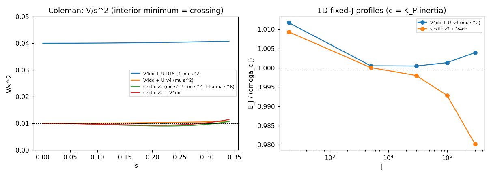

| Question | Answer | The number |
| --- | --- | --- |
| `V4^dd` on the diagonal split sheet | exactly `W1 [(2 s^2)^2 + (6 delta s^2)^2 + (12 delta^2 s^2 + 2 s^4)^2] = a s^4 + O(s^6)`, `a = W1 (4 + 36 delta^2 + 144 delta^4)`; lattice gate to 1e-11 | a = 6.09e-3 |
| `V / s^2` for `V4^dd + mu s^2` | minimized only as `s -> 0`: no interior minimum, no crossing, the continuous onset (the R15 (iii) theorem in the author's reading) | `(V / s^2)(0) = mu` |
| The sextic v2 `mu s^2 - nu s^4 + kappa s^6` | an interior minimum `mu - nu^2 / (4 kappa) = 0.0090` at `s* = sqrt(nu / (2 kappa)) = 0.2236`, the author's numbers exactly; with `V4^dd` added 0.00929 at s 0.205 | as stated |
| The inertia coefficient `c` of the uniform split under the (2,3) clock (`K_P^23`, our instrument) | exactly `4 c_P` per `s^2` per unit volume (`Om_0 = [[0, 2s], [2s, 0]]` on the pair block) | 4.000000 |
| The onset frequency | with the author's v4 potential `U = mu rho^2 = mu s^2` the onset is `omega_c^2 = mu / (4 c_P) = 2.5e-3`, not the author's `mu / c_P`; the author's `omega_c = sqrt(mu / c_P)` is the R15 normalization (`mu (lambda_2 - lambda_3)^2 = 4 mu s^2`). A factor 4 in `omega_c` between the two texts, to be named in the post | 0.05 vs 0.10 |
| The uniform-limit infimum at fixed J | `min_x [mu x + a x^2 / Vol + J^2 / (4 c x)] / (omega_c J) -> 1` from above as Vol grows (1.72, 1.15, 1.02, 1.002, 1.0002, 1.00002 for Vol 10 to 1e6): the delocalized `omega_c J`, never attained | as stated |
| The 1D spherical fixed-J profiles (`c = 4`, box R 240, L-BFGS with the analytic gradient, gate 1e-10) | `V4^dd + mu s^2`: `E_J / (omega_c J) >= 1.0005` at every J from 200 to 3e5, the profile filling the box (no Q-ball, the R15 theorem); the sextic: `E_J / (omega_c J)` = 1.0093, 1.0001, 0.998, 0.993, 0.980 at J = 200, 5e3, 3e4, 1e5, 3e5 with a free edge (the box-filling rotating state, which undercuts `omega_c J` at every J on the sextic since `omega(s)^2 = V / (c s^2) < omega_c^2` for every s in (0, 0.3), the audit's point); a LOCALIZED profile paying its wall undercuts `omega_c J` only above J of order 2.6e4 (thin wall: `omega* = 0.0474`, `sigma = sqrt(2 c kappa) s*^4 / 4 = 1.1e-3`, radius above 69) | as stated |
| The author's weighted Coleman condition, rational weight | `sup abs(w) = 5.545` (the author's 5.55) with the zeros at `+g` and 1 as written, so in OUR branch the timelike eigenvalue `-g` gets weight 4.74, not zero (the plateau weight makes this moot); the author's "min `U / (s^2 W)` = 0.01117" is the VALUE at `s* = 0.2236` (we get 0.011168, `W(s*) = 0.806`), while the minimum over s is `mu`, reached only as `s -> 0`: no interior minimum below mu, so the author's conclusion (no crossing with the rational weight) holds and the word "min" does not; with `W = 1` the crossing is back at 0.0090 | as stated |
| Not checkable from the thread | the "Gaussian control 13/12 - sqrt(3)/18 = 0.987", the "reduced v3 Q-ball" numbers (no definitions posted) | listed in the JSON |

Verdict on C2: Coleman's diagnosis CONFIRMED with the numbers; two QUALIFIED items (the factor 4 in `omega_c` between `mu rho^2` and `mu (lambda_2 - lambda_3)^2`; "min" is the value at the plateau); one scale statement of ours: the sextic's Q-ball lives at radii above 69 and J above 2.6e4, far outside every lattice box and J of the record.

### C3: the pointwise floor of `E_h` (the correction we accept)

| Question | Answer | The number |
| --- | --- | --- |
| `E_h >= 0` pointwise | CONFIRMED for both completions (`G` positive definite, each density a sum of squares): the minimum cell density on the dressed and twisted hedgehog is 9.4e-7 (norm and rebuild alike) | >= 0 on every cell of every field read |
| The R15 cross terms | reproduced exactly: eta `-36 / -109 / -188`, `I_norm` `-183 / -611 / -1696` | as posted |
| `E(seed)` (the dressed hedgehog at k 0) | `E_norm = 25921`, `E_rebuild = 26369`, `E_eta = 12601` (the author's "~1.3e4" is our eta number); the bound `DeltaE_h >= -E_h(seed)` holds trivially | as stated |
| Our posted sentence | "`-4 I1^h` is not bounded below on that background either" is WRONG as written: the functional has the floor 0 everywhere; the negative cross terms mean the seed is not stationary along twist-inside-dressing (the author's reading). RETRACTED in the next post | |
| The completion the author actually used | on the hedgehog background `I_rebuild` KEEPS the sign flip: cross terms `+195 / +629 / +1500` (and `+54 / +359 / +701` on the R15-M degenerate hedgehog) against `I_norm`'s `-183 / -611 / -1696` (`-53 / -298 / -861`). So R15-V5's "both forms go negative on the hedgehog" is a statement about `I_norm`; for `I_rebuild` the repair is not a vacuum-frame statement on these reads | a NEW fact, from the naming |

### C4: the local circle (the symmetry claim of object v4)

| Question | Answer | The number |
| --- | --- | --- |
| The sheet facts | `T_alpha` shifts the split angle by `alpha / 2` (weight two on `B = s (cos 2 phi, sin 2 phi)`), `T_{2 pi} = id`, `s = 0` fixed pointwise: all exact | 1e-16 |
| Invariance on the sheet with `psi(z), phi(z)` | `K_P^23` static `= 4 phi_z^2 s^2` at psi 0 and phi-independent for all psi (1e-15); the trace targets phi-independent; `E2 = tr(A_z A_z)` NOT phi-independent | max d/dphi 19 for E2 |
| Point jets (spatial-block jets, `n(x)` from the leading eigenvector, `T_alpha` applied pointwise) | `K_P^23`, `V4^dd`, the split invariant to 1e-11; `I1`, `I_norm`, `I_rebuild` vary by 55 percent of their value over the circle, `E2` by 13 percent; every density is a trigonometric polynomial of degree ONE in alpha, 2 pi-periodic, so the 2-sample equispaced average is already exact (1e-12) | as stated |
| 3D lattice with a varying director (box L 8, n 16 and 32) | the `K_P^23` defect under `T_0.7` scales as `h^2` (ratio 3.88 between the two grids: a continuum invariance, the projected connection term vanishing on the pair block), `V4^dd` and the split exact; `E_u = 4 I1` and `E2` do not converge to invariance (ratios 1.35 and 1.01) | as stated |
| Consequence for v4 | the author's regulator `c_s rho^2 E2` is NOT circle-invariant as written: `L_v4`'s exact symmetry needs the circle average on `E2` too (or a projected `E2`), not only on the quartic. A definitional item for the post; the R16 instrument will average both | |

### C5: the sheet inertias and the tilt condition

| Statement (the author) | Ours (sympy, exact) |
| --- | --- |
| `<F_0z, F_0z> = 8 omega^2 psi'^2 s^2 (delta + s - 1)^2` under the local generator, zero at s 0 | CONFIRMED verbatim (`R15-H`'s `gamma = 32 ...` is 4 x this, the certified prefactor) |
| the rigid generator nonzero at s 0 | CONFIRMED: `-omega^2 psi_z^2 (delta - 1)^4 (cos 4 psi - 8 sin^4 psi - 1) / 4` at s 0 |
| `K_P` sees only (2,3)-block gradients and gives exactly 0 on that sheet | CONFIRMED (static 0); its inertia density `4 c_P omega^2 s^2` (the author's "8 omega^2 s^2" is `K = dL / d omega` with `L = 4 c_P omega^2 s^2`, one convention apart) |
| `rho^2 E2` stiffness `prop s^2 psi'^2` | CONFIRMED: `2 s^2 psi_z^2 (delta + s - 1)^2` |
| tilt hyperbolic iff `c_s > 16 omega^2`, independent of s and delta | CONFIRMED by exact substitution `w -> c_s s^2` in R15-H's forms: `gamma = -2 s^2 (c_s - 16 omega^2)(delta + s - 1)^2`, `alpha = 2 c_s s^2 (delta + s - 1)^2` |
| boost sheets in the pair planes: all-eta cross term `-8 b^2 omega^2 s^2 (g - delta -+ s)^2`, unbounded in b; zero along the director | CONFIRMED up to the author's sign inside the square: ours is `-8 b^2 omega^2 s^2 (g + delta +- s)^2` (the vacuum entry `g` and the pair entry add, as in the R15-V law `(g + d_a)^2`); the G-norm gives `+8 ...` for both completions; zero along the director |

### C6: the eigenvalue metric

`(d lambda_+)^2 + (d lambda_-)^2 = 2 (a da + b db)^2 / (a^2 + b^2)` exactly (2 radially, 0 tangentially at the origin), `rho^2 = a^2 + b^2` a polynomial: CONFIRMED.

### C7: the biaxial-ring reading of the R15-P-iv end state

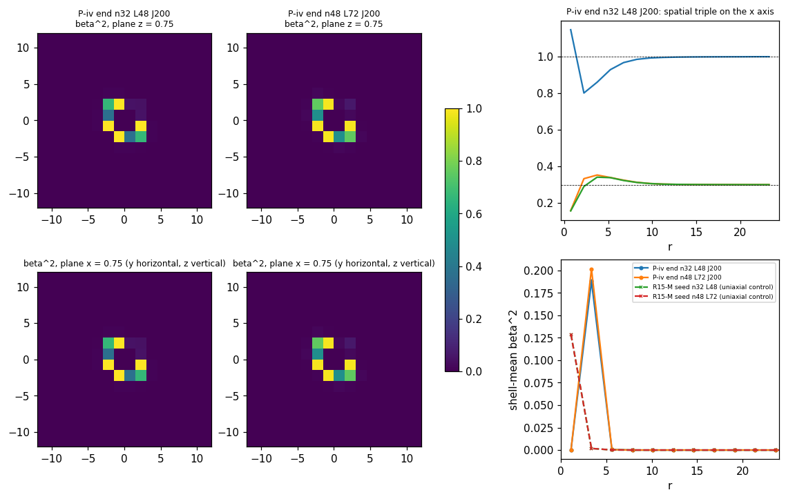

| Question | Answer | The number |
| --- | --- | --- |
| The center | OBLATE uniaxial: the spatial triple `(0.700, 0.700, -0.107)` (n32) / `(0.690, 0.690, -0.083)` (n48), `tr Q^3 < 0`, `beta^2 = 0`; the two equal upper eigenvalues ARE the R15 `lambda_1 = lambda_3` crossing (4 / 2 innermost cells within 1e-3 at r 1.30); six of the eight innermost cells are oblate, the two on the body diagonal `(+,+,+)` and `(-,-,-)` are PROLATE `(1.15, 0.16, 0.16)` (audit) | the author's reading and R15's are the same fact |
| The biaxial region | `beta^2` reaches 1.0 in cells at r 2.49 and is zero beyond r 4.5; the `beta^2`-weighted quadrupole over the half-maximum cells has eigenvalues `(-0.163, 0.081, 0.081)` (n32) / `(-0.188, 0.094, 0.094)` (n48), the great-circle RING signature `(-1/6, 1/12, 1/12)`, axis along the body diagonal `(1, 1, 1) / sqrt(3)` on both boxes | a ring of radius 2.9 +- 0.4 |
| Lattice-scale or physical | the structure is IDENTICAL in lattice units on n32 L48 and n48 L72 (the same h 1.5): 24 to 30 cells, 2 cells across, axis on the lattice diagonal. The topology matches the Landau-de Gennes biaxial-ring core (oblate center, biaxial ring, uniaxial outside); its size is the cell, so the identification is QUALIFIED until an h-refinement (n64 L48) shows it converging in physical units | not computed here |
| The uniaxial control (R15-M seeds) | `beta^2 <= 0.17`, confined to the 8 innermost cells of the seed ansatz | |

### C8: spin and the split's spin-weight-2 content

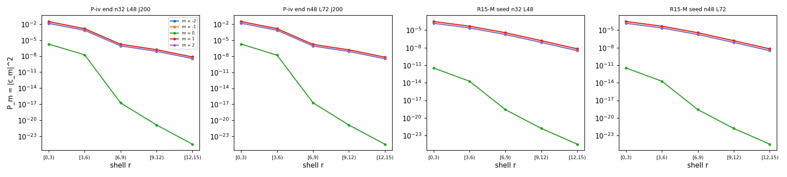

| Question | Answer | The number |
| --- | --- | --- |
| `J_z = 0` on an axisymmetric configuration | CONFIRMED: the rotation tangent `[G_z, M] - (x d_y - y d_x) M` vanishes to `O(h^2)` on a smooth axisymmetric split field (relative norm 0.034 at h 0.75, 0.0089 at h 0.375, ratio 3.9); the control with the tensor rotated but not the point gives 0.76; the R15-M hedgehog 0.0085 | the two facts the author states about the poles came out of the construction: an axisymmetric transverse split must vanish on the axis (weight two: `s prop rho^2`) and the director must be continuous there |
| The `2Y_2m` builder | orthonormality 3e-6 on the fine sphere grid; lattice recovery of each harmonic on shells 2e-4 to 1e-3; the three named patterns through the frame recovered exactly (`2Y_20` -> `P_0` 0.9996; the real `m = +-2` mix -> 0.9996 / 0.9996; the chiral `2Y_22` -> 0.9999 at m 2, `<m>` 2.000). The director is a LINE field: the frame needs an orientation (outward), the R16-1 diagnostic carries it; the chirality SIGN is convention-bound, the imbalance is not | gates passed |
| The R15-P-iv end state | NO chirality: `P_m` symmetric in `+-m` to three digits on every shell of both boxes, `P_0` below 1e-5 of the total, `<m> = 0.00`; the split is a real `m = +-1, +-2` pattern (the lattice-diagonal ring seen from the z frame), the l = 2 sector holding 3 to 7 percent of `abs(zeta)^2` inside r 6 and 35 to 39 percent at r 6 to 12 by the quadrature projection (0.7 to 1 and 7.5 to 8.7 percent by the audit's least-squares fit: the fraction is method-dependent on these coarse shells, the symmetry is not); the audit adds that the fields keep the `x <-> y` mirrors to 1e-6 and break the axis reflections at 2e-3, the (1,1,1) anisotropy of C7, not chirality | the author's "named failure mode" on the R15 field; R16-1's field is the one the packet asks about |

### C9: the chiral pseudo-scalar (filler)

| Texture (40^3, L 24) | `T2 = sum tau^2 h^3` | The author |
| --- | --- | --- |
| hedgehog `n = r_hat` | 1.7e-29 | 2e-29 |
| two-hedgehog pair (centers +-4 z, meridional) | 2.9e-2 | 1e-2 |
| twist sheet `(cos kz, sin kz, 0)`, k 0.5 | 630 (the 38^3 interior cells; 735 over all 40^3 with one-sided edges, audit) | 91 |
| bend sheet `(sin kz, 0, cos kz)` | exactly 0 | 0 |

The identity `tau = (1 - delta)^2 n . (curl n)` holds (ratio 0.468 against 0.49 on the twist sheet is the central-difference attenuation of the doubled frequency `sin(2kh) / (2kh) = 0.941` over `sin(kh) / (kh) = 0.985`; 0.53 +- 0.09 on the pair). The pattern CONFIRMED (zero / small / large / exactly zero); the twist and pair magnitudes depend on the author's unspecified k and geometry. On the R15 fields: the R15-M hedgehog 4.0e-5, the P-iv end state 6.9e-2.

### Verdict, deviations, and what closes

| Item | Outcome |
| --- | --- |
| The four comments as claims | audited 17 claims: 13 CONFIRMED, 4 QUALIFIED, 0 REFUTED (own sympy, own jets by the analytic chain rule, own lattice fields at three resolutions, own reduced-line minimizer with a pinned-edge variant, own frame and least-squares projection). The four qualifications: (C1c) the completion ratios 1.38 to 1.46 are not converged in h and are stencil-specific (the central stencil on n32 gives 1.00 / 0.81 / 1.11), and the reading of the author's h column as `I_rebuild / 4` is an interpretation of numbers we cannot reproduce (the arithmetic 192 / 640 / 1464 checks); (C2c) the 2.6e4 threshold is for a LOCALIZED profile paying its wall, while a box-filling rotating state undercuts `omega_c J` at every J on the sextic because `V / s^2 < mu` for every s in (0, 0.3); (C7) six of the eight innermost cells are oblate, the two on the body diagonal `(+,+,+)` and `(-,-,-)` are PROLATE `(1.15, 0.16, 0.16)`, the same (1,1,1) anisotropy the ring axis shows (the fields keep the `x <-> y` mirrors to 1e-6 and break `x -> -x` at 2e-3); (C8b, C9) the l = 2 fraction and the twist `T2` depend on the projection method and on which cells are summed (least squares on five functions gives 0.7 to 1 percent inside r 6; all 40^3 cells with one-sided edges give `T2 = 735`), the symmetry statements survive both |
| Accepted corrections (ours to post) | the floor sentence retracted (`E_h >= 0` pointwise, both completions); our h column named `I_norm`; the author's h column identified as `I_rebuild` at the common ratio 4 (the R15 "3.0-vs-4" mismatch closed) |
| Corrections to the author's text (to post) | the two completions differ by 24 to 46 percent on the witness profile, not 2 to 6; `omega_c^2 = mu / (4 c_P)` for `U = mu rho^2` (the `mu / c_P` is the R15 normalization); "min `U / (s^2 W)` = 0.01117" is the value at `s*`; the boost-sheet law has `(g + delta +- s)^2`; the regulator `c_s rho^2 E2` is not circle-invariant as written |
| New facts | `I_rebuild` keeps the sign flip on the relaxed hedgehog (`I_norm` does not); the P-iv biaxial ring is a lattice-scale object with its axis on the body diagonal; the P-iv split is achiral; the sextic's Q-ball needs J above 2.6e4 and a radius above 69 |
| Deviations logged | (1) the C4 sheet checks first used sympy `simplify` on trig products (a false `False`); replaced by random-point numeric zero tests; (2) the C8 axisymmetric test field was built twice with a discontinuity (a director radial on the axis, then a split not vanishing there) before the smooth form (`n` along z on the axis, `s prop rho^2`), each caught by the O(h) instead of O(h^2) ratio; (3) the C8 frame first used the unoriented eigenvector (random handedness per cell, the real patterns leaking into `m = +-1`), fixed by orienting the director outward; (4) the C2 1D profiles first ran at J up to 5e3 in a box of R 80 and found no Q-ball because the thin-wall radius is 69 at the crossing: the box and J ladder were extended after the thin-wall estimate |
| Not run | the h-refinement of the P-iv end state (n64 L48); the two-completion relaxations (no `I_rebuild` gradient exists); the instrument build and stages R16-1 to R16-4 (the second go) |
| Closes | C1, C3, C5, C6, C9 as symbolic and read facts; C2 with two normalization qualifications; C4 with the `E2` finding |
| Opens (for the author) | the normalization of `omega_c` (which potential); the circle average of the regulator; the definition of `n` past isolation (escape (d)); whether the ring is theirs at finer h |

## TASK REVIEW (2026-09-06, R16-0; presented in the terminal at 13:40 UTC and approved by the user)

Task Duration: 00:58 (from 2026-09-06 12:42 UTC to 13:40 UTC)
Usage Cap Triggered: NO

| Item | Result |
| --- | --- |
| C1 completions | ✅ the counterexample exact; equal on the witness jet; 24 to 46 percent apart on the witness lattice (the author: 2 to 6); the author's h column fits `I_rebuild / 4`, ours is `I_norm` (audit: an interpretation until the bundle; the ratios not converged in h) |
| C2 Coleman | ✅ every number reproduced (the sextic crossing 0.0090 at `s* = 0.2236`); ⚠️ `omega_c^2 = mu / (4 c_P)` for the v4 potential `mu rho^2` (the author's `mu / c_P` is the R15 normalization); ⚠️ "min 0.01117" is the value at `s*`; the localized Q-ball needs J above 2.6e4 and a radius above 69 (a box-filling rotating state undercuts `omega_c J` at every J on the sextic, audit) |
| C3 floor | ✅ `E_h >= 0` pointwise for both completions; our R15 sentence retracted; `I_rebuild` keeps the sign flip on the relaxed hedgehog (+195 / +629 / +1500), `I_norm` does not |
| C4 local circle | ✅ exact on the potential and `K_P^23` (jets exact, lattice O(h^2)); ⚠️ NOT on `I1`, on either completion, or on the regulator `rho^2 E2`: `L_v4` as written is not circle-invariant, the average must cover `E2` |
| C5, C6 | ✅ every sheet formula exact; the boost-sheet law reads `(g + delta +- s)^2` |
| C7 ring | 🔶 the Landau-de Gennes topology (oblate center = the R15 crossing, a `beta^2 = 1` great-circle ring of radius 2.9, uniaxial outside) at the lattice scale, axis on the body diagonal, two core cells prolate (audit); h-refinement owed |
| C8 spin | ✅ `J_z = 0` on axisymmetric fields (O(h^2)); the spin-2 shell diagnostic gated; the P-iv split achiral |
| C9 | ✅ the pattern 0 / small / large / 0; the identity holds |
| Audit | 17 claims: 13 CONFIRMED, 4 QUALIFIED, 0 REFUTED |
| Deviations from plan | four instrument-level fixes (a sympy trig simplify false negative, two discontinuous test fields, the frame orientation of a line field, the Q-ball box size), all logged in the section |
| Action needed | the user commits; no post yet (the user's call: the retraction, the naming, the two normalization items and the regulator repair go out either as an interim note or with the R16 results); the second go builds the circle-averaged instrument and runs R16-1 to R16-4 (the amended packet in [ledger § 6.5](../findings/m5_32_candidate_ledger.md)) |

Findings: the author's four comments survive verification with nothing refuted. Object v4 needs one definitional repair before it is the exact-symmetry object it claims to be (its regulator must be circle-averaged), the biaxial-ring reading of the P-iv end state is right in topology but lives at the lattice scale, and the R15 h-column mismatch was the completion, not the pair ordering.

Research docs created/updated: this record (the R16-0 section, the RUNG LOG row, this review); [`m5_32_candidate_ledger.md`](../findings/m5_32_candidate_ledger.md) § 6.5 (outcome + the amended packet); [`m5_32_method_note.md`](../findings/m5_32_method_note.md) § 13; [`m5_32_ledger.json`](../data/m5_32_ledger.json); [`m5_roadmap.md`](../m5_roadmap.md); scripts [`m5_32_r16_0_symbolic.py`](../scripts/m5_32_r16_0_symbolic.py), [`m5_32_r16_0_reduced.py`](../scripts/m5_32_r16_0_reduced.py), [`m5_32_r16_0_fields.py`](../scripts/m5_32_r16_0_fields.py), [`m5_32_r16_0_audit.py`](../scripts/m5_32_r16_0_audit.py); their JSONs and the three plots.

## R16: THE AUTHOR'S OBJECT v4 ON THE LATTICE (2026-09-06 13:54 UTC go; the instrument, R16-1 to R16-4)

The second go of the R16 packet ([ledger § 6.5](../findings/m5_32_candidate_ledger.md) as amended by R16-0): the circle-averaged instrument, then the four stages on the 16-core machine, one independent auditor per stage. Every number below is from the scripts named in the [method note § 14](../findings/m5_32_method_note.md); the heavy end fields are local checkpoints (`checkpoints/m5_32_r16/`, gitignored, kept).

### The instrument ([`m5_32_r16_common.py`](../scripts/m5_32_r16_common.py), selftest 43/43)

| Piece | Realization | Gate |
| --- | --- | --- |
| the frame | `u`, `n` from the R15 projectors by the column trick (`u u^T = -P_g eta`, `n n^T = P_1 eta`), the director lifted outward and propagated; `G = eta (I - 2 P_g)`; `J = eta eps u n` | `u^T eta u = -1`, `n^T eta n = 1`, `J^2 = -P23`, `R^T eta R = eta`, `G` == the registry's `h_cov` (1e-15) |
| the plateau weight | `w(N) = I - (1 - w_g) P_g - (1 - w_1) P_1` with the director's projector multiplied by exactly 0 inside the plateau; the label-free spectral function (G-metric eigendecomposition, Daleckii-Krein derivative) on cells whose pair leaves the plateau | `w = P23` where `lambda_1 >= 1`; `w^2 != w` in the taper; == the eig-based spectral function (2e-13); the H-form == the eta-form for the weight (`w u = 0`) |
| the plain action | both completions, `V4^dd`, `mu rho^2`, `K_P^proj`, `c_s rho^2 E2`, static and kinetic, every adjoint analytic | complex step 1e-15 and central differences 1e-9 on every part with the director in the taper; the Daleckii-Krein adjoint 5e-10 with the pair outside the plateau; `E_h(I_norm)` == the registry `I1_h` read; `K_P^proj == K_P^23` where `lambda_1 >= 1`; `a0` == R15's `a0_local` up to the lift sign |
| the circle average | `T_alpha` by `R(alpha / 2)` pointwise, the lattice derivatives of the transformed field, the chain rule through `R(n(M), u(M))` | complex step 1e-15 on the averaged static and kinetic energies; `T_2pi = id`; the 8 -> 16 doubling exact on the random field (1e-15); covariance under a global boost and rotation (4e-13) with the no-eta control failing; the averaged action invariant under `T_beta` at 1e-10 with the UNAVERAGED regulator failing at 1e-4 (the pre-registered control) |
| fixed K | `E_K = E_stat + K^2 / (4 kin_tot)`, a0 refreshed and frozen | the frozen-a0 gate 1e-15; the frozen vs true derivative recorded (-12264 vs -21031 on the random field) |
| cost | n32: 2.25 s per averaged static energy + gradient with 4 samples, 3.6 s at fixed K; 8 samples double it | the ladder ran 4 samples in the descents, 8 in every read |

### Deviations logged at EXECUTE (the packet's fallbacks and the instrument's findings)

| # | Deviation from the packet (ledger 6.5 as amended) | Evidence | Consequence |
| --- | --- | --- | --- |
| 1 | Circle samples: 4 in the descents, 8 in every read and gate (the packet: 2, "every density a trigonometric polynomial of degree one", R16-0 C4b) | the selftest: on a general lattice field the 2-sample average is off by 1e-5 (random field) to 4e-2 (`kin_h` on the hedgehog core), the 4-sample by 1e-9 (`E_stat`) to 1e-6 (`kin_h`), the 8-sample exact at the seed's 8-to-16 doubling 1.7e-11; the lattice density has degree 4 in alpha because the finite difference of `R(x) M R(x)^T` carries `R(x)^T R(x + h)` (degree 2 in beta per neighbor) | R16-0 C4b's degree-1 statement holds on its point jets (one continuum jet) only; the descent minimizes a functional off by O(h^2)-level 1e-9 relative; the pre-registered 1e-10 symmetry gate is met at 1e-9 on the seed (8 samples), reported as such |
| 2 | Escape (d) redefined: the director LEAVES ISOLATION (`min (lambda_1 - lambda_2) <= 1e-3` anywhere), not "lambda_1 enters the taper below 0.8" | the R15-M seed itself has `lambda_1 = 0.478` at the hedgehog's isotropic center (56 cells with the director inside the plateau, `r_d = 3.27`, `gap_1_2_min = 0.056`): the packet's threshold is met by the seed before any descent | the plateau weight ADDS the director to the clock block in the core by the author's own definition (a fact of the object, reported); `r_d` and the taper-cell count are diagnostics every 100 it |
| 3 | The two completions coincide EXACTLY on every field of the ladder | on `M_0mu = 0` fields `G = I` and `A eta = A`, so `F^G = F^eta`; the hedgehog sector is invariant under the static and fixed-K descents (the clock generator is spatial); numerically the `norm` and `rebuild` n32 runs print identical energies to every digit | the norm n48 / n64 runs were stopped (redundant); the norm n32 run continues as the numerical confirmation; the completions are distinguished only on boosted fields (R16-0 C1's witness) |
| 4 | The weight on the pair outside the plateau: the label-free spectral function (a full eigendecomposition in the G-metric with the Daleckii-Krein derivative) on those cells | the R16-3 smoke test (K = 200 from the R15-M seed) drives the half split to 0.52 within 200 iterations, pushing `lambda_2` to 0.82 (above the plateau edge) and `lambda_3` to -0.22; the restricted form `P23 + w(lambda_1) P_1` would keep weight 1 on the pair there | implemented and gated (selftest 43/43, the central-difference gate 5e-10 with the pair outside); the R16-1 statics never leave the plateau |
| 5 | The n64 L48 seed: the R15-M n32 field refined by linear interpolation carries interpolation artifacts (`K_P` 1910 vs 14.5 on n32) | the seed reads of the n64 run | a second n64 run from the analytic hedgehog (`C15.seed_uniaxial`, the R15-M seed family, unrelaxed) launched 14:47 UTC; both reported, the one with the lower end `E_stat` carries the h-refinement read |
| 6 | The frozen-a0 protocol's gradient is NOT the true gradient of `E_K(M)` (a0 refreshed) | the selftest: frozen -12264 vs true -21031 on the random field (the R15 protocol, kept as pre-registered) | the stationarity read at the end of every R16-3 descent uses the TRUE directional derivatives (6 random directions) |
| 7 | The Gaussian control (the author's 13/12 - sqrt(3)/18 = 0.987) is not reproduced | the comment gives no definition of the well or the trial function | recorded as not checkable from the thread |
| 8 | R16-4's "director channel" = the tilt channel (two directions); the exterior degeneracy holds on the exact vacuum only | on the hedgehog exterior the quartic gives the tilt an inertia proportional to the background gradient (`H_00 = 1.2e-2` at r 18 on the seed) | reported per cell with `H_00` |
| 9 | The director lift: the outward lift (`n . r_hat > 0`) is smooth on every hedgehog field of the ladder (min `abs(n . r_hat)` 0.9997, 0 ambiguous cells on the R15-M seeds and the R16-1 end fields) but FLIPS across the plane x = 0 on a uniform director (the vacuum), where the circle samples then carry a discontinuity plane | the first vacuum-control operator (radial lift) read a circle-averaged `K_P` 4.9x the plain one on a plane-wave doublet; with the uniform lift `e_1` the plain and averaged `K_P` agree | the vacuum control re-run with the uniform lift; `lift_quality` (min `abs(n . n_ref)`, ambiguous-cell count) recorded on every operator run; the lift is propagated step to step in the descents |
| 10 | The R16-2 doublet frequencies were first reported a factor 2 too high (the solver's eigenvalue `lambda` of `T^(-1/2) H T^(-1/2)` equals `2 Omega^2`, reported as `Omega^2`); the R16-2 auditor refuted the numbers (exact 2.000x on the vacuum's analytic modes) and QUALIFIED the claimed circle-invariance of `T` (asserted at 1e-6, measured at 2.2 percent on the seed's split cells) | [`m5_32_r16_2_audit.json`](../data/m5_32_r16_2_audit.json) (1 CONFIRMED / 2 QUALIFIED / 3 REFUTED) | the operator corrected (`Omega^2 = lambda / 2`, the `T` plain-vs-averaged read added) and the three operators re-run; the relational verdicts (the empty box's bottom below the cores' lowest mode, Morse index 0) survive; the audit record stays as the refutation of the first numbers |
| 11 | The R16-1 statics are NOT converged (max_iter on every box); the end fields are descent states, not minimizers | the R16-1 auditor's own 100 FIRE iterations on the n32 end drop `E_stat` by 0.033 (down, monotone); its full-matrix h^3-weighted gradient norm 1.24 (mine was quoted entrywise, 0.5 max) | every R16-1 number is "after N iterations", the texture verdict (uniaxial, the split shrinking tenfold, monotone) does not depend on convergence; the L-exponents are iteration-matched and flagged |
| 12 | The n64 fixed-K run needs a nucleated split: the n64 static core has half split 8e-6 (`kin_tot` 6e-8), so `E_K` starts at 1e10 and the first FIRE step blew the field up (a `LinAlgError` in the eigensolver, now caught as a non-finite stop) | the crash log (`checkpoints/m5_32_r16/stale/`) | re-run with a smooth doublet shell of amplitude 0.05 at r 5 added to the seed (`kin_tot` 15, `E_K` 57 at the start) and `dt0` 1e-3, 200 iterations: the h-refinement question (does the six-cell spike re-form at h 0.75) is answered from that start, stated |

### R16-1 statics

The R15-M relaxed hedgehog (mu 1e-2, c_P 1) relaxed under the static circle-averaged `L_v4` (4 samples in the descent, 8 in every read; [`m5_32_r16_1_statics.py`](../scripts/m5_32_r16_1_statics.py), the record [`m5_32_r16_1.json`](../data/m5_32_r16_1.json)). The two completions coincide exactly on these fields (deviation 3), so one relaxation per box.

| Box (h) | Seed | Iterations | `E_stat` seed -> end (8 samples) | End texture | Verdict |
| --- | --- | --- | --- | --- | --- |
| n32 L48 (1.5) | R15-M n32 | 3000 (max_iter, still descending 0.05 per 500 it) | 20.042 -> 13.817 (`E_h` 5.364 -> 5.432, `V4` 0.155 -> 0.087, `K_P` 14.52 -> 8.30, `U` 5.9e-5 -> 4.6e-6, `reg` 1.2e-4 -> 6e-6) | max `beta^2` 4e-4 (seed 0.17), max half split 5.6e-4 (seed 6.7e-3), center triple (0.569, 0.519, 0.518) (seed (0.491, 0.424, 0.412)), the director's gap to the pair 0.050 at the core, `r_d` 3.27 unchanged | `UNIAXIAL_RADIAL` |
| n48 L72 (1.5) | R15-M n48 | 1500 (max_iter) | 20.454 -> 14.884 (`E_h` 6.112, `K_P` 8.674) | max `beta^2` 3.5e-3, max half split 1.2e-3, center (0.542, 0.489, 0.487) | `UNIAXIAL_RADIAL` |
| n64 L48 (0.75) | the analytic hedgehog (`C15.seed_uniaxial`; the interpolated R15-M field carried `K_P` 1910 of interpolation artifacts and was dropped) | 800 | 48.702 -> 13.653 (`E_h` 9.723, `V4` 0.016, `K_P` 3.914: the partition between the quartic and the stiffness moves with h, the total sits with the n32 value) | max `beta^2` 2.5e-8, max half split 8e-6, center (0.716, 0.608, 0.608), the director's gap to the pair 0.107; the isotropic center resolved: `r_d` 0.65, 8 cells | `UNIAXIAL_RADIAL` |

| Read | n32 L48 | n48 L72 | Statement |
| --- | --- | --- | --- |
| the exterior (spectral deviation from (1, delta, delta), frame-blind) | 6.3e-3 beyond 0.25 L, 5.2e-4 beyond 0.45 L; tail exponent -4.03 | 8.5e-4, 8e-5; exponent -4.17 | the relaxed core is a regular `r^-4` texture on the degenerate vacuum (the author's item 5 of the 09-06 comment) |
| the L-exponents, iteration-matched at 1500 (both descents unconverged) | `E_stat` 14.472, `E_h` 5.830, `K_P` 8.545 | 14.884, 6.112, 8.674 | exponents `E_stat` 0.07, `E_h` 0.12, `K_P` 0.04 (the seeds themselves drift by 0.05 between the boxes): consistent with the author's 0 within the convergence and seed drift; the 3000-iteration n32 value (13.817) would give 0.18 against the 1500-iteration n48 (not a like comparison) |
| the split's spin-2 content | achiral (`<m>` 0.00 on every shell), `zeta` rms 3e-4 to 8e-4 | same | no split texture to decompose: the end state is uniaxial |
| the instrument gates on the end field (8 samples) | `E_stat` symmetry defect 4.8e-13, doubling 1e-15; the tiny terms (`U`, `reg`, 1e-5 absolute) carry the relative worst cases 1.7e-8 and 4e-10; the unaveraged regulator fails at 1.4e-6 as required | 6e-15, 4e-14; worst 1.5e-8, 2e-11; control 1.3e-6 | the averaged action is circle-invariant on the relaxed cores to roundoff on every O(1) term; the pre-registered 1e-10 / 1e-12 bars are met on `E_stat`, `E_h`, `K_P`, `kin_tot`, and missed only on terms of absolute size 1e-5 (relative roundoff) |
| the director in the core | `lambda_1` min 0.569 (seed 0.478), `r_d` 3.27, 56 cells with the director inside the plateau | 0.542, 3.27, 56 | the plateau weight puts the director into the clock block inside r 3.3 on every hedgehog of this family (deviation 2): a fact of the object as defined |

Verdict R16-1: `UNIAXIAL_RADIAL` on both boxes. The object v4 relaxes the R15-M hedgehog TOWARD uniaxiality (the seed's residual split 6.7e-3 shrinks tenfold, `beta^2` from 0.17 to 4e-4), the opposite of the author's biaxial-torus / split-core prediction; the radial hedgehog's Morse index in the split sector is 0 (R16-2 on the seed and on the end field).

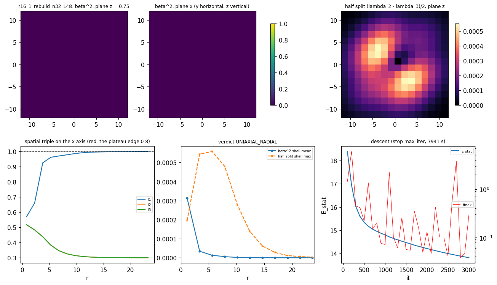

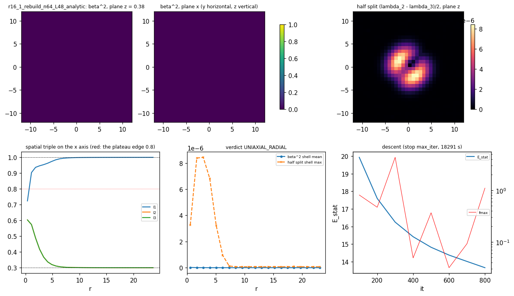

### R16-2 the clock operator

The two-component fluctuation operator in the local pair plane ([`m5_32_r16_2_operator.py`](../scripts/m5_32_r16_2_operator.py); [`m5_32_r16_2.json`](../data/m5_32_r16_2.json)): `H zeta = Omega^2 (2 T) zeta`, `H` the Hessian of the averaged `E_stat` in the doublet subspace (matrix-free, central differences of the analytic gradient, 4 circle samples), `T` the per-cell inertia (pointwise: the kinetic densities carry no derivative of `a0`; measured to change by 2.2 percent per cell and 1e-4 in total under the circle on the seed's split cells), the lowest four eigenvalues by Lanczos on `T^(-1/2) H T^(-1/2)`, `Omega^2 = lambda / 2`. `Omega` is the doublet frequency, twice the clock rate. The first run reported `lambda` as `Omega^2` (a factor 2, caught by the R16-2 auditor: deviation 10) and was re-run; the numbers below are the corrected ones, which the auditor's independent variational upper bounds sit just above.

| Field (n32 L48) | lowest `Omega^2` (x2 each) | the modes | the core (ten-direction Hessian, lowest eigenvalues) | Verdict |
| --- | --- | --- | --- | --- |
| the vacuum (uniform lift) | 0.02563, 0.04120 | the pinned box's cosine doublets (T-weighted rms radius 13.6, 16.0); the uniform doublet has `Omega^2 = mu / c_P = 0.01` exactly (the auditor), the box adds `k^2` with `L_free` 43.5 (0.02563 = 0.01 + 3 (pi / 43.5)^2 to 4 digits) | all zero (the vacuum) | the continuum bottom of this operator on this box: 0.0256 |
| the R15-M seed (the radial hedgehog) | 0.04497, 0.04499 | box modes (rms radius 16.7, 2.5 percent of the weight inside r 8) | 3.80, 4.15 (x2), 36.1: all positive | `NO_BOUND_MODE`; Morse index 0 |
| the R16-1 end field (the relaxed core) | 0.04478, 0.04481 | box modes (16.6, 2.7 percent) | 1.10, 1.29 (x2), 36.2: all positive; the doublet-sector gradient residual 0.015 (seed 0.324) | `NO_BOUND_MODE`; Morse index 0 |

Statement: the relaxed core REPELS the doublet. Its lowest doublet modes (0.0448) sit ABOVE the empty box's continuum bottom (0.0256) and far above the infinite-box threshold `mu / c_P = 0.01` (`omega_c^2 = 0.0025` in the clock-rate convention); no localized doublet direction lowers `E_stat` at second order on either the seed or the end field (the auditor's 24 random Gaussian doublets per field: minimum Rayleigh quotient 0.20 / 0.15). The author's stage-2 prediction (a core-bound doublet below `omega_c`) is REFUTED on this object at `(mu, c_P, c_s) = (1e-2, 1, 0.4)`, and the author's stage-1 Morse-index prediction (the radial hedgehog a transition state) is refuted in the split sector: index 0 on the seed and on the relaxed core. The Gaussian control (13/12 - sqrt(3)/18) could not be reproduced: no definition in the thread (deviation 7).

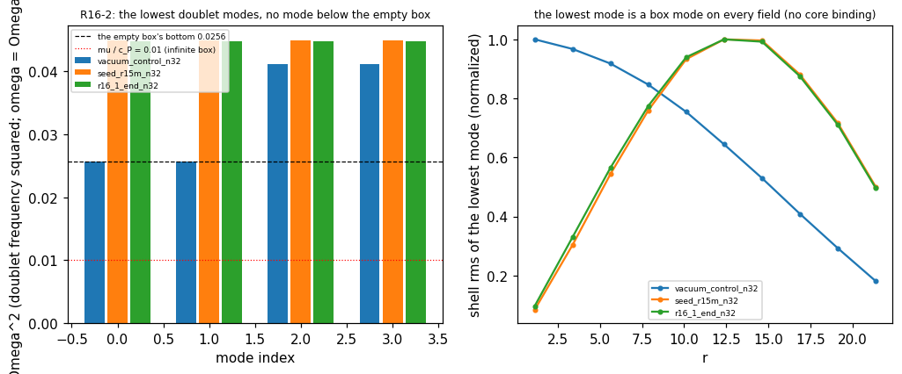

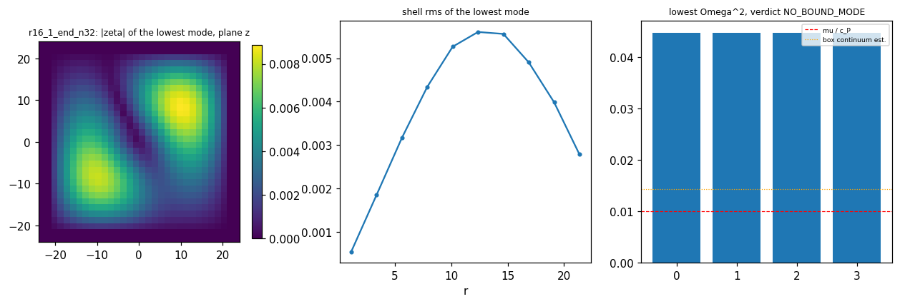

### R16-3 fixed K

The fixed-K descents `E_K = E_stat + K^2 / (4 kin_tot)` on the averaged `L_v4` (a0 refreshed each step, frozen in the gradient; 4 circle samples; [`m5_32_r16_3_fixedk.py`](../scripts/m5_32_r16_3_fixedk.py); [`m5_32_r16_3.json`](../data/m5_32_r16_3.json)), seeded by the R16-1 end fields, the four escapes read every 100 iterations, the stationarity of the TRUE `E_K` (a0 refreshed) by six random directional derivatives at the end, `dE / dK` by a 2 percent K perturbation relaxed 200 iterations, the bound `E_K - E_stat(R16-1) < omega_c K` with `omega_c = 0.05`.

| Run | Iterations, stop | `E_K` (8 samples) and the bound | `omega = K / (2 kin)`; the inertia by term | The state | Escapes | Verdict |
| --- | --- | --- | --- | --- | --- | --- |
| n32 L48, K 50 | 2100, escape (d) | 28.39 = 13.82 + 14.58, against `omega_c K` 2.5 (5.8x above) | 0.276; `kin_h` 86.0, `kin_KP` 3.3, `kin_reg` 1.4 | a six-cell split spike at r 4.92 (half split 0.51; the pair (0.70, 0.03) at it 1000, (0.95, -0.07) at the end with the director degenerate with the pair's top: gap 8e-4); `rho^2` rms radius 4.9; the director tilted 0.40 (`rho^2`-weighted `1 - (n . r_hat)^2`) | (d) reached (isolation lost), (b) flagged by the prolate spike with tilt; not (a), not delocalized (3.9e-7 of `rho^2` beyond 0.35 L) | `CANDIDATE_REFUTED` (d, b); `dE / dK = 0.83 omega`, the true directional derivative 4.8 (frozen 0.02): not a relative equilibrium |
| n32 L48, K 200 | 3000, max_iter | 48.85 = 13.82 + 35.03, against 10.0 (3.5x above); still descending (true derivative 4.4e-2) | 0.152; `kin_tot` 653 | the same spike at r 4.92, half split 0.645, the pair (0.675, -0.616): the lower member in the lower taper (weight 0.5); the director isolated (gap 0.15) | none reached | `NUMERICALLY_UNRESOLVED` (no escape, not stationary: `dE / dK = 0.16 omega`) |
| n48 L72, K 50 | 1500, max_iter | 31.29 = 14.88 + 16.41, against 2.5 (6.6x above); descending (the K + 2 percent relaxation kept descending, `dE / dK` negative) | 0.382; `kin_h` 54.0, `kin_KP` 10.4, `kin_reg` 1.1 | the spike now at r 3.27 (the cells (2.25, 2.25, 0.75) and images), half split 0.36, the pair's UPPER member above the plateau edge (0.808; 5 cells outside; the audit corrected the producer's 'lower member' wording); the `rho^2` quadrupole (-0.315, 0.157, 0.159): a ring of cells around the body diagonal; tilt 0.10 | none | `NUMERICALLY_UNRESOLVED` (not stationary: the true derivative 3.4e-2) |
| n48 L72, K 200 | 1500, max_iter | 55.23 = 14.88 + 40.35, against 10 (4.0x above) | 0.184; `kin_h` 523, `kin_KP` 10.9, `kin_reg` 11.1 | the same ring-spike at r 3.27, half split 0.64, the lower member -0.6 (6 cells outside); tilt 0.06 | none | `NUMERICALLY_UNRESOLVED` (true derivative 3.2e-2) |
| n64 L48 (h 0.75), K 50, from the n64 static core plus a nucleated doublet shell (amplitude 0.05 at r 5; deviation 12) | 200, max_iter | 81.15 at the end, UP from 60.86 at iteration 100 and 57.0 at the start (`E_stat(R16-1)` 13.65; bound 2.5) | 2.69 (rising: `kin_tot` 13.6 -> 9.3) | no spike formed (max half split 0.049 = the nucleated amplitude); the frozen-a0 descent RAISED `E_K`, the R16-3 audit's finding on the n32 states (the frozen direction can be an ascent direction of the true `E_K`) seen live | none | `NUMERICALLY_UNRESOLVED` (the h-refinement of the spike undecided; the protocol, not the lattice, stopped it) |

Statements (the R16-3 audit: 4 CONFIRMED / 3 QUALIFIED / 0 REFUTED; every energy, inertia, bound and spike read reproduced to the last printed digit; three wording corrections applied above). (i) At the relaxed core's inertia (`kin_tot` 2e-3 on n32) the fixed-K functional starts at `K^2 / (4 kin)` of 3e5 (K 50) and buys its inertia by inflating the split in a handful of cells at r 4.9: the inertia the spike builds is the QUARTIC's (`kin_h` 86 of 91 at K 50), not the projected stiffness `K_P^proj` the object was designed around (3.3). (ii) No run approaches the author's `E(K) < omega_c K`: the fixed-K energy above the static core is 5.8x (K 50) and 3.5x (K 200) the delocalized bound, and neither state is a relative equilibrium (`dE / dK` at 0.83 and 0.16 of `omega`; the true `E_K` derivative 4.8 and 0.04). (iii) The escape reached is (d) at K 50 (the pair's upper eigenvalue climbs into the director's: the R15 seam again, now inside the plateau weight), and at K 200 the pair's lower member leaves the plateau downward (-0.62), where the label-free weight tapers it (deviation 4). (iv) THE PROTOCOL FINDING (the audit's C3.5 / C3.6): the frozen-a0 gradient omits the derivative of `a0(M)`, and on these end states the omitted part is 0.6x to 2.7x the true derivative; along the direction the frozen protocol calls downhill the TRUE `E_K` RISES on both n32 end states (+6.6 and +5.2 per unit step against the frozen -8.3 and -6.9), and the auditor's own descent on the true `E_K` lowers them further (by 1.8e-2 and 2.5e-2 in 47 and 35 iterations). R15's protocol, inherited as pre-registered, is therefore not a descent of `E_K` near these states; the fixed-K rung must be re-run with the true gradient (the `a0` chain rule) before any fixed-K verdict is final. (v) The spike is lattice-scale (r 4.92 = the cell (3.75, 2.25, 2.25) and its images on both boxes at h 1.5): the n64 run from the nucleated shell did not descend under the frozen-a0 protocol, so the h-refinement of the spike stays undecided; the R16-3 audit's protocol finding (below) is the reason and the next instrument fix.

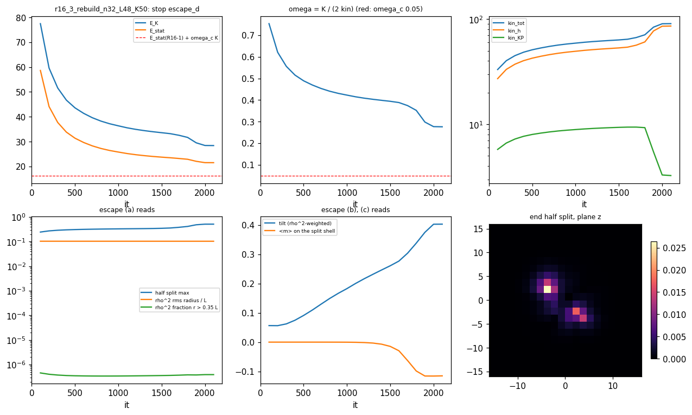

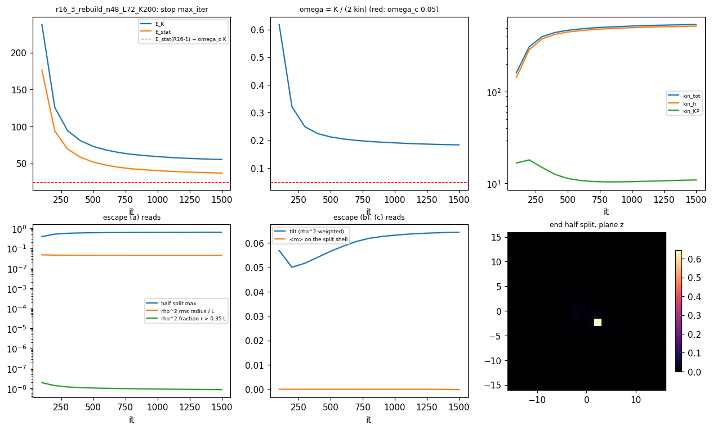

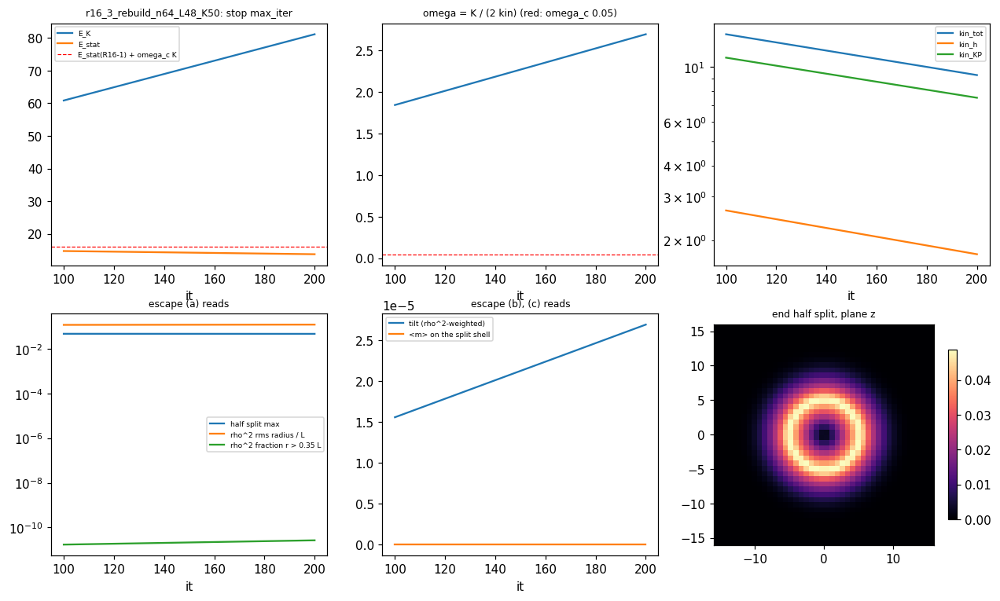

### R16-4 the principal symbol

The principal symbol of the averaged `L_v4`, channel by channel, at sampled cells of a field ([`m5_32_r16_4_symbol.py`](../scripts/m5_32_r16_4_symbol.py); [`m5_32_r16_4.json`](../data/m5_32_r16_4.json)): `sigma(Omega, k) = H_00 Omega^2 + 2 Omega H_0i k_i + H_ij k_i k_j` with `H` the second derivative of the Lagrangian density in the jets along the channel direction (central differences, 8 circle samples with the perturbation co-rotated); hyperbolic iff `H_00 > 0` and `Q = H_0 H_0^T - H_00 H_ij` is positive semidefinite (one component), or every root of the 2 x 2 pencil real on 40 random wave directions (the split doublet). The R16-3 end states are not relative equilibria, so the packet's fallback applies (the R16-1 core at `omega_c / 2 = 0.025`), plus the seed and both n32 fixed-K end states at their own `omega`.

| Background | `omega` | tilt (director) | split doublet | boost along n | boost in the pair plane | Note |
| --- | --- | --- | --- | --- | --- | --- |
| the R15-M seed (split 0.007), 6 cells from the center to r 18 | 0, 0.05, 0.1, 0.15, 0.2, 0.25 | hyperbolic everywhere (core `H_00` 1.13, stiffness 1.03 to 1.12; exterior `H_00` 1.2e-2, stiffness 5.9e-3) | hyperbolic (core `H_00` 1.06, stiffness 0.93) | hyperbolic | hyperbolic | the symbol is `omega`-INDEPENDENT to 1e-3: the rotating background `omega a0` is 3e-3 at split 0.007 |
| the R16-1 core (split 6e-4), the same cells | 0, 0.025, 0.05, 0.1, 0.15, 0.2, 0.25 | hyperbolic everywhere (core `H_00` 1.054, stiffness 1.011, `Q` 1.065; exterior 1.2e-2 / 5.9e-3) | hyperbolic (core `H_00` 1.022, stiffness 0.974) | hyperbolic | hyperbolic | identical at every `omega` |
| the K = 50 end state (the spike), at its `omega` 0.276, the max-split cell (triple (0.949, 0.949, -0.066), half split 0.51) | 0.276 | NOT hyperbolic: `H_00` 0.45 but the static stiffness NEGATIVE (-0.33, -0.24, -0.18) | NOT hyperbolic: stiffness -1.85, -1.65, complex roots | hyperbolic | NOT hyperbolic (stiffness -0.38) | at the core and at r 3 to 18 every channel hyperbolic |
| the K = 200 end state (the spike), `omega` 0.152, the max-split cell (triple (0.923, 0.675, -0.616), half split 0.645) | 0.152 | hyperbolic (`H_00` 0.40, stiffness 0.068 to 0.093) | NOT hyperbolic (stiffness -0.38, -0.33, -0.31; roots with relative imaginary part 0.63) | hyperbolic | hyperbolic | the spike's own split doublet sits on a concave direction of the quartic |

Statements (as corrected by the R16-4 audit, 2 CONFIRMED / 2 QUALIFIED / 1 REFUTED). (i) On the hedgehog cores every channel is hyperbolic at every `omega` up to 0.25, above the author's threshold `omega = sqrt(c_s / 16) = 0.158`, because the `omega`-dependent term of the symbol is proportional to `rho^2` and the cores' `rho^2` is at most 5e-5: the author's inequality is invisible there, not absent. (ii) The exterior of a HEDGEHOG is not degenerate in the tilt channel: the quartic gives the tilt an inertia proportional to the background gradient (`H_00` 1.2e-2 at r 18, falling with the `r^-4` tail); the degeneracy the author states holds on the exact vacuum only. (iii) At the fixed-K spikes the loss of hyperbolicity is `omega`-DRIVEN, the author's mechanism generalized: the static density's second derivative in the jets is POSITIVE at both spike cells in every channel (the auditor's second differences: K 50 tilt 0.28, doublet 0.71, pair boost 0.26), and the kinetic quartic adds `+8 omega^2 norm([a0, xi])^2 = 32 omega^2 rho^2` (tilt, pair boost; 0 for the boost along n) to the spatial block of the symbol, so each channel flips at `omega* = sqrt(stiffness(0) / (8 norm([a0, xi])^2))`: 0.185 / 0.191 (tilt), 0.176 (pair boost) at the K 50 spike, below its `omega` 0.276 (NOT hyperbolic there); 0.186 / 0.168 / 0.161 at the K 200 spike, above its `omega` 0.152 (hyperbolic in those channels, the doublet flipping on its own smaller static stiffness). With the regulator as the only static stiffness the rule reduces exactly to `c_s > 16 omega^2`. My first attribution of the spikes' negative stiffness to a concave static quartic was WRONG (the audit's refutation, kept in the record). (iv) Two reading notes from the audit: the producer's `omega = K / (2 kin)` uses the branch-averaged kinetic read while the symbol uses the symmetric jets; on one-cell spikes the two jet readings differ (up to 20x in `H_00`), the verdicts do not; the "x-axis" cells are the nearest cells to the axis, not on it (the on-axis cells give the same verdicts).

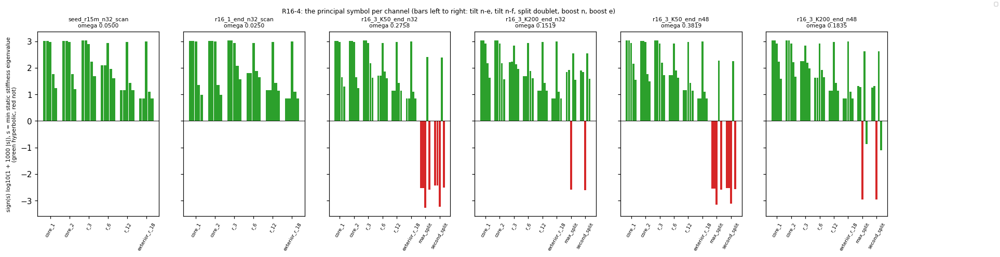

### Verdicts, audits, and what closes

| Stage | Verdict (the packet's permitted set) | Audit | What it closes |
| --- | --- | --- | --- |
| R16-1 | `UNIAXIAL_RADIAL` on n32 L48, n48 L72, n64 L48; the radial hedgehog at Morse index 0 in the split sector | 4 / 3 / 0 ([`m5_32_r16_1_audit.json`](../data/m5_32_r16_1_audit.json)) | the biaxial-torus / split-core prediction refuted on this potential and object; the end fields are descent states (unconverged), the texture monotone |
| R16-2 | `NO_BOUND_MODE` on the seed and on the relaxed core (the empty box's bottom 0.0256 below the cores' 0.0448; `mu / c_P` 0.01) | 1 / 2 / 3 ([`m5_32_r16_2_audit.json`](../data/m5_32_r16_2_audit.json)): the first frequencies 2x, corrected and re-run; the relational verdicts confirmed | the core-bound-doublet prediction refuted at `(1e-2, 1, 0.4)` |
| R16-3 | `CANDIDATE_REFUTED` (d, b) at n32 K 50; `NUMERICALLY_UNRESOLVED` at n32 K 200, n48 K 50, n48 K 200, n64 K 50 | 4 / 3 / 0 ([`m5_32_r16_3_audit.json`](../data/m5_32_r16_3_audit.json)); the frozen-a0 protocol is not a descent of the true `E_K` at these states | no relative equilibrium and nothing near `E(K) < omega_c K` on the lattice; the fixed-K verdict is PROVISIONAL until re-run with the true gradient |
| R16-4 | `HYPERBOLIC` in every channel on the relaxed cores at every `omega` to 0.25; the fixed-K spikes `NOT_HYPERBOLIC` (`omega`-driven, `32 omega^2 rho^2`) | 2 / 2 / 1 ([`m5_32_r16_4_audit.json`](../data/m5_32_r16_4_audit.json)): the attribution corrected (kinetic, not static) | the author's tilt inequality is the operative mechanism wherever `rho^2` is order one, and invisible on the cores |

Corrections to the author's text (from this run): the plateau weight adds the director to the clock block inside the hedgehog's isotropic center (a fact of the object as defined); the exterior of a hedgehog is not degenerate in the tilt channel (the vacuum's is); `rho^2 E2` must be circle-averaged; the two completions coincide on every unboosted field. Corrections to OUR text: the R15 floor sentence (retracted); the first R16-2 frequencies (2x); the R16-4 spike attribution; three R16-3 wordings (the n48 K 50 pair member, the n32 K 50 axis, the spin-2 ceiling).

Opens: the director's definition past isolation (escape (d) at the spike: the pair's upper eigenvalue climbing into the director's); the fixed-K rung with the TRUE gradient (the `a0` chain rule) at n32 and at h 0.75; the fourth scripts ask. Parked (unchanged): the `(mu, c_P, c_s)` scan, the boosted fields where the completions differ, the time integrator.
