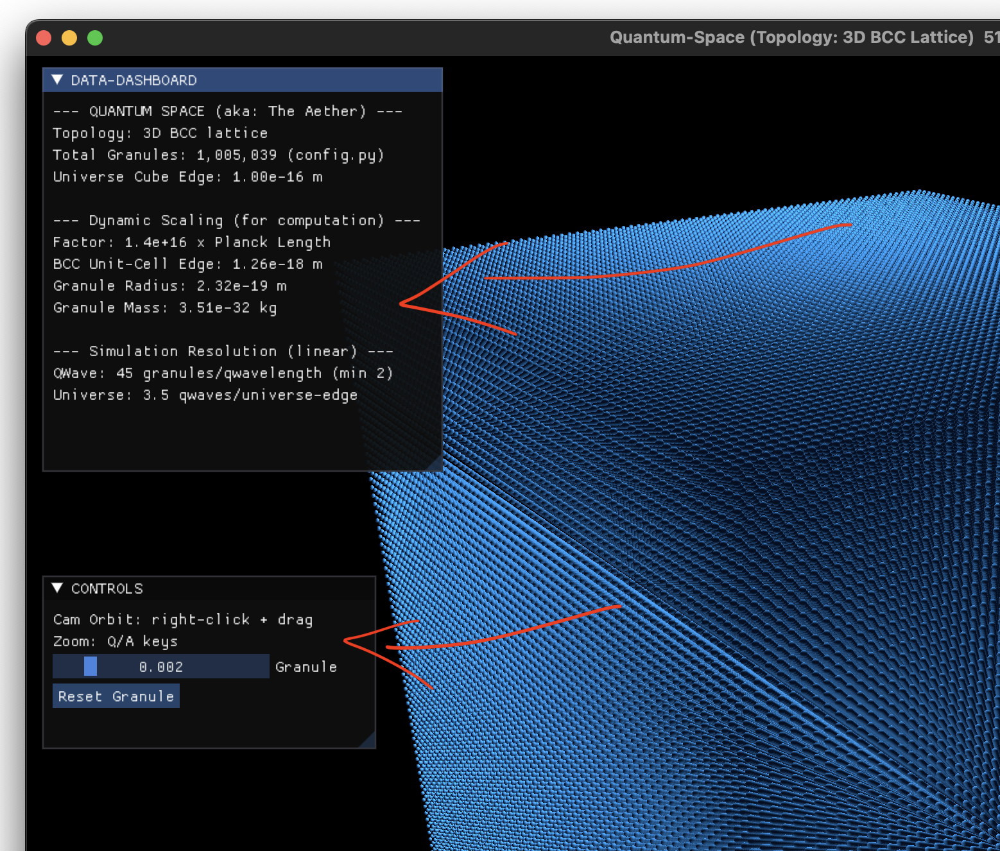
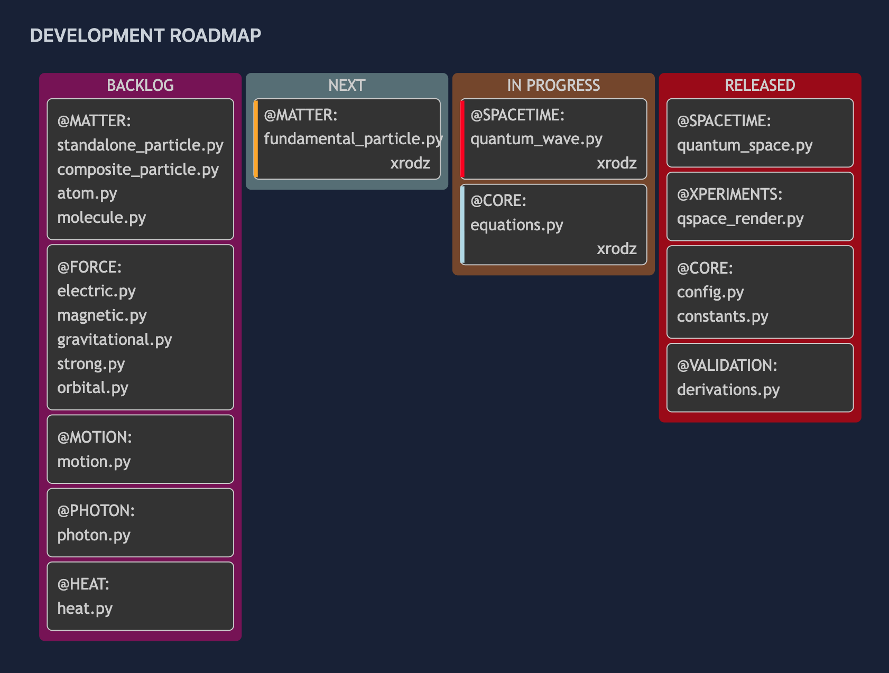

# [SHIP LOG] week: 2025-09-15

## SUMMARY

The week: solid infrastructure improvements plus cool visualization features that'll help debug and understand what's happening in the core of the quantum simulation.

Big Wins:

- Data Dashboard - Built an on-screen overlay for real-time simulation stats. A lot of numerical data and controls can now be displayed without cluttering the main view.

- Block-Slicing Render - Implemented a nice visualization feature that lets you hide particles and peek inside the universe core. Since physics and rendering are separate, you can slice through the visualization without impacting the actual physics computation of wave propagation.

- Xperiments Module - Created a virtual bench for quantum experiments. You can run pre-built experiments, tweak them, or build your own.

- Technical Decision: Tested spherical vs cubic universe shapes. Will continue with cubic because spherical boundaries created incomplete unit cells at edges, hurting performance more than helping.

What's Coming:

- medium.py is done ✓

- Next up: energy_wave.py (multi-week sprint covering spring-mass system, particle oscillation, wave creation/interaction, and particle formation)

- Target: Get at least fundamental particle formation working before public release

## KEY ACTIVITIES

- Refactored scaling logic for better performance
- Created on-screen data-dashboard
- Created Render Block-Slicing
- Created the Xperiments Module
- Tested Spherical Universe

### Wave Medium Lattice Refactoring

- **Scaling Logic Improvements**: Refactored scaling logic in Wave Medium lattice and granule modules for better performance

### On-Screen data-dashboard

- **Overlay Windows**: Implemented overlay window data-dashboard and controls for detailed numerical analysis display.
- This data-dashboard is the perfect place to display information related to the simulation, and it can be a great amount of data.

### Render Block-Slicing

- **Slicing Features**: Hide particles from render and view universe core.

- Implemented block-slice and plane-slice visualization methods for better analysis of Wave Medium internal regions for volumetric data inspection

It was a good decision to separate our Physics Engine from our Render Engine.

Now we can change visualization without even touching (or compromising) the actual vector array that’s performing the physics computation (granule motion, wave propagation, etc).

Our Physics Engine is dealing with a single lattice structure where granules impact motion of its neighbors. This is happening on the background as a unique integrated universe section. And another module (the Render Engine) is responsible for conversion to screen coordinates, and we can decide whatever we want to render at that moment, including hiding some objects to create a see-through experiment - a feature I'm calling "block-slicing".

### Created the Xperiments Module

Created a module where we can make experiments using subatomic objects.

- Xperiments are virtual bench scripts where you can experiment with subatomic objects and simulate desired outcomes.
- You can run sample xperiments shipped with the OpenWave package, tweak them, or create your own.
- Physics engine lives on the quantum object modules (waves, particles, forces, etc). Those objects are called by render engines that live in the xperiments module.

### Spherical Universe Tests

Tested converting medium (aka: Medium) from a cubic to spherical universe

- Options:
  - Spherical universe matches wave and particle geometry
  - Cubic universe matches unit-cell and lattice geometry

- Conclusion:
  - My conclusion is that we should stick with cubic (at least for now)

- Reason:
  - "Boundary Issues"
  - Since the unit cell is cubic, the expanded lattice is also cubic, to convert it to spherical I had to create a special case in the boundary surface, to treat unit-cells that would be incomplete, depending on resolution
  - That special treatment is costing more on performance than the benefit of matching particles / wave spherical geometry

So space will be cubic for now, and waves/particles and any content of space will be spherical

### Documentation & API Updates

- **API Structure**: Refactored and expanded API documentation structure for better developer experience
- **Contribution Guidelines**: Updated contribution sections across documentation

### Rendering & UI Improvements

- **Granule Controls**: Passed granule instance explicitly to render_lattice for better state management
- **UI Labels**: Improved render UI control labels for better user experience

## KEY COMMITS

- `aba7f14` - Refactor scaling logic in Wave Medium lattice and granule
- `7629b2b` - Rename BCC lattice population method
- `d0835e3` - Update overlay window comment in qspace modules
- `0620cce` - Refactor and expand API documentation structure
- `cdf1825` - Update contribution sections in docs
- `8414a21` - Clarify example comments in xperiment scripts
- `2f9f195` - Add block-slice and plane-slice
- `52c4b93` - Implemented Block-Slicing

## WHATS NEXT

- Roadmap updated below

- medium.py (Medium) is done!

- next to work is energy_wave.py, a long sprint split-up in these stages:
  - this week: spring-mass system implementation + time modeling
  - following: particle oscillation and forces
  - following: wave creation (formation + propagation)
  - following: wave interaction (reflection + C/D interference)
  - following: particle formation (fundamental / neutrino)
  - following: particle motion (MAP)

- It's hard to predict time needed for each step, some things come quicker, some take more than expected, I'll move step-by-step and in a few weeks we'll know when the time to release is approaching.
- I would like to make the public release with at least the fundamental particle formed.

