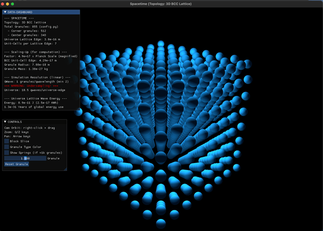

# [SHIP LOG] week: 2025-09-29

## SUMMARY

TL;DR: Built cool infrastructure, hit a physics wall, found potential salvation in an NVIDIA paper.

What We Built 🛠️

Spring System & Architecture

- Got spring connections working between granules (O(n) optimization)
- Built type-based stiffness calculations
- Refactored module names: core → common, quantum space → spacetime

Visuals & UI

- New 3D renderer (qwave_render.py)
- Color-coded granule types (core/face/edge/vertex)
- Camera controls, see-through effects, spring visualization toggle

Wave Driver ✅

- 8 corner vertices oscillating harmonically to inject energy into lattice
- Acting as "wave makers" that should propagate through the system
- Beautiful harmonic motion with phase shifts for symmetry breaking
- Amplitude: ~9.2e-19 m, Frequency: ~1e25 Hz (slowed way down)

The Problem 💥 Wave Propagation = Numerical Explosion. Tried everything to get stable wave propagation:

- Ultra-soft springs (k = 1e-10 N/m - not even physical anymore)
- 1000 substeps per frame
- Damping, attometer scaling, you name it

The Reality Check:

Spring-mass dynamics at Planck scale with realistic physics is computationally impossible with explicit integrators. The timestep requirements for stability with stiff springs are absurd. All explicit methods (Euler, Leapfrog, RK4) hit the same wall.

Options on the table:

1. Implicit integrators (stable but expensive)
2. Toy physics (soft springs, wrong wave speeds)
3. Wave equation PDE solver (restart physics model)

The Hope 💡

Found an NVIDIA paper on "Small Steps in Physics Simulation" that might be the key to breaking through this barrier. Gonna dive into it this week with fresh eyes.

Bottom line: Great progress on infrastructure, fundamental challenge on physics stability, but there's a path forward.

## KEY ACTIVITIES

### Implemented BCC Lattice Spring System

- Created Spring class for modeling elastic connections between granules (commit 0dccdd2)
- Optimized spring connection building from O(n²) to O(n) for large lattices (commit 511b536)
- Implemented granule-based stiffness calculations tied to granule radius (commit cd42549)
- Added spring visualization with UI toggle in 3D renderer (commit c9bbd8f)

### Enhanced Visualization & Rendering

- Built new 3D BCC lattice renderer (qwave_render.py) with Taichi GGUI (commit d10414c)
- Added granule type classification and color-coding (core/face/edge/vertex) (commit 11669de)
- Implemented camera panning controls and improved zoom interface (commits fd9d561, a3b72e2)
- Optimized front octant detection for see-through effect (commit 1c35f7f)

### Optimized Architecture

- Renamed core module → common for clarity (commit 3c126ef)
- Renamed spacetime module → source, consolidated quantum space → spacetime (commit 4ba678f)
- Improved parameter handling by moving oscillation params to quantum_wave.py (commit 95d3c7d)

### Implemented WAVE DRIVER Physics

Implement harmonic oscillation for the 8 lattice vertices to inject energy into the spacetime lattice. These vertices will act as "Wave Drivers/Makers" that later propagate motion through the spring-mass system to other granules.

Goal: Create radially-oscillating boundary conditions that drive quantum wave propagation through the BCC lattice.

Physics: Each vertex oscillates harmonically along its direction vector to lattice center, with:

- Amplitude: QWAVE_AMPLITUDE = 9.215e-19 m
- Frequency: QWAVE_SPEED / QWAVE_LENGTH ≈ 1.05e25 Hz (slowed by factor 1e25)
- Motion: displacement(t) = A·cos(ωt + φ) along radial direction
- Introduced phase shifts to vertex oscillations for symmetry breaking

### Started Implementation of WAVE PROPAGATION

#### ISSUE: still numerically unstable (simulation explosion)

- Created comprehensive harmonics implementation plan (harmonics_plan.md) with BCC physics and integration methods
  - Added spring-mass reference example (spring_mass_example.py)
  - Refined grid calculations for symmetric lattices
- Many hours of debugging and spring stiffness calibrations still not produced the perfect wave propagation, numerical instability is causing simulation explosion, more details and AI analysis below.

## Experiencing Numerical Instability (Sim Explosion)

The system is fundamentally unstable. We've hit a fundamental computational barrier. Even with:

- k = 1e-10 N/m (unrealistic soft springs)
- 1000 substeps
- 0.1% damping per step
- Attometer unit scaling

The simulation still goes unstable within half a second.

The core issue: Simulating Planck-scale physics with explicit numerical integration is computationally infeasible with the given physical constants. The spring stiffness required for realistic wave speeds (c = 3e8 m/s) creates timestep requirements that are beyond what we can compute in real-time, even with the SLO-MO factor.

At this point, given the time we've spent debugging, we have 3 options:

1. Implicit integrators (Backward Euler, Implicit Midpoint) - unconditionally stable but require solving a linear system each step (expensive for computation runtime)
2. Accept non-physical parameters (toy physics): Use even softer springs (1e30 reduction?) and much larger amplitude, accepting that wave speed will be wrong and may not even propagate. Much softer springs - you already set k=1e-10 N/m (vs physical 1e27)
3. Different physics model: use a wave equation PDE solver (different approach entirely) - Wave equation solver instead of spring-mass lattice, but this means a complete remodel of OpenWave's 2 months of work and reviewing initial requirements

The fundamental issue is that spring-mass dynamics with physical parameters is computationally infeasible at Planck scale. The core issue isn't the integrator itself - it's that all explicit methods (Euler, Leapfrog, RK4, etc.) have stability limits that are violated by stiff springs.

Get some rest - this was great debugging work!

Good night! You did excellent debugging work this week - we learned a lot about the fundamental computational challenges of simulating Planck-scale physics.

Summary:

- Spring-mass dynamics works in principle but is computationally infeasible with realistic physics constants
- All explicit integrators (Euler, Leapfrog, RK4) hit the same stability wall
- Need to choose: implicit integration, toy physics parameters, or wave equation approach

Rest well! 🌙

## Light at the end of the tunnel

Today I found this paper from an NVIDIA team, I think I might hold a clue to help us solve the simulation numerical barrier, I'll work on this this week with a fresh brain:

- NVIDIA Research Paper: <https://matthias-research.github.io/pages/publications/smallsteps.pdf>
