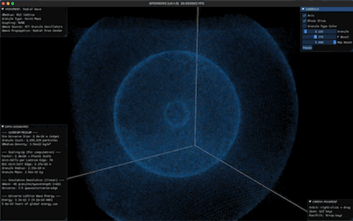
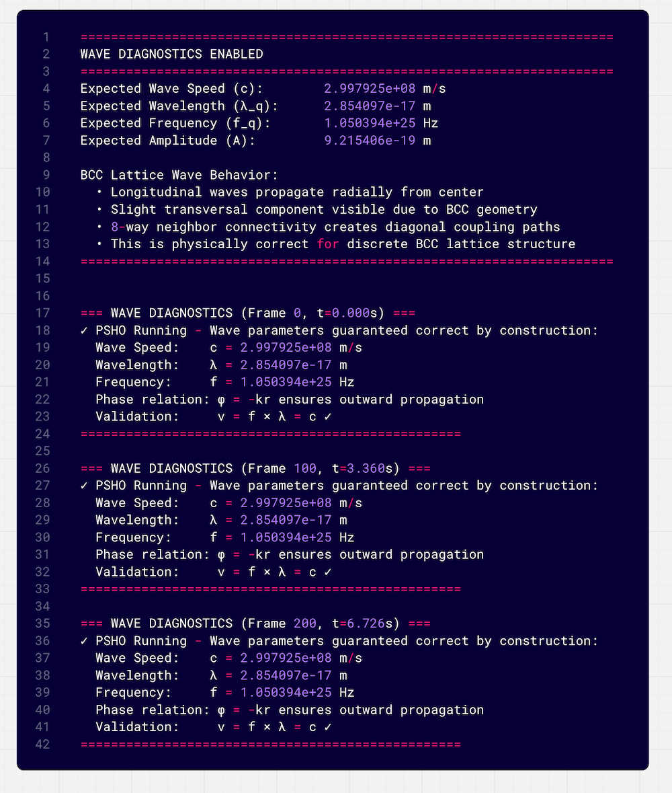
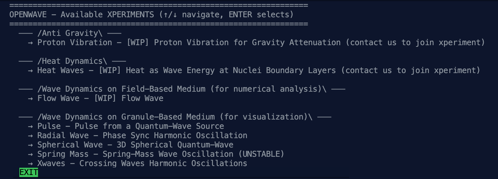

# [SHIP LOG] week: 2025-10-13

## SUMMARY

A week advancing OpenWave from single-source radial waves to multi-source interference patterns while establishing physics-accurate terminology throughout the codebase. Major focus on visualization tools and wave analysis capabilities.

**Key Achievements**:

1. **Multi-Source Wave Physics**: Expanded from single to 10 simultaneous wave sources, enabling complex interference pattern studies and wave superposition validation
2. **Advanced Visualization Tools**: Introduced probe granules, borescope camera, near-far field visualization, and comprehensive wave diagnostics module
3. **Terminology Standardization**: Completed systematic transition from "particle" to "granule-medium" language, aligning codebase with EWT wave-centric paradigm
4. **Documentation Revamp**: Complete restructuring of API references, module documentation, and technical analysis (Taichi vs Warp comparison)

**Impact**: This week transforms OpenWave into a true virtual laboratory for wave physics research, with professional-grade diagnostic tools and the foundation for studying particle formation from wave convergence.

## WAVE DYNAMICS ENHANCEMENTS

**Spherical Wave Visualization in 3D:**

New 3D wave propagation demo.

**Multi-Source Wave System and Wave Interference:**

- **Wave Source Scaling**: Increased maximum wave sources from default to 10 sources (Oct 17-18)
- **Variable Wave Source Support**: Refactored wave source handling to support variable count dynamically (Oct 18)
- **Crossing Waves Experiment**: Added new `xwaves` (crossing waves) experiment with dedicated `ewave_granule` kernel (Oct 16)
- **Wave Interference Visualization**: Implemented multi-source interference patterns showing constructive/destructive interference
- **UI Controls**: Added toggle for showing/hiding wave sources in visualization (Oct 17)

**Wave Mechanics Improvements:**

- **Spherical Wave Falloff**: Implemented proper amplitude falloff for 3D spherical waves (Oct 15)
- **Frequency Boost Parameter**: Added `freq_boost` parameter to wave oscillation functions (Oct 15)
- **Pulse Experiment**: Refactored render API and added pulse wave experiment (Oct 16)
- **Phase Shift Documentation**: Clarified wave mechanics notation and phase shift explanation (Oct 13)

## NEW FEATURES: VISUALIZATION & ANALYSIS TOOLS

**Wave Analysis Tools:**

- **Probe Granules**: Sample granules (in red) serve as a visual probe for better wave visualization, and we can also attach sensors on it from the diagnostics module, and measure quantities like position, speed, acceleration, momentum, energy, etc

- **Near-Far Fields Visualization**: Implemented visualization distinguishing near and far field wave behavior (Oct 16)
- **Energy Dashboard**: Updated energy monitoring and visualization settings (Oct 18)

**UI Improvements:**

- **Pause Control**: Added pause button to all experiments (Oct 14)
- **Dashboard Refinements**: Refined dashboard labels and diagnostics formatting (Oct 15)
- **Camera Controls**: Fixed camera gimbal lock issue for better navigation (Oct 17)
- **Simulation Domain Naming**: Clarified simulation domain terminology in UI (Oct 14)

- **Axis Display Toggle**: Made axis display configurable per experiment (Oct 13)

- **Borescope**: video inspection camera with onboard lighting. The camera and light source penetrates the aether and matter, it gets in between the particles. In the future we can play making a thermal camera, a magnetic camera, signal detector, spectrometer, etc

- **Wave Diagnostics Module**: Implemented comprehensive wave diagnostics system (Oct 14)

## PROJECT MANAGEMENT

**Version Updates:**

- Bumped to version 0.1.1 (Oct 15)
- Bumped to version 0.1.2 (Oct 16)
- Added SemVer notes to project documentation (Oct 14)

**Code Quality:**

- Refactored color constants and UI positioning (Oct 17)
- Renamed experiment modules for improved clarity (Oct 18-19)
- Renamed experiment category to group in CLI (Oct 17)
- Code block language standardization to python in docs (Oct 14)
- Consistent ordered list numbering throughout documentation

**Xperiments Navigation Tree & new placeholder xperiments (anti-gravity, heat-waves):**

- Refactored wave dynamics particle-based experiments structure (Oct 17)
- Updated simulation parameters for energy wave experiments (Oct 17-18)
- Renamed xperiments modules for maximum clarity (Oct 17-19)

## NEXT STEPS

**Immediate Priorities:**

1. **Wave Reflection Implementation**: Execute on reflection planning notes
2. **Parameter Validation**: Verify all EWT constants match paper values (especially with Planck mass correction)
3. **Performance Benchmarking**: Compare Taichi vs Warp based on new documentation
4. **Multi-Source Validation**: Validate wave superposition accuracy with 9-source system

**Code Consolidation:**

1. Finalize module naming conventions
2. Complete API documentation for all refactored modules
3. Performance profiling after major refactors

**Physics Development:**

1. Implement MAP (Minimum Amplitude Principle) for wave reflection
2. Test wave interaction with multiple crossing patterns
3. Validate energy conservation across multi-source systems
4. Explore standing wave formation with interference

## ACHIEVEMENTS SUMMARY

- ✅ 75+ commits of systematic refactoring and renaming
- ✅ Complete terminology standardization (particle → granule-medium)
- ✅ Multi-source wave system supporting 10 simultaneous sources
- ✅ Comprehensive documentation structure overhaul
- ✅ Enhanced wave diagnostics and visualization tools
- ✅ Multiple new wave experiments (crossing, spherical, pulse, heat)
- ✅ Improved UI controls and camera system
- ✅ Version progression to 0.1.2
- ✅ BCC lattice wave behavior documentation
- ✅ Taichi vs Warp comparative analysis
