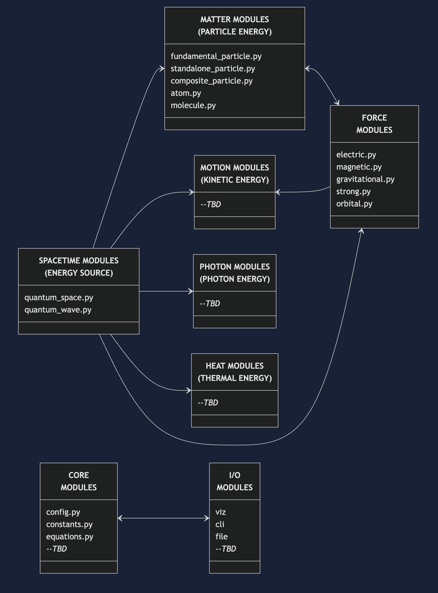
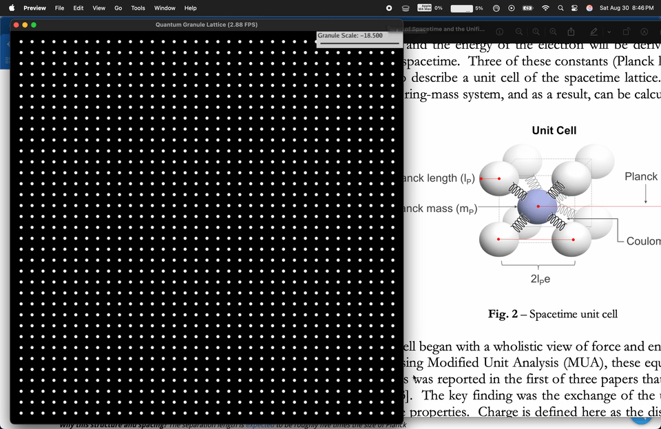

# Week Review - 2025-08-25

## Summary

This week marked significant milestones with the implementation of OpenWave's modular infrastructure, creation of first quantum objects (Granule and Lattice2D), and transition to Claude Code for enhanced development efficiency. Critical scalability challenges were identified at quantum scales, leading to a three-pronged approach focusing on visualization separation, hardware acceleration, and dimensional analysis. The project's brand identity was consolidated under "openwave-labs" to better align with open-source values.

## AI Accelerated Programming

I switched to **Claude Code**, IMO it works better in code assistance, reasons are:

- It lives in the terminal, and integrates with the IDE, quick commanding.
- Access the entire code base locally (very fast).
- Runs bash commands.
- **Opus 4.1 model** excels at complex reasoning, large codebase analysis and can tackle complex tasks, IMO "today" Claude Code is well prepared for programming assistance, and its integration with the development environment is insanely helpful.

## Modular Structure & Objects Map

I've finished the initial **Module Structure** and implemented it in the codebase, (see attached image). It's an initial take on modularity, so as development progresses we evolve the structure.

Core modules were implemented: `constants.py`, `equations.py` and `config.py`, containing core equations, constants and universe configurations and their derivation functions.

The first quantum object-classes were created: **`Granule()`** and **`Lattice2D()`** — initially in 2D, so I can experiment with the scalability design discussed below, and soon I'll be working on the **`Lattice3D()`** — those classes contain the objects attributes (geometry, mass, position/velocity vectors) and methods related to them.

I'm making sure OpenWave design is modular and object-oriented from the ground up, so the application can be expanded and maintained seamlessly.

- **This is the Aether in 2D!** (static for now, with quantum waves coming soon).
- Those classes live inside the module I'm calling `quantum_space.py`, that also defines a specific terminology for the simulator itself:

  - `quantum_space.py` for the Aether (unbiased terminology, to avoid preconceptions)
  - `quantum_waves.py` for Energy Waves (matching terminology)
  - Maintaining scientific neutrality inside the simulator

## First Visualization Screen

I've created our first visualization window for the **`Lattice2D()`** object (see attached gif). It incorporates user input for a linear scaling factor (from the requirements you designed), tying granule radius with unit-cell spacing (separation length, more on this linear scaling below).

## `Fundamental Challenge: Scalability`

True quantum-scale simulation (while maintaining scientific rigor) has scalability and performance challenges that you are well aware of. The orders of magnitude of **Planck units (10^-35)**, **25 orders of magnitude** from atomic to Planck scales, and ultra-small quantum wave length **(10^-17)** require special simulation treatments in order for subatomic conditions to actually be run in today's computer capabilities.

So, before moving to modeling the 3D Lattice, I'll be working on the infrastructure for scalability from 3 perspectives:

### Numerical Simulation Separated from Visualization

**`The big-data aspect of OpenWave`** (thousands to millions of data points for aether granularity and position/velocity vectors) ends up generating **`hot-loops`** in functions that populate or convert those data-container arrays. This happens when data is manipulated for numerical simulation purposes and when that same data needs to be converted to screen display for human visualization.

So the strategy is to separate as much as possible those aspects in different layers:

- **Numerical Simulation Layer**: data-oriented, granule and lattice geometry construction and motion simulations, focused on numerical analysis for scientific validation.
- **Visualization/Rendering Layer**: display-oriented, conversion for screen coordinates, rendering optimizations, and slider-controlled user input that creates performance bottlenecks. Slider finer granule resolutions (scale factors) are creating hot loops that limit future simulation performance. I'll study more carefully the best way to implement those loops and user input without compromising performance when we get to the reality of extremely deep quantum scale simulations.

### Parallel Processing, Arrays & Loops Optimization

We need OpenWave to explore hardware acceleration as much as possible (GPU, multi-core CPU, distributed computing). This is where Python packages implementing parallelization, special data-containers and **JIT pre-compiled kernels** come in.

I've been testing **Taichi Lang** with good results and comparing it to **NVIDIA's newly released Warp package**:

Key considerations and future-proofing:

- Taichi is more stable and designed specifically for particle-based fluid simulations
- Warp focuses on AI/ML and robotics physics, not specialized in fluids like Taichi
- NVIDIA's proprietary approach requires their hardware exclusively
- Corporate packages (Warp) risk discontinuation if not driving profits to core product
- Open-source projects (Taichi) face community maintenance risks and lack of funding
- Syntax similarity suggests future migration is feasible, if needed
- **Decision: Continue with Taichi, optimize loops design, monitor Warp development**

Our modular architecture allows flexibility - core physics/numerical simulation remains separate from visualization, which could use NVIDIA plugins if desired. For robotics-heavy simulations (forces, gravity, mechanical loads), Warp or NVIDIA's Isaac Lab might be suitable, but for fluid dynamics, Taichi remains the clear choice.

Migration strategy exists if needed in the future, as both use similar GPU parallel processing concepts with comparable kernel compiler syntax. For now, Taichi is the optimal choice for OpenWave.

### `Aether Granularity Scaling Complexity`

Full Planck-scale fidelity may be computationally prohibitive and require **user-tunable resolution**.

I've implemented the aether granularity factor you suggested in the requirements for phase 1, connecting this scale-factor to granule radius and lattice spacing together, `but I have a concern that I would need your guidance`.

I've experimented with fluid-dynamics prototype-scaling when building my wave tank last year. One important aspect when scaling down fluid motion is to do it using **`Dimensional Analysis`** to allow scaling down simulations to reasonable magnitudes while keeping numerical significance.

In our case we need to `scale-up the simulations`, so there is some research I still need to do here.

There are 3 main dimensionless equations we need to analyze and preserve: **Reynolds**, **Froude's** and **Mach's numbers**. They have applications for compressible and non-compressible fluids.

`First question is`: from my understanding, Aether properties suggest an elastic medium behavior, similar to compressible fluids, `right?` Similar to gases or even plasma fluids, that are compressible/elastic.

Especially the `massive displacement relative to granule size`, given the ratio between granule-motion (longitudinal wave amplitude) to granule-radius (Planck-unit) with a **10^17 orders of magnitude** (equivalent to the ratio between solar system diameter to a grain of sand, right? So granule oscillation is equivalent to a grain of sand round-tripping the solar system, mind-blowing BTW), and the longitudinal aspect of quantum-wave shares similarities with sound waves properties.

>In this case, when scaling the aether as this elastic fluid, length can scale linearly (the current scale factor), but mass and medium density can not (aether density in our case is related to lattice spacing, right?). Also time and velocity scale squared, and forces scale cubed.
>
>In summary, I'll need to do more research on **Quantum Scaling Methodologies**, to be able to model the scaling factor accordingly, and I would love to get your advice here. We might even need to model new quantum-specific dimensionless numbers/relationships, and wave speed normalization methods, with technical justification for approaches.
>
>My primary focus now shifts to addressing computational performance at quantum scales through hardware optimization and dimensional analysis techniques.

### Terminology Study for Scaling Topic

- aether granularity, granule order of magnitude
- display/screen magnification, zoom lens

## Last Week Commit Summary

### Documentation & Organization

- Research sources reorganization
- Added weekly planning documentation
- Enhanced Sphinx documentation setup with comprehensive module docs
- Updated CLAUDE.md project instructions
- Removed docs/_build directory and updated .gitignore

### Core Physics Implementation

- Added quantum space lattice implementation
- Initialized Taichi physics engine in `quantum_space.py`
- Added relativistic wave energy calculations (longitudinal in/out and magnetic)
- Implemented photon energy calculations and related functions
- Added fundamental force equations with examples
- Implemented particle constant derivations
- Added smoke-test for quantum-wave constants derivations

### Code Refactoring

- Major refactor of modules structure and documentation
- Refactored OpenWave module structure and constants
- Refactored particle constants into classes
- Moved equations and converters to `equations.py`
- Refactored config and constants, removed `config.ini`
- Applied Black linter formatting across codebase

### Configuration & Constants

- Updated universe settings in `config.py`
- Updated Planck units
- Constants and equations documentation updates
- Updated numpy dependency version

### Module Development

- Added module documentation for forces, matter, and spacetime modules
- Removed unused files
- Refactored quantum wave equations and modularized code
- Added core constants and equations modules

## Community Section

### Branding

I've updated the github organization from **openwaveHQ** to **openwave-labs** — HQ was sounding too corporate, we need something more aligned with open-source ethos, and the "labs" suffix was widely available in domain URLs and social handles, giving more consistency to the brand (I've set you as co-owner to them all):

- **Product**: OpenWave
- **Organization**: OpenWave Labs
- **Domain**: [openwavelabs.com](https://openwavelabs.com/)
- **GitHub Org**: [github.com/openwave-labs](https://github.com/openwave-labs)
- **YouTube**: [youtube.com/@openwave-labs](https://youtube.com/@openwave-labs)
- **X**: [x.com/openwavelabs](https://x.com/openwavelabs)
- **Reddit Community**: [reddit.com/r/openwave](https://reddit.com/r/openwave)

### Future User/Contributor Feedback

- This week I'll also check and run Seth Kinneman's scripts and evaluate them as an example for end-user needs, and invite Seth Kinneman to our mailing list, this could be the beginning of a great community!